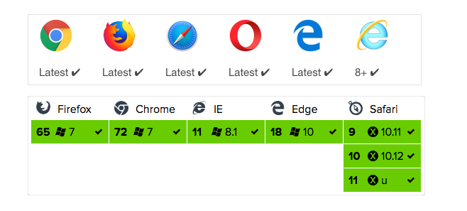
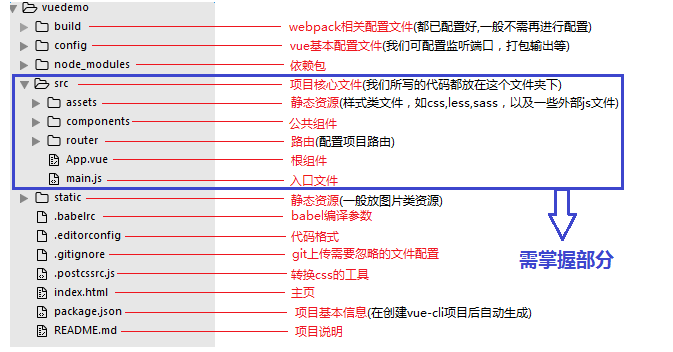
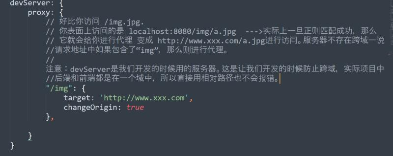

# Axios

## 前言

首先需要知道，axios不是一种新的技术。

axios是一个基于Promise用于浏览器和nodejs的HTTP客户端，本质也是对原生XHR的封装，只不过它是Promise的实现版本，符合最新的ES规范，有以下特点：

- 从浏览器中创建XMLHttpRequests
- 从node.js中创建http请求
- 支持PromiseAPI
- 拦截请求和响应
- 转换请求数据和响应数据
- 取消请求
- 自动转换JSON数据
- 客户端支持
- 防御XSRF

**浏览器支持**



axios面向现代浏览器设计，所以古老的浏览器并不支持

因为axios设计简介，API简单，支持浏览器和node，所以大受欢迎，它能很好的与前端各种框架整合。


## Axios知识

### Axios起步

**安装**

使用 npm：

```
$ npm install axios
```

使用 bower：

```
$ bower install axios
```

使用 CDN：

```html
<script src="https://unpkg.com/axios/dist/axios.min.js"></script>
```


**案例**

执行 `GET` 请求

```javascript
axios.get('user?ID=12345')	//GET请求、参数写地址栏后面
    .then((res)=>{
		console.log(res)
	})
	.catch((err)=>{
    	console.log(err)
	})

//上面的请求也可以这样做
axios.get('user?ID=12345',{	//GET请求、参数写配置对象中
    params:{
        ID:12345
    }
})	//GET请求、传参配置
    .then((res)=>{
		console.log(res)
	})
	.catch((err)=>{
    	console.log(err)
	})
```

执行 `POST` 请求

```javascript
axios.post('/user',{
    firstName:'huang',
    lastName:'shaomo'
})
.then((res)=>{
    console.log(res)
})
.catch((err)=>{
    console.log(err)
})
```

执行多个并发请求

```javascript
function getUserAccount(){
    return axios.get('/user/12345');
}

function getUserPermissions(){
 	return axios.get('/user/12345/permissions')   
}
axios.all([getuserAccount(),getUserPermissions()])
	.then(axios.spread(function(acct,perm){
    //两个请求都执行完成
}))
```


### Axios API

可以通过向`axios`传递相关配置来创建请求

- axios(config)

```javascript
//发送post请求
axios({
    method:'post',
    url:'/user/12345',
    data:{
         firstName:'huang',
    	lastName:'shaomo'
    }
})

//获取远端图片
axios({
    method:'get',
    url:'http://bit.ly/2mTM3nY',
    responseType:'stream'
})
.then((res)=>{
    response.data.pipe(fs.createWriteStream('ada_lovelace.jpg'));
})
```

- axios(url [,config])

```javascript
//发送GET请求
axios('/user/12345')
```


**请求方法的别名**

为方便起见，为所有支持请求方法提供了别名，在使用别名方法时，`url`,`method`,`data`这些属性都不必再配置中指定

axios.request(config)

axios.get(url [,config])

axios.delete(url [, config])

axios.head(url [, config])

axios.options(url [, config])

axios.post(url [, data[, config]])

axios.put(url [, data[, config]])

axios.patch(url [, data[, config]])


**并发**

处理并发请求的助手函数：

- **axios.all(iterable)**
- **axios.spread(callback)**

**创建实例**

可以使用自定义配置创建一个 axios 实例

**axios.create([config])**

```javascript
const instance = axios.create({
    baseURL: 'https://some-domain.com/api/',
    timeout: 1000,
    headers: {'X-Custom-Header': 'foobar'}
})
```

**注意：使用创建的 axios 实例请求时，请求的配置项将与实例的配置合并。**


### 请求配置

这些是创建请求时可以用的配置选项。只有`url`是必须的，如果没有指定`method`，请求默认使用`get`

```javascript
{
	//url是用于请求的服务器URL
    url:'/user'
    
    //method 是创建请求时使用的方法
    method:'get'	//default
    
    //baseURL将自动加在url前面，除非url是一个绝对URL
    //它可以通过设置一个baseURL便于为axios实例的方法传递相对URL
    baseURL:'https://some-domain.com/api/'
    
    // transformRequest 允许在向服务器发送前，修改请求数据
    // 只能用在 PUT、POST 和 PATCH 这几个请求方法
    // 后面数组中的函数必须返回一个字符串，或 ArrayBuffer，或 Stream
    transformRequest:[function(data,headers){
        // 对 data 进行任意转换处理
        return data;
    }]
    
    // transformResponse 在传递给 then/catch 前，允许修改响应数据
    transformResponse: [function (data) {
    // 对 data 进行任意转换处理
        return data;
    }],
        
    // headers 是即将被发送的自定义请求头
    headers: {'X-Requested-With': 'XMLHttpRequest'},
        
    // params 是即将与请求一起发送的 URL 参数
    // 必须是一个无格式对象 (plain object) 或 URLSearchParams 对象
    params: {
        ID: 12345
    },
        
        
    // paramsSerializer 是一个负责 params 序列化的函数
    // (e.g. https://www.npmjs.com/package/qs,     http://api.jquery.com/jquery.param/)
    paramsSerializer: function (params) {
        return QS.stringify(params, {arrayFormat: 'brackets'})
    },
        
        
    // data 是作为请求主体被发送的数据
    // 只适用于这些请求方法 PUT、POST 和 PATCH
    // 在没有设置 transformRequest 时，必须是以下类型之一：
    // - string，plain object，ArrayBuffer，ArrayBufferView，URLSearchParams
    // - 浏览器专属：FormData，File，Blob
    // - Node专属：Stream
    data: {
        firstName: 'Fred'
    },
        
    // timeout 指定请求超时的毫秒数(0 表示无超时时间)
    // 如果请求花费了超过 timeout 的时间，请求将被中断
    timeout: 1000,
        
    // withCredentials 表示跨域请求时是否需要使用凭证
    withCredentials: false,    // default
             
    // adapter 允许自定义处理请求，以使测试更轻松
    // 返回一个 promise 并应用一个有效的响应(查阅 [response docs](#response-api))
    adapter: function (config) {
        /* ... */
    },
        
    // auth 表示应该使用 HTTP 基础验证，并提供凭据
    // 这将设置一个 Authorization 头，覆写掉现有的任意使用 headers 设置的自定义 Authorization 头
    auth: {
        username: 'janedoe',
        password: 's00pers3cret'
    },

    // responseType 表示服务器响应的数据类型，可以是 arraybuffer、blob、document、json、text、stream
    responseType: 'json',    // default
        
    // responseEncoding 表示对响应的编码
    // Note：对于 responseType 为 stream 或 客户端请求会忽略
    responseEncoding: 'utf-8',
   
    // xsrfCookieName 是用作 xsrf token 值的 cookie 名称
    xsrfCookieName: 'XSRF-TOKEN',    // default
        
    // xsrfHeaderName 是 xsrf token 值的 http 头名称
    xsrfHeaderName: 'X-XSRF-TOKEN',    // default    
     
    // onUploadProgress 允许为上传处理进度事件
    onUploadProgress: function (progressEvent) {
        // ... ...
    },
        
    // onDownloadProgress 允许为下载处理进度事件
    onDownloadProgress: function (progressEvent) {
        // ... ...
    },   
        
    // maxContentLength 定义允许的响应内容的最大尺寸
    maxContentLength: 2000, 
        
    // validateStatus 定义对于给定的 HTTP 响应状态码是 resolve 或 reject promise。
    // 如果 validateStatus 返回 true (或者设置为 null 或 undefined)，promise 将被 resolve，否则 promise 将被 reject
    validateStatus: function (status) {
        return status >= 200 && status < 300;    // default
    },
       
    // maxRedirects 定义在 node.js 中 follow 的最大重定向数目
    // 如果设置为 0，将不会 follow 任何重定向
    maxRedirects: 5,
        
    // socketPath 用于在 node.js 中定义 UNIX Socket
    // e.g. '/var/run/docker.sock' to send requests to the docker daemon.
    // 只能指定 socketPath 或 proxy，如果两者同时指定，将使用 socketPath
    socketPath: null,
        
    // httpAgent 和 httpsAgent 分别在 node.js 中用于定义在执行 http 和 https 时使用的自定义代理。
    // 允许像这样配置选项。keepAlive 默认没有启用
    httpAgent: new http.Agent({ keepAlive: true }),
    httpsAgent: new https.Agent({ keepAlive: true }),
        
    // proxy 定义代理服务器的主体名称和端口
    // auth 表示 HTTP 基础验证应当用于连接代理，并提供凭据
    // 这将会设置一个 Proxy-Authorization 头，覆写掉已有的通过使用 header 设置的自定义 Proxy-Authorization 头
    proxy: {
        host: '127.0.0.1',
        port: 9000,
        auth: {
            username: 'mikeymike',
            password: 'rapunz31'
        }
    },

    // cancelToken 指定用于取消请求的 cancel token
    cancelToken: new CancelToken(function (cancel) {
        // ... ...
    })
}
```


### 响应结构

某个请求的响应包含以下信息

```javascript
{
    // data 由服务器提供的响应
    data: {},
    
    // status 来自服务器响应的 HTTP 状态码
    status: 200,

    // statusText 来自服务器响应的 HTTP 状态信息
    statusText: 'OK',

    // headers 服务器响应的头
    headers: {},

    // config 是为请求提供的配置信息
    config: {},

    // request 是生成当前响应的请求
    // 在 node.js 中是最后一个 ClientRequest 实例 (在重定向中)
    // 在浏览器中是 XMLHttpRequest 实例
    request: {}
}
```

使用 `then` 时，你将接收下面这样的响应 :

```javascript
axios.get('/user/12345')
    .then(function (response) {
        console.log(response.data);
        console.log(response.status);
        console.log(response.statusText);
        console.log(response.headers);
        console.log(response.config);
    })
```

在使用 `catch` 、或传递 `rejection callback` 作为 `then` 的第二个参数时，响应可以通过 `error` 对象被使用，可参考后面的篇章 —— 错误处理。


### 配置默认值

你可以指定将被用在各个请求的配置默认值

**全局的axios默认值**

```javascript
axios.defaults.baseURL = 'http://api/example.com',
axios.defaults.headers.common['Authorzation'] = AUTH_TOKEN
axios.defaults.headers.post['Content-Type']='application/x-www-form-urlencoded'
```


**自定义实例默认值**

```javascript
const instance = axios.create({
    baseURL:'https://api.example.com'
})
```


**配置的优先顺序**

配置会以一个优先顺序进行合并。这个顺序是：在 `lib/defaults.js` 找到的库的默认值，然后是实例的 `defaults` 属性，最后是请求的 `config` 参数。后者将优先于前者。这里是一个例子：

```javascript
// 使用由库提供的配置默认值来创建实例
// 此时超时配置的默认值是 0
const instance = axios.create();

// 覆写库的超时默认值
// 现在，在超时前，所有请求都会等待 2.5 秒
instance.defaults.timeout = 2500;

// 为已知需要花费很长时间的请求覆写超时设置
instance.get('/longRequest', {
    timeout: 5000
});
```


### 拦截器

在请求或响应被`then`或`catch`处理前拦截它们

```javascript
//添加请求拦截器
axios.interceptors.request.use(
    function(config){
        //在发送请求之前做点什么
        return config;
    },
    function(error){
		return Promise.reject(error)
    }
)

// 添加响应拦截器
axios.interceptors.response.use(
    function (response) {
        // 对响应数据做点什么
        return response;
    },
    function (error) {
        // 对响应错误做点什么
        return Promise.reject(error);
    }
);
```

如果你想在稍后移除拦截器，可以这样：

```javascript
const myInterceptor = axios.interceptors.request.use(function(){
    
})
axios.interceptors.request.eject(myInterceptor)
```

可以为自定义axios实例添加拦截器

```javascript
const instance =  axios.create();
instance.interceptors.request.use(function(){})
```


### 错误处理

```javascript
axios.get('/user/12345')
	.catch(function(err){
    	if(err.response){
            //请求已发出，且服务器的响应状态码超出了2xx范围
            console.log(err.response.data);
            console.log(err.response.status);
            console.log(err.response.headers);
        }else if(err.request){
            //请求已发出，但没有接收到任何响应
            //在浏览器中，error.request是XMLHttpRequest实例
            //在node.js中，error.request是http.ClientRequest实例
            console.log(err.request)
        }else{
            console.log('Error',error.message)
        }
    console.log(err.config)
	})
```

你可以使用 `validateStatus` 配置选项定义一个自定义 HTTP 状态码的错误范围：

```javascript
axios.get('/user/12345', {
    validateStatus: function (status) {
        // 当且仅当 status 大于等于 500 时 Promise 才被 reject
        return status < 500;
    }
});
```


### 取消请求

使用 `cancel token` 取消请求。

>  Axios 的 `cancel token` API 基于 [cancelable promises proposal](https://github.com/tc39/proposal-cancelable-promises)，它还处于第一阶段。

 可以使用 `CancelToken.source` 工厂方法创建 `cancel token` 像这样：

```
const CancelToken = axios.CancelToken;
const source = CancelToken.source();

axios.get('/user/12345', {
    cancelToken: source.token
}).catch(function (thrown) {
    if (axios.isCancel(thrown)) {
        console.log('Request canceled', thrown.message);
    } else { /* 处理错误 */ }
});

axios.post('/user/12345', {
    name: 'new name'
}, {
    cancelToken: source.token
});

// 取消请求 (message 参数是可选的)
source.cancel('Operation canceled by the user.');
```


还可以通过传递一个 executor 函数到 CancelToken 的构造函数来创建 `cancel token` ：

```
const CancelToken = axios.CancelToken;
let cancel;

axios.get('/user/12345', {
    cancelToken: new CancelToken(function executor(c) {
        // executor 函数接收一个 cancel 函数作为参数
        cancel = c;
    })
});

// 取消请求
cancel();
```

> 注意：可以使用同一个 cancel token 取消多个请求。

### 使用 application/x-www-form-urlencoded 格式

默认情况下，axios 将 JavaScript 对象序列化为 JSON。要以 `application/x-www-form-urlencoded` 格式发送数据，你可以使用以下选项之一。


**浏览器**

- 方式一：使用 URLSearchParams API，如下所示：

```javascript
const params = new URLSearchParams();
params.append('param1', 'value1');params.append('param2', 'value2');
axios.post('/foo', params);
```

>  请注意，不是所有浏览器都支持 URLSearchParams（请参阅 [caniuse.com](https://caniuse.com/)），但可以使用 polyfill（确保填充全局环境）。


- 方式二：使用 qs 库编码数据

```javascript
const qs = require('qs');
axios.post('/foo', qs.stringify({ 'bar': 123 }));
```


**Node.js**

在 node.js 中，你可以使用 `querystring` 模块，如下所示：

```javascript
const querystring = require('querystring');
axios.post('http://something.com/', querystring.stringify({ foo: 'bar' }));
```

你也可以使用 qs 库。


### Axios 尾篇

**Promise**

axios 依赖原生的 ES6 Promise 实现而被支持，如果你的环境不支持 ES6 Promise，可以使用 [polyfill](https://github.com/jakearchibald/es6-promise)。

**TypeScript**

axios 包括 TypeScript 定义：

```javascript
import axios from 'axios';
axios.get('/user?ID=12345');
```

 

## 框架整合


### Vue-axios

#### 安装全局挂载

1. 首先使用Vue-cli初始化项目

   ```javascript
   vue init webpack 项目名称		//2.x版本
   vue create 项目名称				//3.x版本
   ```



​		使用vue --version查看是否安装成功

**[index.html]**

　　index.html和其他html文件一样，但一般只定义一个空的根节点，在main.js里面定义的vm实例将挂载在根节点下，内容都通过vue组件来填充，由于所有的挂载元素会被Vue生成的DOM替换，因此不推荐直接挂载实例到`<html>`或者`<body>`上。


**[main.js]**

　　是Vue应用的入口文件，用来创建一个新的Vue实例，并将这个实例挂载在根节点下，同时也可以用来引入Vue插件


　　**el**：提供一个在页面上已存在的DOM元素作为Vue实例的挂载目标，这里就是index.html中id为 ‘app’ 的节点

　　**router**：将router实例注入到Vue根实例中，使它的每个子组件都可以访问、\$router (router实例)和\$route (当前激活的路由信息对象)

　　**template**：以一个字符串模板作为Vue实例的标识使用。它会替换挂载的元素，也就是用\<app>\</app>这个组件替换 ’el‘ 选项指定的id为 ’app‘ 的节点

　　**components**：局部注册组件，在前面通过import引入的是<app>的选项对象，只要有了选项对象，就可以在这里将它注册为一个Vue实例


**[App.vue]**

　　项目的根组件，可以包含其他的子组件，从而组成组件树，由于使用了vue-loader，它会将这个格式编写的单文件 Vue 组件转换为 JavaScript 模块


```html
<template></template>只能包含一个子节点，也就是说顶层的div只能有一个（如图，id为‘app’的div元素没有兄弟节点），内容将被提取为字符串，将编译并用作 Vue 组件的` template `选项

<script></script>通常用es6来写，用export default导出

<style></style>中的样式默认是影响全局的，如需定义作用域只在该组件下起作用，需在标签上加scoped属性，<style scoped></style>
```


**[router/index.js]**

　　路由配置文件，作用是将组件映射到路由，方便知道在哪里渲染它们


2. 安装axios

   ```javascript
   cnpm install axios --save-dev
   ```

3. 挂载全局

   ```javascript
   //main.js
   import axios from 'axios'
   Vue.prototype.$axios = axios
   ```

   


#### 跨域配置[2.x]


#### 跨域配置[3.x]

由于`devServer.proxy`是以开发环境为基础，所以目前用`devServer.proxy`作为代理工具处理跨域还暂时只能解决开发环境下,如果是打包后的环境，还需与后端一起联调处理

```javascript
devServer: {
    port:3000,  //端口号
    host:'localhost',   //主机名
    https:  false,      //是否启用https
    open:true,           //配置自启动浏览器
	proxy: {
        '/api': {
                target: 'https://developer.duyiedu.com/',//请求的后端接口ip+port
                changeOrigin: true,// 允许跨域，在本地会创建一个虚拟服务端，然后发送请求的数据，并同时接收请求的数据，这样服务端和服务端进行数据的交互就不会有跨域问题
                ws: true,// 开启webSocket
                pathRewrite: {
                    '^/api': '',// 替换成target中的地址
                }
            }
        
    }
}
```




> 注：在浏览器的调试工具中，proxy代理后的请求url会变更显示为`http://localhost:8080/api/test`，且不会显示代理前的请求链接
>
> 
>
> `api`就是接口实际请求的前缀
>
> 比如之前请求接口的时候 url 是这样的：
> 通常来说我们都会把域名写在一个公共请求方法里面，我们只需要传入要调用的接口的后缀名称
> 比如 请求 `test.com/mobile/index/index` 我们只需要传入： `mobile/index/index`
> 那么公共的域名就是 `test.com/`
> 而你要做的，就是在请求接口的公共域名，把`test.com`改为`api/`即可!
>
> 改完后，把项目运行起来可以看到接口请求的路径为 ： `localhost:8080/api/mobile/index/index`
> 而进过代理后，实际的请求路径是 ： `test.com/mobile/index/index`