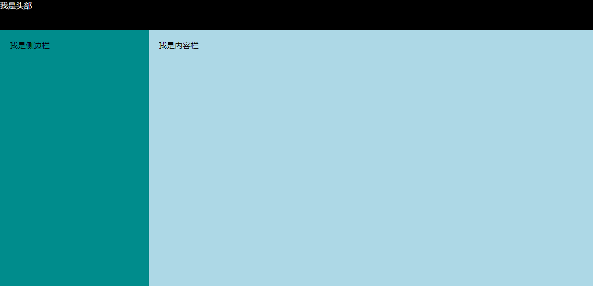
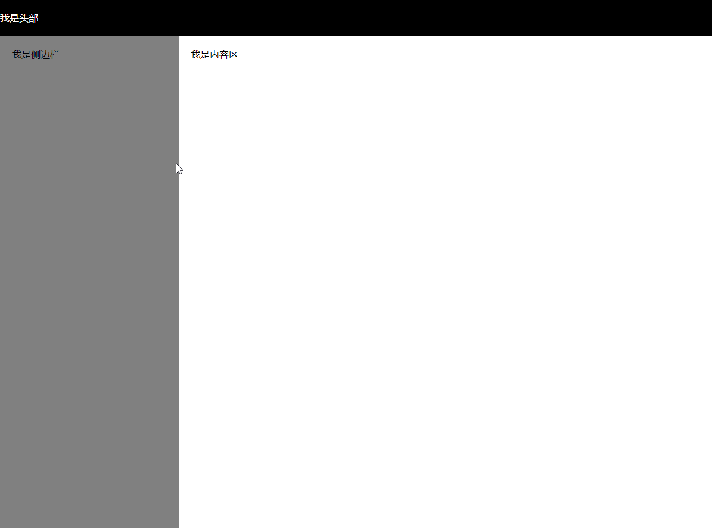
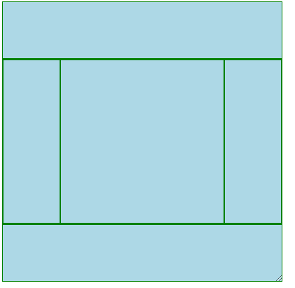

#  HTML+CSS

## HTML


## CSS

### -------- CSS基础 --------

###  盒模型

> 每个元素在页面中都会生成一个矩形区域（盒子）。规定单个盒子的规则

 **盒子类型：**

1. 行盒，display等于inline的元素
2. 块盒，display等于block的元素

display默认为inline

#### 盒子的组成部分（margin-box）

> 无论是行盒，还是块盒，都由下面几个部分组成，从内到外分别是：

1. 内容	content

2. 填充    padding

3. 边框    border

4. 外边距 margin

   

正常情况下：width的宽度 = content的宽度，

内边距盒：width的宽度（padding-box） = padding + content

边框盒：width的宽度（border-box ）= border+padding + content

#### 盒子类型

##### 1. 行盒

> 常见的行盒：包含具体内容的元素
>
> span、strong、em、i、img、video、audio

**显著特点**

1. 盒子沿着内容延伸
2. 行盒不能设置宽高（width,height)，因为宽高依据内容决定   

##### 2. 块盒

> display:block
>
> 常见的块盒：容器元素(div,section,ul li)、h1-h6、p

1. **百分比取值**

   padding、width、margin可以取值为 百分比，以上的所有百分比相对的都是包含块的**宽度**。   **注意：只是宽度，不是高度**

2. **高度的百分比**

- 子元素的高度是父元素的50%，但包含块（父元素）没有设置高度，这种情况百分比无效，因为自相矛盾，

- 包含块的高度不取决于子元素的高度，这种情况百分比相对父元素高度

3.  **每个块盒垂直方向上的auto值**

   height:auto，适应内容的高度

   margin:auto，表示0

##### 3. 行块盒

> display:inline-block
>
> 拥有行盒的特征，但同时又拥有块盒可以设置的CSS属性，比如margin-top、padding-top

##### 总结

- 行盒不能设置宽高，宽度和高度只能由内容撑开，可以理解为文本盒

- 块盒独占一行，宽度默认为包含块宽度，高度也由内容撑开，但可设置宽高

- 行盒的水平方向的margin、padding生效，垂直方向的margin、padding不生效，但垂直的padding还是会影响背景的大小，因为背景默认参考的是border-box，但实际上是视觉发生变化，并没有占用空间，所以不会导致其他盒子移动，因为行盒认为，行高只取决于line-height属性

  

- 块盒的margin、padding都可以设置（行块盒也可以 ）

- 所有类型盒的margin、padding、border、默认值都为0

- 块盒中，默认情况下，总要想尽办法铺满包含块的宽度（空间）

  如果不固定width宽度，width会默认吸收包含块剩余空间

  如果固定了width、padding、border后还有剩余空间，会全部被margin-right吸收

  前提（块盒中水平方向设置了marin:auto），将使margin也拥有吸收剩余包含块空间的能力，但优先级比width低


 #### 应用

##### 1. 改变width、height影响范围

box-sizing:改变width、height的影响范围，默认只影响content，改变为border-box表示将width。height的影响范围提升到content+padding+border，

##### 2. 改变背景覆盖范围

> 默认情况下，背景覆盖border盒

可以通过background-clip进行修改

##### 3.溢出处理

   overflow，控制内容溢出边框盒后的处理方式

##### 4. 断词规则

word-break，会影响文字在什么位置被截断换行

- normal：普通 ，中文字符（文字位置截断），非中文字符（单词位置截断）
- break-all：截断所有，所有字符都在文字处截断，对英文不友好，可能把一个完整的单词截断
- keep-all：在接近换行时，以空格为标准换行，而中文一般不会出现空格，会导致中文不会换行

##### 5. 空白处理

white-space:nowrap：空白的处理规则

overflow:hidden;	

text-overflow:eliipsis	文字溢出用圆点代替

##### 6. 块盒的水平居中

> 如果固定了盒子宽度还有剩余空间，设置margin-left:auto，margin-right:auto后，这是两个属性的吸收能力都是一样的，谁都吸收一半，就会导致盒子水平居中。这也是常规流中块盒的居中方式之一

```css
{
    display:block;
    width:xxx;
    height:xxx;
    margin-left:auto;
    margin-right:auto;
}
```


#### 可替换元素和非可替换元素

大部分元素，页面上显示的结果，取决于元素内容，称为**非可替换元素**

少部分元素，页面上显示的结果，取决于元素属性，称为**可替换元素**

常见可替换元素：img、video、audio

**可替换元素特点**：绝大部分可替换元素均为行盒，但又类似于行块盒，因为具有行块盒的特点，比如可以设置width和height，但CSS又不能完全控制其中的样式，比如图片的颜色是无法控制的


### 层叠（权重计算）

> 声明冲突：同一个样式，多次应用到同一个元素
>
> 层叠：解决声明冲突的过程，浏览器自动处理（权重计算）

#### 1. 比较重要性

> 说人话就是我们写的样式大于浏览器默认样式

重要性从高到底：

作者样式表：开发者书写的样式

1)  作者样式表中的!important

2）作者样式表中的普通样式

3）浏览器默认样式表中的样式

#### 2. 比较特殊性

> 看选择器

总体规则：选择器选中的范围越窄，越特殊

具体规则：通过选择器，计算出一个4位数（xxxx）

1. 千位：如果是内联样式，记做1，否则记0（1000）
2. 百位：等于选择器中所有id选择器的数量（x00）
3. 十位：等于选择器中所有class、属性选择器、伪类选择器(:link)的数量(x0)
4. 个位：等于选择器中所有元素选择器，伪元素（::before）选择器的数量（x）

比较的规则是从千位开始逐位往下比较

#### 3. 比较源次性

> 代码书写靠后的胜出

#### 应用

1. 重置样式表

   > 书写一些作者样式，覆盖浏览器的默认样式
   >
   > 重置样式表->浏览器默认样式

   常见的重置样式表：normalize.css，reset.css，meyer.css

2. 爱恨法则

   :link < :visited < :hover < :active


### 属性值的计算过程

> 一个元素，从所有属性都没有值，到所有属性都有值，这个计算过程，就叫做**属性值的计算过程**。也叫页面的渲染过程。
>
> 浏览器的渲染是一个一个元素依次进行渲染的，且渲染顺序是依旧树形目录结构从根节点开始进行深度优先渲染


**渲染每个元素的前提条件：该元素的所有CSS属性必须有值**


####  **1. 确定声明值**

> 参考样式表（作者样式表或浏览器默认样式表）中有没有冲突的声明，作为CSS属性值


#### 2. 层叠冲突

> 对样式表有冲突的声明使用层叠规则，确定CSS属性值


#### 3. 使用继承

> 对**仍然没有值**的属性，若可以继承，则继承父元素的值


#### 4. 使用默认值

> 对仍然没有值的属性，全部使用默认值（所有CSS属性都有默认值，比如width的默认值是auto，background的默认值是transparent(透明)）


例子:a标签和p标签是什么颜色？

```html
<style>
    div {
        color:red;
    }
</style>
<div>
    <a href="">
        举个例子
    </a>
    <p>
        p元素
    </p>
</div>
```

**a标签**：确定声明值，a标签有浏览器默认的color样式（color:-webkit-link），既然满足了第一个条件，便不会继续往后判断了，即使color是第三步的可继承样式。

**p标签**：确定声明值：p标签没有浏览器默认的color样式。层叠冲突：浏览器默认样式和作者样式都没有关于color的样式，层叠也没必要判断下去了。继承，color是可继承属性，继承父元素的color。


#### inherit 和initial

- inherit：手动（强制）继承，将父元素的值取出应用到该元素
- initial：初始值，将该属性设置为默认值

#### 总结：

- 所谓属性值的计算过程，就是一个元素，从所有属性都没有值，到所有属性都有值的这个计算过程

### -------- CSS提升 --------


### 视觉格式化模型

> 视觉格式化模型（布局规则）：项目中的多个盒子排列规则

1. 常规流

2. 浮动
3. 定位

#### 常规流布局

> 也称文档流，不同文档流，常规文档流，所有元素，默认情况下，都属于常规流布局。
>
> 总体规则：块盒独占一行，行盒水平依次排列

##### 包含块（containing block）

>  每个盒子都有它的包含块，包含块决定了盒子的排列区域，绝大部分情况下：盒子的包含块，为其父元素的内容盒。
>
>  根元素(<html>)所在的包含块是一个被称为**初始包含块**的矩形。
>
>  确定一个元素的包含块的范围完全取决于position属性

- position属性为`static`，`relative`，`sticky`，包含为父元素的内容盒（content）

- position属性为`absolute`，包含块为有**定位元素**的父元素的内边距盒（padding），若找不到，则为初始化包含块

- position属性为`fixed`，包含块是视口（viewport)

  ...

##### 上下外边距的合并(块盒)

- 兄弟间合并： 两个常规流块盒，上下边距相邻，会进行合并，取两个外边距的最大值

- 父子间合并：只要两个margin相邻，也会合并，即使包含块的margin:0也会合并，解决方法
  1. 将子元素的margin给替换成包含块的padding
  2. 给包含块设置border或padding都能隔开
  3. 给包含块设置BFC

#### 浮动流

##### 应用场景

- 文字环绕（原理是行盒的特性，会避让浮动元素）
- 横向排列
- 横向排列

##### 浮动的基本特点

修改float属性为：

- left：左浮动，元素靠上靠左
- right：右浮动，元素靠上靠右

 默认值为none

1. 当一个元素浮动后，元素必定为块盒（更改display属性为block）
2. 浮动元素的包含块，和常规流一样，为父元素的内容盒  

##### 盒子尺寸

1. 宽度为auto时，与常规流的撑满  不同，这里为适应内容宽度
2. 高度为auto时，与常规流一样，都是适应内容的高度
3.  margin即使为auto时（上下左右），也为0
4. 边框，内边距，百分比设置与常规流一样

##### 盒子排列

1. 左浮动的盒子靠上靠左排列

2. 右浮动的盒子靠上靠右排列

3. 浮动盒子的顶边不得高于上一个盒子的顶边

4. 若剩余空间无法放下浮动的盒子，则将该盒子向下移动，直到具备足够的空间能容纳盒子，然后再向左或右移动

   

5. 浮动盒子在包含块中排列时，如果前面有常规流，会避开常规流块盒(浮动看得到常规流)

   **例如：将块盒放在所有浮动盒之前**

   

6. 常规流块盒在排列时，无视浮动盒子（常规流看不到浮动）

   **例如：将块盒放在所有浮动盒之后**

   

   **文字是行盒，看得到浮动盒子，所以会避开**

7. 行盒在排列时，会避开浮动盒子（文字环绕，文字就是行盒）

   

   文字环绕的特点就是利用到了**行盒会避开浮动盒的特点**，将图片设为浮动，文字就是行盒，会避开浮动盒。

8. 如果文字没有在行盒中，浏览器会自动生成一个行盒包裹文字，该行盒叫做匿名行盒，所以可以理解为，文字就是行盒

9. 外边距合并不会发生


##### 高度坍塌

 高度坍塌的根源：常规流盒子的自动高度，在计算时，不会考虑浮动盒子。

一般的场景出现在浮动盒在前，常规盒在后。

解决方式：

- 清除浮动：clear:both 
  - 默认值none
  
  - **left：清除左浮动**，清除浮动的意思不是说不浮动了，而是应用了float:left的元素必须出现在前面所有左浮动盒子的下方，可以理解为让该盒子抬头看看天空，看看天空中的左浮动盒子的排列位置，自己再出现在左浮动盒子的下方（左下方）
  
    例如：浮动盒float:left，块盒clear:left
  
    
  
    例如：如果浮动盒子float:left，块盒clear:right，会出现下面这种情况
  
    
  
    清除右浮动，只是让块盒子抬头看看右上方有没有浮动盒子，而浮动盒子都在左边，盒子看到右上方没有，就认为没有浮动盒子，所有就跑到了左上。
  
    
  
  - **right: 清除右浮动**，该元素必须出现在前面所有右浮动盒子的下方（左下方）
  
    例如：浮动盒float:right  块盒：clear:right
  
    
  
    例如：如果浮动盒float:right，块盒:clear:left，会出现下面这种情况
  
    
  
    因为只是让块盒子看看左上方有没有左浮动盒子，而浮动盒子都在右边，盒子看到左上方没有，就认为没有浮动盒子，所以就跑到了左上。
  
  - **both：清除左右浮动**，让盒子看看左右两边是否有浮动盒子，只要一方有浮动盒子，该元素就必须出现在前面所有浮动盒子的下方（左下方）
  
    例如：浮动盒float:left   块盒clear:both
  
    
  
    例如：浮动盒float:right   块盒clear:both
  
    
  
    例如：浮动盒float:left 、float:right  块盒clear:both
  
    

##### 解决高度坍塌方法

**1. 清除浮动**(clear:xxx)

1. 给父元素最后添加一个元素，设 置clear:both

2. 给父元素的::after伪元素添加clear:both，::after表示父元素的最后一个子元素，原理上是一样的

   ```html
   <style>
       .wrapper{
           background-color:lightblue;
           padding: 30px;
       }
       .item{
           width: 200px;
           height: 200px;
           background-color: red;
           margin: 6px;
           float: left;
       }
       .clearFix::after{
           content: "";
           display: block;
           clear: both;
       }
   </style>
   <body>
       <div class="wrapper clearFix">
           <div class="item"></div>
           <div class="item"></div>
           <div class="item"></div>
           <div class="item"></div>
           <div class="item"></div>
           <div class="item"></div>
           <div class="item"></div>
           <div class="item"></div>
           <div class="item"></div>
           <div class="item"></div>
       </div> 
   
   ```

   不加clearFix时


加了clearFix后


**2.利用BFC的特性**

> 创建BFC的元素，它的自动高度需要计算浮动元素

```html
<style>
    .wrapper{
        width: 450px;
        background-color: lightblue;
        
    }
    .item{
        float: left;
        width: 100px;
        height: 100px;
        background-color: red;
        margin:20px
    }
</style>
<div class="wrapper">
    <div class="item"></div>
    <div class="item"></div>
    <div class="item"></div>
    <div class="item"></div>
    <div class="item"></div>
    <div class="item"></div>
    <div class="item"></div>
    <div class="item"></div>
    <div class="item"></div>
    <div class="item"></div>
</div>
```

**不创建BFC前**


可以发现，自动高度计算是不会计算浮动元素


**创建BFC后**

```css
overflow:hidden //其他方式也可以创建BFC，但影响最小的只有oveflow:hidden
```


创建BFC后，自动高度会计算浮动元素

#### 定位

>  定位：手动控制元素在包含块中的精确定位
>
> 涉及的CSS属性：position
>
> - 默认值：static，静态定位（不定位）
> - relative：相对定位
> - absolute：绝对定位
> - fixed：固定定位 

一个元素，只要position的取值不是static，就认为该元素是一个定位元素

定位元素会脱离文档流（relative除外）

一个脱离了文档流的元素：

1. 文档流中的元素摆放时，会忽略脱离了文档流的元素（跟float一样都会脱离文档流）
2. 文档流中元素计算自动高度时，也会忽略脱离了文档流的元素

###### 相对定位

> 不会导致元素脱离文档流，只是让元素在原来的位置上进行偏移
>
> 特点是：盒子的偏移不会对其他盒子造成任何影响，可以理解为只是视觉上的偏移，本体还是在原位

**偏移属性：**

- left
- top
- right
- bottom


###### 绝对定位

1. 宽高为auto，适应内容
2. 包含块变化：找祖先中第一个定位元素，该元素的填充盒（padding-box）为其包含块，若找不到，则它的包含块为整个网页（初始化包含块）


###### 固定定位

> 其他情况和绝对定位完全一样

包含块不同：固定为视口(浏览器的可视窗口)


上面的红色部分就是视口（不包含滚动条）


可以发现，无论如何滚动网页，元素位置都没有发生改变。


###### 定位下的居中

1. 定宽（高）
2. 将左右上下距离设置为0
3. 将左右上下margin设置为auto

```html
<style>
dov{
    width: 100px;
    height: 100px;
    background-color: red;
    position: fixed;
    left: 0px;
    top: 0px;
    right: 0px;
    bottom: 0px;
    margin: auto;
}
</style>
<body>
    <div>
        
    </div>
</body>
```


###### 多个定位元素重叠时

堆叠上下文

设置Z-index，通常情况下，该值越大，越靠近用户

只有定位元素设置Z-index有效

**z-index可以是负数，如果是负数，则遇到常规流，浮动元素，会被其覆盖**


###### 总结

- 相对定位不会导致元素脱离文档流、绝对定位和固定定位会导致元素脱离文档流

- 绝对定位、固定定位的元素一定是块盒。相对定位则不会改变元素特征，原来是行盒就是行盒
- 绝对定位、固定定位元素一定不是浮动，因为优先级高于浮动
- 没有外边距合并


#### 总结

- 只有常规流存在上下外边距（margin）合并的问题，浮动和定位不存在（relative除外，因为relative还是在常规流当中，遵循常规流）

- 常规流**块盒**，宽度默认吸收包含块剩余宽度、浮动流**块盒**和定位**块盒**（relative除外，因为relative还是在常规流当中，遵循常规流），宽度由内容撑开。

- 常规流块盒、浮动块盒、定位块盒的**高度**都由内容撑开(即使设置为auto)。

- 常规流、浮动流元素的包含块为父级的**内容盒**，定位盒的包含块为拥有定位属性的父级的**填充盒**（padding-box），若找不到，则它的包含块为整个网页（初始化（填充）包含块）


### 块级格式化上下文

> 全程Block Formatting Context，简称BFC。
>
> 它是一块**独立的渲染区域**，它规定了在该区域中，**常规流块盒的布局**
>
> 视觉格式化模型包括块级别格式化上下文，块级格式化上下文因为只针对块级

- 常规流块盒在水平方向上，必须撑满包含块
- 常规流块盒在包含块的垂直方向上依次摆放
- 常规流块盒若外边距无缝相邻，则进行外边距合并
- 常规流块盒的自动高度和摆放位置，无视浮动元素


**把这句解释拆分理解**

##### BFC渲染区域：

> 这个区域由某个HTML元素创建，以下元素会在其**内部**创建BFC区域

- 根元素（HTML）：意味着，<html>元素创建的BFC区域，覆盖了网页中 所有的元素
- 浮动定位和绝对定位（absolute、fixed...）元素
- overflow不等于visible（默认值）的块盒


独立的:

> 不同的BFC区域，他们进行渲染时互不干扰

> 创建BFC的元素，隔绝了它内部与外部的联系（比如隔绝了元素B与外部的联系），内 部的渲染不会影响到外面

##### 渲染规则：

- **创建BFC的元素，该元素的自动高度需要计算浮动元素**

  > 因为如果不计算浮动元素的话，就会高度坍塌导致浮动元素跑到外面去了，隔绝不了与外部的联系了

  ```html
  <style>
      .wrapper{
          width: 300px;
          background-color: lightblue;
      }
      .item{
          float: left;
          width: 100px;
          height: 100px;
          background-color: red;
          margin:20px
      }
  </style>
  
  <div class="wrapper">
      <div class="item"></div>
      <div class="item"></div>
      <div class="item"></div>
      <div class="item"></div>
  </div>
  ```

  没创建BFC前

  

​		可以发现，自动高度计算是不会计算浮动元素

​		创建BFC后

```css
//wrapper
overflow:hidden //其他方式也可以创建BFC，但影响最小的只有oveflow:hidden
```

​		

​		创建BFC后，自动高度会计算浮动元素


- **创建BFC的元素，该元素的边框盒不会与浮动元素重叠**

  > 同样，也是为了隔绝内部元素与外部元素的联系，利用该特性，可以实现左侧边栏固定，右边自适应

  ```html
  <style>
      .float{
          float: left;
          width: 100px;
          height: 100px;
          background-color: red
      }
      .bfc-box{
          height: 200px;
          background-color: #008c8c;
      }
  </style>
  <div class="float"></div>
  <div class="bfc-box"></div>
  ```

  不创建BFC之前

  

  常规流盒子看不到浮动盒

  创建BFC之后

  ```css
  //.bfx-box
  overflow:hideen
  ```

  

  

- **创建BFC的元素，不会和它的子元素进行外边距合并**

  > 也可以理解为，处在不同BFC内的元素，他们的外边距是不可能合并的，只有处在同一个BFC内的元素，外边距才会合并

  ```html
  <style>
      .wrapper{
          height: 300px;
          background-color: #008c8c;
          margin-top: 30px;
      }
      .child{
          height: 100px;
          background-color: red;
          margin-top: 30px;
      }
  
  </style>
  <div class="wrapper">
      <div class="child"></div>
  </div>
  ```

  不创建BFC前

  

  此时，wrapper和child元素都处于html创建的同一个bfc中。

  创建BFC后

  ```css
  //wrapper
  overflow: hidden;
  ```

  

  给wrapper元素创建BFC过后，child处在wrapper创建的BFC中，而wrapper处在html创建的BFC中，不同的BFC之间要要求互不影响，因此两个BFC之间的元素margin-top自然不会合并了


##### 总结：

- BFC是一块**独立的渲染区域**，它规定了在该区域中，**常规流块盒的布局**

- 常见创建BFC区域的元素有根元素、浮动和绝对定位（position,fixed）元素、overflow除visible属性值外
- BFC的渲染规则有三条：
  - 创建BFC的元素，它的自动高度需要计算浮动元素
  - 创建BFC的元素，它的边框盒不会与浮动元素重叠
  - 创建BFC的元素，不会和它的子元素进行外边距（margin-top，margin-bottom）合并

- 绝对定位的元素，自动高度是不会计算在内的，因为绝对定位元素彻底脱离了常规流，而BFC针对的只有常规流块盒的布局


### 布局

#### 多栏布局

##### 两栏布局

> 左边自适应，右边侧边栏固定

```html
<style>
    .contain{
        height: 500px;
        background-color: lightblue;
        overflow: hidden;
    }
    .aside{
        float: right;
        width: 300px;
        height: 500px;
        background-color: #008c8c;
        margin-left: 20px;
    }
</style>

<div class="aside"></div>
<div class="contain"></div>
```


##### 三栏布局

> 左右固定，中间自适应

```html
<style>
    .contain{
        height: 500px;
        background-color: lightblue;
        overflow: hidden;
    }
    .aside{      
        width: 200px;
        height: 500px;
        background-color: #008c8c;
    }
    .left{
		float: left;
    }
    .right{
        float: right;
    }
</style>

<div class="aside left"></div>
<div class="aside right"></div>
<div class="contain"></div>
```


##### 等高布局

1. CSS3的弹性盒
2. JS控制
3. 伪等高


##### 后台页面的布局

常规

```html
<style>
    *{
        margin: 0;
        padding: 0;
    }
    .container{
        position: fixed;
        width: 100%;
        height: 100%;
        background-color: #008c8c;
    }
    .header{
        height: 60px;
        background-color: #000;
        color:#fff
    }
    .main{
        height: calc(100% - 60px);
        background-color: lightblue;
        height: 100%;
    }
    .main .left{
        float: left;
        width: 300px;
        background-color: #008c8c;
        height: 100%;
        overflow: auto;
        box-sizing: border-box;
        padding: 20px;
    }
    .main .content{
        padding: 20px;
        box-sizing: border-box;
        overflow: auto;
    }
</style>
</head>
<!-- 常规 -->
<div class="container">
    <header class="header">我是头部</header>
    <main class="main">
        <aside class="left">我是侧边栏</aside>
        <div class="content">我是内容栏</div>
    </main>
</div>
```



flex

```html
<style>
*{
	margin: 0px;
	padding: 0px;
}
.container{
	position: fixed;
	display: flex;
	flex-direction: column;
	width: 100%;
	height: 100%;
	background-color: green;
}
.header{
	background-color: #000;
	color: #fff;
	flex: 0 0 60px;
    line-height: 60px;
}
.main{
    display: flex;
    flex: 1;
	background-color: lightblue;
    /* 对滚动条的出现至关重要，滚动条出现的条件 子高度 > 父高度 */
    height: 100%;   
}
.main .left{
    width: 300px;
	background-color: gray;
    padding: 20px;
    box-sizing: border-box;
    overflow: auto;
}
.main .content{
    flex: 1;
	background-color: #fff;
    padding: 20px;
	box-sizing: border-box;
	overflow: auto;
}
</style>
<div class="container">
    <header class="header">我是头部</header>
    <main class="main">
        <aside class="left">我是侧边栏</aside>
        <div class="content">我是内容区</div>
    </main>
</div>
```




##### 圣杯布局

所谓圣杯布局，就是header占高度的20%，footer占高度的20%，left占宽度的20%，right占宽度的20%，中间自适应

**flex**

```html
<style>
    .contain{
        resize: both;
        overflow: hidden;
        width: 400px;
        height: 400px;
        display: flex;
        flex-direction: column;
        background-color: lightblue;
    }
    header, footer, .left, .right{
        flex: 0 0 20%;
        border: 1px solid green
    }
    main{
        display: flex;
        flex: 1;
        border: 1px solid green

    }
    .center{
        flex: 1 1 auto;
        border: 1px solid green;
    }
</style>
<div class="contain">
    <header></header>
    <main>
        <aside class="left"></aside>
        <div class="center"></div>
        <aside class="right"></aside>
    </main>
    <footer></footer>
</div>
```



### -------- CSS拓展 --------

#### @规则

> at-rule：@规则，@语句，CSS语句，@指令

1. import 

   @import "路径"

   导入另外一个CSS文件

2. charset

   @charset "utf-8"

   告诉浏览器该CSS文件，使用的字符编码集是uft-8，且该指令必须写在第一行的`<meta>`中

#### body的背景

> 可以理解为网页上有一块画布区域，该画布区域的最小宽度为视口宽度，最小高度为视口高度，不可能再比视口小，只可能比视口大（比如设置了width，height = 3000px)
>
> background填充的是border-box 


**HTMl元素的背景**（background）

> html的背景比较特殊，不是覆盖边框盒，而是覆盖画布


**body元素的背景**

如果HTML元素有背景（background）,body元素背景就会变得正常（背景覆盖边框盒），和其他元素div、p什么的一样，没有任何区别

如果HTML元素没有背景(background)，body元素的背景覆盖画布


可以理解为，如果html没有设置背景，body就继承html的特性，背景覆盖画布，如果html有背景，html的背景就覆盖画布，body就是正常的标签（背景覆盖边框盒）


上面针对的是背景颜色，关于背景图片也有些不同


**关于画布背景图片  **（仅针对设置在画布上的背景图时）

1. 画布背景图的宽度百分比，相对于视口（不是画布），背景颜色没有该问题，宽度百分比现对于画布
2. 画布背景图的高度百分比，相对于HTML元素高度
3. 画布背景图的横向位置百分比，预设值，相对于视口 （不是画布）
4. 画布背景图的纵向位置百分比，预设值，相对于HTML元素高度

#### 参考线-深入理解字体 

##### font-size

> font-size设置的字体实际上是字体的相对大小


**计算规则**

> 字体的实际大小 / 字体的相对大小 = 字体的实际大小/字体的相对大小
>
> ​			2398					2048					x							  200px


- 字体的相对大小，一般为1000,1024,2048，多数为2048，比如Arial字体，concolas字体
- 字体的实际大小，为 字体顶线 到 字体底线 的距离，是字体的实际大小（也叫content-area内容区）。而且在计算机中，字体的实际大小一般大于字体的相对大小。

例子：设置font-size为200px

```html
<style>
    span{
        font-family: 'Consolas';
        font-size: 200px;
        background-color: lightblue;
    }
</style>
<body>
    <span>M</span>
```

计算结果为：2398/2048*200 ≈234


background对字体填充的是content-area的区域

**注意：这里所指的字体大小实际指的是字体框的大小**


##### line-height(行高)

> 顶线向上延伸的空间和底线向下延伸的空间，且延伸的两个空间相等，该空间叫做gap,
>
> 也可以叫Line-gap
>
> (空隙)，line-gap默认情况下，是字体设计者决定


top到bottom的距离，叫做virtual-area(虚拟区)，而line-height，就是virtual-area


line-height:normal(默认值)，使用文字默认的gap

例子：不同字体的默认gap

```html
<style>
    div{
        background-color: red;
    }
    span{
        font-family: 'Consolas';
        font-size: 200px;
        background-color: lightblue;
    }
</style>    
<div>
    <span>M</span>
</div>
```

consolas字体，gap默认为0


字体背景与红色背景刚好重合，而我们知道，字体背景的填充区域为content-area，也就是顶线到低线的距离，这就说明没有gap，因为如果有gap的话，字体背景不会填充gap区域，但总体的高度是存在的，会看到后面的父红色背景。

(也可以认为，父背景对字体的覆盖范围是virtual-area，此时刚好和conten-area重合，说明没有gap)


Arial字体，gap默认为67


字体背景与父红色背景没有重合，说明什么呢？说明字体背景填充的区域不是整个字体的区域，因为gap区域字体背景是无法填充的，说明有gap。

(也可以认为，父背景对字体的覆盖范围是virtual-area，此时父红色背景多出来一部分，说明有gap，多出来的那部分区域就是gap的区域)


例子：设置了line-height后（virtual-area）

比如设置line-height:200px

```
<style>
    div{
        background-color: red;
    }
    span{
        font-family: 'Consolas';
        font-size: 200px;
        background-color: lightblue;
        line-height:200px
    }
</style>    
<div>
    <span>M</span>
</div>
```


字体背景区域大于父红色背景，说明virtual-area缩小了，也就是说gap变为负数了，造成这样的原因是font-size设置的200px是字体的相对大小，实际大小为234px（content-area），而line-height设置200，也就是将virtual-area变为了200,此时的content-area > virtual-area,说明gap变为了负数


###### 文字重叠

content-area > virtual-area出导致出现一个问题：文字重叠


因为文字背景填充的是content-area区域，而文字实际的大小以virtual-area区域进行排版


##### vertical-align


决定参考线的元素：

- font-size（决定字体的相对大小，一般为2048），
- font-family（不同的字体，content-area也不一样）
- line-height（决定virtual-area区域）

一个元素如果子元素出现行盒，该元素内部也会产生参考线


**vertical各属性值**

```html
<style>
    p{
        font-family: 'Arial';
        font-size: 32px;
        line-height: normal;
        background-color: #ddd;
    }
    .span1, .span2{
        font-size: 200px;
        background-color: lightblue;
        line-height: normal;
    }
</style>
<p>
    M
    <span class="span1">
        M
    </span>
    <span class="span2" style="font-size:5em;">
        M
    </span>
</p>
```

- **baseline(默认值)**：该元素基线与父元素基线对齐

  

  span1和span2的基线与p元素的基线对其


- **super**:该元素的基线与父元素的上基线对齐

  ```css
  .span1{
  	vertical-align:super
  }
  ```

  

  span1的基线与p元素的上基线对其


- **sub:**该元素的基线与父元素的下基线对其

  ```css
  .span1{
  	vertical-align:sub
  }
  ```

  

  ​	span1的基线与p元素的下基线对其


- **text-top**：该元素的top与父元素的text-top(顶线)对齐

  ```html
  .span1{
  	vertical-align:text-top
  }
  ```

  

  

  ​	稍微对span1线之间距离做了些修改，不影响整体，Arial字体实际上gap为0，实际修改后更加准确

  表示span1的top对齐p元素的text-top(顶线)


- **text-bottom**：该元素的bottom(vitual-area的底边)，对齐父元素的text-bottom（底线）

  ```html
  .span1{
  	vertical-align:text-bottom
  }
  ```

  


- **top**：该元素的top，对齐line-box顶边

  ```html
  .span1{
  	vertical-align:top
  }
  ```

  


- **bottom**:该元素的bottom，对齐line-box底边

  ```html
  .span1{
  	vertical-align:top
  }
  ```


- **middle:**该元素的中线（conten-area的一样），与父元素的X字母高度的一半对齐

  ```
  
  ```

**数值**：相对于基线（baseline）的偏移量，正数为基线往上，负数为基线往下。

**百分比**：相对于基线（baseline）的偏移量，百分比是相对于自身virtual-area的高度


**line-box**:行盒组合起来，可以形成多行，每一行的区域叫做line-box，line-box的顶边是该行内所有盒最高顶边，底边是该行行盒的最低底边。

实际，一个元素的实际占用高度（高度自动），高度的计算通过Line-box计算


line-box是承载文字内容的必要条件，以下情况不生成行框：

1. 某元素内部没有任何行盒

2. 某元素字体大小为0

   ```html
   <p style="font-size: 0;">
       <span style="font-size: 2em;">
           loem
       </span>
   </p>
   ```

   显示空白


##### 可替换元素和行块盒的基线

> 注意，中文的基线不是在文字的底边，英文才是

图片：基线位置位于图片的下外边距（margin-bottom == baseline）

表单元素：基线位置在内容底边


行块盒：

1. 行块盒最后一行有Line-box，用最后一行的基线作为整个行块盒的基线。


2. 如果行块盒内部没有行盒（文字）则使用，则使用下外边距作为基线


#### 浏览器兼容性

- 是市场竞争
- 标准版本的变化

##### 厂商前缀

> 比如box-sizing，谷歌旧版本浏览器中使用-webkit-box-sizing:border-box

- 市场竞争，标准还没有发布
- 标准仍在讨论中（草案）,浏览器厂商优先支持了

谷歌私有属性：scrollbar滚动条样式

- ::-webkit-scrollbar{}                设置滚动条大小
- ::-webkit-scrollbar-track{}       设置滚动条背景
- ::-webkit-scrollbar-thumb{}    设置滚动块样式
- ::-webkit-scrollbar-button{}    设置滚动条上下两个按钮样式

2. 多个背景图选一个作为背景(不同分辨率浏览器加载不同尺寸图片，节约宽带)

   ```css
   background: image-set(url() 1x,url() 2x);
   ```

   


##### CSS hack

> 根据不同的浏览器（主要针对IE）,设置不同的样式和 元素，主要是利用到了浏览器对不认识属性的掠过而不报错特点。

1. 样式

   > IE中，CSS的特殊符号

   - *属性，兼容IE5-IE7
   - _属性，兼容IE5-IE6
   - 属性值\9，兼容IE5-IE11
   - 属性值\0，兼容IE8-IE11
   - 属性\9\0，兼容IE9-IE10

   > IE5-7存在一个外边距bug，浮动元素的左外边距翻倍

   解决办法

   ```css
   {
       margin-left:30px;
       *margin-left:15px
   }
   ```

   

2. 条件判断

   

IE有个特点是能识别注释里边的一些特点文字，比如 【if IE】 ...【endif】表示如果是IE浏览器，会解析这段注释里边的代码，甚至可以单独添加一个CSS外链。


[if!(IE)]>     <[![endif]]  这段注释表示：其他浏览器会正常解析这段代码，但IE浏览器如果遇到了这段注释，表示IE不解析里边的代码。


##### 渐进增强和优雅降级

两种解决兼容性问题的思路，会影响代码的书写风格

- 渐进增强：  先适应大部分浏览器，然后针对新版本浏览器加入新的样式

  > 书写代码时，先尽量避免书写有兼容性问题的代码，完成之后，在逐步加入新标准中的代码。

- 优雅降低：先制作完整的功能，然后针对低版本浏览器进行特殊处理

  > 书写代码时，先不用特别在意兼容性，完成整个功能之后，在针对低版本浏览器处理样式

##### caniuse

查找CSS兼容性 