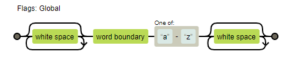
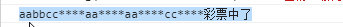
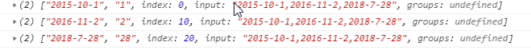

# 窗口（BOM）

> document代表整个html文档

### 1.获取滚动条滚动距离

iE9以上：

```javascript
window.pageXOffset/pageYOffset
```

IE8和IE8以下：

```javascript
document.body.scrollLeft/scrollTop

document.documentElement.scrollLeft/scrollTop
```

上面的两个也是获取屏幕滚动条的方法，但是这两个方法存在兼容性混乱的问题，并且两个方法是互斥的，在一个浏览器中只能用其中一个，只要一个能用，另外一个就是0。

因此，最好的解决办法就是将这两个方法相加

```javascript
document.body.scrollLeft + document.documentElement.scrollLeft
```


**封装一个自己的获取滚动条距离方法，getScrollOffset**

```javascript
function getScrollOffset(){
    if(window.pageXOffset){
      	return {
            x: window.pageXOffset,
            y: window.pageYoffset
        } 
     }else{
         return {
             x: document.body.scrollLeft + document.documentElement.scrollLfet,
             y:document.body.scrollLeft + document.documentElement.scrollLfet
         }
     }
}
```


### 2.可视区窗口

> 可视区窗口就是编写html文档的那部分区域，不包括工具栏和导航栏，也叫视口


IE9以上：

```javascript
window.innerWidth/innerHeight
```

IE8或IE8以下(标准模式)：

```javascript
document.documentElement.clientWidth/clientHeight
```

IE8或IE8以下(怪异模式)下

```javascript
document.body.clientWIdth/clientHeight
```

怪异/混杂模式：该模式下浏览器会向后兼容低版本的页面，兼容能力根据浏览器的版本不同而不同，进入混杂模式只需去掉html文档的 `<!DOCTYPE html>`。获取当前页面是处于何种模式下可用**document.compatMode**属性来查看。


**封装可视区窗口方法:getViewportOffset()**

```javascript
function getViewportOffset(){
    if(window.innerWidth){
        return {
            x: window.innerWidth,
            y: window.innerHeight
        }
    }else if(document.compatMode === 'BackCompat'){
        return {
            x:document.body.clientWidth,
            y:document.body.clientHeight
        }
    }else{
        return {
            x: document.documentElement.clientWidth,
            y: document.documentElement.clientHeight
        }
    }
}
```


### 3. 查看元素的几何尺寸

> content + padding + border
>
> 兼容性很好。
>
> 该方法返回一个对象，对象里面有left，top，right，bottom，width，height。以页面的左上角问原点（0，0），left和top代表该元素左上角的X和Y坐标。right和bottom代表元素右下角的X和Y坐标。
>
> 返回的结果并不是实时的，是静态的值，当保存到一个变量中去后，即使方块位置或长度改变后，该变量的值是不会改变的


```javascript
dom.getBoundingClientRect()
```

在IE浏览器中，该方法没有width属性和height属性，我们可以通过right - left = width，bottom - top = height

```html
<div style="width: 100px; height: 100px; position: absolute; left: 100px; top: 100px; background-color: orange; padding: 10px; border: 10px solid #000; margin:10px;"></div>

<script>
var div = document.getElementsByTagName('div')[0]
</script>
```


### 4. 查看元素的尺寸

> content + padding + border
>
> 该方法让getBoundingClientRect()成为了永久报废的方法。

```javacscript
dom.offsetWidth/offsetHeight
```

```html
<div style="width: 100px; height: 100px; position: absolute; left: 100px; top: 100px; background-color: orange; padding: 10px; border: 10px solid #000;margin:10px;"></div>
<script>
    var div = document.getElementsByTagName('div')[0]
</script>
```


#### 4.1. 查看元素的位置

> 忽略自身是否为定位元素。
>
> 父级有定位：返回以父级左上角为原点的坐标
>
> 父级无定位：返回以文档(html)左上角为原点的坐标
>
> left代表X坐标，top代表Y坐标

```javascript
dom.offsetLeft/offsetTop
```

例子：

```html
<style>
    .wrapper{
        width: 300px;
        height: 300px;
        border: 1px solid #000;
        margin: 50px;
    }
    .box{
        width: 200px;
        height: 200px;
        margin: 50px;
        border: 1px solid purple;
    }
    .demo{
        width: 100px;
        height: 100px;
        margin: 50px;
        background-color: #f10;
    }
</style>
<body>
    <div class="wrapper">
        <div class="box">
            <div class="demo"></div>
        </div>
    </div>
    <script>
        var demo = document.getElementsByClassName('demo')[0];
    </script>
```


没有给任何元素设置定位的时候


Top之所以少了8px，是因为纵向margin塌陷的问题，导致和margin重叠到了一起。


给父父级wrapeer设定定位

```css
.wrapper{
    position:'relative'
}
```


给父级box设定定位，

```css
.box{
    position:'relative'
}
```


封装元素相对于文档的坐标getElementPosition

```javascript
function getElementPosition(element){
    var target = element
    function _getElementPosition(element){
        if(element.parentNode.nodeName== 'HTML') return{
            left: target.offsetLeft,
            top:  target.offsetTop
        };
        var father = element.parentElement || element.parentNode;
        var fatherPos = window.getComputedStyle(father,null).getPropertyValue('position');
        if(father.nodeName == 'DIV'){
            if(fatherPos !== 'static'){
                return{
                    left: target.offsetLeft,
                    top:  target.offsetTop
                }
            }
        }

        return _getElementPosition(father)
    }
    return _getElementPosition(element)

}
```


### 5.   让滚动条滚动

> window上面有三个方法，分别是scroll(x,y)，scrollTo(x,y)，scrollBy(x,y)。
>
> 三个方法功能都类似，用法都是将X,Y坐标传入，实现让滚动轮滚动到当前位置
>
> 其中scroll()和scrollTo()方法一模一样，只要记住其中一个即可
>
> scrollBy()会在之前的数据基础之上累加。

```html
<div class="box" style="width: 100px; height: 100px; position: absolute; left: 100px; top: 100px; background-color: orange;" ></div>
<div style="width: 5000px; height: 5000px;"></div>
```

Scroll方法：


scrollBy方法：


案例一：用scroll实现页面收缩后返回原位

```html
<style>
    :root{
        height: 4000px;
    }
    .demo{
        position: relative;
        width: 300px;
        height: 600px;
        border: 2px solid #000;
    }
    button{
        position: absolute;
        width: 100%;
        height: 23px;
        bottom: 0;
        border: none;
        outline: none;
        background-color:green;
        color: #fff;
    }
</style>
<div class="demo">
    <button>点击查看更多</button>
</div>
<script>
    var button = document.getElementsByTagName('button')[0];
    var demo = document.getElementsByClassName('demo')[0]
    button.addEventListener('click',function(){
        var height = window.getComputedStyle(demo,null).height;
        if(height == '600px'){
            demo.style.cssText='height:1000px;'
            button.textContent = '收回长度'
        }else{
            demo.style.cssText='height:600px;'

            button.textContent = '点击查看更多'
            window.scroll(0,0)
        }

    })
</script>
```


案例2:scrollBy实现自动阅读功能

```html
<style>
    .button{
        position: fixed;
        width: 50px;
        height: 50px;
        border-radius: 50%;
        color: #fff;
        right: 0;
        opacity: 0.7;
        text-align: center;
        line-height: 50px;
        font-size: 20px;
    }
    .start{
        background-color: orange;
        bottom: 200px;

    }
    .stop{
        background-color: red;
        bottom: 150px;

    }
    .fast{
        background-color: #f0f;
        bottom: 100px;

    }
    .low{
        background-color: #0ff;
        bottom: 50px;

    }
</style>
<div class="text">字自己填</div>
<div class="button start">start</div>
<div class="button stop">stop</div>
<div class="button fast">fast</div>
<div class="button low">low</div>
<script>
    var start = document.getElementsByClassName('start')[0];
    var stop = document.getElementsByClassName('stop')[0];
    var fast = document.getElementsByClassName('fast')[0];
    var low = document.getElementsByClassName('low')[0];
    var speed = 10;
    var timer = 0
    start.addEventListener('click',function(){
        clearInterval(timer)
        timer = setInterval(function(){
            window.scrollBy(0,speed)
        },100)
    })
    fast.addEventListener('click',function(){
        speed +=2;
    })
    low.addEventListener('click',function(){
        speed -=2;
    })
    stop.addEventListener('click',function(){
        clearInterval(timer)

    })
</script>
```


### 6. 读写元素CSS属性

**1、dom.style.prop**

> 可读可写行间样式，没有兼容性问题。
>
> 行间不存在的样式也能写入到行间
>
> float是其它语言的关键字，W3C推荐换成cssFloat,也是一样的
>
> 行间样式优先级仅此于!important，非常高

仅有上面的方法支持写入样式，下面的全部都不支持写入样式


**2、查询计算样式**

> IE8以及IE8以下不兼容。
>
> **计算样式只读**，获取的是元素最终展示的样式（权重最高的），无论是在行间还是非行间
>
> 返回的计算样式的值都是绝对值，比如10em,最终返回160px，比如red，最终返回rgb(255,0,0)，这些都是计算过后的

```javascript
window.getComputedStyle(元素,伪元素)
```


**3、查询样式**

> IE独有属性，支持IE所有版本浏览器
>
> 样式只读。
>
> 获取的值是原封不动的值，没有经过计算的

```
ele.currentStyle.prop
```


**封获取装样式方法getStyle**

```javascript
//4.获取样式
function getStyle(ele,prop){
    if (window.getComputedStyle) {
        return window.getComputedStyle(ele,null)[prop];
    }else{
        return ele.currentStyle[name];

    }
}
```


## 事件

### 绑定事件处理函数

**1、ele.on'+type function(){}**

> 兼容性很好，但是一个元素的同一个事件上只能绑定一个处理程序
>
> 基本等同写在HTML行间上
>
> this指向元素本身 

**2、obj.addEventListener(type,fn,是否启动事件捕获（默认false）)**

> IE9以下不兼容，可以为一个事件绑定多个处理程序
>
> thi指向元素本身

**3、ele.attachEvent('on'+type，fn)**

> IE独有，一个事件同样可以绑定多个处理程序
>
> this指向 window，要想指向元素，可以在外部写一个函数，如何在事件处理函数中调用该函数，并手动把this指向当前元素

```javascript
ele.attachEvent('onclick',function(){
    handle.call(ele)//把handle函数中的this指向ele
})
function handle(){
    //事件处理程序
}
```

 

**封装兼容性的addEvent(ele,type,handle)方法：**

 ```javascript
function addEvent(ele,type,handle){
    if (ele.addEventListener) {
        ele.addEventListener(type,handle,false)
    }else if(ele.attachEvent){
        ele.attachEvent('on'+type,function(){
            handle.call(ele)
        })
    }else{
        ele['on'+type] = handle;
    }
}
 ```


### 解除事件绑定

**onclick**

```javascript
ele.onclick = null
```

**removeEventListener**

```javascript
ele.removeEventListener(type,fn,false)
```

**detachEvent**

```javascript
ele.detachEvent('on'+type,fn)
```

注：第二和第三个方法，匿名函数无法清除，因此要想能被清除，最好用有名称的函数


### 事件处理模型——事件冒泡，捕获

**事件冒泡**

> 结构上（非视觉上）嵌套关系的元素，会存在事件冒泡的功能，即同一个事件，自子元素冒泡向父元素（自底向上）

**事件捕获**

> 结构上（非视觉上）嵌套关系的元素，会存在事件捕获的功能，即同一事件，自父元素捕获至事件源事件。（自顶向下）
>
> IE没有捕获事件

注：一个对象的一个事件类型只能存在一个事件处理模式，只能是冒泡，或只能是捕获

如果给一个元素绑定了同类型的事件，一个用事件冒泡，一个用事件处理，触发顺序是**先捕获，后冒泡**

```javascript
<style>
.wrapper{
        width: 300px;
        height: 300px;
        background-color: orange;
    }
.box{
    width: 200px;
    height: 200px;
    background-color: deepPink;
}
.demo{
    width: 100px;
    height: 100px;
    background-color: green;
    color: #fff;
}

</style>
<div class="wrapper">
    <div class="box">
        <div class="demo">底部</div>
	</div>
</div>
<script>
var wrapper = document.getElementsByClassName('wrapper')[0];
var box = document.getElementsByClassName('box')[0];
var demo = document.getElementsByClassName('demo')[0];
    
//冒泡
    wrapper.addEventListener('click',function(){
        console.log('wrapperBubble');
    },false);
    box.addEventListener('click',function(){
        console.log('boxBubble');
    },false);
    demo.addEventListener('click',function(){
        console.log('demoBubble');
    },false);
    
//捕获
    wrapper.addEventListener('click',function(){
        console.log('wrapper');
    },true);
    box.addEventListener('click',function(){
        console.log('box');
    },true);
    demo.addEventListener('click',function(){
        console.log('demo');
    },true);

</script>
```


当我们点击绿色区域时，按照我们的想法先捕获再冒泡的顺序，执行结果应该是wrapper->box->demo->demoBubble->boxBubble->wrapperBubble。但上面的结果却与我们预想的不一致，demo与demoBubble互换了顺序。**但其实绿色区域是事件执行，事件执行的原则是谁先绑定谁先执行**


$focus，blur，change，submit，reset，slelct，onmouseenter, mouseleave等事件不冒泡 $

### 取消冒泡和阻止默认事件

**取消冒泡**

- W3C标准**event.stopPropagation()**,但不支持IE9以下版本

  ```javascript
  ele.onclick = funtion(e){
      e.stopPropagation()
  }
  ```

- IE独有**event.cancelBubble** = true（谷歌也实现了该方法）

  ```javascript
  ele.onclick = funtion(e){
      e.cancelBubble()
  }
  ```

  

**封装取消冒泡的函数stopBubble(event)**

```javascript
function cancelBubble(event){
    if(event.stopPropagation){
        event.stopPropagation()
    }else{
        event.cancelBubble = true;
    }
}
```

event可通过在调用该事件的事件处理函数中得到。


**阻止默认事件**

>  默认事件——表单提交，
>
> a标签取消跳转 `<a href="javascript:void(false)">`，这里的void()就是return，里边填的就是返回的结果
>
> 右键菜单(document.oncontetxmenu)等

- return false  以对象属性(ele.type = fn)的方式注册的时间才生效
- event.preventDefault(): W3C标准，IE9以下不兼容
- event.returnValue = false 兼容IE，谷歌也能使用了

**封装阻止默认事件的函数，cancelHandler(event)**

```javascript
function cancelHandler(event){
    if(event.preventDefault){
       event.preventDefault();
    }else{
        event.returnValue = false;
    }
    //return false封装不进去，因为对于函数来说这是结束函数返回false
}
```


### 事件对象

> event || window.event用于IE

兼容性写法

```javascript
ele.onclick = function(e){
    var event = e || window.event;
}
```

IE的事件对象不会传到事件处理函数中，而是放到window上。


事件源对象（点击的具体元素）

- event.target   火狐只有这个 
- event.srcElement  IE只有这个
- 这俩chrom都有

兼容性写法

```javascript
ele.onclick = function(e){
    var target = event.target || event.srcElement;
}
```


### 事件委托

> 事件冒泡 + 事件源对象 = 事件委托

以click事件为例，只要父元素有click事件，即使子元素没有绑定click事件，当点击子元素的时候，会冒泡到父元素的点击事件，也想当于点击了父元素的点击事件，这时再输出具体的事件源对象，就到是谁点击了。这也就是所谓的**事件委托**

```html
<ul class="demo">
    <li>1</li>
    <li>2</li>
    <li>3</li>
    <li>4</li>
    <li>5</li>
    <li>6</li>
    <li>7</li>
    <li>8</li>
    <li>9</li>
    <li>10</li>
</ul>
<script>
    var ul = document.getElementsByClassName('demo')[0];
    ul.addEventListener('click',function(event){
        var e = event || window.event;
        var target = e.target || e.srcElement;

        console.log(e.target.innerHTML);
    })
</script>
```


优点：

- 性能-不需要循环所有的元素一个个绑定
- 灵活-当有新的子元素时不需要重新添加


# Math对象

> 提供了一系列与数字相关的成员，注意是对象。
>
> 参考链接： https://developer.mozilla.org/zh-CN/docs/Web/JavaScript/Reference/Global_Objects/Math 

### 常用方法 

- random方法：产生一个【0—1）之间的随机数
- PI属性：得到圆周率
- abs方法：求绝对值
- floor方法：对一个数向下取整
- ceil 方法：对一个数向上取整
- max方法：得到一组数字的最大值，如果无参，得到-Infinity
- min方法：得到一组数字的最小值，如果无参，得到Infinity
- pow方法：求一个数字的幂次方，用2**3也可以表示2的三次方
- round方法：得到一个四舍五入的整数

...

# Data构造函数

## 术语

**1. 时间单位**

年（year）

月（month）

日（date）

小时（hour）

分钟（minute）

秒（second）=== 1000ms

毫秒（millisecond，ms） === 1000us

微秒（microsecond）=== 1000ns

纳秒（nanosecond）

**2. UTC和GMT**

时间划分为24个时区，一个时区相差1个小时，北京在东8区，格林威治在0时区，因此格林的凌晨是指0点，北京的凌晨是指8点。

GMT（Greenwish Mean Time）:格林威治时间时，太阳时，精确到毫秒	GMT+0800	东八区

UTC（Universal Time Coodinated）:世界协调时，以原子时间为计时标准，精确到纳秒（计算机使用）

UTC和GMT之间误差不超过0.9秒


**3.时间戳**

1970-1-1 凌晨  到  某个时间  所经过的毫秒数


**4.星期和月份的英文及缩写**

星期


月份（1-12）


（Jan）箭 ：光影似箭，新的一年又开始了

（Feb）飞吧：放寒假咯，飞吧飞吧

（Mar）妈：三八妇女节

（Apr）苹果：四月苹果是最好吃的

（May）美：五月劳动节，劳动最美丽

（june）聚：六一劳动节，小朋友欢聚

（july）就来：七月份暑假就来

（Aug）秋天：Autumn

（sept）School：会学校咯

（Oct）O像气球：十月国庆，放飞气球

（Nov）no温：冬天到了，没温度了

（Dec）底：一年到底了

## 创建时间对象（Date）

- 直接调用函数（不用new）,会忽略所有参数，直接返回当前时间的字符串

  //【星期   月份  日期  年份  时  分  秒  】

  ```javascript
  Date() //"Sat Jan 18 2020 09:03:10 GMT+0800 (中国标准时间)"
  ```

- new Date()：创建日期对象【返回的结果是object类型】

  1. 无参，当前时间

  2. 1个参数，参数为数字，表示传入的是时间戳

     ```javascript
     var d = new Date(1000) //Thu Jan 01 1970 08:00:01 GMT+0800 (中国标准时间)
     ```

  3. 2个参数及以上，分别表示：年、月、日、时、分、秒、毫秒

     ```javascript
     new Date(2015,10,1,10,10,10,200)
     //Sun Nov 01 2015 10:10:10 GMT+0800 (中国标准时间)
     //星期日 11月 1号 2015年 10点 10分 10秒 （200毫秒）
     ```

     

  注意：

  1. 月份(month)是以0开始，1代表2月，5代表6月...
  2. 日期的0或-0代表当前月的一号减去一天（（也就是上个月的最后一天））.-1表示当前月的一号减2天，以此类推...

  2. 如果缺失参数，只有2个参数，日期部分（day）默认为1，时分秒毫秒默认为0

  3. 月、日、时、分、秒、毫秒，均可以传递负数，如果传递负数，会根据指定年份进行推算

     ```javascript
     new Date(2015,-5,-1)
     //Wed Jul 30 2014 00:00:00 GMT+0800 (中国标准时间)
     //星期三 七月 30号 2014年 0时0分0秒
     ```

     月份：0 ==>1，-1==>12， -2 ==>11，-3 ==>10，-4==>9，-5==>8 ...

     日期：1代表1日，0代表上个月的倒数最后一日，-1代表上个日期的倒数第二日

## 实例成员

MDN参考链接： https://developer.mozilla.org/zh-CN/docs/Web/JavaScript/Reference/Global_Objects/Date 

- getDate()方法：得到日期部分（从1-31），几号

- getDay()方法：得到星期几，0表示星期天（从0-6）

- getMonth()方法：得到月份

- getFullYear()方法：得到年份

- getHours()方法：得到小时部分

- getMinutes()方法：得到分钟

- getSecond()方法：得到秒

- getMilliseconds()方法：得到毫秒

  上面的方法都有一个getUTCDate()、getUTCDay()...方法，表示的是从0时区开始到指定日期的时间，北京比0时区快了8个小时

```javascript
var d = new Date();//Sat Jan 18 2020 10:03:21 GMT+0800 (中国标准时间)
d.getDate()	//18
d.getDay()	//6
d.getMonth() //0
d.getFullYear()//2020
d.getHours()	//10
d.getMinutes()	//3
d.getSeconds()	//21
d,getMilliSecond() //346
```

- getTime()方法：得到当前时间戳（从1970-1-1 08:00:00开始）

**设置日期部分**，【返回时间戳】

- setDate方法：设置日期，返回该日期的时间戳

- setMonth方法：设置月份，0代表一月份

- setFullYear方法：设置年份

- setHours方法：设置小时

- setMinutes方法：设置分钟

- setSeconds方法：设置秒

- setMilliSeconds方法：设置毫秒

上面的方法都有一个setUTCDate()、setUTCDay()...方法，表示的是从0时区开始到指定日期的时间，北京比0时区快了8个小时

- setTime方法：设置时间戳（从1970-1-1 08:00:00开始）

```javascript
var d = new Date()//Sat Jan 18 2020 10:35:39 GMT+0800 (中国标准时间)
d.setDate(0) //1577759739801 返回的是1970-1-1 08:00:00到2019-12-31 10:35:39秒之间的时间戳
d.setMonth(0) //1548902139801 设置月份为一月
d.setFullYear(2015)//设置年份为2015年
d.setFullYear(2015,9,1)//设置年月日为2015年10月1号
d.setHours(18)	//设置小时为下午18点
d.setMinutes(59) //设置分钟为59分
d.setSeconds(59) //设置秒数为59秒
d.setMilliSeconds(200) //设置毫秒数为200
d.setTime(2827272727272)//设置时间戳
```


**字符串转换方式**

toString方法：将一个日期转换为一个字符串

toUTCString方法：使用UTC时区， 将一个日期转换为一个字符串

toDateString方法：将日期部分转换为可读的字符串

toLocaleDateString方法：根据当前系统的地区设置，将日期部分转换为可读的字符串

toLocaleString方法：根据当前系统的地区设置，将整个日期转换为可读的字符串

toLocaleTimeString方法：根据当前系统的地区设置，将时间部分转换为可读的字符串

```javascript
var d = new Date()//Sat Jan 18 2020 11:06:44 GMT+0800 (中国标准时间)
d.toSting()	//"Sat Jan 18 2020 11:06:44 GMT+0800 (中国标准时间)"
d.toUTCString()	//"Sat Jan 18 2020 11:06:44 GMT+0800 (中国标准时间)"
d.toDateString()//"Sat Jan 18 2020"
d.toLocaleDateString()//"2020/1/18"
d.toLocaleTimeString()//"上午11:06:44"
d.toLocaleString()//"2020/1/18 上午11:06:44"
```


## 封装一个固定日期格式工具

```javascript
function getDateString(data){
    var year = data.getFullYear().toString().padStart(4,"0")
    var month = data.getMonth().toString().padStart(2,"0")
    var day = data.getDate().toString().padStart(2,"0")
    var hour = data.getHours().toString().padStart(2,"0")
    var minutes = data.getMinutes().toString().padStart(2,"0")
    var second = data.getSeconds().toString().padStart(2,"0")
    return `${year}-${month}-${day} ${hour}:${minutes}:${second}`
}
console.log(getDateString(new Date()))
```


## 日期的运算

日期对象重写了object中的valueof方法，返回的是一个数字，表示时间戳

因此，日期对象可以进行数学运算，不用需要注意的是+号只能表示拼接。

```javascript
var d1 = new Date()
d1.setMinutes(20)
var d2 = new Date()
d2.setMinutes(40)

//日期运算
console.log(d2-d1); //1200000 
console.log(d2+d1);//Sat Jan 18 2020 11:40:48 GMT+0800 (中国标准时间)Sat Jan 18 2020 11:20:48 GMT+0800 (中国标准时间)
console.log(d2*d1)//2.4942461314377065e+24
console.log(d2/d1)//1.0000007598218135
```

## 练习题

给定用户出生日，返回用户年龄

```javascript
function getAge(){
     
}
```

# 正则表达式

> 正则表达式是一个规则，用于验证字符串


## 基础

### 1. 字面量匹配

规则中直接根据书写的字符进行匹配

### 2. 特殊字符

| 字符 | 描述                                                      |
| ---- | --------------------------------------------------------- |
| .    | 匹配除换行符 \n 之外的任何单字符。要匹配 . ，请使用 \.    |
| ^    | 匹配输入字符串的开始位置，在[]表示对字符范围取反          |
| $    | 匹配输入字符串的结尾位置。要匹配 $ 字符本身，请使用 \\$。 |

### 3. 转义符

| 字符 | 描述                                                         |
| :--: | ------------------------------------------------------------ |
|  \n  | 匹配一个换行符                                               |
|  \r  | 匹配一个回车符                                               |
|  \t  | 匹配一个制表符，                                             |
|  \s  | 匹配任何空白字符串，包括空格，制表符，换页符等等（都是白色的空格） |
|  \S  | 匹配任何非空白字符（不能留有空白）                           |
|  \b  | 匹配一个单词的边界，即字与空格间的位置 。字符串的开始、结尾、空格、换行都算边界。只是匹配字符串开头结尾及空格回车等的位置, 不会匹配空格符本身 |
|  \B  | 非单词边界匹配                                               |
|  \d  | 匹配一个数字字符，等价于[0-9]，一次只能匹配一个              |
|  \D  | 匹配一个非数字字符，等价于 【^0-9】                          |
|  \w  | 匹配字母，数字，下划线（_），等价于^[A-Za-z0-9\_]，          |
|  \W  | 匹配非字母，数字，下划线(_）,等价于【^A-Za-z0-9_】           |
|  \u  | 匹配 n，其中 n 是一个用四个十六进制数字表示的 Unicode 字符。其中[\u4e00-\u9fa5]表示所有基本汉字的范围 |

上面的转义符都是出现一个只能匹配一个

### 4.字符集

| 字符            | 描述                   |
| --------------- | ---------------------- |
| []              | 匹配字符范围的一个字符 |
| [\u4e00-\u9fa5] | 匹配所有基本汉字的范围 |

### 5.量词

前面规程出现的次数

| 字符  | 描述                 |
| ----- | -------------------- |
| *     | 匹配0个或以上的数字  |
| ？    | 匹配0个或一个的数字  |
| +     | 匹配一个或多个的数字 |
| {n}   | 匹配n个。            |
| {n,}  | 匹配>=n个            |
| {n,m} | 匹配n-m个            |

>  比如^[A-Za-z0-9\_]{6}表示前面的规则出现6次，需要注意的是，{n}只能指代它前面的一个规则，不能指代多个规则，如果需要将这些规则组装成一个整体，需要用（）来将规则组装成一个整体

### 6.或者

多个**规则**之间，任选其一 ```|```

### 7.集合

| 字符 | 描述                                                         |
| ---- | ------------------------------------------------------------ |
| （） | 将多个规则组装成一个整体进行匹配，例如```^(\d[a-z]{3})```表示一个数字后面接一个小写字母，并重复匹配三次 |

### 8.练习

```javascript
1. 匹配一个正数(包括小数)			  //^\d+(\.\d+)?$
2. 匹配一个邮箱					//^\w+@\w+(\.\w+){1,2}$
3. 匹配一个小数（包括负小数）		//^-?\d+\.\d+$
4. 匹配一个整数（包括负数和.00的情况）			//^-?\d+(\.[0]+)?$
```


## JS中的应用

> JS中，正则表达式表现为一个对象，该对象是通过构造器函数RegExp生成的

### 创建正则对象

1. 字面量模式

   ```javascript
   var reg1 = /规则/flags
   ```

2. 构造函数模式

   ```javascript
   var reg2 = new RegExp('规则','flags')
   ```

3. 直接使用构造函数

   ```javascript
   var reg3 = RegExp('规则')
   ```

使用第2种方法和第3种方法唯一的区别就是：如果规则是一个引用对象，第二种方法可以理解为复制，第三种方法为剪切

```javascript
var reg1 = /^-?\d+(\.0+)?$/
var reg2 = new RegExp(reg)
reg === reg2	//false
var reg3 = RegExp(reg)
reg=== reg3		//true
```

### 正则实例成员

#### 属性

| 符号           | 描述                             |
| -------------- | -------------------------------- |
| g——global      | 是否开启全局匹配。只读属性       |
| i——ignore Case | 在匹配时是否要忽略字符的大小写   |
| m——multiline   | 是否开启多行匹配(影响^和$的行为) |
| s——Source      | 目前的规则                       |
| lastIndex      | 匹配                             |

#### 方法

| 方法   | 描述                                                         |
| ------ | ------------------------------------------------------------ |
| test() | 测试某个字符是否满足规则,返回布尔值，需要注意的是，如果规则开启了全局匹配，并且多次调用test方法，test会记住上一次匹配结束的字符串末尾索引（lastIndex），然后再次进行第二次匹配，如果后面已经没有字符串，第三次又会复位重头开始。lastIndex可手动更改，如果未启动全局匹配，每次都是匹配第一个匹配的到的字符串 |

> 正则表达式，默认情况下，使用贪婪模式

> 在量次后，加上？ 表示进入非贪婪模式

```javascript
//这个规则存在一个歧义，是匹配 1，2，3，4呢，还是匹配1234呢？，默认情况下，匹配1234。而这个就是贪婪模式
//var reg = /\d+/g	//贪婪模式下，表示尽可能的匹配多的字符
var reg = /\d+?/g	//非贪婪模式下，表示尽可能的匹配少的字符
var s = '1234abc123aaa'
console.log(s,reg.lastIndex,reg.test(s),reg.lastIndex);
console.log(s,reg.lastIndex,reg.test(s),reg.lastIndex);
console.log(s,reg.lastIndex,reg.test(s),reg.lastIndex);
console.log(s,reg.lastIndex,reg.test(s),reg.lastIndex);
console.log(s,reg.lastIndex,reg.test(s),reg.lastIndex);
console.log(s,reg.lastIndex,reg.test(s),reg.lastIndex);
console.log(s,reg.lastIndex,reg.test(s),reg.lastIndex);
```


|  方法   | 描述                                                         |
| :-----: | ------------------------------------------------------------ |
| exec( ) | execute，执行匹配，得到第一次匹配结果。是一个特殊数组（类数组）,分别代表（结果、开始的下标索引（可通过lastIndex修改）、输入的匹配项、所属组、数组长度）,规则开启全局匹配时，会根据当前索引进行查找匹配 |

如果索引下标还有其他数字，是所属组的结果

```javascript
var reg = /\d+/g	
var s = '1234abc123aaa'
console.log(s);
console.log(reg.lastIndex);
console.log(reg.exec(s));
console.log(Array.isArray(reg.exec(s)));
```


修改lastIndex后

```javascript
reg.lastIndex = 2
reg.exec(s)
```


可以发现是从包括lastIndex的索引开始查找起。


### 字符串对象中的正则方法（String）

| 方法        | 描述                                                         |
| ----------- | ------------------------------------------------------------ |
| match(正则) | 使用正则表达式与字符串相比较，返回匹配的结果，全局匹配模式下，得到的是一个数组，非全局匹配模式下，得到的是一个跟exec（）方法一样的特殊数组（类数组） |

```javascript
var s = '1234abc123aaa'
var result = s.match(/\d+/)	//非全局匹配
//["1234", index: 0, input: "1234abc123aaa", groups: undefined]
console.log(s,result);

var result2 = s.match(/\d+/g)//全局匹配
//["1234", "123"]
console.log(s,result2);		
```

| 方法           | 描述                                                         |
| -------------- | ------------------------------------------------------------ |
| search（正则） | 对正则表达式和指定字符串进行匹配搜索，返回的永远是第一个出現的匹配项的下标 |

```javascript
var s = '1234abc123aaa'
var result = s.search(/\d+/)	//非全局匹配
console.log(s,result);	//1234abc123aaa 0
var result2 = s.search(/\d+/g)//全局匹配
console.log(s,result);	//1234abc123aaa 0
console.log(s,result);	//1234abc123aaa 0
```


| 方法               | 描述                                                         |
| ------------------ | ------------------------------------------------------------ |
| split(正则，limit) | 通过分离字符串成字串，将字符串对象分割成字符串数组，默认全局替换 |

```javascript
var s = 'aaaa,bbbb dddd-eeee\nffff\tgggg'
var result = s.split(/[, \-\n\t]/)
console.log(result);
//(6) ["aaaa", "bbbb", "dddd", "eeee", "ffff", "gggg"]
```


| 方法                                                   | 描述                                 |
| ------------------------------------------------------ | ------------------------------------ |
| replace(正则/字符，字符/函数（匹配的结果，捕获组...）) | 不会改变原来字符串，默认只替换一次， |

```javascript
var s = "hello world\tjavascript\nyes"
//将首字母大写
console.log(s);
s = s.replace(/\s*\b[a-z]\s*/g,function(match){
    return match.toUpperCase().trim()
})
console.log(s);
//HelloWorldJavascriptYes
```




### 练习

1. 书写一个正则表达式，去匹配一个字符串，得到匹配的次数和匹配的结果

```javascript
var reg = /\d{3}/g;
var s = '123aaa456aaa789aaa'
var n = 0;
while(result = reg.exec(s)){
    n++;
    console.log(result[0]);
}
console.log(`匹配${n}次`);
```


2. 得到一个字符串中中文字符的数量

```javascript
var reg = /[\u4e00-\u9fa5]/g
var s = '小红红，大灰狼，MM，GG'
var n = 0;
while(reg.test(s)){
    n++;
}
console.log(`匹配到${n}个中文字符`);
//匹配到6个中文字符
```


3. 过滤敏感词，维护一个敏感词数组，需要将字符串中出现的敏感词替换成四个\****

```javascript
//将字符串中敏感词替换
var senWords = ['色情','暴力','双色球','卢本伟牛逼','卧槽'];
/** 
*@parms s	字符串
*@parms rep 替换的词汇
**/
function removeSensitiveWords(s,rep){
    var reg = new RegExp(`(${senWords.join('|')})+`,'g');
    return s.replace(reg,rep);
}
console.log(removeSensitiveWords('aabbcc色情aa暴力aa卢本伟牛逼cc卧槽双色球彩票中了','****'))
```



## 进阶

### 捕获组

> 用小括号（）包裹的部分叫做捕获组，捕获组会出现在匹配结果中，捕获顺序是从左到右，并且捕获组可以命名，通过在（?<名称>）命名，叫做具名捕获组,命名的捕获组会出现在exec生成的数组的groups对象中

```javascript
var s = "2015-10-1,2016-11-2,2018-7-28";
//得到每个日期，并得到每个日期的年月日
var reg = /(?<year>\d{4})-(?<month>\d{1,2})-(?<day>\d{1,2})/g;
while(result = reg.exec(s)){
      console.log(result);
}
```


### 非捕获组

如果仅仅希望把某些规则当成一个整体而不捕获，需要用到非捕获组，非捕获组只需在（？）后面加上：即可（?:）

```javascript
var s = "2015-10-1,2016-11-2,2018-7-28";
//得到每个日期，并得到每个日期的年月日
var reg = /(?:\d{4})-(?:\d{1,2})-(\d{1,2})/g;
while(result = reg.exec(s)){
      console.log(result);
}
```




**捕获组+replace的一些操作**

```javascript
var s = "2015-10-1,2016-11-2,2018-7-28";
//得到每个日期，并得到每个日期的年月日
var reg = /(\d{4})-(\d{1,2})-(\d{1,2})/g;
s.replace(reg,function(match,g1,g2,g3){
    console.log(match,g1,g2,g3)
    return `${g1}/${g2}/${g3}`
})
```


```javascript
var s = "2015-10-1,2016-11-2,2018-7-28";
//得到每个日期，并得到每个日期的年月日
var reg = /(\d{4})-(\d{1,2})-(\d{1,2})/g;
//$1,$2,$3...分别表示第一个捕获组，第二个捕获组...
s = s.replace(reg,"$1/$2/$3");
console.log(s);
//2015/10/1,2016/11/2,2018/7/28
```


### 反向引用

> 在正则表达式中，使用某个捕获组，用法：```\捕获组编号```

```javascript
var reg = /(\d{2})\1/	//\1表示使用第一个捕获组，使用一次，总的意思就是重复引用之前的结果
console.log(reg.test('1313'));	//true
console.log(reg.test('1314'));	//false
```


> 例子：找出该字符串中连续出现的字符，达到去重的效果

```javascript
var s = 'aaaabbbbccccefghhhh'
var reg = /(\w)\1+/g	//\1+表示使用第一个捕获组，使用一次以上
while(result = reg.exec(s)){
    console.log(result[1])
}
```


另外，也可以通过名字\k<捕获组名>引用某个具名捕获组，\k表示获取某个捕获组

```javascript
var s = 'aaaabbbbccccefghhhh'
var reg = /(?<repeat>\w)\k<repeat>+/g	//\1+表示使用第一个捕获组，使用一次以上
while(result = reg.exec(s)){
    console.log(result[1])
}
```


### 正向断言（预查）

> 检查某个字符后面的字符是否满足某个规则，该规则不成为匹配结果,并且不称为捕获组
>
> （?=）

例子：找出字母后面接数字的字母

```javascript
var s = 'huhu123shao3456xik8881';
var reg = /[a-zA-Z](?=\d+)/g
console.log(reg);
while(result = reg.exec(s)){
    console.log(result);
}
//
```


面试题：给一组数字，从右向左，每隔三位添加一个逗号，

例如3333444555 ==》3,333,444,555

```javascript
var s = "3333444555"
var reg = /\B(?=(\d{3})+$)/g
s = s.replace(reg,',')
console.log(s);	//3,333,444,555
```


### 负向断言（预查）

> 检查某个字符后面的字符是否不满足某个规则，该规则不成为匹配结果,并且不称为捕获组(?!)

```javascript
var s = 'hu123wsh456';
var reg = /[a-zA-Z](?!\d+)/g;
while(result = reg.exec(s)){
    console.log(result);
}
```


面试题：判断密码强度，要求密码中必须出现小写字母，大写字母，数字，特殊字符(!@#_,.)

```javascript
var s = "huan.@xx##,XX11"
//var s = 'asdfsdAf234.'
var reg = /^(?=.*[a-z])(?=.*[A-Z])(?=.*\d)(?=.*[!@#_,.]).{6,12}$/
console.log(reg.test(s))
```

面试题：

//判断密码强度

//出现小写字母、大写字母、数字、特殊字符（!@#_,.）	强

//出现小写字母、大写字母、数字	中

//出现小写字母、大写字母、			弱

//其他													不满足要求

```javascript
function judgePwd(pwd){
    if(/^(?=.*[a-z])(?=.*[A-Z])(?=.*\d)(?=.*[!@#_,.]).{6,12}$/.test(pwd)){
       return '强'
    }else if(/^(?=.*[a-z])(?=.*[A-Z])(?=.*\d).{6,12}$/.test(pwd))	 {
       return '中'      
    }else if(/^(?=.*[a-z])(?=.*[A-Z]).{6,12}$/.test(pwd)){
       return '弱'    
    }else{
        return "不满足要求"
    }
}
console.log(judgePwd('assADDFF4.343'));
```


# 语法错误

JS中的错误分为：

1. 语法错误(SyntaxError)：会导致整个脚本块无法执行
2. 运行错误（TypeError）
   1. 运行报错：会导致当前脚本块后续代码无法执行
   2. 运行结果不符合预期：

## 调试错误

1. 控制台打印
2. 断点调试

## 抛出错误

错误在JS中本质上是一个对象，抛出错误的语法为：

```javascript
throw 错误对象
```

错误对象的构造函数为Error

## 捕获错误

try{

​	//代码块1

}catch(错误对象){

​	//代码块2

}finally{

​	//代码块3

}

当运行代码1的时候，如果发生错误，立即停止代码1 的执行，转而执行代码2，错误对象为抛出的错误对象，无论代码1和代码2是否运行完成，最终都将执行代码3

```javascript
function A(){
    console.log(B());
    console.log('A环境')
}
function B(){
    try{
       C();
       console.log('B环境');
    }catch(e){
        console.log('C运行发生了错误：',e);
        return 'catch'
    }finally{
        return 'finally';
    }
}
function C(){
    throw new Error('C is a Errror')
}

A()
console.log('qlobal环境');
```


# 深入数组扩展方法

### forEach（func,obj）

> 该方法接收两个参数，第一个参数是一个函数，然后反复的调用该函数，调用的次数取决了数组的长度，并且会给调用的函数传递三个参数，ele，index，self(数组本身)。第二个参数是一个对象，表示将第一个参数（函数）的this指向指向该obj，否则就是默认指向window

例子：

```javascript
var arr = [
    {
        name: '张三丰',
        age: '18',
        sex: 'male',

    },
    {
        name: '张三',
        age: '34',
        sex: 'male'
    },
    {
        name: '爱丽丝',
        age: '16',
        sex: 'female'
    }
]
function deal(item,index,self){
    console.log(item,index,self)
}
arr.forEach(deal)
```


**forEach的实现：**

```javascript
Array.prototype.myForEach = function(func){
    var len = this.length;
    var _this = arguments[1] || window;
    for(var i = 0; i < len; i++){
        func.apply(_this,[this[i],i,this])
    }
}
```

惊呆了​吧:anguished:，forEach的实现竟然如此简单！没错，就是这么简单。


**下面所有的方法都是基于forEach方法进行添砖加瓦的！**

### filter(func,obj)

> 过滤
>
> filter方法基于forEach。
>
> 加瓦片的地方在于调用该方法最终会返回一个新数组，return true的函数内容（item）会被放入到新数组中，起到过滤的作用。

例子：

```javascript
function filterDeal(item,index,self){
    console.log(this)
    if(item.sex =='male') return true
}
let obj = {name:'HSM'}
var newArr = arr.filter(filterDeal,obj);
console.log(newArr)
```


**filter的实现：**

```javascript
Array.prototype.myFilter = function(func,obj){
    let arr = [];				//新增
    let len = this.length;
    let _this = arguments[1] || window;
    for(let i = 0; i <len; i++){
        func.apply(_this,[this[i],i,this]) && arr.push(this[i])//后半部分新增
    }
    return arr;		//新增
}
```


### Map(func,obj)

> 映射。
>
> 返回一个新数组，数组中的元素为原始数组元素调用函数处理后返回 的值。
>
> 当数组中元素是值类型，map不会改变原数组；当是引用类型，则可以改变原数组。因为基本类型返回的是值到新数组中，引用类型改变了内部的值

例子：引用类型值会被修改

```javascript
function MapDeal(item,index,self){
    console.log(this)
    item.age = +item.age + 10;
    return item
}
var newArr = arr.map(MapDeal,obj);
console.log(newArr)
console.log(arr)
```


基本类型原数组不会被修改

```javascript
var arr2 = [1,2,3]
var newArr = arr2.map(function(item,index,self){
    return item*2
})
console.log(newArr); //[2,4,6]
console.log(arr2);		//[1,2,3]	
```


也可以单独抽离出需要返回的内容

```javascript
function MapDeal(item,index,self){
    console.log(this)
    return item.age
} 
console.log(arr.map(MapDeal,obj))

```


**Map的实现：**

```javascript
Array.prototype.myMap = function(func,obj){
    let arr = [];
    let len = this.length;
    let _this = arguments[i] || window;
    for(let i = 0; i < len; i++){
        arr.push(func.apply(_this,[this[i],i,this]))	//新增
    }
    return arr;
}
```


### some(func,obj)

> 可以理解为promise中的race，该函数只返回一个Boolean值
>
> 判断数组中的元素是否都符合条件，有一个符合条件就返回true，全不符合条件才返回false

```javascript
arr.some(function(item,index,self){
    console.log(this)
    if(item.age > 20){
        return true
    }
    return false;
})
```


**some的实现**

```javascript
Array.prototype.mySome = function (func, obj) {
    let flag = false;
    let len = this.length;
    let _this = arguments[1] || window;
    for (let i = 0; i < len; i++) {
        if (func.apply(_this, [this[i], i, this]) == true) {
            flag = true;
            break;
        }
    }
    return flag
}
```


### every(func,obj)

> 可以理解为Promise中的all ，该函数只返回一个Boolean值。
>
> 判断数组中的元素是否都符合条件，全符合返回true，有一个不符合就返回false

```javascript
arr.every(function(item,index,self){
    console.log(this)
    if(item.age > 20){
        return true
    }
    return false;
})
```


**every的实现**

```javascript
Array.prototype.myEvery = function (func, obj) {
    let flag = true;
    let len = this.length;
    let _this = arguments[1] || window;
    for (let i = 0; i < len; i++) {
        if (func.apply(_this, [this[i], i, this]) == false) {
            flag = false;
            break;
        }
    }
    return flag
}
```


### reduce(func,initialValue)

> 从左向右进行遍历，这个方法有点像接力
>
> 原始的该方法只接收两个参数，一个是函数，一个是初始值，该函数也接收4个参数，prevValue，item,index，self，其中的prevValue默认就是initValue的值，函数每一次return的值，都会赋予prevValue，如果函数没有return ,就默认undefined，最后一次的return 会返回给外部函数接收

```javascript
function reduceDeal(prev,item,index,self){
    console.log(prev,item.index,self)
}
arr.reduce(reduceDeal,3)
```

 

将cookie字符串形式转化成对象形式;

```javascript
var str = "PSTM=1547202501;BIDUPSID=51A74B310E1C99BD28A9FA40AB749FD6;MSA_WH=375_667;BAIDUID=0D8F8152E381149:FG=1;BD_UPN=12314753;H_WISE_SIDS=140797_142277_110085;BDORZ=B490B5EBF6F3CD402E515D22BCDA1598;BD_HOME=1;H_PS_PSSID=31782_31464_31322_30824;delPer=0;BD_CK_SAM=1;PSINO=7;H_PS_645EC=bHv5XGOaNHro5ko"
function parseCookidStr(str){
    var obj1 = {};
    var cookieArr = str.split(/[:;]/);
    return cookieArr.reduce(function(prev,cur,index,self){
        var newArr = cur.split('=')
        prev[newArr[0]] = newArr[1];
        return prev
    },obj1)
}
var cookieObj = parseCookidStr(str);
console.log('最终结果是：'cookieObj)
```


**myReduce的实现**

```javascript
Array.prototype.myReduce = function(func,initialValue){
    let len = this.length;
    let _this = arguments[2] || window;
    let nextValue = initialValue
    for(let i = 0; i < len; i++){
        nextValue = func.apply(_this,[nextValue,this[i],i,this])
    }
    return nextValue
}
```


### reduceRight(func,initValue)

> 从右向左进行遍历

将cookie字符串形式转化成对象形式;

```javascript

var str = "PSTM=1547202501;BIDUPSID=51A74B310E1C99BD28A9FA40AB749FD6;MSA_WH=375_667;BAIDUID=0D8F8152E381149:FG=1;BD_UPN=12314753;H_WISE_SIDS=140797_142277_110085;BDORZ=B490B5EBF6F3CD402E515D22BCDA1598;BD_HOME=1;H_PS_PSSID=31782_31464_31322_30824;delPer=0;BD_CK_SAM=1;PSINO=7;H_PS_645EC=bHv5XGOaNHro5ko"
function parseCookidStr(str){
    var obj1 = {};
    var cookieArr = str.split(/[:;]/);
    return cookieArr.reduceRight(function(prev,cur,index,self){
        console.log(prev,cur)
        var newArr = cur.split('=')
        prev[newArr[0]] = newArr[1];
        return prev
    },obj1)
}
var cookieObj = parseCookidStr(str);
console.log('最终结果是：',cookieObj)
```


**myReduceRight的实现**

```javascript
Array.prototype.myReduceRight = function(func,initialValue){
    let len = this.length;
    let _this = arguments[2] || window;
    let nextValue = initialValue
    for(let i = len-1; i >= 0; i--){
        nextValue = func.apply(_this,[nextValue,this[i],i,this])
    }
    return nextValue
}
```

