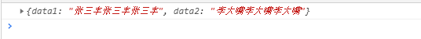

# Mock

## Mock的引入方式

第一种：通过npm 下载

```
npm install mockjs
```

第二种：下载moks.js文件引入

```
https://github.com/nuysoft/Mock/tree/refactoring/dist
```

第三种：通过CDN的形式

```
<script src="https://cdn.bootcdn.net/ajax/libs/Mock.js/1.0.1-beta3/mock-min.js"></script>
```


Vue方式使用

1. 在根目录创建mock.js文件，写入如下

```javascript
const Mock = require('mockjs')
const Random = Mock.Random
let dataList = Mock.mock({
    // 属性 list 的值是一个数组，其中含有 1 到 10 个元素
    'list|1-10': [{
        // 属性 id 是一个自增数，起始值为 1，每次增 1
        'id|+1': 1,
        'name': '@FIRST',
        'creatTime': Random.datetime()
    }]
})

//根据数据模版生成模拟数据
Mock.mock('/api/user/userinfo','get',(req,res)=>{
    return{
        status:0,
        data:dataList,
        message:'成功'
    }
})
```

2. 在main.js文件中导入该文件

```javascript
import './mockjs'
```

3. 使用axios发送请求

```javascript
<template>
  <div class="hello">
    <h1>{{ msg }}</h1>
    <ul>
      <li v-for="item in movieArr">
        <span>{{item.title}}</span>
      </li>
    </ul>
    <button @click="sayOut">渲染</button>
  </div>
</template>
 
<script>
export default {
  name: 'hello',
  data () {
    return {
      msg: '调用豆瓣api',
      movieArr : []
    }
  },
  methods:{
    sayOut () {
      this.$axios.get('/api/user/userinfo')
        .then((response) => {
          console.log(response)
          console.log(response.data.subjects)
          this.movieArr = response.data.subjects
          // 这里要强调一下这个this 箭头函数指的是它的父级也就是vue实例  然后不用箭头函数的话 this是一个undefined 无法.movieArr来给他赋值  这里要注意一下 我被坑了半天 希望小伙伴不要被坑
        })
    }
  }
}
</script>
```


## 语法

## 规范

### 数据模板定义规范

> 用来定义随机生成的模板规范

数据模板中的每个属性由于3个部分构成：属性名，生成规则，属性值 （name|rule:value）


#### 1. min-max：

> 代表一个区间，如果value是字符串或数组，表示重复生成这段字符串min -max次之间，如果是对象，表示随机从对象中取出min -max个之间的属性

```javascript
//属性值是字符串
console.log(
    Mock.mock({
        'data1|1-4' : '张三丰',
        'data2|3':'李大嘴'
    })
)
```




### 数据占位符定位规范

> 只是在属性值字符串中占个位置，并不出现在最终的属性值中
>
> 格式@random方法，其实可以看出@就是random 

### random

#### image （2）

##### random.image()  

> 随机生成图片
>
> 尺寸、背景颜色，文字颜色、图片类型、图片中的文字，
>
> 其实是用到了http://dymmyimage.com，不过很慢，推荐
>
> http://placehold.it
>
> 格式如下：
>
> http://placehold.it/1000x900/33874f/fff.png&text=kavin 

```
Random.image(),
Random.image(),
```

##### random.dataImage

> 生成base64格式的图片

#### Color（5）

##### random.color()

> 随机生成一个颜色，格式为#RRGGBB

##### random.hex()

> 随机生成一个颜色，格式为#RRGGBB

##### random.rgb()

> 随机生成一个颜色，格式为rgb(10,20,30)

##### random.rgba()

> 随机生成一个颜色，格式为rgba(10,20,30,1)

##### random.hsl()

> 随机生成一个有吸引力的颜色，格式为'hsl(h,s,l)'

#### Text（8）

##### random.paragraph(start,end)

> 默认随机生成3-7段话（以 . 结尾表示一段），文字是英文。
>
> start表示固定为多少个句子
>
> start + end 表示区间，左闭右开


##### random.cparagraph(start,end)

> 默认随机生成3-7段话（以。结尾表示一段），文字是中文。
>
> start表示固定为多少个句子
>
> start + end 表示区间，左闭右开


##### random.sentence(start,end)

> 随机一段话，默认10-18个字符串，文字是英文。
>
> start表示单词的数量
>
> start + end 表示单词的数量区间，左闭右开


##### random.csentence(start,end)

> 随机一段话，默认10-18个文字，文字是中文。
>
> start表示文字的数量
>
> start + end 表示文字的数量区间，左闭右开


##### random.word(start,end)

> 随机生成一个英文字符串，默认为3-10个字符之间组成的随机数，文字是英文。
>
> start表示字符的个数
>
> start + end 表示生成字符的个数区间，左闭右开


##### random.cword(字符池（可选），start,end)

> 随机生成一段中文字，默认1个中文字，文字是中文。
>
> start表示文字的个数
>
> start + end 表示生成文字的个数区间，左闭右开


##### random.title(start,end)

> 随机生成一段标题，默认3-7个字符串，文字是英文。每个单词的首字母都是大写
>
> start表示字符串的个数
>
> start + end 表示生成字符串的个数区间，左闭右开


##### random.ctitle(start,end)

> 随机生成一段标题，默认3-7个文字，文字是中文。
>
> start表示文字的个数
>
> start + end 表示生成文字的个数区间，左闭右开


#### Name(6)

> 内部维护了一个姓名池

##### random.first()

> 随机生成一个名 

##### random.last()

> 随机生成一个姓

##### random.name()

>随机生成一个姓名


##### random.cfirst()

> 随机生成一个姓 

##### random.clast()

> 随机生成一个名

##### random.cname()

>随机生成一个姓名


#### web(6)

##### random.url(protocol，host)

> 随机生成一个地址


##### random.protocol()

> 随机生成一个协议


##### random.domain()

> 生成一个随机域名


##### random.tid()

> 随机生成一个顶级域名，例如cn,edu,com等等


##### random.email（type）

> 随机生成一个邮箱格式的邮箱地址
>
> 参数表示@后面的所属邮箱类型,例如163.com，qq.com


##### random.ip()

> 随机生成一个ip地址


#### address(5)

##### random.region()

> 随机生成一个中国大区，比如华南，华北


##### random.province()

> 随机生成一个中国省份，比如广东省，澳门特别行政区，台湾


##### random.city()

> 随机生成一个市，
>
> 参数为Boolean，默认为false，表示是否在前面也输出该市所属省份


##### random.county()

> 随机生成一个县
>
> 参数为Boolean，默认为false。表示是否在前面也输出该县所属城市和省份


##### random.zip()

> 随机生成一个邮政编码


#### Helper(5)

##### random.capitalize(str)

> 将传入参数的首字母大写


##### random.upper(str)

> 将传入的参数全部大写


##### random.lower(str)

> 将传入的参数全部小写


##### random.pick(arr)

> 从创建的数组中随机选取一个元素，并返回


##### random.shuffle(arr)

> 随机给创建的数组排序


#### Miscellaneous(3)

##### random.guid()

> 随机生成一个序列号，全球唯一

##### random. id()

> 随机生成一个身份证，全球唯一

##### random.increment(step)

> 生成一个自增函数，参数表示自增的跨度


#### random.extent(扩展方法)

```javascript
random.extend({
	consttellation:function(data){
		consttellation = ['水瓶座'，'双语座'，'处女座'...]
        return this.pick(consttellation)
    }

})
```

