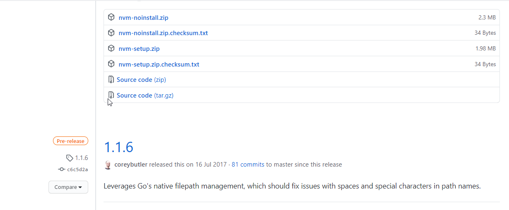
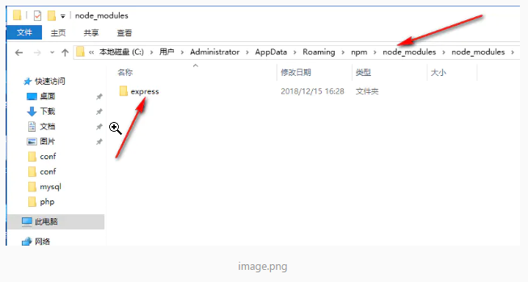
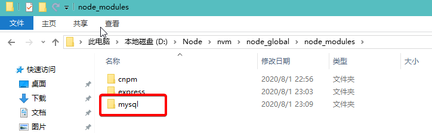
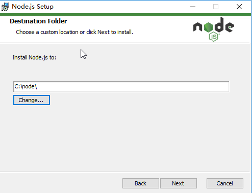
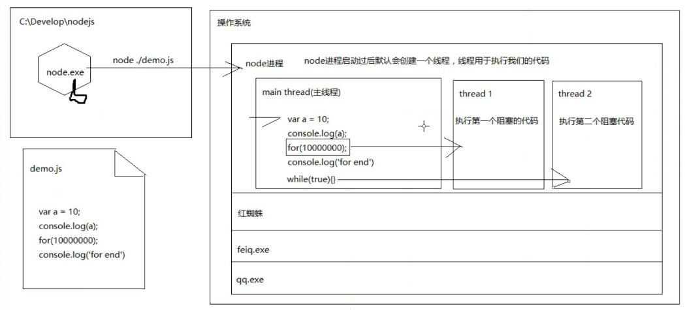

NodeJS

Node 就是 JavaScript 语言在**服务器端**的运行环境，即不是一门语言，也不是JavaScript的框架；

所谓“运行环境（平台）”有两层意思：

+ 首先，JavaScript 语言通过 Node 在服务器运行，在这个意义上，Node 有点像 JavaScript 虚拟机；
+ 其次，Node 提供大量工具库，使得 JavaScript 语言能与操作系统互动（比如读写文件、新建子进程），在这个意义上， Node 又是 JavaScript 的工具库。

Node.js 是一个基于Chrome JavaScript 运行时建立的一个平台。

Node.js是一个事件驱动I/O服务端JavaScript环境，基于Google的V8引擎，V8引擎执行Javascript的速度非常快，性能非常好。


## 1. NodeJS简介

### 客户端的JavaScript是怎样的

- 什么是JavaScript

  > 运行在浏览器内核的JS引擎中的脚本语言，一般用来做客户端页面的交互（Interactive）

- JavaScript的运行环境

  > 运行在浏览器内核的JS引擎中。

- 浏览器中的JavaScript可以做什么？

  - 操作DOM（对DOM的增删改、注册事件）
  - AJAX/跨域
  - BOM（页面跳转、历史记录、console.log()、alert()）
  - ECMAScript

- 浏览器中的JavaScript不能做什么？

  - 文件操作（文件和文件夹的CRUD）
  - 没有办法操作系统信息
  - 由于运行环境特殊（我们写的代码是在不认识人的浏览器中运行，如果插入了恶意代码来获取服务器的信息，会导致信息被泄露）

- 在开发人员能力相同的情况下编程语言的能力取决于什么？

  - -语言本身？-

  - 语言本身只是提供定义变量，定义函数，定义类型，流程控制，循环结构之类的操作
  - 取决于运行该语言的平台（环境） 
  - 对于JS来说，我们常说的JS实际是ES，大部分能力都是由浏览器的执行引擎决定
  - BOM和DOM可以说是浏览器开放出来的接口
  - 比如：Cordova中提供JS调用摄像头，操作本地文件的API
  -  Java既是语言也是平台
  - Java运行在Java虚拟机（跨操作系统）
  - PHP既是语言也是平台（跨操作系统）
  - C#语言平台：.NET Framework（Windows）
  - C#可以运行在MONO这样的平台
  - 因为有人需要将C#运行在Linux平台，所有出现了MONO

- JavaScript 只可以运行在浏览器中吗？
  - 不是
  - 语言能运行在哪取决于，有没有为你搭建该语言的特定平台
  - 浏览器为JS提供了JS引擎平台，DOM和BOM本身是浏览器赋予JS的功能，并不是JS自己的，因此也可以理解为浏览器是ES语言的运行环境（平台）


### 浏览器的执行机制

1. 请求一个HTTP地址（封装一个请求报文）

   ​		浏览器的最大作用就是将一个URL地址封装成一个请求报文

2. 解析服务器返回来的响应报文（内容有可能不一样）

   ​		html =>渲染HTML（渲染引擎）

   ​		CSS =>渲染CSS（渲染引擎）

   ​		image =>渲染图片（渲染引擎）

   ​		JS =>解释(执行)JS（JS引擎）

   这里有个问题就是渲染引擎与JS引擎是互斥的，只能同时执行其中的一个，因为js能改变HTML结构或样式，不互斥的话如果在JS中执行删除节点操作，渲染引擎都不知道是否要渲染


### 什么是Node

- Node就是JavaScript语言能够运行在**服务器端**的运行环境

- 所谓“运行环境（平台）”有两层意思：

  + 首先，JavaScript 语言通过 Node 在服务器运行，在这个意义上，Node 有点像 JavaScript 虚拟机；

    

    
  
  + 其次，Node 提供大量工具库，使得 JavaScript 语言与操作系统互动（比如读写文件、新建子进程），在这个意义上， Node 又是 JavaScript 的工具库。
  
    

### 为什么是JavaScript?

> 据NodeJS创始人Ryan DaHI回忆，他最初希望采用ruby，但是Ruby的虚拟机效率不行，而JavaScript是目前开发行业最火热的一门语言，会的人很多很多


### Node的实现

- Node内部采用Google Chrome的V8引擎，作为JavaScript的语言解释器 

- 通过自行开发的libuv库，调用操作系统资源


### Node在web中的用途

- 做网站（处理用户所有的请求，然后给用户响应 ）【全包】

  

- 做分发（分发数据请求，渲染HTML页面）【只做一部分】

  

用户请求时先返回node，经过node处理后去调用传统的服务器接口，数据拿回后，进行html的拼接，拼装完后再返回给用户。


**这种结构的目的是Node的并发数和抗压性比传统的的平台要好很多，通过node包装后会对整个系统的稳定性会有很大的提升。**目前天猫就是这样做的


### 总结

- Node是一个JavaScript的运行环境（平台），不是一名语言，也不是JavaScript的框架

- Node的实现结构
- Node可以用来开发服务端应用程序，Web系统；
- 基于Node的前端工具集


##  2. 安装和配置

### window

#### NVM工具的使用

> Node Version Manager（Node版本管理工具）

由于以后的开发工作可能会在多个Node版本中测试，而且Node的版本也比较多，所以需要这么款工具来管理

**安装操作步骤**

1. 下载：[nvm-windows](https://github.com/coreybutler/nvm-windows/releases/download/1.1.0/nvm-noinstall.zip)
2. 解压到一个全英文路径
3. 编辑解压目录下的`settings.txt`文件（不存在则新建）

  + `root 配置为当前 nvm.exe 所在目录`
  + `path 配置为 node 快捷方式所在的目录`
  + `arch 配置为当前操作系统的位数（32/64）`
  + `proxy 不用配置`


4. 配置环境变量 可以通过 window+r  : sysdm.cpl（都配置到用户变量中）

  + `NVM_HOME = 当前 nvm.exe 所在目录`

    

  + `NVM_SYMLINK = node 快捷方式所在的目录`

    

  + `PATH += %NVM_HOME%;%NVM_SYMLINK%;`

    如果添到用户变量nvm命令无法使用的话，再把%NVM_HOME%;%NVM_SYMLINK%添加到系统变量path中即可

    

  + 打开CMD通过`set [name]`命令查看环境变量是否配置成功，如下图

  + PowerShell中是通过`dir env:[name]`命令

5. NVM使用说明：

  + https://github.com/coreybutler/nvm-windows/

6. NPM的目录之后使用再配置

cmd中查看配置的命令

 

cmd命令

```text
nvm ls	//查看所有的版本
nvm use 版本号	//使用某个版本的nodejs
```


#### 环境变量的概念

- 环境变量就是操作系统提供的系统级别用于存储变量的地方

- 系统变量和用户变量

- 环境变量的变量名是不区分大小写的

- 特殊值：

  ​		—PATH变量

  ​		—只要添加到PATH变量中的路径，都可以再任何目录下搜索


#### window常用的命令行操作

- 切换当前目录（change directory）：cd
- 查看当前所在路径：pwd         (powerShell可以使用)

- 创建目录（make directory）：mkdir

- 查看当前目录列表（directory）：dir
  - 别名：ls(list)
- 清空当前控制台：cls
  - 别名:clear
- 删除文件：del
  - 别名：rm
- 查看文件的内容：cat 文件名

注意：所有别名必须在新版本的PowerShell中使用。  


#### NodeJs+nvm安装及环境配置

参考资料： https://www.jianshu.com/p/0d591ad6d60d

##### 1. NVM的安装与配置

> node的版本管理控制器
>
> 由于以后的开发工作可能会在多个Node版本中测试，而且Node的版本也比较多，所以需要这么款工具来管理

**安装操作步骤**

1. 下载：[nvm-windows](https://github.com/coreybutler/nvm-windows/releases/download/1.1.0/nvm-noinstall.zip),我们选择latest中的第一个：nvm-noinstall.zip，点击下载。

   

2. 下载完成后解压到一个地方，我的是在`D:\Node` 里面的文件列表是这样的：elevate.cmd、elevate.vbs、install.cmd、LICENSE、nvm.exe，

   

3. 双击 install.cmd 然后会让你输入”压缩文件解压或拷贝到的一个绝对路径” 先不用管它，直接回车，成功后，会在C盘的根目录生成一个settings.txt的文本文件，把这个文件剪切到`D:\Node\nvm`目录中，然后我们把它的内容修改成这样：

   > root: D:\Node\nvm 
   > path: D:\Node\nodejs 
   > arch: 64 
   > proxy: none
   >
   > node_mirror: http://npm.taobao.org/mirrors/node/
   >
   > npm_mirror: https://npm.taobao.org/mirrors/npm/

  + `root 配置为当前 nvm.exe 所在目录`
  + `path 配置为 node 快捷方式所在的目录`(后面用nvm use 版本号才生成node快捷方式，先填着)
  + `arch 配置为当前操作系统的位数（32/64）`
  + `proxy 不用配置`


4. 配置环境变量 可以通过 window+r  : **sysdm.cpl**（都配置到用户变量中）

  + `NVM_HOME = 当前 nvm.exe 所在目录`

    

  + `NVM_SYMLINK = node 快捷方式所在的目录`

    

  + `PATH += %NVM_HOME%;%NVM_SYMLINK%;`

    如果添到用户变量nvm命令无法使用的话，再把%NVM_HOME%;%NVM_SYMLINK%添加到系统变量path中即可

    

  + 打开CMD通过`set [name]`命令查看环境变量是否配置成功，如下图

    

  + PowerShell中是通过`dir env:[name]`命令

    

5. NVM使用说明：https://github.com/coreybutler/nvm-windows/

6. cmd命令

   > nvm ls	//查看当前安装所有的版本
   > nvm install latest	//安装最新版本
   > nvm use 版本号	//使用某个版本的nodejs

`nvm install`


使用nvm下载后，下载的node版本就会保存在`D:\Node\nvm`目录下

`nvm use`

下载该版本后，还有用`nvm use 版本号`去使用它，这里就是 `nvm use 14.7.0`，使用之后该版本的快捷方式就会出现在上面`path: D:\Node\nodejs `指定的目录


`nvm ls`

查看当前已安装所有的版本


##### 2. NPM的全局配置

> 默认情况下，我们在执行`npm install -g XXXX`时，下载了一个全局包，这个包的默认存放路径位`C:\Users\Administrator\AppData\Roaming\npm\node_modules下`，可以通过CMD指令`npm root -g`查看
>
> 
>
> 
>
> 我们可以下载一个全局包试试看，执行命令`npm install -g express`，可以看到，确实是下载到了c盘下面
>
> 
>
> 首先进入命令模式，输入 `npm config set prefix "D:\Node\nvm\node_global"` 回车，这是在配置npm的全局安装路径，然后在用户文件夹`C:\Users\Administrator`下会生成一个.npmrc的文件，用记事本打开后可以看到如下内容：
>
> > prefix=D:\Node\nvm\node_global
>
> 然后继续在命令中输入： `npm install express-g` 回车后会发现正在下载npm包，在`D:\Node\nvm\node_global`目录中可以看到下载中的文件，以后我们只要用npm安装包的时候加上 `-g` 就可以把包安装在我们刚刚配置的全局路径下了。
>
> 
>
> 将NPM目录配置到其他目录时，必须将该目录放到环境变量中，否则无法使用
>
> 
>
> 默认的全局安装路径是：**当前nodejs版本的node_modules中**。如果安装了NVM，在版本切换的时候会连带node_modules也切换过去，因此我们需要修改npm的全局安装路径。我们可以在当前与所有nodejs所有版本的同级下新建一个名node_global的文件夹，把NPM的全局安装路径配置到这个文件夹中，这样即使切换不同版本node也不影响node_modules的使用，因为已经放到了一个公用的目录里边。这样操作就更为方便
>
>  
>
> 
>
> 我们为这个npm配置环境变量： 变量名为：NPM_HOME，变量值为 ：`%NVM_HOME%\node_global`
>
> 
>
> 
>
> 在Path的最前面添加`;%NPM_HOME%`，注意了，这个一定要添加在 `%NVM_SYMLINK%`之前，所以我们直接把它放到Path的最前面
>
> 
>
> 至此，所有配置已完成，我们可以测试以下，全局安装一个mysql包，看看会不会安装在我们配置的路径中
>
> 
>
> 安装完后，mysql确实安装在了我们定义的路径中，至此，所有安装就已经完成了
>
> 
>
> 扩展：
>
> **淘宝cnpm安装：**
>
> `npm install -g cnpm --registry=https://registry.npm.taobao.org`
>
> ## nrm 的安装
>
> nrm就是npm registry manager 也就是npm的镜像源管理工具，有时候国外资源太慢，那么我们可以用这个来切换镜像源。
>  我们只要通过这个命令: `npm install -g nrm` 就可以实现安装。
>
> - 命令：`nrm ls` 用于展示所有可切换的镜像地址
> - 命令：`nrm use cnpm` 我们这样就可以直接切换到cnpm上了。当然也可以按照上面罗列的其他内容进行切换
>
> 

至此，整个安装已结束。下面额外补充一下用安装包方式安装nodejs


##### 3. nodejs安装包方式下载

下载地址：[https://nodejs.org/zh-cn/download/](https://links.jianshu.com/go?to=https%3A%2F%2Fnodejs.org%2Fzh-cn%2Fdownload%2F)
根据自己电脑系统及位数选择，我这里选择`windows64位.msi`格式安装包

> .msi和.zip格式区别：
> 1、.msi是Windows installer开发出来的程序安装文件，它可以让你安装，修改，卸载你所安装的程序。说白了.msi就是Windows installer的数据包，把所有和安装文件相关的内容封装在一个包里。
> 2、.zip是一个压缩包，解压之后即可，不需要安装

>  
>
>  下载完成后，双击安装包，开始安装，一直点`next`即可，安装路径默认在`C:\Program Files`下，也可以自定义修改
>
>  
>
>  
>
>  我是放在`D:\Node\nvm\`下
>
>  
>
>  ` Node.js runtime` 表示运行环境
>  `npm package manager`表示npm包管理器
>  `online documentation shortcuts` 在线文档快捷方式
>  `Add to PATH`添加到环境变量
>
>  安装完成如图所示
>
>  
>
>  安装完成后，.msi格式的安装包已经将`node启动程序`添加到系统环境变量`path`中,查看系统变量验证
>
>  
>
>  既然已经将node程序添加到全局系统变量，我们可以直接在CMD窗口中任意位置执行`node`，打开CMD窗口，执行命令`node -v`查看node版本
>
>  
>
>  最新版的node在安装时同时也安装了npm,执行`npm -v`查看npm版本
>
>  
>
>  
>
>  以上步骤就是安装node跟npm并自动加入全局可用

## 3. 快速入门

### 控制台程序

#### REPL环境操作

> 在REPL环境中可以执行类似console.log的操作，用于测试JS代码
>
> 在REPL环境中，只能书写ES代码，BOM和DOM不再可用，不过console是node为我们提供的

**进入REPL:**

-node

-node --use_strict

**REPL环境中：**

-类似chrome Developer Tools ->  consoles

-特殊变量下划线（_）表示上一个命令的返回结果

-通过.exit或执行process.exit()退出REPL交互 


#### 全局对象（不需要用模块化方式引入，启动node的时候就已存在）

- **global：**

  > 类似客户端JavaScript运行环境中的window

- **process（全局变量）：**

  > 用于获取当前的Node进程信息，一般用于获取环境变量之类的信息

- **console（全局变量）：**

  > Node中内置的console模块，提供操作控制台的输入输出功能，常见使用方式与客户端类似。
  
  ```javascript
  console.log = (msg)=>{
      process.stdout.write(`${msg}\n`)
  }
  ```
  
  

**process常用方法和属性**

**process.argv**

> `process.argv` 属性返回一个数组，其中包含当启动 Node.js 进程时传入的命令行参数。 
>
> 第一个参数是node.exe所在的绝对路径。
>
> 第二个参数是当前脚本文件的绝对路径。
>
> 其他参数是启动时传入的参数，如果有传入的话。


例子：实现一个类似npm命令的功能：npm init  / npm install xxx  / npm uninstall

```javascript
var argvs = process.argv.slice(2);//把两个系统自带的参数干掉,返回的时一个数组
//对传入的第一个参数进行判断
switch(argvs[0]){
    case 'init':
        console.log('你需要init');
        break;
    case 'install':
        var installPackgeName = argvs[1];
        console.log(`正在安装${installPackgeName}...`);
        break;
    case 'uninstall':
        var installPackgeName = argvs[1];
        console.log(`正在卸载${installPackgeName}...`);
        break;
}
```


**process.env**

> 返回操作系统包含用户环境的对象


**process.stdout**

> 标准输出流（二进制数组）

console.log也是调用stdout的。

```javascript
console.log = (msg)=>{
    process.stdout.write(`${msg}\n`)
}
```

**process.stdout.getWindowSize()**

> 获得window窗口的尺寸，可以利用这里填充换行，达到清空控制台的目的，本质上还是用换行把内容顶上去而已

下面的也能够达到清空控制台的目的

```javascript
process.stdout.write('\\033[2J');

process.sstdout.write('\\033[0f')
```


stdout实现字符画小例子

```javascript
var fs = require('fs');
//存放动画的每一帧
var frames = []
for (let i = 1; i < 7; i++) {
    frames[frames.length] = fs.readFileSync(`./frames/${i}.txt`,'utf-8')
}
var fps = 10;
var index = 0
var render =()=>{
    //首先清空控制台
    //方法一
    // var height = process.stdout.getWindowSize()[1];
    // for(var i = 0; i <　height; i++){
    //     process.stdout.write('\r\n');
    // }
    //方法二
    process.stdout.write('\033[2J');

    process.stdout.write('\033[0f')
    index++
    var current = index % frames.length;
    process.stdout.write(frames[current])
}

setInterval(() => {
    render()
}, 1000/fps);
```


process.exit()

> 终止Node进程

例子：快速双击^c两次终止node进程

```javascript

setInterval(function(){
    console.log('1');
},1000)

//表示当前是否已经按下^c
var exiting = false

//点击^c时触发该回调
process.on('SIGINT',()=>{
    if(exiting){
        //终止当前node进程
        process.exit()
    }else{
        console.log('一秒内双击^c即可退出');
        exiting = true;
        setTimeout(function(){
            exiting = false;
        },1000)
    }
})
```


**process.stdin**

> 标准输入流（二进制数组）


例子：用户登录判断

```javascript
var account = {
    'admin': '123',
    'user1': '321',
    'user2': '213'
}
process.stdout.write(`请输入用户名\n`);

var username = ""//存放成功后的用户名

//on类似与jquery绑定事件的方法，on（data）这段话的意思是，接受用户输入，并在点击触发车时执行回调
//stdin输入的结果是一个流，不是字符串，因此要先转换成字符串，并且点击回车时，回车也是个输入，也必须去掉
process.stdin.on('data', (input) => {
    input = input.toString().trim();
    if (!username) {
        //Object.keys返回一个数组，存放对象中所有的的键
        if (Object.keys(account).indexOf(input) === -1) {
            //如果用户名与accout中的不匹配
            process.stdout.write(`用户名不存在\n`);
            process.stdout.write(`请输入用户名\n`);
        }else{
            //如果用户名匹配，将用户名存入username中
            username = input;
            process.stdout.write(`请输入密码\n`);
        }
    }else{
        //用户名存在，判断密码
        if(input === account[username]){
            process.stdout.write('登陆成功');
        }else{
            process.stdout.write(`请输入密码\n`);
        }
    }
})
```


  


### Node调试 

**1. 命令行调试**

1. node debug 文件名
2. n表示下一步，如果需要对变量添加监视 watch(‘变量名’)

**2. vsCode调试**


**3. 第三方模块提供的调试**

- npm install node-inspector -g 
  - 启动：node-debug 文件名
- npm install devtoll -g
  - 启动： debug 文件名


## 4、事件驱动和非阻塞

### 异步操作

- Node采用chrome V8引擎处理JavaScript脚本，V8最大特点就是单线程操作，一次只能运行一个任务
- Node大量采用异步操作，即任务不是马上执行，而是插在任务队列的尾部，等到前面的任务运行完后再执行
- 提高代码的响应能力


**回调函数的设计**

- 对于一个函数，如果需要定义回调函数，那么回调函数一定作为参数的最后一个参数出现

  ```javascript
  function foo (name,age,callback){
      ...
      callback(null,data)
  }
  ```

- 错误优先的回调函数：回调函数的第一个参数默认接受错误信息，第二个参数才是真正的回调数据（便于外界获取调用的错误情况）。try-catch只能捕获同步执行时的错误。

  ```javascript
  foo('huang',18,function(err,data){
      if(err) throw error
      console.log(data);
  })
  ```

  

### 进程和线程

> 进程包含线程

#### 什么是进程？(进行中的程序)

- 每一个**正在运行**的应用程序都称之为进程
- 每一个应用程序运行都至少有一个进程
- 进程是用来给应用程序提供一个运行的环境
- 进程是操作系统为应用程序分配资源的一个单位


#### 线程

- 用来执行应用程序中的代码
- 在一个进程内部，可以有很多的线程
- 在一个线程内部，同时只可以干一件事
- 而且传统的开发方式大部分都是I/O阻塞的
- 所以需要多线程来更好的利用硬件资源，但同时进程开的越多，越消耗硬件资源，因此线程也不是越多越好

node默认的形式是一个进程一个线程 

 


#### 多线程的问题

- 多线程都是假的，因为只有一个CPU(单核)，当然多核就是真的多线程，效率也确实比单线程高

- 线程之间共享某些数据，同步某个状态都很麻烦，因为每个线程都是一个独立的作用域
- 更致命的是:
  - 创建线程耗费（相当于招聘到一个合适的人很耗费）
  - 线程数量有限
  - CPU在不同线程之间转换，要切换到不同线程的上下文，这个转换非常耗时  


### 非阻塞I/O

> Node的核心特性

#### 什么是I/O

- I/O：【input/output】
- 可以理解为从输入到输出之间的转换过程
- 例如：
  - 敲击键盘（输入）看到编辑器中出现字符（输出）
  - 移动鼠标（输入）看到光标移动（输出）


### Node的执行机制

> Node的内部是多线程的，因为在内部维护了一个线程池。
>
> Node的执行机制是：
>
> 主线程执行同步任务，在执行过程中，如果遇到阻塞任务，把该阻塞任务放入到事件队列中，然后继续往下执行，直到主线程同步任务全部执行完毕后，按顺序从事件队列中取出阻塞任务，一个个的交给线程池中的多个线程分别去执行，在线程执行完后，把回调函数返回给主线程，然后主线程继续执行内部的同步任务，如果遇到阻塞任务再次放到事件队列中，如果不是阻塞任务，主线程就直接把回调取出来自己干完。如此的循环反复，就构成了node的执行机制。就像剥洋葱一样，一层一层的剥。
>
> 需要注意的一点是：因为阻塞任务是按主线程由上往下的执行顺序放入到事件队列中的，然后主线程再按顺序一个个拿出来交给其他线程去执行，因此，返回给主线程的回调如果里面存在阻塞任务，会再次放入到事件队列的最后，换句话说，返回的回调里边的阻塞任务永远不可能快于第一次的阻塞任务。

> JavaScript的执行机制：主线程（执行栈）执行同步任务，遇到异步任务，交给其他对应引擎去监听，监听到反馈后，把回调函数放入到事件队列中，等待主线程（执行栈）同步任务执行完空闲的时候，再按顺序把回调函数从任务队列中拿出来一个个执行。整体上是比node的执行机制简单些。


```javascript
const fs = require('fs');

console.time('timer');
//1、首先查看文件状态，查看该文件是否存在
fs.stat('./test.txt', function statCallbcak1(err, data) {
    if (err) {
        //文件不存在,创建一个文件并写入内容
        console.log('文件不存在');
        fs.writeFile('./test.txt',new Date,function(err){
            if (err) throw Error('文件创建写入失败');
            console.log('文件创建并写入成功');
        });
    } else {
        //文件存在，先删除该文件，并重新创建一个新文件
        fs.unlink('./test.txt',function(err){
            if(err) throw Error('文件存在,但删除失败');
            //文件删除成功后，重新创建一个文件并写入内容
            console.log('文件已成功删除');
            fs.writeFile('./test.txt', new Date(), function (err) {
                if (err) throw Error('文件写入失败');
                console.log('再次创建文件并写入成功');
            })
        })
    }

});


console.timeEnd('timer');
```

 执行顺序： 

主线程处理同步任务，遇到阻塞任务（fs.stat），先把把该阻塞任务放入事件队列中，进行继续往下执行同步任务，等同步任务执行完毕后，从事件队列中取出第一个阻塞任务（fs.stat）交给另一个线程执行，由该线程执行完该任务后，把回调函数放入到主线程中，然后主线程执行该回调里的JS代码，假设我们文件存在，会执行else内部的代码，fs.unlink是一个阻塞任务（表示删除该文件），把他放入到事件队列中，然后继续往下执行，下面已经没有可执行的代码，主线程再次空闲下来，等待其他线程执行完删除文件操作后返回的回调，主线程继续执行删除文件后的回调，然后继续往下执行，下面已经没有可执行的代码，主线程再次空闲下来，等待其他线程执行完写入文件操作后返回给主线程的回调，继续执行该回调...


整个过程中，主线程进程执行的是同步任务，剩下的基本都是**往返调度**工作，调度其他线程去执行阻塞操作

如果分配给其他线程的任务没有完成，该任务注册的回调也就不会进入到主线程中，是阻塞不了主线程的执行的，阻塞的知识执行该任务的线程。这就是**NodeJs非阻塞的机制。**


#### 总结

- Node 中将所有的阻塞操作交给了内部实现的线程池

- Node本身主线程主要就是不断的**往返调度**

#### 平台实现差异

由于window和linux平台的差异，Node提供了libuv作为抽象封装层，保证上层的Node与下层的自定义线程池及IOCP之间各自独立


### Node开发服务器的阻塞情况

```javascript
'use strict'
const http = require('http');

let count = 0;
const server = http.createServer((request,response)=>{
    //此回调会在有任何用户请求的时候触发
    response.write(`你是第${count++}个访问的用户`);
    if(count === 10){
        while(true){}
    }
    response.end();
})

server.listen(12306,(err)=>{
    if(err) throw Error;
    console.log('web服务已启动，端口：12306');
})
```

当请求到10 的时候，由于只有一个进程，会发生阻塞，同步代码执行是在主线程中，被同步代码阻塞，肯定无法再进行


## 5、模块化结构

> Node采用的模块化结构是按照CommonJs规范
>
> 模块与文件是一一对应关系，即加载一个模块，实际上就是加载对应的模块文件

例子：实现一个命令行计算器

```javascript
//calc.js
function convert(input){
    return parseFloat(input);
}

function add(a,b){
    return convert(a) + convert(b);
}

function substract(a,b){
    return convert(a) - convert(b);
}

function mutiply(a,b){
    return convert(a) * convert(b);
}

function divide(a,b){
    return convert(a) / convert(b);
}

module.exports ={add,substract,mutiply,divide}

//03.js
'use strict'
var args = process.argv.slice(2);
if(args.length !== 3){
    throw NewError('传递参数个数不合法');
}
let params1 = args[0];
let operator = args[1];
let params2 =args[2]
const calc = require('./calc.js');

let result
switch(operator){
    case '+':
        result = calc.add(params1,params2);
        break;
    case '-':
        result = calc.substract(params1,params2);
        break;
    case '*':
    case 'x':
        result = calc.mutiply(params1,params2);
        break;
    case '/':
        result = calc.divide(params1,params2);
        break;
    default:
        throw new Error('不被支持的操作符' + operator);
    
}
console.log(result);
```


#### 模块的分类

- 文件模块

  > 就是我们自己写的功能模块文件

- 核心模块

  > Node平台自带的一套基本的功能模块，也有人称之为Node平台的API

- 第三方模块

  > 社区或第三个人开发好的功能模块，可以直接拿来用，比如mysql模块


#### 模块内全局环境（伪）

- **我们在之后的文件操作中必须使用绝对路径**

  

  因为当我们进行读取文件操作时，如果读取的路径是**相对路径**时，系统会以当前执行文件（04.js）为入口文件去读取。

  例如：我们在04.js文件中引入了module文件夹中的module1文件

  ```javascript
  //module1
  //当前脚本文件所在目录
  console.log(__dirname);
  //文件路径
  console.log(__filename); 
  
  const fs = require('fs');
  fs.readFile('../readme.md',(err,data)=>{
      if(err) throw new Error(err)
      console.log(data);
  })
      
  //04.js
  const module1 = require('./module/module1.js');   
  ```

  

  用node 04去执行。

  

可以发现，如果按照我们预想的module1模块所在的路径进行读取文件，上一级路径就是module,在该路径中可以找到readme.md。而现实是上一级路径是'nodeJS重温'，该路径正好是04.js的上级路径，而readme.md并不存在与该路径中，所以会报错。因此，要想准确的查找到文件，以后的路径都要用绝对路径。

将module1文件中的读取文件路径改成绝对路径后就准确了。

```javascript
fs.readFile(__dirname+ '/../readme.md/',(err,data)=>{
    if(err) throw new Error(err)
    console.log(data.toString());
})
```


- __dirname

  > 用于获取当前文件所在目录的完整路径
  >
  > 可以不通过导入就直接使用，但之所以不是全局，是因为在REPL环境无效

- __filename

  > 用来获取当前文件的完整路径
  >
  > 可以不通过导入就直接使用，但之所以不是全局，是因为在REPL环境无效

- module（模块对象）

  > Node内部提供一个Module构建函数，所有模块都是Module的实例，属性如下

  - module.id：模块的标识符，通常是带有绝对路径的模块文件名
  - module.filename:模块定义的文件的绝对路径
  - module.loaded：返回一个布尔值，表示调用该模块的模块
  - module.parent：返回一个对象，表示调用该模块的模块
  -  module.children：返回一个数组，表示该模块要用到的其他模块
  -  module.exports：表示模块对外输出的值

  **载入一个模块就是构建一个Module实例**

  例子：在06.js中导入module3模块

  ```javascript
  console.log(module);
  const module3 = require('./module/module3');
  console.log(module3)
  ```

  

  可以发现，module3的父模块就是06.js。

  如果module3里引入了别的模块，那么该模块就是module3的children

  因此，可以得出一个结论

  如果该模块存在parent，说明该模块被引用，如果不存在，说明该文件是入口文件

- exports

  

- require()

  - require.cache
  - require.extensions
  - require.main
  - require.resolve()


#### 模块的定义

- 一个新的JS文件就是一个模块
- 一个合格的模块应该是有导出成员的，否则模块就失去了定义的价值
-  模块内部是一个独立（封闭）的作用域（模块与模块之间不会冲突）
- 模块之间必须通过导出或导入的方式协同
- 导出方式
  - exports.name = value
  - module.exports = {name:value}


#### 自己实现一个require函数

> require的基本功能是，读入并执行一个JavaScript文件，然后返回该模块的exports对象

```javascript
//自己写一个require函数
'use strict'

function $require(filePath){
    //1. 先根据传入的路径查找文件，如果文件不存在就返回错误结果，如果存在就读取文件内容，内容是JS代码
    const fs = require('fs');
    const path = require('path');
    //要加载的js文件路径（完整路径）
    const filename = path.join(__dirname,filePath)//拼合路径
    const dirname = path.dirname(filename)//取到路径所在的目录
    //必须用同步方法才能接受到返回的结果
    let code = fs.readFileSync(__dirname+filePath,'utf-8') // 同步任务不会进入事件队列

    //2. 执行代码，所要执行的代码 ，代码的执行需要放入一个函数中才能执行，就是要营造一个私有空间module4
    //定义一个数据容器，用容器去装导出的成员 
    let module = {id:filename,exports:{} };
    let exports = module.exports;
    //下面这段代码是在私有空间执行的代码，因此要用立即执行函数创造一个私有空间
    code = `
(function($require,module,exports,__dirname,__filename){
${code}
})($require,module,exports,dirname,filename);
`
    // eval() 函数会将传入的字符串当做 JavaScript 代码进行执行。
    eval(code);
    //返回暴露的对象    
    return module.exports;  
}
// code相当于
// (function($require,module,exports,__dirname,__filename){
//     function say(msg){
//         console.log(msg);
//     }
    
//     module.exports = {day}
// })($require,module,exports,dirname,filename)

//测试
//module4.js
function say(msg){
    console.log(msg);
}
module.exports = {say}
//
var m4 = $require('./module/module4.js');
m4.say('hello')


```


总结:

code是引入某个模块中读取到的全部js代码，然后把该代码放入到一个封闭空间中去执行，形成一个私有空间，模块的私有空间就是这样定义的，给这个封闭空间添加一些参数，比如$require，这样在该代码执行的封闭空间中也可以调用\$require,形成一种链式，再比如把dirname和filename传进去，这样是为了在该封闭空间中使用上他们，module也是同理，也是作为参数传入进入的。综上，才使得该js文件不再是个普通的文件，一旦该文件被\$require引入后，就会形成一个封闭的空间，并且自带那些参数。

require把我们读取出文件内容，然后把该文件放入到一个封闭空间去执行，最后将该代码执行完的导出来的exprot对象返回给我们


测试：

```javascript
//module1
//在里面引用module2,并导出
var module2 = $require('./module2.js')

module.exports = {
    a: {say:()=>{
        console.log('module1 say');
        }
    },
    b:module2
} 
//module2
//只导出
module.exports = {
    say:()=>{
    console.log('module2 say');
    }
}
//$require文件中
var module1 = $require('./module1.js');
module1.a.say();
module1.b.say();
```


#### require加载文件规则


> require也可以用于读取json文件
>
> .js > .json > .node > 同名目录

例如：我们分别定义三个类型的文件module.js，module.json, module.node

然后用require引入该文件，不写任何后缀名

```javascript
//module.js
module.exports = {
    'name':'这是一个JS文件'
}

//module.json
{"name":"这是一个JSON文件"}

//07.js
var md  = require('./file-loadRules/module');
console.log(md)
```

首先会先加载.js文件


如果删除.js文件后，就会查找.json文件


删除.json文件后，最后就会加载.node文件


如果是同名目录，会优先找里面的package.json文件中main指向的文件，然后再找index.js文件


删除package.json后


**重点：**

**通过'./'或'../'开头：则按照相对路径从当前文件所在文件夹开始寻找模块**

- require('../file.js'); =>上级目录下找file.js文件

**通过/开头，则以系统根目录开始寻找模块**

- require('/user/icsStone/documents/file.js')=以绝对路径的方式找

**不通过'./' 或'/'开头，则表示加载的是一个默认提供的核心模块（位于node系统安装目录中，系统模块 优先级 最高）或npm下载的放在node_modules中的模块**


#### 模块的缓存

- 第一次加载某个模块时，Node会缓存该模块，以后再加载该模块，就直接读取第一次从缓存取出该模块的module.exports属性，而不会再执行该JS文件
- 如果需要多次执行模块中的代码，一般可以让模块暴露行为（函数）
- 模块的缓存可以通过require.cache拿到，同样也可以删除 

例子：多次取同一个module的成员，会从缓存中拿

```javascript
//data.js
module.exports = new Date();
//08.js
setInterval(()=>{
    var date = require('./module/date.js');
    console.log(date.getTime());
},1000)
```


可以发现，尽管多次取出，但时间戳都是一样的，说明拿的是缓存。

如果我们拿我们之前定义的$require来试试，这里没有定义缓存

```javascript

//自己写一个require函数
'use strict'

function $require(id){
    //1. 先根据传入的路径查找文件，如果文件不存在就返回错误结果，如果存在就读取文件内容，内容是JS代码
    const fs = require('fs');
    const path = require('path');
    //要加载的js文件路径（完整路径）
    const filename = path.join(__dirname,id)//拼合路径
    const dirname = path.dirname(filename)//取到路径所在的目录
    //必须用同步方法才能接受到返回的结果
    let code = fs.readFileSync(filename,'utf-8') // 同步任务不会进入阻塞队列

    //2. 执行代码，所要执行的代码 ，代码的执行需要放入一个函数中才能执行，就是要营造一个私有空间module4
    //定义一个数据容器，用容器去装导出的成员 
    let module = {id:filename,exports:{} };
    let exports = module.exports;
    //下面这段代码是在私有空间执行的代码，因此要用立即执行函数创造一个私有空间
    code = `
        (function($require,module,exports,__dirname,__filename){
            ${code}
        })($require,module,exports,dirname,filename);
    `
    // eval() 函数会将传入的字符串当做 JavaScript 代码进行执行。
    eval(code);
    //返回暴露的对象    
    return module.exports;  
}
//模块的缓存


setInterval(()=>{
    var date = $require('./module/date.js');
    console.log(date.getTime());
},1000)
```


可以发现，每次取到的时间戳都是不一样的。


**require.cache**

> 只要文件被require，就一定存在缓存
>
> 缓存存在于**require.cache**对象中，存放格式是{‘缓存的文件路径’ ： ‘该文件的module对象’}


**清空缓存**

```javascript
Object.keys(require.cache).forEach((key)=>{
    delete require.cache[key]
})
```

 如果想不清空缓存，但同时每次又能拿到新的数据，可以暴露为一个方法，这样每次就会执行该方法

```javascript
//date.js
module.exports = ()=>{
    console.log(date module exec);
    return new Date()
}

//08.js
setInterval(()=>{
    var date = require('./module/date.js');
    console.log(date().getTime());
},1000)
```


**如何实现一个缓存（给$require加上）**

```javascript
//自己写一个require函数
'use strict'

function $require(id){
    //1. 先根据传入的路径查找文件，如果文件不存在就返回错误结果，如果存在就读取文件内容，内容是JS代码
    const fs = require('fs');
    const path = require('path');
    //要加载的js文件路径（完整路径）
    const filename = path.join(__dirname,id)//拼合路径
    //缓存											【新增缓存部分】
    $require.cache = $require.cache || {};
    //如果存在缓存，把该缓存返回出去
    if($require.cache[filename]){ 
        return $require.cache[filename].exports//再次调用$require的话，会直接从这里拿
    }

    const dirname = path.dirname(filename)//取到路径所在的目录
    //必须用同步方法才能接受到返回的结果
    let code = fs.readFileSync(filename,'utf-8') // 同步任务不会进入阻塞队列

    //2. 执行代码，所要执行的代码 ，代码的执行需要放入一个函数中才能执行，就是要营造一个私有空间module4
    //定义一个数据容器，用容器去装导出的成员 
    let module = {id:filename,exports:{} };
    let exports = module.exports;
    //下面这段代码是在私有空间执行的代码，因此要用立即执行函数创造一个私有空间
    code = `
        (function($require,module,exports,__dirname,__filename){
            ${code}
        })($require,module,exports,dirname,filename);
    `
    // eval() 函数会将传入的字符串当做 JavaScript 代码进行执行。
    eval(code);
    //返回暴露的对象 
    //没有就缓存下来									【新增缓存部分】
    $require.cache[filename] = module
    return module.exports;  
}

setInterval(()=>{
    var date = $require('./module/date.js');
    console.log(date().getTime());
},1000)
```

第一次调用$require取同一个路径的时候，会执行该文件路径的JS代码，然后把该文件路径与对应的module保存起来，存入到 \$require.cache对象中


```javascript
$require.cache[filename] = module  						//【新增缓存部分】
```

如果再次调用$require,就直接返回第一次从缓存取出该模块的module.exports属性(export执行的也是同一个地址)

```javascript
//缓存													【新增缓存部分】
$require.cache = $require.cache || {};
//如果存在缓存，把该缓存返回出去
if($require.cache[filename]){ 
    return $require.cache[filename].exports//再次调用$require的话，会直接从这里拿
}
```


## 6、核心模块

### 核心模块的意义

- 如果只是在服务器运行javaScript代码，意义并不大，因为无法实现任何功能（读写文件，访问网络）
- Node的用处在于它本身还提供的一系列功能模块，用于与操作系统互动
- 这些核心的功能模块在Node中内置。
- 常见内置模块如下
  - path：处理文件路径
  - fs：操作文件系统（CRUD）
  - child_process：新建子进程
  - util：提供一系列实用小工具
  - http：提供http服务器功能
  - url：用于解析url
  - querystring：解析url中的查询字符串
  - crypto：提供加密和加密功能


## 7、node package manage (npm)包

### 什么是包？

- 由于Node是一套轻内核 的平台，虽然提供了一系列的内置模块，但是不足以满足开发者的需求，于是乎出现了包（package）的概念：
- 与核心模块类似，就是将一些预先设计好的功能或者说API封装到一个文件夹，提供给开发者使用


### 包的加载机制

> 首先在系统核心（优先级最高）的模块中找，如果找不到再到当前项目中node_modules目录中找


";%NVM_HOME%;%NVM_SYMLINK%;";d:\2345下载\bin;C:\Program Files (x86)\Microsoft Visual Studio\Common\Tools\WinNT;C:\Program Files (x86)\Microsoft Visual Studio\Common\MSDev98\Bin;C:\Program Files (x86)\Microsoft Visual Studio\Common\Tools;C:\Program Files (x86)\Microsoft Visual Studio\VC98\bin;C:\Users\Administrator\AppData\Local\Microsoft\WindowsApps;C:\Program Files\Intel\WiFi\bin\;C:\Program Files\Common Files\Intel\WirelessCommon\;E:\software\apps data\VS code\Microsoft VS Code\bin;C:\Users\Administrator\AppData\Local\BypassRuntm;C:\Users\Administrator\AppData\Local\GitHubDesktop\bin;

### 安装NPM

- NPM不需要单独安装，默认在安装Node的时候会连带一起安装
- 但是，Node附带的NPM可能不是最新版，最好使用下面的命令，更新到最新版本
  - npm install -npm -g
- 默认安装到当前系统Node所在目录下
- 由于之前使用NWM的方式安装的Node，所以需要重新配置NPM的全局目录


### 常见NPM命令

- npm config ：配置npm
- npm init：初始化一个package.json的文件
- npm search  包名：搜索包
- npm info  包的ID：提供包的描述信息
- npm install 包名：安装包
- npm uninstall包名：卸载包
- npm list： 打印当前项目里所有的依赖项目
  - npm list -depth 0 ：查看第一层的包
- npm outdated 包名：查看包有没有更新
- npm update 包名：更新包
- npm run ：运行在package.json中定义的一些脚本
- npm cache 包名：查看包的缓存
  - npm cache list 查看包的缓存清单
  - npm cache clear：情况所有包的缓存


## 8、文件系统操作

> 在文件操作的过程中，都必须使用物理路径（绝对路径）


### 路径操作模块API（path）

> 有两套差不多的方法，path会根据当前操作系统去决定使用window的方法还是linux的方法。
>
> 两套方法的差别只在路径定界符（path.delimiter）和路径片段分隔符（path.sep）返回的结果不一样

- **path.basename(path,[,ext]);**

  > 返回path路径的最后一部分（文件），尾部的'/'目录分隔符将被忽略。
  >
  > 第二个参数选填，表示从尾部开始需要删除的文字，一般用于删除文件的后缀。

  ````javascript
  path.basename('/foo/bar/baz/asdf/quux.html');
  // 返回: 'quux.html'
  
  path.basename('/foo/bar/baz/asdf/quux.html', '.html');
  // 返回: 'quux'
  ````

- **path.delimiter**

  > 提供平台特定的路径定界符，
  >
  > window上是`;`
  >
  > linux上是`：`

  ```javascript
  console.log(process.env.PATH);
  // 打印: 'C:\Windows\system32; C:\Windows;C:\Program Files\node\'
  
  process.env.PATH.split(path.delimiter);
  // 返回: ['C:\\Windows\\system32', 'C:\\Windows', 'C:\\Program Files\\node\\']
  ```

- **path.dirname(path)**

  > 返回当前文件路径所在的目录名， 尾部的目录分隔符（/）开始将被忽略

  ```javascript
  console.log( path.dirname('/foo/bar/baz/asdf/quux.html') );
  //返回：/foo/bar/baz/asdf
  ```

- **path.extname(path)**（后缀）

  > 返回path中的扩展名（包含.），从最后一次出现`.`(句点)字符到path最后一部分的字符串结束。 如果在 `path` 的最后一部分中没有 `.` ，或者如果 `path` 的基本名称（参阅 `path.basename()`）除了第一个字符以外没有 `.`，则返回空字符串。

  ```javascript
  console.log( path.extname('./foo/bar/baz/asdf/quux'));
  //返回 ''
  console.log( path.extname('/foo/bar/baz/asdf/quux'));
  //返回 ''
  console.log( path.extname('/foo/bar/baz/asdf/quux.'));
  //返回 '.'
  console.log( path.extname('/foo/bar/baz/asdf/quux.html'));
  //返回 '.html'
  ```

- **path.parse(path)**

  > 将一个路径字符串转换为一个对象（包含文件目录，文件名，扩展名）
  >
  > dir：路径的目录部分
  >
  > root：路径的根部分
  >
  > base：路径的文件名部分（包括.扩展名）
  >
  > ext：路径的扩展名(包括（.）)
  >
  > name：路径的文件名

  ```javascript
  path.parse('C:\\path\\dir\\file.txt');
  // 返回:
  // { 
  //   root: 'C:\\',
  //   dir: 'C:\\path\\dir',
  //   base: 'file.txt',
  //   ext: '.txt',
  //   name: 'file' 
  // }
  ```

  ```javascript
  ┌─────────────────────┬────────────┐
  │          dir        │    base    │
  ├──────┬              ├──────┬─────┤
  │ root │              │ name │ ext │
  " C:\      path\dir   \ file  .txt "
  └──────┴──────────────┴──────┴─────┘
  （"" 行中的所有空格都应该被忽略。它们纯粹是为了格式化）
  ```

  

- **path.format(pathObject)**

  > 将路径对象转换成一个字符串，与parse正好相反。
  >
  > dir：路径的目录部分
  >
  > root：路径的根部分
  >
  > base：路径的文件名部分（包括.扩展名）
  >
  > ext：路径的扩展名(包括（.）)
  >
  > name：路径的文件名

  - 如果提供了 `pathObject.dir`，则忽略 `pathObject.root`。
  - 如果 `pathObject.base` 存在，则忽略 `pathObject.ext` 和 `pathObject.name`。

  ```javascript
  path.format({
    dir: 'C:\\path\\dir',
    base: 'file.txt'
  });
  // 返回: 'C:\\path\\dir\\file.txt'
  ```


- **path.isAbsolute(path)**

  > 检测路径是否为绝对路径（物理路径）

   ```javascript
  console.log(path.isAbsolute('/foo/../temp/1.txt'))
  //true
  console.log(path.isAbsolute('C:/foo/../temp/1.txt')) 
  //true
  console.log(path.isAbsolute('./temp/1.txt')) 
  //false
   ```

  

- **path.join('path1'，'path2'....)**

  > 拼合路径组成，一般用于将相对路径转换为绝对路径
  >
  > 该方法用的是arguments接受参数，所以不限参数个数
  >
  > 如果连接的路径字符串是零长度的字符串，则返回 `'.'`，表示当前工作目录。

  ```javascript
  //01.js
  console.log(path.join(__dirname,'..','./day03','/readme.md'));
  //E:\software\VsCode-Code\NodeJS重温\day03\readme.md
  
  console.log(path.join());
  //返回 ‘.’
  
  console.log(path.resolve(__dirname,'..','./day02','./','c:/dev'));
  //c:\dev
  ```

  

  __dirname:  `E:\software\VsCode-Code\NodeJS重温\day03`

  '..'：基于上面的路径，退回一格到``E:\software\VsCode-Code\NodeJS重温`

  './day03' ：基于上面的路径，向下一格到  `E:\software\VsCode-Code\NodeJS重温\day03`

  ’/readme.md‘基于上面的路径，向下一格到  `E:\software\VsCode-Code\NodeJS重温\day03\readme.md`

  

- **path.normalize(path)**

  > 常规化一个路径，

  ```javascript
  var a = path.normalize('c:/dev\\abc//cbd/////1.txt');
  console.log(a);
  //返回  c:\dev\abc\cbd\1xt
  ```

- **path.relative(from,to)**

  > 获取to 相对于from 的相对路径

  ```javascript
  path.relative('C:\\orandea\\test\\aaa', 'C:\\orandea\\impl\\bbb');
  // 返回: '..\..\impl\bbb'
  ```


- **path.resolve([...paths])**

  > 将路径或路径片段的序列解析为绝对路径。
  >
  > 如果没有传入任何路径，则path.resolve()将返回当前工作文件所在目录的绝对路径，类似于dirname
  >
  > 与path.join类似，不同的地方在于join对于绝对路径不做解析，直接当成字符串加入，而resolve会解析加入的绝对路径

  ```javascript
  console.log(path.resolve());
  //E:\software\VsCode-Code\NodeJS重温\day03
  
  console.log(path.resolve(__dirname,'..','./day02','./','c:/dev'));
  //c:\dev
  ```

  resolve的操作就像是下面的操作


​	path.join的操作

```javascript
console.log(path.resolve(__dirname,'..','./day02','./','c:/dev'));
//E:\software\VsCode-Code\NodeJS重温\day02\c:\dev
```


- **path.sep**

  > 提供平台特定的路径片段分隔符；
  >
  > window上是 `\`
  >
  > linux上是 `/`

  ```javascript
  'foo\\bar\\baz'.split(path.sep);
  // 返回: ['foo', 'bar', 'baz']
  ```

  

- **path.win32**

  > 允许在任意操作系统上使用window的方式操作路径

  

- **path.posix**

  > 允许在任意操作系统上使用linux的方式操作路径


### 同步或异步调用

> fs模块对文件的几乎所有操作都有同步和异步的两种形式。
>
> 例如：readFile()和readFileSynce()

**区别：**

- 同步调用会阻塞代码的执行，异步则不会
- 异步调用会将读取任务下达任务队列，直到任务执行完成才会回调
- 异常处理方面，同步必须使用try catch方式，异步可以通过回调函数的第一个参数

```javascript
const fs = require('fs');
const path = require('path');

console.time('同步(sync)')
try {
    var data = fs.readFileSync(path.join(__dirname,'./readme.md'))
    } catch (err) {
        throw new Error(err)
    }
console.timeEnd('同步(sync)');


console.time('异步(async)')
fs.readFile(path.join(__dirname,'./readme.md'),function(err,data){
    if(err) throw Error(err)
})
console.timeEnd('异步(async)')
```


读取的文件越大，差异越明显，当然异步主要是交给了其他线程去做，其他线程读取的时间不算在异步里，异步里算的只是同步代码的执行时间而已，把console.timeEnd('异步(async)')放到异步回调里，得到的时间就差不多了


## 9 、Buffer（缓冲区）【全局】

> 如果读取文件的时候没有指定编码，默认读取的是**buffer**
>
> 文件流（stream）就像是车站等车的人群
>
> 缓冲区（Buffer）就像是公交车，用来装人的，大小不同公交车能装的人数量不一样。
>
> 而内存就相当于到站的过检：公交车一下子下来的人太多，内存一下子处理不了那么多人，就会造成阻塞，造成内存一下占用过大，而如果换成每趟公交车下来的人少，公交次数多的话，内存就会很容易的处理了。


### 什么是缓冲区？ 

- 缓冲区就是内存中**操作数据的容器**（就相当于公交车 ），只是数据容器而已
- 通过缓冲区可以很方便的操作二进制数据
- 而且在大文件操作时必须有缓冲区，大文件默认就会被读进缓冲区当中
- 缓冲区存放的就是真实的数据，只不过经过一些处理

 

### 为什么要有缓冲区

- JS是比较擅长处理字符串，但是早期的应用场景主要是用于处理HTML文档，不会有太大篇幅的数据处理，也不会接触到二进制的数据
- 而在Node中操作数据，网络通信(比如从网上引入一张base64图片)是没办法完全以字符串的方式操作的，所以在Node中引入了一个二进制的缓冲区的实现：Buffer
- 比如拷贝一个大文件


### 创建缓冲区

- 创建长度为4个字节的缓冲区

  > var buffer = new Buffer(4)

- 通过指定数组内容的方式创建

  > var buffer = new Buffer([00,01])

- 通过指定编码的方式创建

  > var buffer = new Buffer('hello','uft8');
  
  

**整型范围（表示在不同int中数的取值范围）**
Int8 - [-128 : 127]
Int16 - [-32768 : 32767]
Int32 - [-2147483648 : 2147483647]
Int64 - [-9223372036854775808 : 9223372036854775807]


**无符号整型范围**
UInt8 - [0 : 255]
UInt16 - [0 : 65535]
UInt32 - [0 : 4294967295]
UInt64 - [0 : 18446744073709551615] 


**例子：**

```javascript
var buf = new Buffer(4)//创建长度为4个字节的Buffer
buf.writeInt32LE('10') //表示创建一个4个字节长度，里边可填整数范围为
						[-2147483648 : 2147483647]
buf						//<Buffer 0a 00 00 00>

buf.writeInt32BE('10') //表示创建一个4个字节长度，里边可填整数范围为
						[-2147483648 : 2147483647]
buf						//<Buffer 00 00 00 0a>
```

一般开发用LE，网络传输时用BE


### 目前可能遇到的应 用场景

- 将图片转成BASE64编码
- 对文字进行BASE64编码 


### Node目前默认支持的编码

> Buffer和JavaScript字符串对象之间转换时需要一个明确的编码方法，下面是字符串的不同编码

- ASCII：7位的ASCII数据，这种编码方式非常快，它会移除最高位内容
- UTF8：多字节编码Unicode字符，大部分网页和文档使用这类编码方式
- UTF16LE：2个或4个字节，Little Endian(LE) 编码Unicode字符，编码范围（u+10000 到 U+10FFFF）
- UCS2：UTF16LE的子集
- base64：Base64字符编码
- binary：仅使用每个字符的头8位将原始的二进制信息进行编码，在需使用Buffer的情况下，应该尽量避免使用这个已经过时的编码方式，这个编码方式将会在未来某个版本中废弃
- ‘hex'：每个字节都采用2进制编码

提供编码转换的包：iconv-lite

```javascript
iconv.decode(buffer，'编码类型')		//将buffer变为xxx编码
```


案例：歌词滚动显示

```javascript
const path = require('path');
const fs = require('fs');
const iconv = require('iconv-lite');


var begin = new Date().getTime()
//readFile有个特点，会把内容一次性读入buffer中，如果文件过大，可能会造成内存占用过大
fs.readFile(path.join(__dirname,'./致青春.lrc'),function(err,data){
    var lines = iconv.decode(data,'gbk').split('\n');//将文件编码为gbk文件
    var regExp = /\[(\d{2})\:(\d{2})\.(\d{2})\](.*)/;//正则规则
    lines.forEach((line)=>{
        var match = regExp.exec(line);//那到存放当前行歌曲的伪数组
        if(match){
            var minute = parseFloat(match[1]);
            var second = parseFloat(match[2]);
            var minSecond = parseFloat(match[3]);
            var text = match[4];
            var offset = new Date()-getTime()-begin;
            setTimeout(function(){
                console.log(text);
            },minute*60*1000+second*1000+minSecond - offset)
            //代码在声明的时候和真正执行的执行在时间上有些耗损，需要减去这份耗损，否则会出现歌和曲越来越不同步的情况
        }
    })
})
```

readFile有个特点，会把内容一次性读入buffer中，如果文件过大，可能会造成内存占用过大。


### readline

> 流分为文件流和网络流  
>
> 一行一行（chunk）的把流中的内容放入到buffer中，这样就不会造成内存占用过大了，readline能一行一行读取，主要是依靠\n和\r符进行判断的


```javascript
const fs = require('fs');
const readline = require('readline');
//创建一个可读流实例，去读取filename文件,返回一个流，同时也会在内存当中创建一个buffer,buffer的大小根据当系统的资源分配情况来决定尺寸
var streamReader = fs.createReadStream('文件名路径');

//创建了一个interface的实例。传入了stdin(标准输入流)和stdout（标准输出流）
const rl = readline.createInterface({input:streamReader});

//每当 输入流 接收到行尾输入（\n、 \r 或 \r\n）时就会触发 'line' 事件
//。 这种情况通常发生在当用户按下 <Enter> 键或 <Return> 键。
rl.on('line', (input) => {
    console.log(input);
})

-------------------以上就可以实现一段一段流的读取----------------------------

----------------------------补充---------------------------------------

let data = '';
//取出数据的大小就依据buffer的大小，一旦buffer把数据装满并送来的时候，data事件就会被触发
streamReader.on('data',(chunk)=>{
    //chunk只是一个文档的片段 ，不是完整的文件
    data +=chunk.toString()
});

//等流传送完成后 触发，此时data就是一个完整的文档了
streamReader.on('end',()=>{
    console.log(data);
})

```


这样做的好处是，在内存当中始终只占用一定的字节空间，占据的空间取决于系统为buffer分配的内存空间大小。


**用readLine优化歌词滚动显示**

```javascript
const path = require('path');
const fs = require('fs');
const readline = require('readline');
const iconv = require('iconv-lite');

//创建了一个interface的实例。传入了stdin(标准输入流)和stdout（标准输出流）
let regExp = /\[(\d{2})\:(\d{2})\.(\d{2})\](.*)/;//正则规则
let begin = new Date().getTime();
let filename  = path.join(__dirname,'./致青春.lrc');

//在内存当中创建一个buffer,buffer的大小根据当系统的资源分配情况来决定尺寸
//创建一个可读流实例，去读取filename文件,返回一个流，然后再对该流进行转码，得到转码后的流
let streamReader = fs.createReadStream(filename).pipe(iconv.decodeStream('gbk'));
 
//利用readline读取buffer传递过来的流
let rl = readline.createInterface({input:streamReader});

//每当 输入流(input) 接收到行尾输入（\n、 \r 或 \r\n）时就会触发 'line' 事件
//。 这种情况通常发生在当用户按下 <Enter> 键或 <Return> 键。
rl.on('line',(input)=>{   
    PrintSong(input,begin);
})
  
 

//接收一行文字(包含时间和歌词)，在给定的时间后输出歌词
function PrintSong(line,begin){
    var match = regExp.exec(line);//那到存放当前行歌曲的伪数组
    if(match){
        var minute = parseFloat(match[1]);
        var second = parseFloat(match[2]);
        var minSecond = parseFloat(match[3]);
        var text = match[4];
        var offset = new Date().getTime()-begin;
        setTimeout(function(){
            console.log(text);
        },minute*60*1000+second*1000+minSecond - offset)
        //代码在声明的时候和真正执行的执行在时间上有些耗损，需要减去这份耗损，否则会出现歌和曲越来越不同步的情况
    }
}
```

过程解析：首先用fs.createReadStream(filename)方法把文件变成一个流，然后把这个流进行转码，得到转码后的流返回给streamReader，然后用readline.createInterface()生成的实例都关联一个 input 可读流和一个 output 可写流。把流绑定到input(stdin)中，然后给rl绑定line事件，每当输入流（input）接收到行尾输入（\n、 \r 或 \r\n）时就会触发该 'line' 事件去执行pringSong函数，按照条件把歌词打印出来

## 10、文件内容的增删改查

> 只要是涉及到文件操作的，无论是读取还是写入，删除，修改，一定要使用绝对路径的方式

**写入方式**

- **异步文件写入**(文件存在，覆盖文件)

  > fs.writeFile(file,data[,option],callback(err))

  ```javascript
  //JSON.stringify序列化 ，JSON.parse反序列化
  const fs = require('fs');
  const path = require('path');
  fs.writeFile(path.join(__dirname,'./autoCreate.txt'),JSON.stringify({id:10}),(err)=>{
      if(err){
          //读文件时不存在报错
          //意外错误
          //权限不够
          //文件夹找不到
          console.log(err);
      }else{
          console.log('success');
      }
  })
  ```

- **同步文件写入**(文件存在，覆盖文件)

  > fs.writeFileSync(file,datap[,option],callback(err))

  ```javascript
  //JSON.stringify序列化 ，JSON.parse反序列化
  const fs = require('fs');
  const path = require('path');
  fs.writeFileSync(path.join(__dirname,'./autoCreate.txt'),JSON.stringify({id:10}),(err)=>{
      if(err){
          //读文件时不存在报错
          //意外错误
          //权限不够
          //文件夹找不到
          console.log(err);
      }else{
          console.log('success' );
      }
  })
  ```

- **流式文件写入**(文件存在，覆盖文件)

  > fs.createWriteStream(path[,option])

  ```javascript
  const fs = require('fs');
  const path = require('path');
  
  //创建一个装文件流的文件
  var streamWriter = fs.createWriteStream(path.join(__dirname,'./streamFile.txt'));
   setInterval(function(){
      streamWriter.write('hello',()=>{
          console.log('ok');
      })
   },1000)
  ```

-   **异步文件追加内容**（文件存在，往文件中追加）

  > appendFile(filename,[,data],callback)

  ```javascript
  //JSON.stringify序列化 ，JSON.parse反序列化
  const fs = require('fs');
  const path = require('path');
  fs.appendFile(path.join(__dirname,'./autoCreate.txt'),JSON.stringify({id:10}),(err)=>{
      if(err){
          //读文件时不存在报错
          //意外错误
          //权限不够
          //文件夹找不到
          console.log(err);
      }else{
          console.log('success');
      }
  })
  ```

- **同步文件追加内容（**文件存在，往文件中追加）

  > appendFileSync(filename,[,data],callback)

  ```javascript
  //JSON.stringify序列化 ，JSON.parse反序列化
  const fs = require('fs');
  const path = require('path');
  fs.appendFileSync(path.join(__dirname,'./autoCreate.txt'),JSON.stringify({id:10}),(err)=>{
      if(err){
          //读文件时不存在报错
          //意外错误
          //权限不够
          //文件夹找不到
          console.log(err);
      }else{
          console.log('success');
      }
  }) 
  ```


**其他文件操作**

- **重命名文件或目录，也可作文件移动**

  > fs.rename(oldpath,newpath,callback)
  >
  > fs.renameSync(oldpath,newpath,callback);

  ```javascript
  const fs = require('fs');
  const path = require('path')
  
  //文件重命名
  var oldPath = path.join(__dirname,'./test.txt')
  var newPath = path.join(__dirname,'./mytest.txt')
  fs.rename(oldPath,newPath,(err)=>{
      if(err) throw Error(err)
  })
  
  //文件移动
  var oldPath = path.join(__dirname,'./test.txt')
  var newPath = path.join(__dirname,'./testFile/test.txt')
  fs.rename(oldPath,newPath,(err)=>{
      if(err) throw Error(err)
  })
  ```

  

- **删除文件**

  > fs.unlink(path,callback(err))
  >
  > fs.unlinkSync(path)

  ```javascript
  const fs = require('fs');
  const path = require('path')
  
  var newPath = path.join(__dirname,'./mytest.txt')
  fs.unlink(newPath,(err)=>{
      if(err) throw Error(err)
  })
  ```

- **打印当前文件信息**

  > fs.stat(path,callback)

  ```javascript
  const fs = require('fs');
  const path = require('path')
  
  var newPath = path.join(__dirname,'./mytest.txt')
  fs.stat(newPath,(err,data)=>{
      if(err) throw Error(err)
      console.log(data);
  })
  ```


- **获取当前目录下的所有文件**

  > fs.readdir(path,callback)
  >
  > 返回的结果是一个数组

   ```javascript
   const fs = require('fs');
  const path = require('path');
  
  var target = path.join(__dirname,process.argv[2] || './');
  fs.readdir(target,(err,files)=>{
      console.log(files)
  })
   ```

  


**练习：**获取一个根目录中的所有文件，打印文件列表

```javascript
const fs = require('fs');
const path = require('path');

//获取当前有没有传入目标路径
const target = path.join(__dirname, process.argv[2] || './');

function loadTree(target,depth) {
    if(target == null) return;
    var prefix = new Array(depth +1).join('|  ');//
    var dirInfors = fs.readdirSync(target);//读取当前目录下的所有文件
    var dirs = [];
    var files = [];
    //将不同类型的文件进行分拣
    dirInfors.forEach((info) => {  
        var stats = fs.statSync(path.join(target, info));
        if (stats.isFile()) {
            files.push(info);
        } else {
            dirs.push(info);
        }
    })

    //└─
    //把数据拿出来展示
    var count = 0
    dirs.forEach((dir) => {
        if (files.length == 0) {
            ++count == files.length ? console.log(`${prefix}└─${dir}`) : console.log(`${prefix}├─${dir}`);
        }else{
            console.log(`${prefix}├─${dir}`);
        }
        loadTree(path.join(target,dir),depth+1);
    })
    files.forEach((file) => {
        ++count == files.length ? console.log(`${prefix}└─${file}`) : console.log(`${prefix}├─${file}`);
    })
}
loadTree(target,0);
```


 

## 11、目录操作

### 创建目录

- fs.mkdir( path，callbacks )

  > 该API有个特点，创建的文件夹的上级必须存在，否则会创建失败

  ```javascript
  fs.mkdir(path.join(__dirname,'demo1'),(err)=>{
      if(err) throw Error('创建文件失败');
      console.log('文件夹已创建');
  })
  ```

  

  ```javascript
  fs.mkdir(path.join(__dirname,'demo2/demo3'),(err)=>{
      if(err) throw Error(err);
      console.log('文件夹已创建');
  })
  ```

  

  创建失败的原因是demo2文件夹不存在，导致的失败，而不是会创建demo2，再创建demo3


​		**循环创建文件夹**

```javascript
const fs = require('fs');
const path = require('path');
//1. 创建文件要用绝对路径，因此首先要判断传入的路径是相对路径或绝对路径，如果是相对路径，转化为绝对路径
//2. 获取要创建的文件夹部分,然后根据分割符用split分割到数组中
//3. 遍历循环该数组，调用fs模块创建文件夹，如果该文件夹未创建(fs.stat报错)，进入catch创建文件夹
//   注意点，下级的文件夹需要上级文件夹的路径
//           哪个文件调用，__dirname就是文件调用的上级文件夹路径（可以module.parent.path获取到（root））


function createfolder(folderPath, callback) {
    var root = module.parent.path; 
    //1.
    var folderPath = path.isAbsolute(folderPath) ? folderPath : path.join(root, folderPath);
    var relativepath = path.relative(root, folderPath);
    var folders = relativepath.split(path.sep);
    try {
        var pre = '';
        folders.forEach(folder => {
            try {
                //文件不存在，则报错，进入catch创建文件
                fs.statSync(path.join(root, pre, folder));
            } catch (error) {
                fs.mkdirSync(path.join(root, pre, folder));
            }
            pre = path.join(pre,folder);

        })
        callback && callback(null);
    } catch (err) {
        callback && callback(err);
    }
    console.log(folders)
}

module.exports = createfolder
```

测试

```java
const createfolder = require('./createfolder.js');
createfolder('demo2/demo3/demo4/demo5',function(err){
    if(err) console.log(err);
        console.log('创建成功');
});
```


### 案例：文件监视

- `fs.watchFile(path,{interval:时间},listenr)`

  - path表示监听的文件路径
  - 监听到改变后多久告诉订阅者
  - listener表示监听者（类似发布-订阅者模式），有curr和prev两个参数，分别表示当前修改后的，和修改前的信息

  ```javascript
  const fs = require('fs');
  const path = require('path');
  
  fs.watchFile(path.join(__dirname,'readme.md'),(curr,prev)=>{
      console.log(`current:${curr.size}, prev:${prev.size}`);
  })
  ```

  

- 实现思路：
  1. 利用’fs‘模块的文件监视功能监视指定md文件

  2. 当文件发生变化后，借助`marked`包提供的`markdown` to `html`功能将改变后的md文件转化为HTML

  3. 再将得到的HTML替换到模板中

  4. 最后利用BrowersSynce模块实现浏览器自动刷新

     (browsersynce需要用到python2.7)

- 实现

  ```javascript
  const fs = require('fs');
  const path = require('path');
  const marked = require('marked');
  //接收需要转换的文件路径
  const target = path.join(__dirname, process.argv[2] || './readme.md');
  
  //监视文件变化
  fs.watchFile(target, { interval: 200 }, (curr, prev) => {
      //首先判断是否有没有发生了改变,如果修改的时间不变，说明内容没修改
      if (curr.mtime === prev.mtime) {
          return false
      }
      //读取md文件，将.md文件内容转化为html标签，最后再将标签拼接到html标签中
      fs.readFile(target, 'utf8', (err, content) => {
          if(err) throw err;
          var html = marked(content);
          //顺便读取github.css样式文件，再一起集中替换{{{}}}插值
          fs.readFile(path.join(__dirname,'github.css'),'utf8',(err,css)=>{
              if(err) throw err;
              html= template.replace('{{{content}}}',html).replace('{{{styles}}}',css);
              // console.log(html);
              //最后将完整的html写入文件
              fs.writeFile(target.replace(path.extname(target),'.html'),html,'utf8',(err)=>{
                  if(err) console.log(err)
              })
          })
      })
  })
  var template = `
  <!DOCTYPE html>
  <html lang="en">
  <head>
      <meta charset="UTF-8">
      <style>
          {{{styles}}}
      </style>
  </head>
  <body>
      <div class='vs'>
          {{{content}}}
      </div>
  </body>
  </html>`
  ```

  


## 12、文件流

>  流就相当于水桶里的水
>
> buffer就相当于瓢或者管子（数据容器），什么时候用到buffer，取决于水多不多，水不多的话，直接倒入另一个桶了就行了（内存）。只有水桶里的谁多的时候，才需要用瓢把水一部分一部分的舀到另一个桶里

### 什么是流？

> 任何数据的最根本，表现 形式都是二进制

- 现实过程的流
  - 水流、人流
- 在程序开发的概念中
  - 流是程序输入或输出的一个连续的字节序列
  - 文件流、网络流（比如从网上下载电影）
  - 设备（例如鼠标，键盘，磁盘，屏幕，调制解调器和打印机）的输入和输出都是用流来处理的


### Node中文件流的操作

- `fs.createReadStream()` =>得到一个 `readableStream`
- `fs.createWriteStream()` =>得到一个 `writableStream`

#### 案例：大文件拷贝

普通方法：**用readFile + writeFile**

```javascript
const fs = require('fs');
const path = require('path');

console.time('read')
fs.readFile('E:\\software\\test.avi', (err, data) => {
    if (err) throw err;
    console.timeEnd('read')
    console.time('write')

    fs.writeFile('E:\\software\\test2.avi',data,(err) => {
        if (err) throw err;
        console.log('写入完成')
        console.timeEnd('write')  
    })
})
```


这个方法的问题是：

	1. 将文件一次性读入内容，如果文件过大，会导致内存一下占用过大，导致电脑卡死。
 	2. 没有进度的概念


**文件流的方式**

1. `fs.createReadStream`:通知操作系统在内存中创建一个缓冲区(buffer)，并建立磁盘中的文件与内存缓冲区之间的联系（缓冲区（buffer ）的大小由操作系统决定，一般是35536个字节）

   

   此时只是创建文件的读取流，还没有正式的开始读取数据,如何证明？

```javascript
const fs = require('fs');
const path = require('path');

console.time('start')
//创建文件的读取流，还没有正式的开始读取数据，但已经把读取任务交给线程池中的线程去开始执行
var reader = fs.createReadStream('E:\\software\\test.avi');
console.timeEnd('start')
```


读取同样一个文件，上面用了1313ms，而这个只用了2ms，说明只是创建了一个文件的读取流，并没有开始正式的读取数据。**但是已经把读取任务交给线程池中的线程去开始执行了**

on('data',(chunk)=>{})

> 一旦读好一部分(复制的方式)到缓冲区（buffer）中之后，就通知我们代码的data事件执行拿到该buffer片段（chunk），然后再清空缓冲区（buffer）中的数据，继续从 磁盘文件中读取数据


```javascript
fs.stat('E:\\software\\test.avi',(err,stats)=>{
    if(stats){
        var readTotal = 0
        reader.on('data',(chunk)=>{
            // console.log(chunk.length);
            console.log(`文件读取中，进度${(readTotal += chunk.length) / stats.size*100}%`)
        })
    }
});
```


2. `fs.createWriteStream`：一样的，通知操作系统在内存中创建一个缓冲区(buffer)，并建立内存缓冲区与磁盘中的文件之间的联系（缓冲区（buffer ）的大小由操作系统决定，一般是35536个字节）

   

   此时只是创建了文件的写入流，还没有正式的开始读取数据，如何证明？

```javascript
const fs = require('fs');
const path = require('path');
//创建文件的写入流，还没有正式的开始写入数据，但已经把写入任务交给线程池中的线程去开始执行
console.time('start');
var writerStream = fs.createWriteStream('E:\\software\\test2.avi');
console.timeEnd('start');
```


写入同样一个文件，上面用了1495ms，而这个只用了0.544ms，说明只是创建了一个文件的写入流，并没有开始正式的写入数据。**但是已经把写入任务交给线程池中的线程去开始执行了**

**写入流.write(chunk，callback)**

> 把读取流拿到的buffer片段（chunk）写入写入流通知操作系统在内存中创建的缓冲区（buffer）中，再将缓冲区（buffer）中的数据写入到写入流创建的test2.avi中


```javascript
writerStream.write(chunk,(err)=>{
    console.log(`文件写入中，进度${(readTotal += chunk.length) / stats.size*100}%`)
})
```


总代码：

```javascript
const fs = require('fs');
const path = require('path');

//创建文件的读取流，还没有正式的开始读取数据，但已经把读取任务交给线程池中的线程去开始执行
var readerStream = fs.createReadStream('E:\\software\\test.avi');
//创建文件的写入流，还没有正式的开始写入数据，但已经把写入任务交给线程池中的线程去开始执行
console.time('start');
var writerStream = fs.createWriteStream('E:\\software\\test2.avi');
console.timeEnd('start');


fs.stat('E:\\software\\test.avi',(err,stats)=>{
    if(stats){
        var readTotal = 0
        readerStream.on('data',(chunk)=>{
            writerStream.write(chunk,err=>{
            console.log(`文件写入中，进度${(readTotal += chunk.length) / stats.size*100}%`)
            })
        })
    }
});

```


写入方式除了用舀（write）的方式，还有用管道（pipe）的方式

**pipe方法（）**

>  读取流 pipe(写入流)

```javascript
const fs = require('fs');
const path = require('path');

//创建文件的读取流，还没有正式的开始读取数据，但已经把读取任务交给线程池中的线程去开始执行
var readerStream = fs.createReadStream('E:\\software\\test.avi');

console.time('start');
//创建文件的写入流，还没有正式的开始写入数据，但已经把写入任务交给线程池中的线程去开始执行
var writerStream = fs.createWriteStream('E:\\software\\test2.avi');
console.timeEnd('start');

readerStream.pipe(writerStream);
```


#### 总结

- `fs.createReadStream`就相当于创建一个装满水的水桶，
  - 可读流.on('data'callback(chunk))方法：就相当于拿到瓢里边的水
  - 可取流..on('end',callback)方法：可读流的数据读取完的时候触发
  - 可取流.pipe(可写流)方法：结合data方法和write方法，可以理解为两桶之间的管道。数据由可读流一点一点的流入可写流，流入的大小也是内部的操作系统在内存上创建的buffer大小。pipe还有一个特点，支持链式调用
- `fs.createWriteStream`就相当创建了一个空的水桶
  - 可写流.write(chunk，callback)方法就相当于把瓢的里水倒入空桶中
  - 可写流.on('finish',callback)方法：可写流的数据读写入完的时候触发
  - 可写流.on('pipe'，callback(src))事件：当调用可读流.pipe() 方法时会发出 'pipe' 事件，src参数就是可读流（src === readerStream ）


## 13、Socket

> 建立客户端与服务端的双向通信。是两端之间的桥梁，因此socket能拿到两端的数据

### 建立一个Socket服务器

```javascript
//建立一个Socket服务器

const net = require('net');

//创建一个Socket服务器
const server = net.createServer(socketConnect);

//当有客户端与该服务器连接时触发,在服务端，socket存放客户端信息，在客户端，socket存放服务端信息
function socketConnect(socket){
    const client = socket.address();
    console.log(client.address);

    //监听socket,有数据过来时触发,chunk是传过来的buffer数据片段
    socket.on('data',(chunk)=>{
        console.log(chunk.toString())
    })
}

server.listen('2080',(err)=>{
    if(err) console.log('端口已被占用');
    console.log('socket服务已启动，端口:2080')
})
```

上面表示创建一个socket全双工通信服务器，创建方法根http类型，http在node中是高度封装的，net才是比较基础的。

当我们用telnet访问服务器时，会调用sockerConnect函数，在里面打印出访问的ip地址，socket.on('data',callback(chunk))事件会在客户端有数据发送过来时触发，如果我们在客户端输入hello world。


### 建立一个Socket客户端

> socket客户端也会有端口，不过端口是随机的 ，且客户端不监听任何端口，只有服务器才监听端口。
>
> net.connect或net.createconnect

```javascript
const net = require('net');
//与端口2080的127.0.0.1建立通信，
const client = net.connect({port:2080},()=>{
    console.log('服务器已连接，可进行通信');
    process.stdout.write('\nclient > ');
    //控制台输入回车后触发
    process.stdin.on('data',(chunk)=>{
        //向服务端发送输入的数据
        client.write(`${chunk.toString().trim()}`);
    })
    //接收到服务器数据时触发
    client.on('data',(data)=>{
        //输出服务端返回的数据
        console.log('\n' + data.toString().trim())
    })
});
```

更改一下服务端，与服务器进行配合

```javascript
//建立一个Socket服务器

const net = require('net');

//创建一个Socket服务器
const server = net.createServer(socketConnect);

//当有客户端与该服务器连接时触发,在服务端，socket存放客户端信息，在客户端，socket存放服务端信息
function socketConnect(socket) {
    // console.dir(socket)
    console.log(`${socket.remoteAddress}:${socket.remotePort}进来了`);

    //监听socket,有数据过来时触发,chunk是传过来的buffer数据片段
    socket.on('data', (chunk) => {
        console.log(`${socket.remoteAddress}:${socket.remotePort}发来信息：${chunk.toString()}`);
        //向客户端发送数据
        socket.write(`server > 我猜你说的是：${chunk.toString()}`)
    })


}

server.listen('2080', (err) => {
    if (err) console.log('端口已被占用');
    console.log('socket服务已启动，端口:2080')
})
```


上面是client与server的通信

**client之间通信**

但如何我们有多个client，想client与client之间通信可以吗，答案是不可以的，因为要与其他client通信，是需要被通信的client有端口监听着，而client是没有监听端口的，因此client之间client无法通信


下面的案例可以实现client与client的通信，主要实现原理是广播原理

### 案例：socket实现广播聊天室

```javascript
//server.js
const net = require('net');

var clients = {};
const server = net.createServer((socket) => {//该回调函数会在有客户端连接时执行,socket存放连接的客户端信息
    var username;
    
    //接收到客户端发送的消息后执行
    function onreceiveClientData(chunk) {
        // chunk:{"protocol":"broadcast","from":"user1","message":"xxx"};
        //首先需要判断传递的参数格式是否正确,如果JSON.parse()传入的不是json格式，会报错
        try {
            var signal = JSON.parse(chunk.toString().trim());
            var protocol = signal.protocol;
            switch (protocol) {
                case 'broadcast':
                    broadcast(signal)
                    break;
                case 'p2p':
                    p2p(signal)
                    break;
                case 'signin':
                    signin(signal)
                    break;
                default:
                    socket.write('')
                    break;
            }
        } catch (err) {
            socket.write('参数格式不正确！');
        }
    }

    //输入用户名后自动向服务器发送的信息
    function signin(signal){
        username = signal.from;
        clients[username] = socket;
        console.log(`${username}进入2080聊天室。当前在线人数：${Object.keys(clients).length}`);

    }

    //给当前所有连接的用户发送信息
    function broadcast(signal) {
        var send = {
            protocol: signal.protocol,
            from: signal.from,
            message: signal.message
        }
        for (var client in clients) {
            if (clients.hasOwnProperty(client)) {
                clients[client].write(JSON.stringify(send));
            }
          }

    }

    //给指定用户发送信息
    function p2p(signal) {
        var target = signal.to;
        var send = {
            protocol: signal.protocol,
            from: signal.from,
            message: signal.message
        }
        clients[target].write(JSON.stringify(send));
    }


    //监听到客户端发送数据后执行回调，chunk是客户端发送的数据
    socket.on('data', onreceiveClientData)
    socket.on('error', (err) => {//客户端退出时导致报错的错误处理
        // client格式 {user:socket,user2:socket}
        var deleteKey;
        for (var username in clients) {
          if (clients.hasOwnProperty(username)) {
            var client = clients[username];
            if (socket === client) {
              deleteKey = username;
            }
          }
        }

        //删除用户列表中离开的用户
        delete clients[deleteKey];
        console.log(`${username}下线了 当前在线${Object.keys(clients).length}`);

    })
})

server.listen('2080', (err) => {
    if (err) throw err;
    console.log('服务已启动，端口2080');
})


//client.js
const net = require('net');
const readline = require('readline');
const rl = readline.createInterface({ input: process.stdin, output: process.stdout });
//跳出一个问题弹窗，在控制接受到回车符后执行回调
rl.question('what are your name?', (name) => {
    name = name.trim();
    if (!name) {
        throw new Error('祖安大舞台，没名你别来');
    }
    var server = net.connect({ port: 2080, host: '192.168.1.103' }, (err) => { //该回调是连接上服务器时触发，server存放的是连接的服务器的信息
        if (err) throw err;
        server.write(JSON.stringify({protocol:'signin',from:name}))
        //设置弹窗格式
        rl.setPrompt(name + '> ');
        //调用弹窗
        rl.prompt();
        server.on('data', (chunk) => {
            //得到的chunk是json格式的字符串,首先需要判断传入的是不是json格式的字符串
            //然后判断该文件的目的，如果协议是广播，则在控制台输出广播的内容
            try {
                var signal = JSON.parse(chunk.toString().trim());
                var protocol = signal.protocol;
                switch (protocol) {
                    case 'broadcast':
                        console.log(`broadcast：【${signal.from}】say ${signal.message}`);
                        //调用弹窗
                        rl.prompt();
                        break;
                    case 'p2p':
                        console.log(`p2p：【${signal.from}】say ${signal.message}`);
                        //调用弹窗
                        rl.prompt();
                        break;

                    default:
                        server.write('干不了干不了');
                        break;
                }
            } catch (err) {

            }

        })

        //每接收到回车(\n)或换行（\r）执行回调
        //broadcast格式 >hello       表示给所有人发广播hello消息
        //p2p消息格式 > user2:hello  表示单独给user2发送hello消息
        rl.on('line', (line) => {
            line = line.toString().trim();
            //首先拿到消息，判断消息格式是单发还是广播
            lineArr = line.replace(/:/,'>').split('>');
            var send;
            if(lineArr.length === 2){
                //单播
                send = {protocol:'p2p',from:name,to:lineArr[0],message:lineArr[1]}
            }else if(lineArr.length === 1){
                //广播
                send = { protocol: 'broadcast', from: name, message: line }
            }else{
                //消息格式有误
                throw Error('消息格式有误')
            }
            rl.prompt();
            server.write(JSON.stringify(send))


        }).on('close', () => {
            console.log('已主动断开连接!');
            process.exit(0);
        });
    }).on('error',(err)=>{
        console.log(`\n服务器已关闭`);
        process.exit(0);

    })


})


```

整体思路非常简单，就是利用到了socket的两个API而已，

- socket.on('data'，callback(chunk))，接收到客户端/服务端传递过来的数据时触发，chunk就是传递过来的数据

- socket.write()，向服务端/客户端发送数据

思路：首先在客户端用rl.question方法询问用户名并保存到name中，并弹窗格式（name > ）,然后调用一次该弹窗，并输入内容，点击回车后，被rl.on('line',callback(line))捕获到，执行回调，在里边向服务端发送消息，格式为JSON字符串{协议,用户名,消息}，在服务端，服务端接收到消息后，取出里边的协议判断该消息的用处目的，如果是broadcast，则向当前所有连接的客户端发送该消息（用clients变量存在所有连接的socket），在客户端，接收到消息后，解析里边的协议判断该消息的用处目的，如果是broadcast，则console.log输出消息发出者和消息。这样，就实现了客户端与客户端通信的方式


## 14、浏览器的本质作用

- 将用户在地址栏中输入的URL地址封装为一个请求报文（包含请求头和请求体字符串）【类似客户端rl.on('line')点击回车后将封装的json字符串向服务端发送(socket.write(''))】
- 将得到的请求消息通过socket的方式发送到所请求的网站服务器
- 接收服务器返回的响应消息（包含响应头和响应体字符串）
- 解析响应消息中的数据，渲染到页面上


报文


### 客户端与服务端

> 发起请求的叫客户端
>
> 接收请求，处理请求的叫服务端


### 利用http做一个客户端

