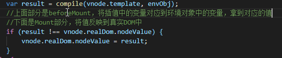
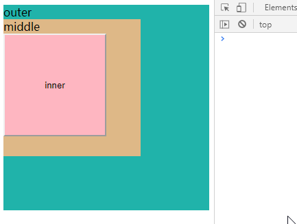
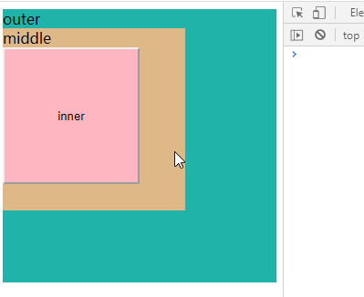
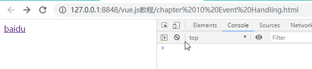
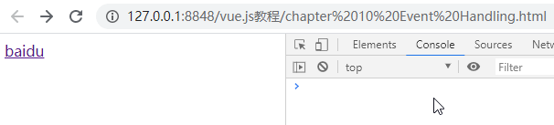
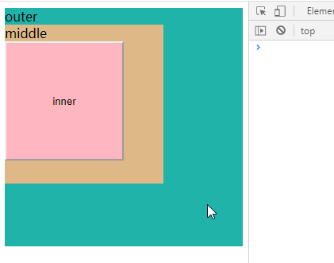
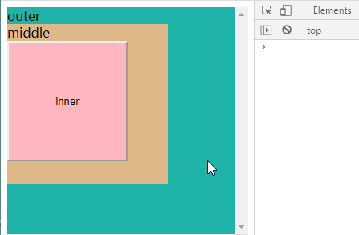
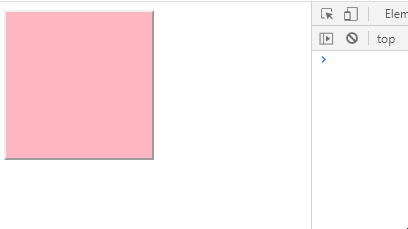

#  Vue（2.0）

## 1. Vue概念

### vue渐进式

vue仅控制页面中指定的区域，其他区域不会受到vue的影响，于是分区域的改造工程，以降低成本和风险

### vue组件化

组件是一个独立的功能单位，管理自身的状态，接受外来的属性，对需要外部处理的位置使用事件，组件的数据只能来自本身（data）或传递进来的（props）

组件是vue中的基本功能单位，每个组件包含功能和界面，组件的功能实际上是对组件数据的各种操控处理，代码表现为通过配置 data、props、methods、computed实现，而有了数据之后我们可以根据数据来渲染组件的界面，所谓组件的节点就是组件想要展示的内容，代码表现为通过components、tamplate实现。

####  组件的单向数据流

组件间的数据传递自上而下，只能由父组件向子组件传递数据(props)，而不能由子组件向父组件传递数据（props），否则的话会造成代码逻辑混，难以维护，如果想要通知父级，可通过事件触发（$emit）主动触发父组件的事件修改数据


#### 组件的生命周期

1. **beforeCreate**：执行一次，组件刚创建时被调用，此时还未提升配置中的成员（就是data还未代理到vm对象中），就是每用一次组件(<compponent />)就会执行一次，每个组件的生命周期是相互独立的
2. **created**：执行一次，组件提升了配置中的成员到代理对象（vm）中后被调用(dataResponsive)，此时界面还未渲染出来，在这里面进行过多的请求操作的话可能会导致卡顿，界面无法及时加载出来
3. **beforeMounted**：执行一次，组件已完成对模板的编译（compile），但还未反映到真实的DOM中
4. **mounted**：执行一次，组件已被渲染到真实的DOM中（render），此时页面已呈现，建议在该方法中书写副作用代码，以免阻塞页面呈现
5. **beforeUpdate**：执行多次，每当组件需要重新渲染时，就会执行该方法，此时，数据已更新，但界面还未更新（render，当此时render还未执行完，只是数据更新了，还每位反映到真实DOM中）
6. **updated**：执行多次，此时，数据和界面都已更新
7. **beforeDestroy**：组件销毁之前执行  ,比如`v-if=“false”`时会销毁组件
8. **destroyed**：组件销毁之后执行

render函数片段



#### 父子组件的生命周期钩子函数执行

父beforeCreate	->	父created	->	父beforeMount	->	子beforecreate	->	子created	->	子

beforeMount	->	子mounted	-> 	父 mounted

**子组件更新过程**

1. 影响到父组件：父beforeUpdate->子beforeUpdate->子updated->父updated
2. 不影响父组件：子beforeUpdate->子updated

**父组件更新过程：**

1. 影响到子组件： 父beforeUpdate -> 子beforeUpdate->子updated -> 父updted
2. 不影响子组件： 父beforeUpdate -> 父updated

**销毁过程：**
 父beforeDestroy -> 子beforeDestroy -> 子destroyed -> 父destroyed

 看起来很多好像很难记忆，其实只要理解了，不管是哪种情况，都一定是父组件等待子组件完成后，才会执行自己对应完成的钩子，就可以很容易记住。 


### vue响应式（2.0）

vue实例可以响应数据的变化，当**属性**（props）或**状态**(data)变化时，组件会重新渲染，

如果从组件树整体来看，组件的重新渲染时从某个组件出发（状态变化），依次影响到后续组件，当然如果后续的组件没有接受到变化的属性，组件自然也不会重新渲染

**重点**：

Vue之所以能实现响应式，根本原因，是它将配置中的状态提升到了Vue实例中，使得对状态的赋值和取值可以被监控。

能提升到实例中的有：data、props、computed、methods、还有一些自身的成员（$xxx啥的）

**不会响应式的**

未经声明的

未使用的


**渲染是异步的**

数据更改后，页面并不会立刻重新渲染，页面的渲染操作是异步（微任务中）执行的，这样做的目的是防止因为如果在同步任务阶段渲染，同步任务多次更改变量的话，会导致页面多次重新渲染。而异步是等待同步任务的最终结果再判断数据是否更改再决定是否重新渲染


#### $nextTick

> 由于渲染是异步的，如果想拿到最终渲染的数据，可以通过nextTick()
>
> vm.$nextTick()    this指向vm实例
>
> Vue.$nextTick()    this指向window

原理

```javascript
if(typeof Promise !== 'undefined'){
    
}else if(typeof Mutataionobserver !== 'undefined'){

}else if(typeof setImmediate !== 'undefined'){
    
}else{
	//setTimeout
    //setTimeout是最慢的宏任务
} 
```

- Promise.resolve( ).then( )微
- MutationObserver( ) 突变观察    微
- setImmediate  宏任务  IE 下
- setTimeout  宏任务


Vue的小缺点：vue会一直等待主线程执行完毕后才会执行异步队列，容易导致页面卡死

#### 页面不重新渲染的情况

1. 数组
   1. 通过索引的方式更改数组，例`arr[4] = 'HSM'`
   2. 更改数组长度，例`arr.length = 5`
2. 对象
   1. 增删对象

究其原理是引用类型监控的只是地址而已，地址改变就会重新渲染，比如

```javascript
var arr = [1,2,3];
arr = [1,2,3,4]
```

像这样的就会重新渲染，因为arr的地址指向改变了


#### 页面重新渲染

1、数组变异方法(7)：push,pop,shift,unshift,splice,sort,reverse

```javascript
var arr = [1,2,3]
arr.push('HSM')
```

使用变异方法，页面也会重新渲染

 **以下数组，对象都通用**

2、vm.$set(要改谁，改什么，改成啥)—这是一个函数

> Vue.set( ) 也是vm.$set( )

```javascript
vm.$set(vm.arr,3,'HSM')
```

效果和上面一样

3、vm.$delete(要删谁的值，删哪个)


```javascript
vm.$delete (vm.arr,3,'HSM')
```

#### 总结：

- 对于简单类型，数据劫持的是变量本身，会将变量代理到vm实例中

- 对于引用类型，数据劫持的是变量所指地址，因此更改引用类型的值不会触发页面重新渲染，必须要用vue提供的变异方法或\$set，$delete方法才能以响应的姿态对引用类型里的值进行增删改查
- definedProperty无法监听到对象的增删，这是它的劣势 


### Vue组件通信方式

#### 父子组件通信方式

`prop` 和 `event`、`v-model`、 `.sync`、 `$refs`、 `$parent` 和 `$children` 

`prop`属性：通过prop向下传递 

`event`: 通过事件向上传递 

`$refs`属性： ref 特性可以为子组件赋予一个 ID 引用(ref='ID')，父组件可以通过这个 ID 引用可以直接访问这个子组件的实例。当父组件中需要主动获取子组件中的数据或者方法时，可以使用 `$refs` 来获取。 注意点，ID引用不可同名，除非通过for循环才能得到几个ID引用相同的子组件

`$parent`属性： 可以用来从一个子组件访问父组件的实例Vuecomponent（每个组件也是一个组件实例，组件的this默认指向该组件） ,最顶层就是根实例。

`$chirden`属性： 默认是一个空数组，存放当前实例的直接子组件组成的数组。 注意点：不能在当前组件的生命周期created中获取子组件数据，因为根据父子生命周期的执行顺序，此时子组件的数据还未被提升到子组件实例中，需要放在mounted中，此时所有子组件都已提升且挂载完毕

#### 非父子组件通信方式

 `$attr` 和 `$listeners`、 `provide` 和 `inject`、 `eventbus`、通过根实例`$root`访问、`vuex`、`dispatch` 和 `brodcast` 

`$attr`属性：该实例上属性会包含父组件中没有被 `prop` 接收的所有属性，默认是个空对象，可将这个传给子组件（v-bind=\$attrs）或只传递单个属性（content="$attrs.content"）。该属性有一个缺点，没接收的属性会显示在当前组件元素标签中：例如：`<div content="xxx"></div>`,需要将inhertattrs设置为false，默认为true

`$listeners`属性：`$listeners` 会包含所有父组件中的 `v-on` 事件监听器 (不包含 `.native` 修饰器的) ，可以通过 `v-on="$listeners"` 传入内部组件。 

`provide`和`inject`属性：可字面意思理解，provide意思是提供数据的仓库，类似于一个公共仓库，哪个组件需要，可以通过inject直接注入（inject:['xxx'])，特点是不局限于组件间的关系。但是缺点也很明显，会导致关系混乱，最后都不知道值到底是从哪来的

## 2. Vue-Router

> 建立并管理url和对应组件之间的映射关系.

元数据：描述数据的数据

### 路由配置

通过routes配置路由规则，什么地址匹配什么组件

- 静态规则： 	` { path: "/", component: Home}`
- 动态规则：     `{ path: "/move/:id", component: MovieDetail}`
- 自定义数据： `{ path: "/movie", component: Movie, meta: { needLogin:true }}`

通过mode配置路由模式

hash模式：http://www.baidu.com/index.html# 路径在这里

history模式：http://www.baidu.com/ 路径在这里

### 导航

链接导航：`<router-link to="链接地址">链接内容</router-link>`

编程导航：`this.$router.push("链接地址")`，当我们配置了vue-router后，会自动往vue实例中注入$router私有属性 

#### `$router`和`$route`区别

- `$router`是指整个**路由实例**,你可以操控整个路由,通过'$router.push'往其中添加任意的路由对象.
- `$route`:是指当前路由实例('$router')跳转到的**路由对象**;
- 路由实例可以包含多个路由对象.它们是父子包含关系.

### 导航守卫

- 全局导航守卫（无论怎么跳转，都会经过该函数）
  - beforeEach：每次进入一个地址之前运行的守卫
  - beforeResolve
  - afterEach
- 路由导航守卫
  - beforeEnter
- 组件导航守卫
  - beforeRouteEnter
  - beforeRouteUpdate
  - beforeRouteLeave

以上组件的顺序是从整体到局部，越来越精细。

to：到那里去（对象）

from：从哪里来（对象）

next：一个函数，调用会才会到达指定的地址


## 3. Vuex

> 处理和存储复杂共享数据的仓库，用来管理vue的所有组件状态，每一个Vuex应用就是一个store，在store中包含组件中的共享状态state和改变状态的方法mutations。这样想，Vuex实际上不就是一个存放全局对象的地方吗？确实是这样，但和全局对象还是有点区别的

### Vuex与普通全局对象的区别

1. Vuex的状态(state)存储是响应式的，当Vue组件从store中读取状态的时候，若store中的状态发生变化，那么相应的组件也会相应的得到更新
2. 不能直接改变store中的状态。改变store中状态的唯一途径就是显式地**提交（commit）mutation**。这样使得我们可以方便的跟踪每一个状态的变化，从而让我们能实现一些工具帮助我们更好的了解我们的应用。

例如：

```javascript
//store.js
// 如果在模块化构建系统中，请确保在开头调用了 Vue.use(Vuex)
const store = new Vuex.Store({
  state: {
    count: 0
  },
  mutations: {
    increment (state) {
      state.count++
    }
  }
})

//count.js
store.commit('increment') // 调用 mutations 中的方法
console.log(store.state.count) // -> 1
```

### 配置

- state（初始状态）：存放数据的地方，可以共享里面的数据供所有的组件使用
- getters（获得者）：可以看成是组件内的computed计算属性,接收两个参数 state和getters,函数触发的条件跟computed一样，监测到的数据发生了改变就执行
- mutations：类似于一个事件，可配置多个用于改变状态(state) 的无副作用方法（不能异步请求），无副作用就是保存数据纯净,接收两个参数，第一个参数是state,另一个参数是传递过来的数据，可以是字符串形式，也可以是对象形式（传递多条数据）
- actions：可配置多个用于处理副作用的方法（可以异步请求）。提交mutation,让mutaition去更改状态
- modules：模块化配置
- namespaced：是否开启命名空间，以防止多个模块 的名称冲突 


### 使用方式

`store.dispatch("命名空间/action名称"，负载)`	//分发action

`store.commit("命名空间/mutation名称"，负载)` //调用mutation中的方法

`store.state`	//获取整个仓库的状态

负载表示的是额外的信息，只能是单个

你不能直接改变 store 中的状态。改变 store 中状态的唯一途径就是显式地**提交 (commit) mutation**。这样使得我们可以方便地跟踪每一个状态的变化，从而让我们能够实现一些工具帮助我们更好地了解我们的应用。


### 在组件中使用

配置了vuex后，会将$store属性配置到每一个组件vue实例上去

需要在计算属性中获取仓库数据

```javascript
computed: {
    xxx(){
        return this.$store.state.xxx
    }
}
```

使用xxx属性也相当于使用了仓库里的属性，因为把这两个关联了起来


某些时候，通过Vuex.mapState（函数）可简化操作，调用该函数，返回一个对象

`Vuex.mapState("命名空间"，["属性1"，"属性2"])`

会返回以下

```javascript
{
    属性1(){
        return this.$store.命名空间.属性1
    },
    属性2(){
        return this.$store.命名空间.属性2
    }  
}
```


## vue学习笔记

### 事件处理

 如果需要在内联语句处理器中访问原生DOM事件。可以使用特殊变量`$event`，把它传入到`methods`中的方法中。

#### 事件修饰符

   在Vue中，**事件修饰符**处理了许多DOM事件的细节，让我们不再需要花大量的时间去处理这些烦恼的事情，而能有更多的精力专注于程序的逻辑处理。在Vue中事件修饰符主要有：

- .stop：仅触发自身事件，不向上触发父级的事件，等同于JavaScript中的`event.stopPropagation()`，防止事件冒泡
- .prevent：取消元素存在的默认事件，比如阻止表单的默认提交，a标签的跳转
- .capture：将默认的事件冒泡转机制为事件捕获，所谓事件捕获，就是结构上（非视觉上）嵌套关系的元素，会存在事件捕获的功能，即同一事件，自父元素捕获至事件源事件。（自顶向下）
- .self：`.self`修饰符只会触发自己范围内的事件，不会包含子元素。
- .once：事件只触发一次
- .passive：告诉浏览器你*不*想阻止事件的默认行为，与prevent互斥

---------------------------------------------------------------------------------------------------------------------------

##### .stop

**添加.stop修饰符前**

```html
<div id="app"> 
　　<div class="outer" v-on:click="outer">outer 
　　　　<div class="middle" v-on:click="middle">middle 
　　　　　　<button v-on:click="inner">inner</button>
 　　　　</div>
 　　</div> 
</div>
<script>
var vm = new Vue({
	el : "#app",
	methods:{
		outer(){
			console.log('outer')
		},
		middle(){
			console.log('middle')
		},
		inner(){
			console.log('inner')
		},
	}
});
</script>
```

点击inner也会触发outer中的事件




**添加.stop修饰符后**

```html
<div id="app"> 
　　<div class="outer" v-on:click="outer">outer 
　　　　<div class="middle" v-on:click="middle">middle 
　　　　　　<button v-on:click.stop="inner">inner</button>
 　　　　</div>
 　　</div> 
</div>
```

点击inner只会触发自身的事件，不会再向上冒泡触发祖先的事件，middle和outer不添加.stop修饰符，还会继续冒泡




---------------------------------------------------------------------------------------------------------------------------

##### .prevent

> 取消默认事件


**a标签事件添加.prevent修饰符前**

```html
<div id="app">
    <a href="https://www.baidu.com" v-on:click="handleA">baidu</a>
</div>
<script>
var vm = new Vue({
	el : "#app",
	methods:{
		handleA(){
			console.log('a被点击了')
		}
	}
});
</script>
```

此时click事件和a标签的默认跳转事件都会触发



**a标签事件添加.prevent修饰符后**

```html
<div id="app">
    <a href="https://www.baidu.com" 
       v-on:click.prevent="handleA"
    >baidu</a>
</div>
```

此时只有click事件被触发，a标签的默认跳转事件不再触发



-------------------------------------------------------------------------------------------------------------------------


##### .capture

事件捕获的前提的祖先必须也是事件捕获，事件捕获机制才能从父级向下传递（自结构上），事件冒泡也是同理的，所有事件默认都是冒泡机制


**inner和middle添加.capture事件前**

```html
<div id="app">
    <div class="outer" v-on:click="outer">outer
        <div class="middle" v-on:click="middle">middle
            <button class="inner" v-on:click="inner">inner</button>
        </div>
    </div> 
</div>
<script>
var vm = new Vue({
	el : "#app",
	methods:{
		outer(){
			console.log('outer')
		},
		middle(){
			console.log('middle')
		},
		inner(){
			console.log('inner')
		},
	}
});
</script>
```

点击inner，此时还是默认的事件冒泡机制，事件触发结构上由inner向上扩散




**添加.capture事件后**

```html
<div id="app">
    <div class="outer" v-on:click="outer">outer
        <div class="middle" v-on:click.capture="middle">middle
            <button class="inner" 		
                    v-on:click.capture="inner">inner</button>
        </div>
    </div> 
</div>
```

因为outer没有变成事件捕获机制，还是冒泡机制，根据先捕获后冒泡的原理。

点击inner，事件捕获触发顺序自结构上由父级（middle）到源目标（inner），再到事件冒泡，自当前元素（inner）到父级（outer）


点击middle，父级是事件冒泡，不存在捕获，只有自己是捕获没用，根据先捕获后冒泡原理，由middle（捕获）再到outer（冒泡）


##### .self

不响应因子级事件的触发而冒泡到自身事件的触发，只有触发自身，才会触发自身向上的冒泡


```html
<div id="app"> 
　　<div class="outer" v-on:click="outer">outer
      <div class="middle" v-on:click.stop="middle">middle
          <button class="inner" v-on:click="inner">inner</button>
      </div>
    </div> 
</div>
<script>
var vm = new Vue({
	el : "#app",
	methods:{
		outer(){
			console.log('outer')
		},
		middle(){
			console.log('middle')
		},
		inner(){
			console.log('inner')
		},
	}
});
</script>
```

点击inner，由于middle设置的.self修饰符，所以冒泡不会响应在middle中，跳过middle继续向outer冒泡。

点击middle自身，此时先触发middle自身，再向上冒泡触发outer




**.stop** 和**.self** 的区别：.self只会阻止子元素自己身上冒泡行为的触发，并不会真正阻止 冒泡的行为。” .stop "会阻止该元素所有的冒泡的行为


##### .once

```html
<div id="app"> 
　　<button class="inner" v-on:click.once="inner"></button>
</div>
```




##### .passive


#### 键盘修饰符

在JavaScript事件中除了前面所说的事件，还有键盘事件，也经常需要监测常见的键值。在Vue中允许`v-on`在监听键盘事件时添加关键修饰符。记住所有的`keyCode`比较困难，所以Vue为最常用的键盘事件提供了别名：

- **`.enter`**：回车键
- **`.tab`**：制表键
- **`.delete`**：含`delete`和`backspace`键
- **`.esc`**：返回键
- **`.space`**: 空格键
- **`.up`**：向上键
- **`.down`**：向下键
- **`.left`**：向左键
- **`.right`**：向右键

```javascript
<!-- 只有在 `key` 是 `Enter` 时调用 `vm.submit()` -->
<input v-on:keyup.enter="submit">
```


#### 鼠标修饰符

鼠标修饰符用来限制处理程序监听特定的滑鼠按键。常见的有：

- **`.left`**：鼠标左键
- **`.middle`**：鼠标中间滚轮
- **`.right`**：鼠标右键

#### 系统修饰键

可以用如下修饰符开启鼠标或键盘事件监听，使在按键按下时发生响应：

- **`.ctrl`**
- **`.alt`**
- **`.shift`**
- **`.meta`**

##### .exact修饰符

`.exact`是准确的意思

`.exact`修饰符允许你控制由精确地系统修饰符组合触发的事件

```html
<!-- 表示按住click+ctrl触发，即使也 Alt 或 Shift 被一同按下时也会触发 -->
<button v-on:click.ctrl="onClick">A</button>

<!-- 有且只有click+ Ctrl 被按下的时候才触发 -->
<button v-on:click.ctrl.exact="onCtrlClick">A</button>

<!-- 没有任何系统修饰符被按下的时候才触发 -->
<button v-on:click.exact="onClick">A</button>
```


#### 自定义按键修饰符别名

在Vue中可以通过`Vue.config.keyCodes`全局自定义按键修饰符别名。例如，由于预先定义了`keycode 116`（即`F5`）的别名为`f5`，因此在文字输入框中按下`F5`，会触发`prompt`方法，出现`alert`。

```html
<!-- HTML -->
<div id="app">
    <input type="text" v-on:keydown.f5="prompt()">
</div>

<script>
Vue.config.keyCodes.f5 = 116;

let app = new Vue({
    el: '#app',
    methods: {
        prompt: function() {
            alert('我是 F5！');
        }
    }
});
</script>

```