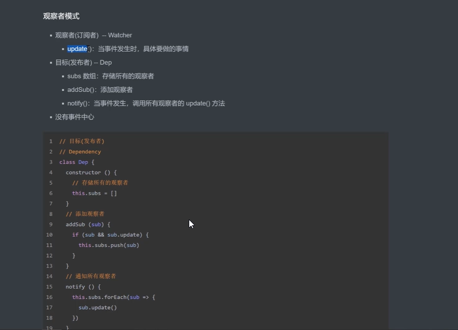
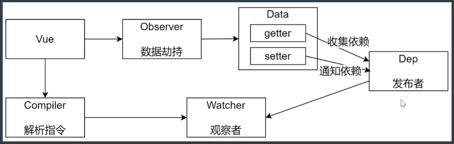

# Vue2.0源码分析

**如何学习源码**

- 先宏观了解
- 带着目标看源码
- 看源码的过程要不求甚解
- 调试
- 参考资料

## Snbbdom源码分析（v0.7.4）

Vue.js中的核心之一就是虚拟DOM,而要研究虚拟DOM最好的就是看snabbdom，这个玩意就是利用虚拟DOM来进行驱动的，相比Vue来说，snabbdom对于研究虚拟DOM更好，因为它里面没有其他干扰的东西，因此研究起来更方便。

### 前言

#### 什么是虚拟DOM

> 所谓虚拟DOM，只是一个用来描述真实Dom的普通的JavaScript对象，至于为什么要用来描述真实的Dom，是因为真实DOM的属性成员非常多，导致创建一个真实Dom的开销特别高，但创建一个虚拟DOM的开销却很小，因为虚拟Dom仅仅是几行简单的JS对象。

创建一个虚拟Dom示例

```javascript
{
    $el:"div",
    data:{},
    children:undefined,
    text:'Hello World',
    elm:undefined,
    key:undefined
}
```


#### 为什么需要虚拟DOM

> 因为创建一个Dom的开销特别高，因此如果我们频繁的对Dom进行操作，会非常耗费浏览器性能
>
> 虚拟Dom的目的是实现最小更新


我们先来看一个有增加，删除功能的列表:

[jquery增加，删除列表](http://qiutianaimeili.com/html/_page/2018/05/source/snabbdom/example.html)

> 点击添加按钮，生成随机数据的固定模板，插入到列表中，点击删除时，删除被选中的数据模板

```html
<div id='nb'>
    <ul id='nb_ul'>
        <li>
            <div class='unit'>
                <span class='left'>姓名:张三</span>
                <span class='left' style='margin-left:20px;'>年龄:20</span>
                <span class='right close'>x</span>
            </div>
        </li>
    </ul>
</div>
<div class='btn_group'>
    <div class='add btn'>增加</div>
</div>
<script src='/js/jquery-3.1.1.min.js'></script>
<script>
    $(function() {	
        $('.add').on('click', function() {
            var name = Math.random().toString(36).substr(2),
                age = 5 + Math.random() * 20 >> 0;
            $('#nb_ul').append("<li>\
<div class='unit'>\
<span class='left'>姓名:" + name + "</span>\
<span class='left' style='margin-left:20px;'>年龄:" + age + "</span>\
<span class='right close'>x</span>\
    </div>\
    </li>")
        });
        $('#nb').on('click', function(ev) {
            if($(ev.target).closest('.close').length) {
                $(ev.target).closest('li').remove();
            }
        });
    })
</script>
```

就是直接利用js操作我们的DOM，在后面添加一个或者删除。这样做似乎没有什么问题，但是如果我们要做列表排序可能就比较麻烦了，于是我们可能想到一个更好的办法，就是将列表的内容用数组保存起来，排序完成后，直接重新渲染列表就好了：


[jquery排序列表](http://qiutianaimeili.com/html/_page/2018/05/source/snabbdom/example1.html)

> 维护一个内容数组，定义一个render函数遍历数组把数据渲染到模板上，点击排序时，将数组数据按age从小到大排序，然后在用render函数遍历数组把数据渲染到模板上

```html
<div id='nb'>
    <ul id='nb_ul'>
        <li>
            <div class='unit'>
                <span class='left'>姓名:张三</span>
                <span class='left' style='margin-left:20px;'>年龄:20</span>
                <span class='right close'>x</span>
            </div>
        </li>
    </ul>
</div>
<div class='btn_group'>
    <div class='add btn'>增加</div>
</div>
<script src='/js/jquery-3.1.1.min.js'></script>
<script>
	var data = [{
    name: '张三',
     age: 10,
    }, {
    name: '李四',
    age: 20
    }, {
    name: '王五',
    age: 15,
    }, {
    name: '康复',
    age: 16
    }, {
    name: '宝宝',
    age: 12
    }];
    var render = function() {
        var html = '';
        data.forEach(function(n, i) {
        html += "<li>\
                <div class='unit'>\
                <span class='left'>姓名:" + n.name + "</span>\
                <span class='left' style='margin-left:20px;'>年龄:" + n.age + "</span>\
                <span class='right close'>x</span>\
                </div>\
                 </li>";
        });
        return html;
}    
$('#nb_ul').html(render());
$('.sort').on('click', function() {
        data = data.sort(function(a, b) {
        return a.age - b.age;
        });
    $('#nb_ul').html(render());
});
</script>
```

​		这种方式虽然可以解决列表排序问题，但是比较暴力，就是将之前的全部删除，重新来过一遍，这样明显是效率低下的，因为假如有些元素位置根本没有变，那么就没有必要移动了。

​		上述的两个实现，各有优缺点，从数据层面上来说，第二个更好，因为它是**先改变数据，再改变视图**，这样就免去了再次收集数据的步骤，但是第二个过于粗暴，如果能像第一个那样精准就好了，因此我们设想的步骤大致如下:


其实上面大概就有点虚拟DOM的意思了，首先是先控制数据再渲染视图，**但是视图不是直接渲染的，是采用diff渲染的，diff渲染就是通过比较渲染前后的数据，只当数据有变动才会发生真正的渲染。**


总结：

- 手动操作DOM比较麻烦，还要考虑浏览器的兼容性问题，虽然有jQuery等库简化DOM操作，但是随着项目的复杂，DOM操作复杂提升
- 为了简化DOM的操作，于是出现了各种MVVM框架，MVVM框架解决了视图和状态的同步问题（数据发生变化，自动更新视图，反之如此）
- 为了简化视图的操作，我们可以使用模板引擎，但是模板引擎没有解决跟踪状态变化的问题（数据发生变化后，无法获取上一次的状态，只好把界面上的元素删除再新建），于是Virtual DOM出现了（模板引擎就类似v-for，插值{{}}这些）
- Vitrual DOM的好处是当状态改变时不需要立即更新DOM，只需要创建一个虚拟树来描述DOM，Virtual DOM内部再用diff算法高效的更新DOM


### 宏观了解

> 学习源码前，先要对整体的Snabbdom有一个宏观上的了解

看看snabbdom的主要目录结构。

| 名称            | 类型   | 解释                                                         |
| --------------- | ------ | ------------------------------------------------------------ |
| dist            | folder | 存放Snbbdom编译后的结果                                      |
| examples        | folder | 存放了使用snabbdom的例子                                     |
| helpers         | folder | 包含svg操作需要的工具（与核心流程无关，暂不关心）s           |
| modules         | folder | 官方提供的模块，包含了attribute，props，class，dataset，eventlistner，style，hero【自定义模块】的操作 |
| src             | folder | ,存放源码文件                                                |
| h               | file   | 用于创建Vnode                                                |
| hook            | file   | 定义了一些钩子函数，与Vue中的生命周期钩子函数类似            |
| htmldomapi      | file   | 原生dom操作的抽象                                            |
| is              | file   | 判断类型                                                     |
| snabbdom.bundle | file   | snabbdom本身依赖打包                                         |
| snabbdom        | file   | snabbdom 核心，包含diff，patch等操作                         |
| thunk           | file   | snabbdom下的thunk功能实现                                    |
| tovnode         | file   | 导出一个tovnode()函数，用于把DOM元素转化成VNode              |
| vnode           | file   | 定义了Virtual DOM的结构（ts接口），以及导出一个vnode()函数，用于创建vnode |


hook钩子函数

钩子是一种挂钩到DOM节点生命周期的方法。Snabbdom提供了丰富的钩子可以选择。模块使用钩子来扩展Snabbdom，在普通代码中，钩子用于在虚拟节点生命周期的期望点执行任意代码。


以下钩子可用于模块:pre、create、update、destroy、remove、post。

以下钩子可用于单个元素的钩子属性:init、create、insert、prepatch、update、postpatch、destroy、remove。


https://github.com/coconilu/Blog/issues/152

先从一个完整且简单的案例切入

```javascript
import {h,init} from 'snabbdom'

//1. 导入模块
import style from 'snabbdom/modules/style',
import eventlisteners from 'snabbdom/modules/eventlisteners',   

//2.在init中注册模块
//init()的参数是一个数组，可以传入模块，处理属性/样式/事件等
//patch函数的作用是比对两者虚拟dom之间的差异
let patch = init([
    style,
    eventlisteners
])

//3. 使用h()函数的第二个参数传入模板需要的数据 （对象）
let vnode = h('div',{
    style:{
        backgroundColor:'red'
    },
    on:{
        click:eventHandler
    }
    Hook:{		//生命周期钩子函数
    
    }
},[
    h('h1','hello snabbdom'),
    h('p','hello p')
])

function eventHandler(){
    console.log('被点击了')
}

let app = document.querySelector('#app');	//获取到占位元素

patch(app,vnode) //通过patch去比对两个VNode，  去更新真实DOM,然后返回一个VNode
```

上面我们看到主要使用了h（）函数，init()函数，和调用init返回的patch函数，我们先从分析这三个函数开始

#### h.js

> h() 函数的作用就是调用 vnode() 函数创建并返回一个虚拟节点。

```javascript
"use strict";
Object.defineProperty(exports, "__esModule", { value: true });
//部分一：导入模块
var vnode_1 = require("./vnode");
var is = require("./is");

//部分二：创建命名空间
function addNS(data, children, sel) {
    data.ns = 'http://www.w3.org/2000/svg';
    if (sel !== 'foreignObject' && children !== undefined) {
        for (var i = 0; i < children.length; ++i) {
            var childData = children[i].data;
            if (childData !== undefined) {
                addNS(childData, children[i].children, children[i].sel);
            }
        }
    }
}

// 部分三：判断参数个数，创建虚拟节点
/**
 * 判断参数个数，创建虚拟节点
 * @param {*} sel 元素
 * @param {*} b 模块
 * @param {*} c 文本或子元素数组
 */

function h(sel, b, c) {
    var data = {}, children, text, i;
    //对所传参数进行处理判断，实现重载的机制，所谓重载，就是 根据根据传递的参数个数不同而调用不同的同名函数
    if (c !== undefined) {  //c不为空，说明传入了三个参数 sel、data、children/text
        data = b;   
        if (is.array(c)) {  //如果C是数组，说明是存储子Vnode的数组
            children = c;
        }
        else if (is.primitive(c)) { //如果C是原始值，说明是C文本
            text = c;
        }
        else if (c && c.sel) {      //如果C是一个子Vnode
            children = [c];
        }
    }
    else if (b !== undefined) {//C为空，b不为空，说明传入二个参数 sel、children/text
        if (is.array(b)) {  //如果C是数组，说明是存储子Vnode的数组
            children = b;
        }
        else if (is.primitive(b)) { //如果C是原始值，说明是C文本
            text = b;
        }
        else if (b && b.sel) {  //如果C是一个子Vnode
            children = [b];
        }
        else {
            data = b;
        }
    }
    if (children !== undefined) { //处理children中的原始值（string/number）
        for (i = 0; i < children.length; ++i) {
            if (is.primitive(children[i]))
            //如果child是string/number、创建文本节点   
                children[i] = vnode_1.vnode(undefined, undefined, undefined, children[i], undefined);
        }
    }
    if (sel[0] === 's' && sel[1] === 'v' && sel[2] === 'g' &&
        (sel.length === 3 || sel[3] === '.' || sel[3] === '#')) {
        //如果是SVG，添加命名空间
        addNS(data, children, sel);
    }
    return vnode_1.vnode(sel, data, children, text, undefined);
}
exports.h = h;
;
exports.default = h;
//# sourceMappingURL=h.js.map
```

代码逻辑


文件中分别用到了is文件中的Array方法和primitive方法，还有vnode文件中的vnode方法，我们接着分析这两个

##### is.js

```javascript
"use strict";
Object.defineProperty(exports, "__esModule", { value: true });
exports.array = Array.isArray;  //判断参数是否为数组
//primitive用于判断参数是否为原始值（字符串或数字），满足其中一样返回true
function primitive(s) {
    return typeof s === 'string' || typeof s === 'number';
}
exports.primitive = primitive;
//# sourceMappingURL=is.js.map
```

这个文件很简单，主要是定义了Array方法用于判断参数是否为数组、定义了primitive方法用户判断参数是否为原始值（string/number），并暴露出去

##### vnode.js

```javascript
//VNode函数最终返回的是一个JS对象
//{ sel: sel, data: data, children: children, text: text, elm: elm, key: key };
//  选择器       节点数据     子节点               节点文本   真实DOM      优化用
"use strict";
Object.defineProperty(exports, "__esModule", { value: true });
function vnode(sel, data, children, text, elm) {
    var key = data === undefined ? undefined : data.key;
    return { sel: sel, data: data, children: children, text: text, elm: elm, key: key };
}
exports.vnode = vnode;
exports.default = vnode;
//# sourceMappingURL=vnode.js.map
```

这个文件也很简单，声明了一个vnode函数，在里面声明了一个key变量，赋值规则为，如果data未传入，则key为undefined，传入了data，key的值则为data中的key属性。最终返回一个打包好的JS对象，也就是所谓的vnode了。


h函数我们看完了，下面我们正式看vnode的核心文件，snabbdom.js，探究vnode是如果转换成真实Dom的，又是如何计算出最小更新的。


#### snabbdom.js

```javascript
"use strict";
//部分一：导入模块部分
Object.defineProperty(exports, "__esModule", { value: true });
var vnode_1 = require("./vnode");
var is = require("./is");
var htmldomapi_1 = require("./htmldomapi");
```

先从第一部分导入模块看起，我们看到，主要导入了三个模块文件，其中前两个我们上面已经见过了，我们来看看第三个`htmldomapi`是干什么的

##### htmldomapi.js

```javascript
"use strict";
Object.defineProperty(exports, "__esModule", { value: true });
function createElement(tagName) {
    return document.createElement(tagName);
}
function createElementNS(namespaceURI, qualifiedName) {
    return document.createElementNS(namespaceURI, qualifiedName);
}
function createTextNode(text) {
    return document.createTextNode(text);
}
function createComment(text) {
    return document.createComment(text);
}
function insertBefore(parentNode, newNode, referenceNode) {
    parentNode.insertBefore(newNode, referenceNode);
}
function removeChild(node, child) {
    node.removeChild(child);
}
function appendChild(node, child) {
    node.appendChild(child);
}
function parentNode(node) {
    return node.parentNode;
}
function nextSibling(node) {
    return node.nextSibling;
}
function tagName(elm) {
    return elm.tagName;
}
function setTextContent(node, text) {
    node.textContent = text;
}
function getTextContent(node) {
    return node.textContent;
}
function isElement(node) {
    return node.nodeType === 1;
}
function isText(node) {
    return node.nodeType === 3;
}
function isComment(node) {
    return node.nodeType === 8;
}
exports.htmlDomApi = {
    createElement: createElement,		//创建元素
    createElementNS: createElementNS,	//创建带有命名空间的节点
    createTextNode: createTextNode,		//创建文本节点
    createComment: createComment,		//创建注释节点
    insertBefore: insertBefore,			//插入操作：将B插入到A节点下面的同级C位置前
    removeChild: removeChild,			//删除操作：删除A节点下的子级B节点
    appendChild: appendChild,			//增加操作：把B节点插入父级A节点下
    parentNode: parentNode,				//查询操作：查询B的父节点
    nextSibling: nextSibling,			//查询操作：查询B的兄弟姐弟那
    tagName: tagName,				    //查看操作：查看当前节点的标签名
    setTextContent: setTextContent,		 //修改操作：设置当前节点的文本内容
    getTextContent: getTextContent,		 //查询操作：查询当前节点的文本内容
    isElement: isElement,				//判断操作：判断当前节点的类型是否为元素节点
    isText: isText,					    //判断操作：判断当前节点的类型是否为文本节点
    isComment: isComment,				//判断操作：判断当前节点的类型是否为注释节点
};
exports.default = exports.htmlDomApi;
//# sourceMappingURL=htmldomapi.js.map
```

可以发现，这个文件只是封装了一些调用原生Domapi的方法，并通过htmlDomapi对象返回出去。

接着我们回到snabbdom.js，继续往下分析第二部分

```javascript
//部分二：定义辅助函数部分
function isUndef(s) { return s === undefined; }    //该函数用于判断传入的参数是否为undefined
function isDef(s) { return s !== undefined; }      //该函数用于判断传入的参数是否不为undefined

var emptyNode = vnode_1.default('', {}, [], undefined, undefined);  //创建空的vnode

function sameVnode(vnode1, vnode2) {    //该函数用于比对两个虚拟节点是否相同
    return vnode1.key === vnode2.key && vnode1.sel === vnode2.sel;
}
function isVnode(vnode) {               //该函数用于判断节点是否为虚拟节点
    return vnode.sel !== undefined;
}
function createKeyToOldIdx(children, beginIdx, endIdx) {
    var i, map = {}, key, ch;
    for (i = beginIdx; i <= endIdx; ++i) {
        ch = children[i];
        if (ch != null) {
            key = ch.key;
            if (key !== undefined)
                map[key] = i;
        }
    }
    return map;
}

//存储钩子函数名字的数组
var hooks = ['create', 'update', 'remove', 'destroy', 'pre', 'post']; 
```

第二部分也只是定义了一些辅助函数，用于辅助接下来的核心源码部分

- isUndef()：该函数用于判断传入的参数是否为未定义，就是未赋值
- isdef()：该函数用于判断传入的参数是为已定义，就是有值
- emptyNode：声明了一个空vnode，并存放到emptyNode变量中。
- sameVnode（）：该函数用于比对两个vnode是否相同，条件为sel(选择器)和key都要一致
- isVnode（）：该函数用户判断参数是否为vnode，条件为vnode.sel属性存在，这个属性是vnode特有的
- createKeyToOldIdx（）：后面补充
- Hooks:存储模块的钩子函数名字的数组


第二部分探究完之后，正式进入snabbdom的核心源码部分，init（）函数，这个函数是整个Snabbdom源码实现的核心，其他的只不过是该核心的辅助函数。

```javascript
function init(modules, domApi) {
    var i, j, cbs = {};
    //初始化 把转换虚拟节点成真实DOM节点的API
    var api = domApi !== undefined ? domApi : htmldomapi_1.default;

    //把传入的所有模块的钩子函数，统一存储到cbs对象中 cbs{create:[fn,fn],update:[fn]}
    for (i = 0; i < hooks.length; ++i) {
        cbs[hooks[i]] = [];     //cbs{create:[]}
        for (j = 0; j < modules.length; ++j) {
            var hook = modules[j][hooks[i]];    //模块下面的钩子函数
            if (hook !== undefined) {   //如果模块下面有钩子函数
                cbs[hooks[i]].push(hook);    //cbs{create:[fn,fn],update:[fn]}
            }
        }
    }
	//获取真实Dom的tag、id、class属性，调用vnode()函数返回vnode。暂时不展开
    function emptyNodeAt(elm){	
    }
    //高阶函数。暂时不展开
    function createRmCb(childElm, listeners){
    }
    //该函数用于将vnode转换成真实Dom。暂时不展开
    function createElm(vnode, insertedVnodeQueue){
    }
    //该函数用于批量增加节点。暂时不展开
    function addVnodes(parentElm, before, vnodes, startIdx, endIdx, insertedVnodeQueue){
    }
    function invokeDestroyHook(vnode){
    }
    //该函数用于批量删除节点。暂时不展开
    function removeVnodes(parentElm, vnodes, startIdx, endIdx){
    }
    
    function updateChildren(parentElm, oldCh, newCh, insertedVnodeQueue){
    }
    //该函数用于对比两个vnode之间的差异，应该就是diff算法了。暂时不展开
    function patchVnode(oldVnode, vnode, insertedVnodeQueue){
    }
    
    
    //init内部返回patch函数，把vnode渲染成真实DOM,并返回vnode
    return function patch(oldVnode, vnode) {
        var i, elm, parent;
        var insertedVnodeQueue = [];    //插入节点的队列
        for (i = 0; i < cbs.pre.length; ++i)    //遍历所有的pre钩子函数（pre是预处理钩子函数）
            cbs.pre[i]();                       //然后执行
        if (!isVnode(oldVnode)) {               //判断是否为真实节点（判断oldVnode是否有sel属性），如果是
            oldVnode = emptyNodeAt(oldVnode);   //要先转换成虚拟节点
        }
        if (sameVnode(oldVnode, vnode)) {       //比对传入的两个虚拟节点是否为相同节点（sel相同，key相同），如果是
            patchVnode(oldVnode, vnode, insertedVnodeQueue);
        }
        else {                                  //如果两个虚拟节点不为相同节点，vnode创建对应dom
            elm = oldVnode.elm; //获取旧节点中的存放真实节点的elm
            parent = api.parentNode(elm);   //获取elm的父节点
            createElm(vnode, insertedVnodeQueue);   //创建vnode对应的真实dom元素，并触发init/create钩子函数
            if (parent !== null) {  //如果父节点不为空
                // 把vnode对应的真实dom元素插入到parent下面，位置在旧元素节点前面
                api.insertBefore(parent, vnode.elm, api.nextSibling(elm)); //把vnode对应的DOM插入到文档中
                //然后把旧节点给移除
                removeVnodes(parent, [oldVnode], 0, 0);                    //然后再移除老节点
            }
        }
        //执行用户设置的insert构造函数
        for (i = 0; i < insertedVnodeQueue.length; ++i) {
            insertedVnodeQueue[i].data.hook.insert(insertedVnodeQueue[i]);
        }
        //执行模块的post构造函数
        for (i = 0; i < cbs.post.length; ++i)
            cbs.post[i]();
        return vnode;
    };
}
```

再开始看init函数之前，我们再回顾下init函数做了些什么，首先调用了init（）函数，返回patch函数，patch函数用于比对两个节点，并更新到真实Dom中，返回新vnode。

##### init

init是一个高阶函数，返回一个patch函数，该函数接收2个参数，分别为模块与domApi

1. init内部初始化了4个变量，i=undefined、j=undefined、cbs={ }、api：如果传入了domApi，就用domApi，否则用自带的htmldomapi
2. 把传入的所有模块的钩子函数，统一存储到cbs对象中 cbs{create:[fn,fn],update:[fn]}


3. init内部返回patch函数，init函数结束

##### patch (oldVnode，vnode)

patch（）函数接收2个参数，分别为oldVnode、vnode

1. patch内部初始化了4个变量，i、elm、parent、insertedVnodeQueue

2. 遍历所有的pre钩子函数（pre是预处理钩子函数）,然后执行。【pre钩子在patch过程开始执行】
3. 判断oldvnode是否是真实Dom，如果是，先转换成虚拟节点
4. 比对传入的两个虚拟节点是否为相同节点 (sel相同，key相同)，


## 响应式分析

所谓响应式，就是当我们修改数据时，视图会进行更新，避免了繁琐的Dom操作，提高开发效率。


准备工作

- 数据驱动
- 响应式的核心原理
- 发布订阅模式和观察者模式

### 数据驱动

- 数据响应式、双向绑定、数据驱动
- 数据响应式
  - 数据模型仅仅是普通的JavaScript对象，而当我们修改数据时，视图会进行更新，避免了繁琐的Dom操作，提高开发效率

- 双向绑定
  - 数据改变，视图改变；视图改变，数据也随着改变
  - 我们可以使用v-model在表单元素上创建双向数据绑定

- 数据驱动是Vue最独特的特性之一（一种开发过程）
  - 开发过程中仅需要关注数据本身，不需要关系数据是如何渲染到视图

`主流MVVM框架已经帮我们实现了数据响应式和双向绑定`


### 响应式核心原理（2.0）

```javascript

let data = {
    name: 'HSM',
    age: 21,
    family: ['mom', 'dad', 'sister', 'brother'],
    friend: {
        'zhansan': 19,
        'lisi': 22,
        'honhon': 18
    }
}

let vm = {}
function proxyData(vm, data) {
    Object.keys(data).forEach((key) => {
        if(typeof data[key] == 'object') {

        }
        Object.defineProperty(vm, key, {
            get() {
                console.log('get:', key, data[key])
                return data[key]
            },
            set(newValue) {
                console.log('set:', key, newValue)
                if (newValue === data[key]) {
                    return
                }
                data[key] = newValue
            }
        })
    })
}

proxyData(vm,data)
console.log(vm)
```


### 响应式核心原理（3.0）

```javascript
let data = {
    name: 'HSM',
    age: 21,
    family: ['mom', 'dad', 'sister', 'brother'],
    friend: {
        'zhansan': 19,
        'lisi': 22,
        'honhon': 18
    }
}

let vm = new Proxy(data,{
    //target就是代理的目标对象，也就是data
    //key就是对象里的属性
    get(target,key){
        console.log(target,key)
        return target[key]
    },
    //target就是代理的目标对象，也就是data
    //key就是对象里的属性
    //newValue就是更改的值
    set(target,key,newValue){
        console.log(target,key,newValue)
        if(target[key] === newValue){
            return
        }
        target[key] = newValue;
        
    }
})
```


### 发布/订阅者函数


### 发布订阅模式


### 观察者模式




### 发布订阅与观察者的区别


## 手写Vue响应式

### Vue

- 功能
  - 负责接收初始化的参数【选项】
  - 负责把data中的属性注入到**Vue实例**，转换成getter/setter
  - 负责调用observer监听data中所有属性的变化
  - 负责调用compiler解析指令/差值表达式

- 结构

  

  

- 代码

```html
<body>
    <div id="app">
        <h1>差值表达式</h1>
        <h3>{{msg}}</h3>
        <h3>{{count}}</h3>
        <h1>v-text</h1>
        <div v-text="msg"></div>
        <h1>v-model</h1>
        <input type="text"v-model="msg">
        <input type="text"v-model="count">
    </div>
    <script src="./JS/Vue.js"></script>
    <script>
        const vm = new Vue({
            el:'#app',
            data:{
                msg:'Hello World',
                count:100
            }
        })
    </script>
</body>
```

```javascript
class Vue{
    constructor(options){
        // 1. 负责接收初始化的参数【选项】
        this.$options = options || {}
        this.$data = options.data || {}
        this.$el = typeof options.el === 'string' ? document.querySelector(options.el) : options.el
        //2. 负责把data中的属性注入到Vue实例，转换成getter/setter
        this._proxyData(this.$data)
    }
    _proxyData(data){
        Object.keys(data).forEach(key=>{
            Object.defineProperty(this,key,{
                enumerable:true,
                configurable:true,
                get(){
                    return data[key]
                },
                set(newValue){
                    if(data[key] === newValue){
                        return
                    }
                    data[key] = newValue
                }
            })
        })
    }
}
```


目前上面现在只实现了一二步


### observer

- 功能
  - 负责把$data选项中的属性转化成响应式数据
  - $data中的某个属性也是对象，把该属性转化成响应式数据
  - 数据变化发送通知

- 结构

  

  > walk负责遍历对象中的所有属性
  >
  > definedReactive负责调用definedProperty给属性添加监听

- 代码

```javascript
//vue.js
    constructor(options){
        //3. 负责调用observer监听data中所有属性的变化			【新增】
        new observer(this.$data)
    }
```

```javascript
class observer{
    constructor(data){
        this.walk(data)
    }
    //walk负责遍历data对象中的所有属性
    walk(data){
        if(!data || typeof data !== 'object'){
            return;
        }
        Object.keys(data).forEach((key)=>{
            this.definedReactive(data,key,data[key])
        })
    }
    //definedReactive负责调用definedProperty给属性添加监听
    definedReactive(data,key,value){	
        Object.defineProperty(data,key,{
            enumerable:true,
            configurable:true,
            get(){
                return value;
                //传递value原因是如果用data[key]的会造成读取的效果，自动调用get,造成死递归
            },  
            set(newValue){
                if(value === newValue){
                    return;
                }
                value = newValue;
                //发送通知
            }
        })
    }
}
```


此时data对象中的属性也被代理到了data对象中。不过此刻可能有些疑问，为什么实例的get可以返回data[key]，而data中的get中返回的却是value而不是data[key]呢。

> 原因在于，在实例中返回data[key]，也就会触发data中的get（因为你访问了data中的属性），此时如果在data中也返回data[key]，就又会触发data中的get，造成无限递归的效果，从而造成了死循环。

   

还有一点是，data中返回的value由于被外部访问到，所以无法被回收掉，造成了闭包。导致外部函数可以访问内部函数的值


但此时还存在两个问题

1. 如果属性是对象，只会代理对象，而不会代理对象里边的属性
2. 如果给属性重新赋值为对象，也只会代理对象，而不会代理对象里边的属性

这两个问题同时也是definedProperty的缺陷所在


**改进后的definedReactive** 

```javascript
definedReactive(data,key,value){
    let that = this;	//【新增】
    //在调用definedReactive给属性添加getter或getter时，先调用walk去判断属性值的类型
    this.walk(val)		//【新增】
    Object.defineProperty(data,key,{
        enumerable:true,
        configurable:true,
        get(){
            return value;
        },  
        set(newValue){
            if(value === newValue){
                return;
            }
            value = newValue;
            //属性重新赋值后判断值的类型
            that.walk(newValue)		//【新增】
            //发送通知
            
        }
    })
}
```

这样，即使重新给属性赋值为对象，或属性本身就是个对象，对象里面的属性也会被代理。


问题？：我此时有个疑问，属性值为对象的，为何内部的属性也会被代理到实例，实例并没有对对象进行判断吖


### compiler

- 功能
  - 负责编译模板，解析指令/差值表达式
  - 负责页面的首次渲染
  - 当数据变化后重新渲染视图

- 结构

  


- 代码

```javascript
class compiler{
    constructor(vm){
        this.el = vm.el;
        this.vm = vm;
    }
    // 编译模板，处理文本节点和元素节点
    compile(el){
		
    }
    
    //编译元素节点，处理指令
    compileElement(node){

    }

    //编译文本节点，处理差值表达式
    compileText(){

    }

    //判断元素属性是否为指令
    isDirective(attrName){
        return attrName.startsWith('v-');
    }

    //判断节点是否为文本节点
    isTextNode(node){
        return node.nodeType === 3;
    }

    //判断节点是否是元素节点
    isElementNode(node){
        return node.nodeType === 1;
    }
}
```


#### compile(el)

接受一个Dom对象，然后进行编译成html

```javascript
// 编译模板，处理文本节点和元素节点
compile(el){
    //首先拿到el下的所有子节点
    var childNodes = el.childNodes;
    //判断子节点类型
    Array.from(childNodes).forEach((node)=>{
        if(this.isTextNode(node)){  //文本节点
            this.compileText(node)
        }else if(this.isElementNode(node)){     //元素节点
            this.compileElement(node)
        }   //其他节点类型不处理


        //判断子节点下是否还有子节点
        if(node.childNodes && node.childNodes.length){
            this.compile(node)
        }
    })
}
```


#### compileElement(node)

编译元素节点，处理指令

```javascript
compileElement(node){
    // node.attributes是一个存放属性节点的伪数组
    //遍历所有的属性节点
    Array.from(node.attributes).forEach((attr)=>{
        let attrName = attr.name; //拿到属性名 
        //判断属性是否为指令（v-）
        if(this.isDirective(attrName)){
            //判断指令类型，执行不同操作
            attrName = attrName.substr(2); // v-xxx -> xxx
            let key = attr.value; //拿到v-text对应的属性值（变量名）
            this.update(node,key,attrName)   //赋值根据指令名拼接成对应的函数名，替代用if语句去判断指令类型,
        }
    })
}
//辅助函数
update(node,key,attrName){//该函数用于根据指令名拼接成对应的函数名，并执行对应的函数
    let updataFn = this[attrName+'Updater'];
    updataFn && updataFn(node,this.vm[key])
}

// 处理v-text指令
textUpdater(node,value){
    return node.textContent = value
}
//处理v-model指令
modelUpdater(node,value){
    return node.value = value
}
```


#### compileText(node)

编译文本节点，处理差值表达式

```javascript
compileText(node){
    let reg = /\{\{(.+?)\}\}/;
    let value = node.textContent;//拿到文本节点的内容
    if(reg.test(value)){
        let key = RegExp.$1.trim();
        node.textContent = value.replace(reg,this.vm[key]);
    }
}
```


#### isDirective(attrName)

接收一个属性名，判断该属性名是否为指令（v-）

#### isTextNode(node)

接收一个节点，判断该节点是否为文本节点

#### isElementNode(node)

接收一个节点，判断该节点是否为元素节点


#### 终observer

```javascript
class compiler{
    constructor(vm){
        this.el = vm.$el;
        this.vm = vm;
        this.compile(this.el)
    }
    // 编译模板，处理文本节点和元素节点
    compile(el){
        //首先拿到el下的所有子节点
        var childNodes = el.childNodes;
        //判断子节点类型
        Array.from(childNodes).forEach((node)=>{
            if(this.isTextNode(node)){  //文本节点
                this.compileText(node)
            }else if(this.isElementNode(node)){     //元素节点
                this.compileElement(node)
            }   //其他节点类型不处理

            
            //判断子节点下是否还有子节点
            if(node.childNodes && node.childNodes.length){
                this.compile(node)
            }
        })
    }
    
    //编译元素节点，处理指令
    compileElement(node){
        // node.attributes是一个存放属性节点的伪数组
        //遍历所有的属性节点
        Array.from(node.attributes).forEach((attr)=>{
            let attrName = attr.name;
            //判断属性是否为指令（v-）
            if(this.isDirective(attrName)){
                //判断指令类型，执行不同操作
                // v-xxx -> xxx
                attrName = attrName.substr(2);
                let key = attr.value; //拿到v-text对应的属性值（变量名）
                this.update(node,key,attrName)   //赋值根据指令名拼接成对应的函数名
            }
        })
    }

    update(node,key,attrName){
        let updataFn = this[attrName+'Updater'];
        updataFn && updataFn(node,this.vm[key])
    }

    // 处理v-text指令
    textUpdater(node,value){
        return node.textContent = value
    }
    //处理v-model指令
    modelUpdater(node,value){
        return node.value = value
    }

    //编译文本节点，处理差值表达式
    compileText(node){
        let reg = /\{\{(.+?)\}\}/;
        let value = node.textContent;//拿到文本节点的内容
        if(reg.test(value)){
            let key = RegExp.$1.trim();
            node.textContent = value.replace(reg,this.vm[key]);
        }
    }

    //判断元素属性是否为指令
    isDirective(attrName){
        return attrName.startsWith('v-');
    }

    //判断节点是否为文本节点
    isTextNode(node){
        return node.nodeType === 3;
    }

    //判断节点是否是元素节点
    isElementNode(node){
        return node.nodeType === 1;
    }
}
```


### Dep(Dependency)

收集依赖，发送通知



- 功能
  - 收集依赖，添加观察者（watcher)
  - 通知所有观察者

- 结构


> subs是一个存储所有观察者的数组
>
> addSub（sub）函数的作用是添加观察者
>
> notify() 函数的作用是发送通知


- 代码

```javascript
//收集依赖，发送通知
class dep{
    constructor(){
        this.subs = [];
    }

    addSub(sub){
        //添加观察者之前首先得判断传入的参数是否为观察者，观察者都有update方法
        if(sub && sub.update){  
            this.subs.push(sub)
        }
    }

    notify(){
        this.subs.forEach(sub=>{
            sub.update();
        })
    }
}
```


我们现在要做的，就是**给每个响应式属性添加一个dep实例**，这样做的目的是，可能一个属性在多个地方都有使用到，当该属性发生变化时，我们必须能够通知所有的使用到了该属性的地方，让他们知道属性发送改变了，需要更新。


因此，我们需要在给每个属性添加响应式的同时，也给每个属性都添加一个dep依赖，并且在set函数执行时，通知所有的使用到了该属性的地方，也就是调用dep.notify()函数去通知所有的依赖

```javascript
//更改后的obsever.js如下
class observer{
    constructor(data){
        this.walk(data)
    }
    //walk负责遍历data对象中的所有属性
    walk(data){
        if(!data || typeof data !== 'object'){
            return;
        }
        Object.keys(data).forEach((key)=>{
            this.definedReactive(data,key,data[key])
        })
    }
    //definedReactive负责调用definedProperty给属性添加监听
    definedReactive(obj,key,value){
        let that = this;
        //负责收集依赖，并发送通知
        let dep = new Dep()						//【新增】
        this.walk(value)
        Object.defineProperty(obj,key,{
            enumerable:true,
            configurable:true,
            get(){
                return value;
            },  
            set(newValue){
                if(value === newValue){
                    return;
                }
                value = newValue;
                that.walk(newValue);
                //发送通知
                dep.notify()					//【新增】
            }
        })
    }
}
```

此时还剩一个问题，就是在哪里收集哪些依赖呢？很显然，当我们用到某个属性的时候，必然会去读取它，此时一定会调用get（）方法，因此，我们在get中收集哪些依赖即可。

```javascript
//更改后的obsever.js如下
class observer{
    constructor(data){
        this.walk(data)
    }
    //walk负责遍历data对象中的所有属性
    walk(data){
        if(!data || typeof data !== 'object'){
            return;
        }
        Object.keys(data).forEach((key)=>{
            this.definedReactive(data,key,data[key])
        })
    }
    //definedReactive负责调用definedProperty给属性添加监听
    definedReactive(obj,key,value){
        let that = this;
        //负责收集依赖，并发送通知
        let dep = new Dep()						
        this.walk(value)
        Object.defineProperty(obj,key,{
            enumerable:true,
            configurable:true,
            get(){
                //收集依赖，Dep.target就是所谓的依赖
                Dep.target && dep.addSub(Dep.target)		//【新增】
                return value;
            },  
            set(newValue){
                if(value === newValue){
                    return;
                }
                value = newValue;
                that.walk(newValue);
                //发送通知
                dep.notify()					
            }
        })
    }
}
```

Dep.target我们在之前还未声明，先接着看


### Watcher


- 功能
  - 当数据变化触发依赖，dep通知所有的Watcher实例更新视图
  - 自身实例化的时候往dep对象中添加自己

- 结构

  

- 代码

  ```javascript
  class Watcher{
      constructor(vm,key,cb){
          this.vm = vm;
          //data中的属性名
          this.key = key;
          //回调函数负责更新视图
          this.cb = cb;
          //触发get方法，在get方法中会调用addSubs
          this.oldValue = vm[key] //这里会触发get方法
      }   
      update(){
          let newvalue = this.vm[this.key];
          if(this.oldValue === newvalue){ //判断数据是否改变
              return
          }
          this.cb(newvalue)
      }
  
  }
  ```

  结构代码写好了，那如何实现在Watcher实例化时dep对象中添加自己呢？就是在调用Watcher类实例化一个watcher对象时，在Wacther类中把当前实例赋给Dep.target，然后在访问属性时，会触发get，在get里边把Dep.target放入到subs中（这一段上面已实现）。

  ```javascript
  //把watcher对象记录 到Dep类的静态属性target中
  Dep.target = this
  ```

  

  终Watcher

  ```javascript
  class Watcher{
      constructor(vm,key,cb){
          this.vm = vm;
          //data中的属性名
          this.key = key;
          //回调函数负责更新视图
          this.cb = cb;
          //把watcher对象记录 到Dep类的静态属性target中
          Dep.target = this
          //触发get方法，在get方法中会调用addSubs
          this.oldValue = vm[key] //这里会触发get方法
          //制空
          Dep.target = null
      }   
      update(){
          let newvalue = this.vm[this.key];
          if(this.oldValue === newvalue){ //判断数据是否改变
              return
          }
          this.cb(newvalue)
      }
  
  }
  ```

  

#### 创建watcher对象

watcher对象要在哪里创建呢？我们首先回顾以下Watcher干了什么。

- 首先在实例化一个Watcher对象时，会往dep.target中添加自身。如下

  ```javascript
  //watcher
  //把watcher对象记录 到Dep类的静态属性target中
  Dep.target = this
  //触发get方法，在get方法中会调用addSubs
  this.oldValue = vm[key] //这里会触发get方法
  //制空
  Dep.target = null
  
  //observer中的definedReactive函数中的get()
  //收集依赖，Dep.target就是所谓的依赖
  Dep.target && dep.addSub(Dep.target)		//【新增】
  ```

  

- 第二个就是当数据改变的时候，会触发set函数中的notify方法去遍历所有的wacther对象，调用update去更新视图

  ```javascript
  //observer中的definedReactive函数中的set()
  //发送通知
  dep.notify()
  
  //dep.js
  notify(){
      this.subs.forEach(sub=>{
          sub.update();
      })
  }
  
  //watcher.js
  update(){
      let newvalue = this.vm[this.key];
      if(this.oldValue === newvalue){ //判断数据是否改变
          return
      }
      this.cb(newvalue)
  }
  ```

  可以看到，我们更新视图的操作都在this.cb回调函数中，而更新视图的操作就是在操作dom，因此我们需要在操作dom的地方创建watcher对象，这个地方就是compiler类中的compileText函数和compileElement函数中，两个函数分别对插值表达式与指令进行了编译，初始化渲染 

  ```javascript
  //编译文本节点，处理差值表达式
  compileText(node){
      let reg = /\{\{(.+?)\}\}/;
      let value = node.textContent;//拿到文本节点的内容
      if(reg.test(value)){
          let key = RegExp.$1.trim();
          node.textContent = value.replace(reg,this.vm[key]);
  
          //创建watcher对象,当数据改变时渲染视图
          new Watcher(this.vm,key,(newValue)=>{		//【新增】
              node.textContent = newValue		
          })
      }
  }
  ```

  compileElement是通过其他辅助函数完成对指令的操作的

  ```javascript
  update(node,key,attrName){
      let updataFn = this[attrName+'Updater'];
      updataFn && updataFn.call(this,node,this.vm[key],key)
  }
  
  // 处理v-text指令
  textUpdater(node,value,key){
      node.textContent = value;
      new Watcher(this.vm,key,(newValue)=>{
          node.textContent = newValue
      })
  }
  //处理v-model指令
  modelUpdater(node,value,key){
      node.value = value;
      new Watcher(this.vm,key,(newValue)=>{
          node.value = newValue
      })
  }
  ```

  

​	此时已经实现了响应式，就是当数据改变时，更新视图


### 思考与总结

1. 从new Vue 开始，首先通过definedProperty去监听Data中的数据变化，同时创建Dep用来收集使用该数据的Watcher
2. 编译模板，创建Watcher，并将Dep.target标识为当前Watcher
3. 编译模板时，如果使用到了Data中的数据，就会触发Data的get方法，然后调用Dep.addSub将Watcher收集起来
4. 数据更新时，会触发Data的set方法，然后调用Dep.notify通知所有使用到该Data的Watcher去更新DOM

## 双向数据绑定

双向数据绑定利用到了事件机制与数据响应式

> 当触发了文本框的input事件以后，把文本框的值重新赋给了，当我们给xx赋值了之后，又会触发响应式机制，而响应式数据中，当数据发生变化时，就会重新更新我们的视图


v-model的双向数据绑定

```javascript
// 处理v-text指令
textUpdater(node,value,key){
    node.textContent = value;
    new Watcher(this.vm,key,(newValue)=>{
        node.textContent = newValue
    })
}
```

