前端常见面试题

### 一、HTML

#### doctype是做什么用的？

> 定义页面的的渲染模式，分为严格模式和混杂模式，去掉HTML文档的`<!DOCTYPE html>`即可进入混杂模式。

#### 包含块

>  包含块一般指当前元素父级的content区域，决定了盒子的排列区域
>
>  根元素(<html>)所在的包含块是一个被称为**初始包含块**的矩形。
>
>  确定一个元素的包含块的范围完全取决于position属性

- position属性为`static`，`relative`，`sticky`，包含为父元素的内容盒（content）

- position属性为`absolute`，包含块为有定位元素的父元素的内边距盒（padding）

- position属性为`fixed`，包含块是视口（viewport)


#### 块级元素和行内元素的区别

- 块级元素独占一行，宽度默认填充父级宽度，行内元素不独占一行，宽度随内容变化

-  块级元素可设置宽高，行 内元素不行

- 块级元素可设置margin、padding，行内元素只能设置水平方向的margin、padding，padding垂直方向也可以设置，但只影响背景，但实际不占用空间，因为行盒认为，高度只取决于行高  而margin垂直方向则完全无效

  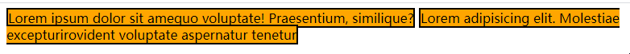

- 块级：display:block，行内：display:inline

**块级元素**：容器元素(div,section,ul li)、h1-h6、p

**行级元素**：文本元素（span,a,img,video,audio)


#### 常规流、浮动、定位的区别

- 只有常规流存在上下外边距（margin）合并的问题，浮动和定位不存在（relative除外，因为relative还是在常规流当中，遵循常规流）
- 常规流**块盒**，宽度默认吸收包含块剩余宽度、浮动流**块盒**和定位**块盒**（relative除外，因为relative还是在常规流当中，遵循常规流），宽度由内容撑开。
- 常规流块盒、浮动块盒、定位块盒的**高度**都由内容撑开。
- 常规流、浮动流元素的包含块为父级的**内容盒**，定位盒的包含块为拥有定位属性的父级的**填充盒**（padding-box），若找不到，则它的包含块为整个网页（初始化（填充）包含块）

### 二、HTML5+CSS3

#### H5新增特性

1. 拖拽释放API
2. 更好的语义化标签（header,nav,footer,aside,section,article...）
3. 音频、视频API(audio,video)
4. 画布（canvas）API
5. 地理（Geolocation）API
6. localStorage和sessionStroage 存储
7. 新的表单控件（calendar【日历】、date【日期】、email【邮箱】、url【地址】、search【搜索】、tel【电话号码】、number【数字】）
8. 新的技术webWorker，webSocket，Geolocation

#### C3新增特性

- 选择器
  - 属性选择器
  - 伪元素选择器
  - 伪类选择器
- 边框
  - border-radius
  - border-shadow
  - border-image
- 背景：background
- 渐变：linear-gradient、radial-gradient
- 文字阴影：text-shadow
- 盒模型
  - 标准盒子
  - IE6混杂模式盒子
  - 弹性盒模型
- 过渡：transition过渡动画
- 自定义动画：animation
- 2D转换：transfrom：translate(x，y) rotate(x，y) skew(x，y) scale(x，y)
- 3D转换

#### 标签语义化(H5)

所谓标签语义化，就是合理，正确的运用标签来展示内容，

语义化的优点：

- 为了在没有CSS的情况下，页面也能呈现出很好地内容结构、代码结构:为了裸奔时好看；
- 有利于SEO，搜索引擎根据 标签来确定上下文和各个关键字的权重
- 方便其他设备解析，如盲人阅读器根据语义渲染网页
- 有利于开发和维护，语义化更具可读性，代码更好维护，与CSS3关系更和谐。

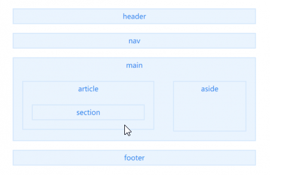


### 二、CSS 

#### CSS可继承属性

- 字体（font）

  - font、font-family、font-weight、font-size、font-style、font-variant(将网页中的小写字母转化成大写)

- 文本（text）

  - text-align、line-height、word-spacing、letter-spacing、text-indent、direction、color

- 列表元素

  - list-style、list-style-type、list-style-position、list-style-image。

  background只所以能看到父级的颜色，不是因为继承，而是自身的默认白色背景色透明度为0，可以穿透看到后面的


####  BFC(Block formatting context)

- BFC是一块独立的渲染区域，它规定了在该区域中，**常规流块盒的布局**

- 常见创建BFC区域的元素有

  - 根元素\<html>
  - 浮动和绝对定位元素（absolute、fixed）
  - overflow除visible属性外

- BFC的渲染规则

  - 创建BFC的元素，它的高度需要计算浮动元素
  - 创建BFC的元素，它的边框盒和不会与浮动元素重叠
  - 创建BFC的元素，不存在和子元素外边距合并的问题

  

#### 单行超出省略

```css
white-space:nowrap	//文字触边不换行【白色空格填充换行的意思】
overflow:hidden		//溢出部分隐藏处理
text-overflow: ellipsis//溢出文本省略处理
```

#### 多行超出省略

```css
display:-webkit-box
-webkit-box-orient:vertical
-webkit-line-clamp:3;
overflow:hidden
```


#### 实现居中的方式有哪些？

- 行盒（行块盒）水平居中，父元素设置text-align
- 行盒（行块盒）垂直居中，当前元素设置line-height等于父元素高度（原理是virtual-area的上下gap一样高）

- 常规流块盒水平居中，固定宽度，左右margin:auto去自动吸收剩余空间

- 定位块盒水平居中：固定宽度，左右偏移设置为0，左右margin设置auto吸收剩余空间

- 定位块盒垂直居中：固定高度，上下偏移设置为0，上下margin设置auto吸收剩余空间

- flex的水平居中justify-content:center

- flex的垂直居中:align-items:cenetr

  

#### Link标签和Script标签加载有何区别？

>  link标签是同时加载(并行)的,先加载完成的优先解析 
>
>  script标签才会加载完一个再加载另一个 

#### link、visity、hover、active

> love and hate(爱与恨)

  

#### CSS选择器权重

```javascript
!important > 内联样式 > id > class=[属性]=伪类 > 标签名称选择器=伪元素 > 通配符
	无限大		 1000   100       10                 1            0
```

#### CSS选择器

- **父子选择器** （div span...）：选中div下面的所有span标签，包括孙子span标签
- **直接子元素选择器**（div > span ）：选中div的所有子span标签，不包括孙子span标签
- **并列选择器**（div.demo...）:表示选中拥有.class类名的div
- **分组选择器**（em, string, span ）：表示分别选中这三个元素

浏览器遍历父子选择器的顺序是**自右向左**（子级开始往父级查找）的，如果是自左向右，会出现一个问题，比如span元素，如果在直接父级找不到，会往孙子级继续查找该元素是否存在，就是会一条路走到黑，而如果目标元素并不在该枝干上，就会重新从其他分支查找，这样就会导致 几乎所有的枝干都给遍历一遍了，非常耗费性能。而自右向左的话，就非常容易，因为标签只有一个父级，如果父级不是，就会从另一个目标元素开始往上查找。

CSS有父子选择器，直接子元素选择器

#### 权重问题（层叠）

> 权重用相加，相同权重取后声明的样式

1. **作者样式表大于浏览器默认样式表**

   1.  作者样式表中的!important
   2.  作者样式表中的普通样式
   3.  浏览器默认样式表中的样式

2. **比较选择器相加权重**

   > 具体规则：通过选择器，计算出一个4位数（xxxx）

   1. 千位：如果是内联样式，记做1，否则记0（1000）
   2. 百位：等于选择器中所有id选择器的数量（x00）
   3. 十位：等于选择器中所有class、属性选择器、伪类选择器(:link)的数量(x0)
   4. 个位：等于选择器中所有元素选择器，伪元素（::before）选择器的数量（x）

3. **书写越靠后的胜出**


#### 响应式和自适应的区别

响应式布局就是内容排版布局随着宽度变化

自适应布局就是网页在不同设备上进等比例缩放


###  三、JS

#### JS中的七大数据类型

五种基本数据类型（Undefined、Null、Boolean、Number 和 String）、

一种复杂数据类型（Object）

一种新的原 始数据类型（Symbol） 

#### JS中为false的情况

- Boolean(0)
- Boolean(null)
- Boolean(undefined)
- Boolean('')
- Boolean(NaN)
- Boolean(false)


#### 函数声明与函数表达式

函数声明

```javascript
function sum(a,b){
    return a+b
}
```

函数表达式

```javascript
var sum = function(a,b){
    return a+b
}
```

 Function构造函数【从技术角度讲，这是一个函数表达式】 

```javascript
var sum = new Function('a','b','return a+b')//不推荐使用，影响函数解析性能
```


#### JS数组中，哪些方法改变原数组，哪些不改变？

> 改变原数组：Push、Pop、Unshift、shift、reverse、splice 、sort（速记：啪啪不是人生）
>
> 不改变原数组：join、slice、concat、
>
> ​							map、filter、some、,every等不改变原数组

#### URL从输入到页面展示的过程

1、用户输入URL后，浏览器会根据URL在本地查找缓存，如果有缓存，直接跳到第5步，如果没有缓存，则解析出主机名

2、浏览器根据主机名查找出IP

​			先查找本地DNS缓存列表，如果有，则进入第4步，如果没有，则向浏览器默认的DNS域名服务器发起请求

​       获取到IP，并缓存在本地DNS

3、解析URL获取端口号

4、拿到ip +端口号，则开始建立起一条链接目标服务器的TCP请求，也就是”三次握手“。

5、浏览器向服务器发送一条HTTP请求报文

6、服务器向浏览器返回一条HTTP响应报文

7、关闭连接 浏览器解析文档

8、如果文档中有资源则重复5、6、7动作，直至资源全部加载完毕

9、 为了避免服务器与客户端双方的资源占用和损耗，当双方没有请求或响应传递时，任意一方都可以发起关闭请求。与创建TCP连接的3次握手类似，关闭TCP连接，需要4次握手。 

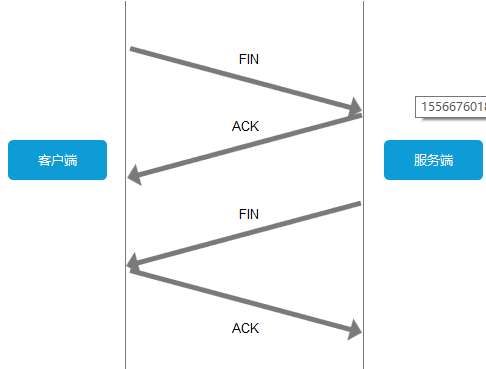


上图可以这么理解：

客户端：“兄弟，我这边没数据要传了，咱关闭连接吧。”

服务端：“收到，我看看我这边有木有数据了。”

服务端：“兄弟，我这边也没数据要传你了，咱可以关闭连接了。”

客户端：“好嘞。”

#### 常见6种Error.name错误信息

1. EvalError: eval( )使用与定义不一致
2. RangeError: 数值越界
3. ReferenceError: 非法或不能识别的引用数值
4. SyntaxError: 发生语法解析 错误
5. TypeError: 操作数类型错误
6. URLError: url处理函数使用不当

#### 判断数据类型

```javascript
//分两类，一种原始值，一种引用值，还有null的情况，用typeof判断原始值和引用值，用原型toString方法判断引用值类型（包装类，对象，数组）
function type(target){
    let template = {
        "[object Array]" : "array",
        "[object Object]" : "object",
        "[object Number]" : "number-object",
        "[object String]" : "string-object",
        "[object Boolean]" : "boolean-object"      
    }
    if(target === null){
       	return 'null';
    }
    //引用值类型有三种情况，包装类、数组，对象
    if(typeof target === 'object'){
    	const str = Object.prototype.toString.call(target);
        return template[str];
    }else{
        return typeof target;
    }
}

type(2)

```


####  this指向总结

> 1. 函数是否在new中调用(new绑定)，如果是，那么this绑定的是新创建的对象。
> 2. 函数是否通过call,apply调用，或者使用了bind(即硬绑定)，如果是，那么this绑定的就是指定的对象。
> 3. 函数是否在某个上下文对象中调用(隐式绑定)，如果是的话，this绑定的是那个上下文对象。一般是obj.foo()
> 4. 如果以上都不是，那么使用默认绑定。如果在严格模式下，则绑定到undefined，否则绑定到全局对象。
> 5. 如果把Null或者undefined作为this的绑定对象传入call、apply或者bind，这些值在调用时会被忽略，实际应用的是默认绑定规则。
> 6. 如果是箭头函数，箭头函数的this继承的是外层代码块的this。


#### call、apply、bind的区别

>  从本质上来讲、它们的作用都能动态的改变this的上下文（指向），差别在于
>
> 1. call和apply改变了函数的this上下文后便**执行**该函数，而bind则是返回改变了上下文后的一个函数，该函数需要被调用才会执行。
> 2. call和apply的差别仅体现在传参列表的不同， call从第二个参数开始以参数列表的形式展现，apply则是把除了改变上下文对象的参数放在一个数组里面作为它的第二个参数。 

```javascript
//call
fn.call(obj,arg1,arg2,arg3);
//apply
fn.apply(obj,[arg1,arg2,arg3])
```

##### 应用：求最大值最小值

```javascript
var arr = [34,5,3,6,54,6,-67,5,7,6,-8,687];

Math.max.apply(Math, arr);
Math.max.call(Math, 34,5,3,6,54,6,-67,5,7,6,-8,687);

Math.min.apply(Math, arr);
Math.min.call(Math, 34,5,3,6,54,6,-67,5,7,6,-8,687);

```


#### 箭头函数

> 1. 在箭头函数中，其实并不存在this、arguments、new.target，如果使用了，则使用的是普通函数外层对应的this、arguments、new.Target,如果外层也没有（还是箭头函数），则会一直向上查找、最终会找到顶层的window，因为在非严格模式下this默认绑定到window。
> 2. 箭头函数没有原型（因此箭头函数占用内存空间非常少）
> 3. 箭头函数不能用作构造函数使用（因为没有原型，自然没有原型链）

```javascript
const func = ()=>{
    console.log(this);	//window
    console.log(arguments); //Uncaught ReferenceError:arguments is not defined
}

```


#### new的作用及实现

> **new 运算符**创建一个用户定义的对象类型的实例或具有构造函数的内置对象的实例。 ——（来自于MDN）  

```javascript
function MyNew(){
	//1、获得构造函数，同时删除arguments中第一个参数
    Con = [].shift.call(arguments); //调用数组的shift,删除第一个，并返回被删除的参数给Con接收
    //2、创建一个空的对象并链接到原型，obj继承构造函数原型中的属性
    var obj = Object.create(Con.prototype);
	//3、绑定this实现继承(将构造函数的this指向obj)，obj可以访问到构造函数中的属性
    var ret = Con.apply(obj,arguments); //ret是调用构造函数Con时return回来的结果,一般返回的是undefined
    //4、优先返回构造函数返回的对象
    return ret instanceof Object ? ret : obj
}

function Person(name,age){
    this.name = name;
    this.age = age
}
var person = MyNew(Person,'huang',18) 
console.log(person);
```

过程：首先获取构造函数，然后创建一个对象，并将该对象的\__proto\_\_指向到该构造函数的原型， 调用该构造函数，将构造函数的this指向obj，将arguments作为剩余参数传入，得到返回的值，判断该返回的值是不是一个对象，如果是对象则返回这个对象，不然返回新创建的 `obj`对象 。

```txt
obj(null) --->{}  
--->  
{
    __proto__:Con.prototype
}

--->
{
    person.name = 'huang'
    person.age = 18
    __proto__:Con.prototype
}
```


####  如何实现一个深度拷贝


#### 数组去重

##### 方法一：对象属性名唯一

```javascript

Array.prototype.unique = function(){
    let temp = {},
    	arr = [],
        len = this.length
        
    for(let i = 0; i < len; i++){
        if(!temp[this[i]]){
        //如果该属性对应的值不存在，或者说是undefined
            temp[this[i]] = 'huang';
        	//将值push进一个新数组里
            arr.push(this[i]);
        }
    }
    return arr
}

const arr1 = [1,2,3,4,12,11,2,1,1,1]
const result = Array.prototype.unique.call(arr1)
console.log(result);
```

##### 方法二：Set

```javascript
const arr1 = [1,2,3,4,12,11,2,1,1,1] 
const res = new Set(arr1);
console.log(res);
```


#### 节流防抖

1、防抖

>  触发高频事件后n秒内函数只会执行一次，如果n秒内高频事件再次被触发，则重新计算时间 

2、节流

>  高频事件触发，但在n秒内只会执行一次，所以节流会稀释函数的执行频率 

#### 求一个数组中出现次数最多的字符串

```javascript
//思路：根据对象属性名判断
//情况一：a字符串最多，
//情况二：a和b字符串一样多，两个一起返回
function maxCountElement(arr) {
    let obj = {};
    for (let i = 0; i < arr.length; i++) {
        let key = arr[i];
        if (obj[key]) {
            obj[key]++;
        } else {
            obj[key] = 1;
        }
    }

    let maxCount = 0;
    let maxElement = arr[0];
    let repeatElement = [];
    for (let key in obj) {
        if (obj[key] > maxCount) {
            maxCount = obj[key];
            maxElement = key;
            repeatElement.length = 0;
        } else if (maxCount === obj[key]) {
            repeatElement.push(key);
        }
    }
    if (repeatElement.length) {//当eq数组多于一个->也就是出现了同样重复次数的项
        for (let j = 0; j < repeatElement.length; j++) {
            maxElement += '，' + repeatElement[j];
        }
    }
    return "该数组中出现次数最多的元素:" + maxElement + "-出现次数为:" + maxCount + "次";
}

let arr = [1, 2, 2, 3, 3 ,3, 3, 4, 5, 6];

let res = maxCountElement(arr);

console.log(res);
```


#### 函数柯里化

 函数柯里化又叫部分求值，维基百科中对柯里化 (Currying) 的定义为： 

>  在数学和计算机科学中，柯里化是一种将使用多个参数的函数转换成一系列使用一个参数的函数，并且返回接受余下的参数而且返回结果的新函数的技术。  

##### 一、柯里化实现

```javascript
//柯里化，判断传入的参数个数是否与执行该函数所需要的参数个数一致
/**
* @param {*} fn 需要固定参数的函数
* @param {*} length 该函数期待的参数个数
**/
function Curry(fn,length){
    var length = length || fn.length;
    return function(){						//代号：标记函数
        //判断传入的参数个与所需的参数个数对比
        if(arguments.length < length){
           	//[fn,xx,xx] 将需要固定参数的函数与调用函数传递的参数放入到一个数组中
            var combined = [fn].concat([].slice.call(arguments,0))
            //相当于 return Curry(FixedParmasCurry(fn,1))
            return Curry(FixedParmasCurry.apply(this,combined),length - arguments.length)
         }else{
             return fn.apply(this,arguments);	//这里的fn是执行函数，arguments是最后一次传的值
         }
    }
}
//固定参数
function FixedParmasCurry(fn){
    //调用数组slice方法，将slice方法的this指向arguments,从第一位开始切割，将剩余参数形成的数组返回。
    var _arg = [].slice.call(arguments,1); 
    return function(){						//代号：执行函数
        //将第一次调用函数的数组与第二次调用该函数传递的数组合并（需要先将第二次的类数组转换成数组）
        var newArg = _arg.concat([].slice.call(arguments,0))//将每次的参数保存在newArg
        return fn.apply(this,newArg); //在这个阶段才一直调用了执行函数，这里的fn是add
    }
}

function add(a,b,c,d){
    return a+b+c+d;
}
var newAdd = Curry(add);//调用Curry得到标记函数newAdd
const a = newAdd(1);    //调用标记函数newAdd    

console.log(a);//得到标记函数a          curry(FixedParamsCurry(fn,1)【执行函数】,3)【标记函数a】
const b = a(2);//调用标记函数a			

console.log(b);//得到标记函数b          curry(FixedParamsCurry(fn,2)【执行函数】,2)【标记函数b】
const c = b(3);//调用标记函数b

console.log(c);//得到标记函数C          curry(FixedParamsCurry(fn,3)【执行函数】,1)【标记函数c】
const d = c(4);//调用标记函数C

console.log(d);//得到标记函数d          执行执行函数
```

上面的代码理解妻俩就是「用闭包把传入参数保存起来，当传入参数的数量足够执行函数时，就开始执行函数」。上面的 currying 函数是一种简化写法，判断传入的参数长度是否为 0，若为 0 执行函数，否则收集参数。 


##### 二、柯里化实现（二）

```javascript
function currying(fn, length) {
  length = length || fn.length; 	// 注释 1
  return function (...args) {			// 注释 2
    return args.length >= length	// 注释 3
    	? fn.apply(this, args)			// 注释 4
      : currying(fn.bind(this, ...args), length - args.length) // 注释 5
  }
}

// Test
const fn = currying(function(a, b, c) {
    console.log([a, b, c]);
});

fn("a", "b", "c") // ["a", "b", "c"]
fn("a", "b")("c") // ["a", "b", "c"]//function(a,b,undefined){...}// --->function(a,b,c){...}可以看到，参数在满满筹集，等参数个数够了后调用该参数
fn("a")("b")("c") // ["a", "b", "c"]
fn("a")("b", "c") // ["a", "b", "c"]
```

- 注释 1：第一次调用获取函数 fn 参数的长度，后续调用获取 fn 剩余参数的长度
- 注释 2：currying 包裹之后返回一个新函数，接收参数为 `...args`
- 注释 3：新函数接收的参数长度是否大于等于 fn 剩余参数需要接收的长度
- 注释 4：满足要求，执行 fn 函数，传入新函数的参数
- 注释 5：不满足要求，递归 currying 函数，新的 fn 为 `bind` 返回的新函数（`bind` 绑定了 `...args` 参数，未执行），新的 length 为 fn 剩余参数的长度


#### 闭包


#### 作用域链


#### 执行期上下文


```javascript
function ajax(methods,url,callback,data,flag){
    var xhr = null;
    if(window.XMLHttpRequest){
       xhr = new XMLHttpRequest();
    }else{
        xhr = new ActiveXObject("Microsoft.XMLHTTP");
         
    }
    xhr.onreadystatechange = function(){
        if(xhr.readyState === 4){
            //xhr.responseText表示获取服务器响应的消息体文本
        	callback(xhr.responseText);    
        }
    }
    methods = methods.toUpperCase();
    if(methods === "GET"){
       xhr.open(methods,url+"?"+data,flag);
       xhr.send(null);
    }else if(methods === "POST"){
        xhr.open(methods,url,flag);
        xhr.setRequestHeader("Content-type","application/x-www-form-urlencoded")
        xhr.send(data)
    }
    
}
ajax("POST","http://yuanjin.tech:5100/api/local",test, null,true)

function test(value){
    console.log(value);
}
```


#### ajax 函数封装

```javascript
/**
 * 
 * @param {*} method 请求的方法  get/post/put....
 * @param {*} url  请求的地址
 * @param {*} callback 请求成功返回的回调函数
 * @param {*} data 发送的数据
 * @param {*} flag 是否异步 默认为true
 */
function ajax(method,url,callback,data,flag){
    // xhr 是 XMLHttpRequest的缩写，https://www.w3school.com.cn/xmldom/dom_http.asp
    var xhr = null;
    // 判断浏览器是否存在该方法XMLHttpRequest，该方法用于发送网络请求
    if(window.XMLHttpRequest){
        xhr = new XMLHttpRequest;	//创建发送请求的对象
    }else{
        xhr = new ActiveXObject("Microsoft.XMLHTTP");
    }
    /*监听连接服务器readyState属性的状态的变化 
    0-刚刚创建好里请求对象，但还未配置请求。 
    1-open() 方法已调用，但是 send() 方法未调用。请求还没有被发送。
    2-Send() 方法已调用，HTTP 请求已发送到 Web 服务器。未接收到响应。 
    3-所有响应头部都已经接收到。响应体开始接收但未完成。
    4- HTTP 响应已经完全接收。
    
    */
    //当请求状态（0，1，2，3，4）发送改变时运行的函数
    xhr.onreadystatechange = function(){
        if(xhr.readyState == 4 && xhr.status == 4){
            //xhr.responseText表示获取服务器响应的消息体文本
            callback(xhr.responseText);
            console.log('ok');
        }else{
            console.log('error');
        }
    }

    method = method.toUpperCase();
    if(method == 'GET'){
        //xhr.open(请求方式，请求地址?参数，是否异步),参数放在请求头
        xhr.open(method,url + '?' + data,flag);
        xhr.send();
    }else if(method = 'POST'){
        // xhr.open(请求方式，请求地址，是否异步);
        xhr.open(method,url,flag);
        // 设置请求头：告诉服务器我要传输何种类型的数据给它
        xhr.setRequestHeader('Content-type','application/x-www-form-urlencoded');
        
        xhr.send(data);//构建请求体，发送到服务器
    }
}
```

##### ajax为什么是无刷新

因为ajax是异步的，当js代码执行的时候，遇到异步代码，会放到网络线程当中去执行，然后把回调函数放入事件队列的宏队列中，等到主线程的同步任务执行完了之后再读取事件队列中的回调函数，进入主线程执行。

#### Promise

> promise出现的背景原因：
>
> 第一个是：JS对于异步任务没有统一的标准(规范)，每个人编写的异步函数代码不同，因此会导致需要传递的参数不清楚，不清楚回调函数是第几位参数，常常需要查各种库官方文档
>
> 二：容易陷入回调地狱（ 某个异步操作需要等待之前的异步操作完成，无论用回调还是事件，都会陷入不断的嵌套 ）

因此，在ES6的Promise出现之前，为了避免代码标准各写个的，开发者们默认用node回调模式作为约定

node回调模式

1. 所有回调函数不能作为属性出现
2. 所有回调函数必须作为函数的最后的参数
3. 所有回调函数必须有两个参数，第一个参数表示错误，第二个参数表示结果

`node(参数1,参数2...,function(err,callback){}`


### 四、网络

#### HTTP缓存

> https://juejin.im/post/5e2d7d3a6fb9a02fec665157
>
> 缓存分为强缓存和协商缓存。
>
> 缓存的作用是可以减少网络传输，加快资源获取速度，提升用户体验，缓解服务端的压力，强缓存和协商缓存也是属于`Disk Cache`, 它们最终都存储在硬盘里.

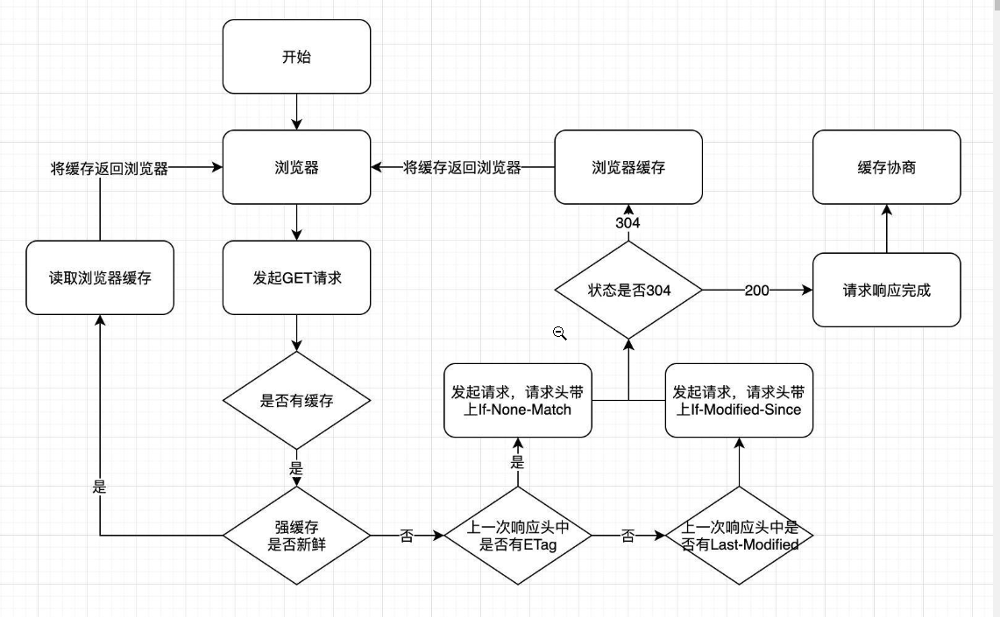

##### 缓存类型

###### 强缓存

- 由Expires、Cache-control、pragma、3个Header共同来控制，优先级由低到高。

  - `Expires`产于`HTTP/1.0`, `Cache-control`产于`HTTP/1.1`;

  - `Expires`设置的是一个具体的时间, `Cache-control` 可以设置具体时常还有其它的属性；

  - 两者同时存在, `Cache-control`的优先级更高;

  - 在不支持`HTTP/1.1`的环境下, `Expires`就会发挥作用, 所以现阶段的存在是为了做一些兼容的处理.

    

- 强缓存不需要发送HTTP请求，而协商缓存需要

- HTTP请求之前, 浏览器会先检查一下强缓存, 如果命中直接使用，否则就进入下一步。

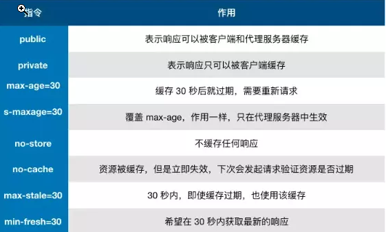

###### 协商缓存

> 协商缓存概括来说就是浏览器会携带缓存标识(tag)向服务器发送请求, 服务器会根据缓存标识(tag)来决定是否使用缓存。
>
> 协商缓存一定向服务器发送请求，但拿不拿回资源得根据缓存标识是否发生变化来决定了
>
> 缓存标识实际分为两种，`Last-Modified`和 **`ETag`**


**Last-Modified（上次修改时间） 和 If-Modified-Since（从何时更改）**

> 从字面意思上我们可以看出, `Last-Modified`表示的是资源的最后修改时间, 因此其中一种协商缓存判断的就是最后修改时间.

使用`Last-Modified`进行协商缓存会经过以下几步:

1. 浏览器第一次向服务器请求这个资源
2. 服务器在返回这个资源的时候, 在`response header`中添加`Last-Modified`的`header`, 值为该资源在服务器上最后的修改时间
3. 浏览器接收到后缓存文件和这个`header`
4. 当下次浏览器再次请求这个资源的时候,  检测到有`Last-Modified`这个`header`, 就会在请求头中添加`If-Modified-Since`这个`header`, 该值就是`Last-Modified`
5. 服务器再次接收到该资源的请求, 则根据`If-Modified-Since`与服务器中的这个资源的最后修改时间做对比
6. 对比结果相同则返回`304`（资源未修改）和一个空的响应体, 告诉浏览器从自己(浏览器)的缓存中拿
7. 对比结果不同(`If-Modified-Since` < 服务器资源最后修改时间), 则表示资源被修改了, 则返回200和最新的资源文件(当然还包括最新的`Last-Modefied`)

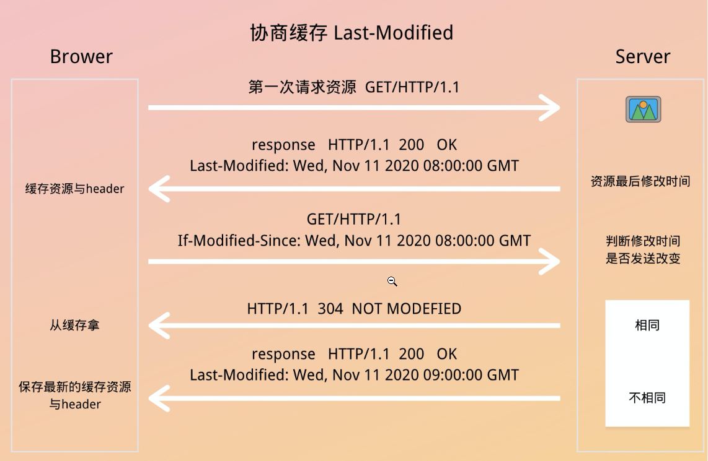


**ETag 与 If-None-Match**（假如不匹配）

> `ETag`其实与`Last-Modefied`的原理差不多, 不过它不是根据资源的最后修改时间来判断的, 而是通过一个唯一的标识😊.

在浏览器请求服务器资源的时候, 服务器会根据当前文件的内容, 给文件生成一个唯一的标识, **若是文件发生了改变, 则这个标识就会改变.**

服务器会将这个标识`ETag`放到响应体的`header`中与请求的资源一起返回给浏览器, 而浏览器同样也会缓存文件与这个`header`.

在下一次再次加载该资源时, 浏览器会将刚刚缓存的`ETag`放到请求体头部(request header)的`If-None-Match`里发送给服务器.

同样的服务器接收到了之后与该资源自身的`ETag`做对比, 如果一致, 则表示该资源未发生改变, 则直接返回304知会客户端直接使用本地缓存即可. 若是不一致, 则返回200和最新的资源文件(当然还包括最新的`ETag`)

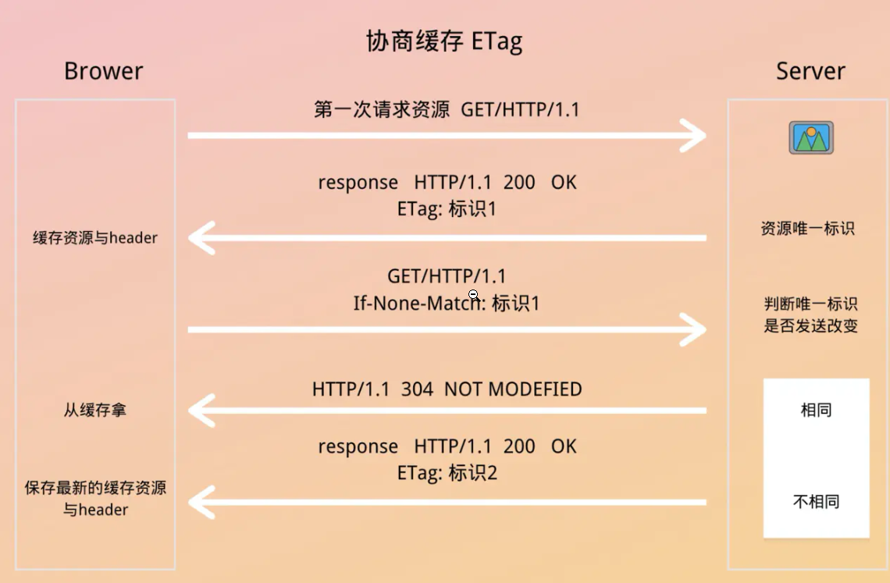


##### 缓存存放位置

> 优先级由高到低

- Service worker

- Memory Cache(内存缓存)

  - 存储在内存中的缓存，读取效率快，但缓存持续时间短。会随着进程的释放而释放(一旦关闭`Tab`页面, 就被释放了, 还有可能在没关闭之前, 排在前面的缓存就失效了, 例如一个页面的缓存占用了超级多的内存)
  - 几乎所有的请求资源都能进入`memory Cache`, 细分来说主要分为`preloader`和`preload`这两块.
    - `preloader`：在浏览器打开一个网页的时候,能够一边解析执行js/css, 一边去请求下一个资源,
    - preload：显式指定预加载的资源, 这些资源也会被放进`memory Cache`中, 例如`<link rel="preload">`
  - 在从`memory Cache`读取缓存时, 浏览器会忽视`Cache-Control`中的一些`max-age、no-cache`等头部配置, 除非设置了`no-store`这个头部配置.

- Disk Cache(磁盘缓存)

  > 也叫HTTP Cache，是存储在硬盘上的缓存，是持久存储的。
  >
  > 前面提到的强缓存和协商缓存也是属于`Disk Cache`, 它们最终都存储在硬盘里。
  >
  > 比内存缓存慢，但比网络请求块

- Push Cache(推送缓存)

##### 缓存过程分析

> 从浏览器发起HTTP请求到获取到请求结果，可以分为以下几个过程

1. 浏览器第一次发起`HTTP`请求，在浏览器缓存中没有发现请求的缓存结果和缓存标记
2. 于是向服务器发起`HTTP`请求，获得该请求的结果还有缓存规则，也就是 `Last-modified`或者`Etag`
3. 浏览器把响应内容放入`Disk Cache`，把响应内容的引用存入`Memory Cache`
4. 把响应内容存入`Service Worker`的`Cache Storage`(如果`Service Worker`的脚本调用了Cache.put())

下一次请求相同资源的时候：

1. 调用`Service Worker`的`Fetch`事件响应
2. 查看`Memory Cache`
3. 查看`disk Cache`,这里细分为：
   - 有强缓存且未失效，则使用强缓存，不请求服务器，返回的状态码是200
   - 有强缓存但已失效，使用协商缓存判断，是返回304还是200（读取缓存还是重新获取）

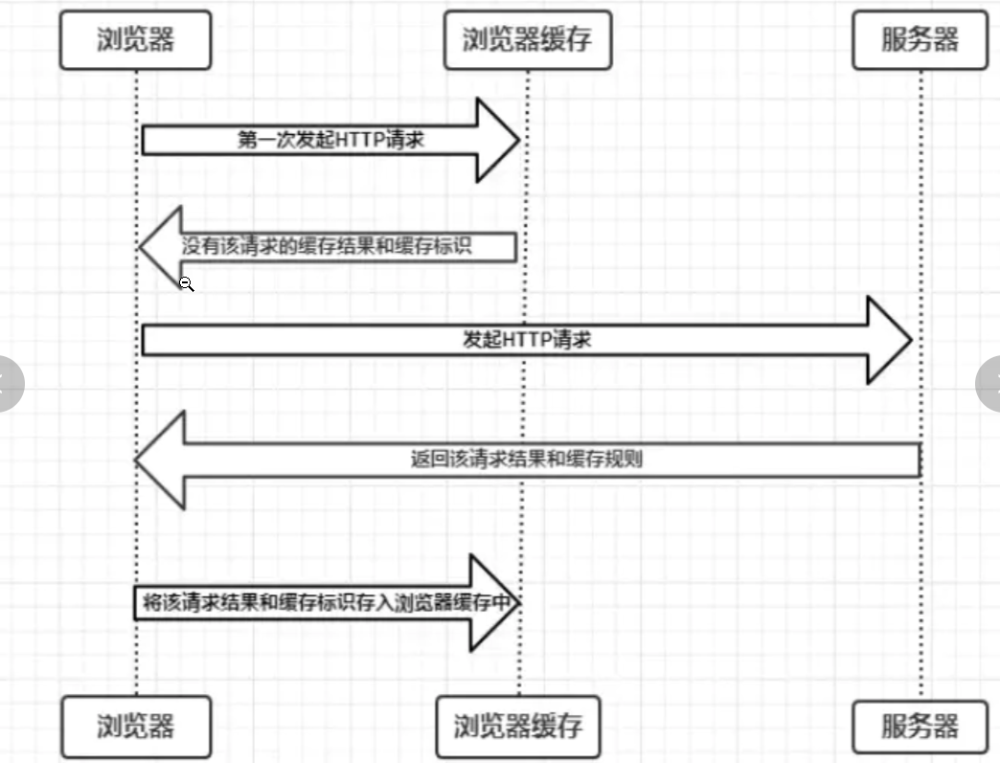

##### 缓存策略的实际场景应用

**不常变化的资源**

```
Cache-Control: max-age=31536000
```

通常是给`Cache-Control`设置成一个很大的值, (31536000, 一年). 这个也很好理解, 不常变化的资源, 直接让它使用强缓存就是了.这样也不用请求服务端了

但是有时候为了解决更新的问题, 我们需要在文件名中添加上`hash`, 版本号等动态字段, 这样就达到了更改引用`URL` 的目的.


**常变化的资源**

```
Cache-Control: no-cache	//不使用强缓存，使用协商缓存
```

设置成以上配置, 使得浏览器每次都请求服务器, 然后配合`ETag`或者`Last-Modified`来验证资源是否有效.


##### 总结：

- 缓存的作用是减少网络请求，加快资源获取速度，提升用户体验，缓解服务端的压力。
- 缓存类型分为强缓存和协商缓存，都属于`Disk Cache`, 它们最终都存储在硬盘里。
  - 强缓存优先级高于协商缓存
  - 强缓存不需要发送HTTP请求，缓存是否新鲜由Expires、Cache-control控制。
  - 协商缓存一定向服务器请求，是否缓存由服务端决定(服务端会根据缓存标识是否变化来决定)。缓存标识有etag和Last-Modified两种，且etag优先级大于Last-Modified

- 缓存存放位置有 Service Worker > Memory Cache > Disk Cache > Push Cache
- 缓存过程分析：
- 如果什么缓存策略都没设置，浏览器会采用一个启发式的算法，通常会取响应头的响应Data 减去 Last-Modified(该文件的最近修改时间)的10%时间作为缓存时间。


#### SEO

> 中文名搜索引擎优化：是一种通过了解搜索引擎的运作规则（如何抓取网站页面，如何索引以及如何根据特定的关键字展现搜索结果排序等）来调整网站，以提高该网站在搜索引擎中某些关键词的搜索结果排名。


#### 状态码

- 1xx:	(临时响应)

  > 表示临时响应并需要请求者执行操作才能继续的状态[代](https://baike.baidu.com/item/代/2626169)码。 

- 2xx: 	(成功)

  > 表示服务器已成功处理了请求的状态代码。 

- 3xx:  （已重定向）

  > 要完成请求，您需要进一步进行操作。 

- 4xx:	(请求错误)

  > 请求可能出错，已妨碍了服务器对请求的处理。，请求可能包含错误语法

- 5xx:	 (服务器错误)

  > 服务器在尝试处理请求时发生内部错误。这些错误可能是服务器本身的错误，而不是请求出错。 


#### web性能优化有哪些

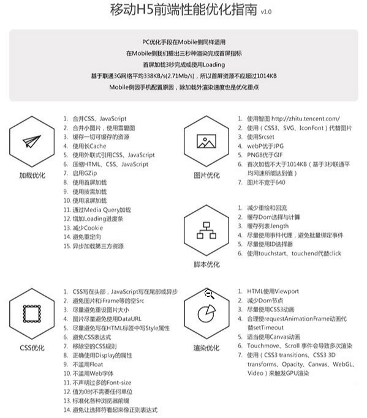

1. 减少网络请求

   1. 比如将多张图片合并成单张图片，通过css来控制什么地方某块图片的显示位置
   2. 避免重定向，因为重定向会导致浏览器会向location所指向的地址重新发送一次请求。

2. 使用浏览器缓存

   1. 不常变化的资源可以设置cache-control，并设定一个很大的值，比如一些CSS文件，javaScript，logo等等
   2. 经常变化的值可以设置协商缓存`cache-contorl:no-cache使得浏览器每次都请求服务器, 然后配合`ETag`或者`Last-Modified`来验证资源是否有效.

3. 对文件进行压缩

   1. 通过webpack对文件进行压缩，移除一些不必要的注释，减少代码体积

4. 使用CDN来加速JS文件的加载

5. 如果JS文件没有操作DOM的相关代码，可以将该脚本设为异步加载，通过asynce或defer来标记代码

6. 对于大的CSS文件，可以通过媒体查询属性，将其拆分为多个不同用途的CSS文件，这样只有在特定的场景下才会加载特点的CSS文件

   ```html
   <script async type="text/javascript" src='foo.js'></script>
   <script defer type="text/javascript" src='foo.js'></script>
   ```

   async 和 defer 虽然都是异步的，不过还有一些差异，使用 async 标志的脚本文件一旦加载完成，会立即执行；而使用了 defer 标记的脚本文件，需要在 DOMContentLoaded 事件之前执行。

#### 什么是前后端分离

前后端分离是一种开发模式，就是前端开发的时候不需要考虑后端是如何实现的，后端也不需要考虑前端是如何设计的，前端只需要根据预设的接口规范（restFul）去拿取数据并渲染到页面，后端只负责根据接口规范提供接口。

##### 为什么要用前后端分离模式

因为传统的Web前后端开发大多数前端将页面写好，然后丢给后端，让后端把页面集成到项目中去，这里就存在一个前后端耦合的问题，对于后端来说，不仅要写后端逻辑，还得集成前端页面，而对于前端来说，也不是很轻松就能看到页面真正渲染出来的样子，也不利于开发调试。


#### spa页面的优缺点

优点：spa（单页面应用）
1、用户体验好、快，内容的改变不需要重新加载整个页面，避免了不必要的跳转和重复渲染。
2、基于上面一点，SPA相对对服务器压力小。
缺点：

1. 初次加载页面更耗时 
2. seo 不利于搜索引擎优化 
   1. 因为单页面的情况下，页面的很大内容都是根据匹配到的路由动态生成展示的，且很大页面的内容是根据ajax异步请求获取的，而爬虫并不会等待异步请求后再抓取页面内容，他们只是更擅长于对静态资源的抓取和分析。
3. 前进、后退、地址栏等，需要程序进行管理；
4. 书签，需要程序来提供支持；

#### 渲染模式

- 服务端渲染：

  ​		先向后端服务器请求数据，然后生成完整首屏html返回给浏览器；浏览器只需要解析HTML即可。

- 客户端渲染

  ​		等js代码下载、加载、解析完成后再请求数据渲染，等待的过程页面是什么都没有的，就是用户看到的白屏。

- 同构渲染

  

#### Cookie与session的区别

- **安全性：** Session 比 Cookie 安全，Session 是存储在服务器端的，Cookie 是存储在客户端的。
- **存取值的类型不同**：Cookie 只支持存字符串数据，想要设置其他类型的数据，需要将其转换成字符串，Session 可以存任意数据类型。
- **有效期不同：** Cookie 可设置为长时间保持，比如我们经常使用的默认登录功能，Session 一般失效时间较短，客户端关闭（默认情况下）或者 Session 超时都会失效。
- **存储大小不同：** 单个 Cookie 保存的数据不能超过 4K，Session 可存储数据远高于 Cookie，但是当访问量过多，会占用过多的服务器资源。


#### XSS和SCRF

##### 什么是XSS?

参考链接： https://juejin.im/post/5bad9140e51d450e935c6d64#heading-1 

> Cross-Site Scripting（跨站脚本攻击）简称 XSS，是一种代码注入攻击。攻击者通过在目标网站上注入恶意脚本，使之在用户的浏览器上运行。利用这些恶意脚本，攻击者可获取用户的敏感信息如 Cookie、SessionID 等，进而危害数据安全, 为了和 CSS 区分，这里把攻击的第一个字母改成了 X，于是叫做 XSS。 

##### XSS分类

 根据攻击的来源，XSS 攻击可分为存储型、反射型和 DOM 型三种。 

###### 存储形XSS

存储型 XSS 的攻击步骤：

1. 攻击者将恶意代码提交到目标网站的数据库中。
2. 用户打开目标网站时，网站服务端将恶意代码从数据库取出，拼接在 HTML 中返回给浏览器。
3. 用户浏览器接收到响应后解析执行，混在其中的恶意代码也被执行。
4. 恶意代码窃取用户数据并发送到攻击者的网站，或者冒充用户的行为，调用目标网站接口执行攻击者指定的操作。

这种攻击常见于带有用户保存数据的网站功能，如论坛发帖、商品评论、用户私信等

###### 反射型XSS

反射型 XSS 的攻击步骤：

1. 攻击者构造出特殊的 URL，其中包含恶意代码。
2. 用户打开带有恶意代码的 URL 时，网站服务端将恶意代码从 URL 中取出，拼接在 HTML 中返回给浏览器。
3. 用户浏览器接收到响应后解析执行，混在其中的恶意代码也被执行。
4. 恶意代码窃取用户数据并发送到攻击者的网站，或者冒充用户的行为，调用目标网站接口执行攻击者指定的操作。

反射型 XSS 跟存储型 XSS 的区别是：存储型 XSS 的恶意代码存在数据库里，反射型 XSS 的恶意代码存在 URL 里。

反射型 XSS 漏洞常见于通过 URL 传递参数的功能，如网站搜索、跳转等。

**由于需要用户主动打开恶意的 URL 才能生效**，攻击者往往会结合多种手段诱导用户点击。

POST 的内容也可以触发反射型 XSS，只不过其触发条件比较苛刻（需要构造表单提交页面，并引导用户点击），所以非常少见。

###### DOM型XSS

DOM 型 XSS 的攻击步骤：

1. 攻击者构造出特殊的 URL，其中包含恶意代码。
2. 用户打开带有恶意代码的 URL。
3. 用户浏览器接收到响应后解析执行，前端 JavaScript 取出 URL 中的恶意代码并执行。
4. 恶意代码窃取用户数据并发送到攻击者的网站，或者冒充用户的行为，调用目标网站接口执行攻击者指定的操作。

**DOM 型 XSS 跟前两种 XSS 的区别：DOM 型 XSS 攻击中，取出和执行恶意代码由浏览器端完成，属于前端 JavaScript 自身的安全漏洞，而其他两种 XSS 都属于服务端的安全漏洞。**


##### XSS攻击的预防


##### 什么是CSRF?

参考链接： https://juejin.im/post/5bc009996fb9a05d0a055192 

> CSRF（Cross-site request forgery）跨站请求伪造：攻击者诱导受害者进入第三方网站，在第三方网站中，向被攻击网站发送跨站请求。利用受害者在被攻击网站已经获取的注册凭证，绕过后台的用户验证，达到冒充用户对被攻击的网站执行某项操作的目的。

一个典型的CSRF攻击有着如下的流程：

- [受害者登录a.com](http://xn--a-f38al5vkzdt61bv7l.com)，并保留了登录凭证（Cookie）。

- [攻击者引诱受害者访问了b.com](http://xn--b-nv6ao4io8bp6po6e00mu47cda4311avpa330h.com)。

- [b.com](http://b.com) 向 [a.com](http://a.com) 发送了一个请求：[a.com/act=xx。浏览器会…](http://a.com/act=xx。浏览器会默认携带a.com的Cookie。)

- a.com接收到请求后，对请求进行验证，并确认是受害者的凭证，误以为是受害者自己发送的请求。

- a.com以受害者的名义执行了act=xx。

- 攻击完成，攻击者在受害者不知情的情况下，冒充受害者，让a.com执行了自己定义的操作。

  

##### 常见CSRF攻击类型

###### GET类型的CSRF

GET类的CSRF利用非常简单，只需要一个HTTP请求，一般会这样利用：

```javascript

```

在受害者访问含有这个img的页面后， 浏览器会自动向`http://bank.example/withdraw?account=xiaoming&amount=10000&for=hacker`发出一次HTTP请求。 bank.example就会受到包含受害者登录信息的一个跨域请求。


###### POST类型的SCRF

这种类型的CSRF利用起来通常适用的是一个自动提交的表单，如：

```javascript
<form action="http://bank.example/withdraw" method=POST>
	<input type="hidden" name="account" value="xiaoming"/>
    <input type="hidden" name="amount" value="10000"/>
    <input type="hidden" name="for" value="hacker"/>
</form>
<script>document.forms[0].submit;</script>
```

访问该页面后，表单会自动提交，相当于模拟用户完成了一次post操作

 POST类型的攻击通常比GET要求更加严格一点，但仍并不复杂。任何个人网站、博客，被黑客上传页面的网站都有可能是发起攻击的来源，后端接口不能将安全寄托在仅允许POST上面。 


###### 链接类型的CSRF

 链接类型的CSRF并不常见，比起其他两种用户打开页面就中招的情况，这种需要用户点击链接才会触发。这种类型通常是在论坛中发布的图片中嵌入恶意链接，或者以广告的形式诱导用户中招，攻击者通常会以比较夸张的词语诱骗用户点击，例如： 

```javascript
  <a href="http://test.com/csrf/withdraw.php?amount=1000&for=hacker" taget="_blank">
  重磅消息！！
  <a/>
```

由于之前用户登录了信任的网站A，并且保存登录状态，只要用户主动访问上面的这个PHP页面，则表示攻击成功。

##### CSRF的特点

* 攻击一般发起在第三方网站，而不是被攻击的网站，被攻击的网站无法防止攻击发生
* 攻击利用受害者在被攻击网站的登录凭证，冒充受害者提交操作，而不是直接窃取数据
* 整个过程攻击者并不能获取到受害者的登录凭证，仅仅是冒用
* 跨站请求可以用各种方式：图片URL、超链接、CORS、Form提交等到。部分请求方式可以直接嵌入第三方论坛，文章中，难以进行追踪。

 CSRF通常是跨域的，因为外域通常更容易被攻击者掌控。但是如果本域下有容易被利用的功能，比如可以发图和链接的论坛和评论区，攻击可以直接在本域下进行，而且这种攻击更加危险。 （绕过同源策略）

##### CSRF防护策略

上文中讲了CSRF的两个特点：

- CSRF（通常）发生在第三方域名。
- CSRF攻击者不能获取到Cookie等信息，只是使用。

针对这两点，我们可以专门制定防护策略，如下：

- 阻止不明外域的访问 
  - 同源检测
  - Samesite Cookie
- 提交时要求附加本域才能获取的信息 
  - CSRF Token
  - 双重Cookie验证

以下我们对各种防护方法做详细说明：

###### 同源检测

既然CSRF大多来自第三方网站，那么我们就直接禁止外域（或者不受信任的域名）对我们发起请求。

那么问题来了，我们如何判断请求是否来自外域呢？

在HTTP协议中，每一个异步请求都会携带两个Header，用于标记来源域名：

- Origin Header
- Referer Header

这两个Header在浏览器发起请求时，大多数情况会自动带上，并且不能由前端自定义内容。 服务器可以通过解析这两个Header中的域名，确定请求的来源域。

**使用Origin Header确定来源域名**

在部分与CSRF有关的请求中，请求的Header中会携带Origin字段。字段内包含请求的域名（不包含path及query）。

如果Origin存在，那么直接使用Origin中的字段确认来源域名就可以。

但是Origin在以下两种情况下并不存在：

- **IE11同源策略：** IE 11 不会在跨站CORS请求上添加Origin标头，Referer头将仍然是唯一的标识。最根本原因是因为IE 11对同源的定义和其他浏览器有不同，有两个主要的区别，可以参考[MDN Same-origin_policy#IE_Exceptions](https://developer.mozilla.org/en-US/docs/Web/Security/Same-origin_policy#IE_Exceptions)
- **302重定向：** 在302重定向之后Origin不包含在重定向的请求中，因为Origin可能会被认为是其他来源的敏感信息。对于302重定向的情况来说都是定向到新的服务器上的URL，因此浏览器不想将Origin泄漏到新的服务器上。

**使用Referer Header确定来源域名**

根据HTTP协议，在HTTP头中有一个字段叫Referer，记录了该HTTP请求的来源地址。 对于Ajax请求，图片和script等资源请求，Referer为发起请求的页面地址。对于页面跳转，Referer为打开页面历史记录的前一个页面地址。因此我们使用Referer中链接的Origin部分可以得知请求的来源域名。

这种方法并非万无一失，Referer的值是由浏览器提供的，虽然HTTP协议上有明确的要求，但是每个浏览器对于Referer的具体实现可能有差别，并不能保证浏览器自身没有安全漏洞。使用验证 Referer 值的方法，就是把安全性都依赖于第三方（即浏览器）来保障，从理论上来讲，这样并不是很安全。在部分情况下，攻击者可以隐藏，甚至修改自己请求的Referer。

2014年，W3C的Web应用安全工作组发布了Referrer Policy草案，对浏览器该如何发送Referer做了详细的规定。截止现在新版浏览器大部分已经支持了这份草案，我们终于可以灵活地控制自己网站的Referer策略了。新版的Referrer Policy规定了五种Referer策略：No Referrer、No Referrer When Downgrade、Origin Only、Origin When Cross-origin、和 Unsafe URL。之前就存在的三种策略：never、default和always，在新标准里换了个名称。他们的对应关系如下：

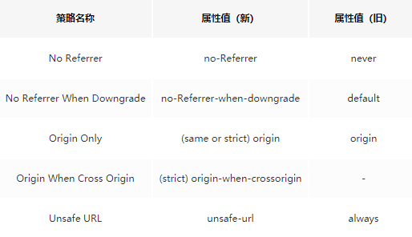

根据上面的表格因此需要把Referrer Policy的策略设置成same-origin，对于同源的链接和引用，会发送Referer，referer值为Host不带Path；跨域访问则不携带Referer。例如：`aaa.com`引用`bbb.com`的资源，不会发送Referer。

设置Referrer Policy的方法有三种：

1. 在CSP设置
2. 页面头部增加meta标签
3. a标签增加referrerpolicy属性

 **上面说的这些比较多，但我们可以知道一个问题：攻击者可以在自己的请求中隐藏Referer。如果攻击者将自己的请求这样填写：** 

```javascript
  
```

那么这个请求发起的攻击将不携带Referer。

另外在以下情况下Referer没有或者不可信：

1.IE6、7下使用window.location.href=url进行界面的跳转，会丢失Referer。

2.IE6、7下使用window.open，也会缺失Referer。

3.HTTPS页面跳转到HTTP页面，所有浏览器Referer都丢失。

4.点击Flash上到达另外一个网站的时候，Referer的情况就比较杂乱，不太可信。

总结： 同源验证是一个相对简单的防范方法，能够防范绝大多数的CSRF攻击。但这并不是万无一失的，对于安全性要求较高，或者有较多用户输入内容的网站，我们就要对关键的接口做额外的防护措施。 

###### CSRF Token

前面讲到CSRF的另一个特征是，攻击者无法直接窃取到用户的信息（Cookie，Header，网站内容等），仅仅是冒用Cookie中的信息。

而CSRF攻击之所以能够成功，是因为服务器误把攻击者发送的请求当成了用户自己的请求。那么我们可以要求所有的用户请求都携带一个CSRF攻击者无法获取到的Token。服务器通过校验请求是否携带正确的Token，来把正常的请求和攻击的请求区分开，也可以防范CSRF的攻击。

### 五、VUE

#### 什么是VUE?


#### Vue优点

1. 体积小
2. 更高的运行效率
3. 双向数据绑定
4. 生态丰富，学习成本低


#### MVVM模式

MVVM模式，顾名思义就是Model-View-ViewModel模式。

Model（数据）：代表数据模型，也可以在Model中定义数据修改和操作的业务逻辑

View（视图）：代表UI组件，它负责将数据模型转化成UI展现出来

ViewModel：代表监听模型数据的改变和控制视图行为、处理用户交互，简单 理解就是一个同步view和Model的对象，连接Model和View。

在MVVM架构下，View和Model之间并没有直接的联系，而是通过ViewModel进行交互，Model和ViewModel之间的交互式是双向的，因此View数据的变化会同步到Model中，而Mode数据的变化也会立即反应到View中,我们只关注业务逻辑，不需要手动操作DOM，不需要关注View和Model的同步工作

##### MVC与MVVM的区别

- model：负责在数据库中对数据进行存取
- view：UI视图
- controller: model和view的协调者

https://www.jianshu.com/p/b0aab1ffad93

MVC就是（model-view-controllerl）说直白点就是利用C去给视图V赋予数据M。只能在view中用js去操作dom入c去更新model，而不能通过model变化让c去更新view，

MVVM就是（model-view-viewModel)，就是用viewModel去处理视图与数据的双向交互，视图数据的变化会同步到model中，而model数据的变化也会同步到view中，优点：我们只关注业务逻辑，不需要手动操作DOM，不需要关注View和Model的同步工作


#### Vue的生命周期

https://blog.csdn.net/haochangdi123/article/details/78358895

生命周期钩子的 `this` 上下文指向调用它的 Vue 实例。

Vue的生命周期就是Vue实例从创建到销毁的过程，一共有八个阶段，分别如下：

1. **beforeCreate**（创建前）：在数据观测和初始化事件还未开始，此时数据还未劫持到全局，methods、watch、computed也未提升到全局
2. **created**（创建后）：完成数据劫持，属性和方法的运算，初始化事件，$el属性还没有显示出来
3. **beforeMount**（载入前）：在挂载开始之前被调用，相关的render函数首次被调用，实例已完成以下配置：编译模版，把data里面的数据和模板生成html，但还没有挂载到html页面上
4. **Mounted**（载入后）：在el被新创建的vm.$el替换，并挂载到实例上去之后调用。实例已完成以下配置：用上面编译好的html内容替换el属性执行的DOM对象。完成模板中的html渲染到html页面中，此过程可以进行ajax交互
5. **beforeUpdate**（更新前）：在数据更新之前调用，发送在虚拟DOM重新渲染和打补丁之前，可以在该构造中进一步地更改状态，不会触发附加的重渲染过程
6. **updated**（更新后）：在由于数据更改导致的虚拟DOM重新渲染和打补丁之后调用，调用时，组件DOM已经更新，所有可以执行依赖于DOM的操作。然而在大多数情况下，应该避免在此期间更改状态，因为这可能不导致更新无限循环，该钩子在服务器渲染期间不被调用。
7. **beforeDestroy**（销毁前）：在实例销毁之前调用，实例仍然完全可用
8. **destory**（销毁后）：在实例销毁之后调用 ，调用后，所有的事件监听器会被移除，所有的子实例也会被销毁，该钩子在服务器渲染期间不被调用

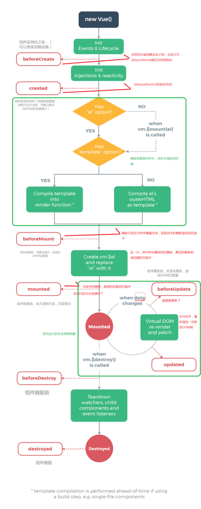


##### 1. 什么是Vue声明周期

Vue实例从创建到销毁的过程，就是生命周期，从开始创建实例、初始化数据、编译模板、挂载DOM -> 渲染、更新->渲染、销毁等一系列过程，称之为Vue的生命周期


##### 2. Vue生命周期的作用

它的声明周期中有多个事件钩子，让我们在控制整个Vue实例的过程中更容易形成好的逻辑


##### 3.第一次加载页面会触发几个生命周期钩子

beforeCreate、created、beforeMount、mounted


##### 4. DOM渲染在哪个周期就已经完成

mounted


#### 响应式原理

> 所谓响应式，就是当我们修改数据时，视图会进行更新，避免了繁琐的Dom操作，提高开发效率。

Vue是采用数据劫持（defineProperty）+ 发布者-订阅者模式的方式，通过Object.defineProperty()来劫持各个属性的setter、getter，在数据变动时发布消息给订阅者，触发相应的监听回调。

主要分为以下几个步骤：

1. 需要observe(观察)的数据进行递归遍历，包括子属性对象的属性，都加上setter和getter（definedproperty），这样的话，给这个对象的某个值赋值，就会触发setter，那么就能监听到数据变化
2. compile解析模板指令，将模板中的变量替换成数据，然后初始化渲染页面视图（render），并将每个指令对应的节点绑定更新函数，添加监听数据的订阅者，一旦数据有变动，收到通知，更新视图
3. Watcher订阅者是Observer和compile之间通信的桥梁，主要做的事情是：
   1. 在自身实例化时往属性订阅器（dep）里面添加自己
   2. 自身必须有一个update（）方法
   3. 待属性变动dep.notice()通知时，能调用自身的updata()方法，并触发compile中绑定的回调，则功成身退。

4. MVVM作为数据绑定的入口，整合Observer，compile和Watcher三者，通过Obeserve来监听自己的Model数据变化，通过compile来解析编译指令模板，最终利用Watcher搭起Observer和Compile之间的通信桥梁，达到数据变化 -> 视图更新，视图交互变化（input） ->数据modle变更的双向绑定效果

**JS实现简单的双向绑定**

```html
<body>
    <div id="app">
        <input type="text" id="txt">
        <p id="show"></p>
	</div>
</body>
<script type="text/javascript">
    var obj = {}
    Object.defineProperty(obj, 'txt', {
        get: function () {
            return obj
        },
        set: function (newValue) {
            document.getElementById('txt').value = newValue
            document.getElementById('show').innerHTML = newValue
        }
    })
    document.addEventListener('keyup', function (e) {
        obj.txt = e.target.value
    })
</script>
```

view->model：首先通过definedProperty进行数据劫持，通过监听keyup事件，拿到在input框输入后的值，并赋予被劫持的属性，属性的值发生改变后，触发set函数，将新值展示到view中。

model -> view：直接操控被劫持的数据，触发set函数的执行，将新值展示到view中。

#### definedProperty缺陷

1. **对于对象**

   只有当实例被创建时就存在于data中的property才是**响应式**的，如果你添加一个新的property，那边该属性的改动不会触发任何视图的更新。

   ```javascript
   vm.b = 'h1'
   ```

   解决方法：

   如果确实想添加响应式的属性，可以通过Vue.set方法或vm.$set方法来添加。

2. **对于数组**

   1. 利用索引的方式加入或设置数据，例如：vm.items[5] = "zhy"

   2. 修改数组长度，例如vm.items.length = 7

   ```javascript
   var vm = new Vue({
       data:{
           items:['a','b','c']
       }
   })
   vm.item[1] = 'x';	//不是响应式的
   vm.items.length = 2;
   
   ```

   Vue都不能检测到数组的变动，就不会触发任何视图的更新

   解决方法：

   1. 使用Vue.set

   ```javascript
   Vue.set(vm.items,1,bb)	//表示把items中的第二位数值更改为bb
   ```

   2. 使用splice:

   ```javascript
   vm.items.splice(newLength)
   ```


#### 异步更新队列

Vue在更新DOM时是**异步**执行的，只要侦听到数据变化，Vue将开启一个队列，并缓冲在同一个事件循环中所发生的所有数据变更。如果同一个Watch被多次触发，只会推入到队列一次，这种在缓冲时去除重复数据对于避免不必要的计算和操作DOM时非常重要的。然后，在下一个事件循环“tick"中，Vue刷新队列并执行实际（已去重的）工作，Vue在内部队异步队列尝试使用原生的Promise.then，MutationObserver和setImmediate，如果执行环境不支持，则会采用setTimeOut(fn,0)代替。

##### nextTick

使用nextTick会在DOM更新完成之后触发回调，在里面可以拿到更改后的DOM

- Vue.nextTick

- vm.$nextTick

如果你想基于更新后的 DOM 状态来做点什么，这就可能会有些棘手。虽然 Vue.js 通常鼓励开发人员使用“数据驱动”的方式思考，避免直接接触 DOM，但是有时我们必须要这么做。为了在数据变化之后等待 Vue 完成更新 DOM，可以在数据变化之后立即使用 `Vue.nextTick(callback)`。这样回调函数将在 DOM 更新完成后被调用。例如：

```html
<div id="example">{{message}}</div>
<script>
    var vm = new Vue({
        el: '#example',
        data: {
            message: '123'
        }
    })
    vm.message = 'new message' // 更改数据
    vm.$el.textContent === 'new message' // false
    Vue.nextTick(function () {
        vm.$el.textContent === 'new message' // true
    })
</script>
```

因为 `$nextTick()` 返回一个 `Promise` 对象，所以你可以使用新的 [ES2017 async/await](https://developer.mozilla.org/zh-CN/docs/Web/JavaScript/Reference/Statements/async_function) 语法完成相同的事情：

```javascript
methods: {
  updateMessage: async function () {
    this.message = '已更新'
    console.log(this.$el.textContent) // => '未更新'
    await this.$nextTick()
    console.log(this.$el.textContent) // => '已更新'
  }
}
```


#### 动态组件

使用is属性，去根据不同条件去动态切换成的不同组件。典型的例子就是tabs切换栏

```html
<div id="app">
    <button
            v-for="tab in tabs"
            v-bind:key="tab"
            v-bind:class="['tab-button',{active:currentTab == tab}]"
            v-on:click="currentTab = tab"
            >{{tab}}
    </button>
    <div 
         v-bind:is="currentTabComponent">
    </div>
</div>

<script type="text/javascript">
    let vm = new Vue({
        el:'#app',
        data:{
            tabs:['Home','page','service'],
            currentTab:"Home"
        },
        computed: {
            currentTabComponent: function() {
                return this.currentTab.toLowerCase();
            },
        },
        components:{
            home:{
                template:'<div>这是home页面</div>',
            },
            page:{
                template:'<div>这是page页面</div>',
            },
            service:{
                template:'<div>这是service页面</div>',
            }
        }
    })
</script>
```

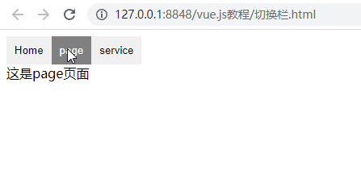

#### 异步组件

在项目中，有些组件不会在第一次首屏时加载，而是当执行了某些操作时，才会加载进来，所以此时，我们可以将组件设置成异步组件，什么时候用（比如点击的时候再加载组件），什么时候再加载进来，以达到提升首屏性能的目的

使用方法：

```javascript
components:{
    AsyncCmp:()=> import('URL'),
}
```

意思就是，在需要使用的使用，才调用该函数去异步加载这个组件过来，

如果异步加载的组件有多个，会有多个请求，可以使用weback合并两个组件到一个文件中，达到请求一次加载多个组件的目的。

如下

```javascript
components:{
    AsyncCmp1:()=>import("/*webpackChunkName:'async'*/",'url');
    AsyncCmp1:()=>import("/*webpackChunkName:'async'*/",'url');
}
```

async表示两个文件合并后的文件名。

异步记载的文件，会在link标签上设置el="prefetch"，浏览器会在空闲时间内下载对于的资源，使用时可以直接从缓存中获取，与之对应的el="preload"，会及时下载对应的资源。


#### Vue组件间参数传值

**1.父组件与子组件传值**
父组件传给子组件：子组件通过props方法接受数据;
子组件传给父组件：$emit方法传递参数
**2.非父子组件间的数据传递，兄弟组件传值**
eventBus，就是创建一个事件中心，相当于中转站，可以用它来传递事件和接收事件。项目比较小时，用这个比较合适。（虽然也有不少人推荐直接用VUEX，具体来说看需求咯。技术只是手段，目的达到才是王道。）


#### keep-alive的了解

**keep-alive**是Vue内置的一个组件，可以使被包含的组件保留状态，避免被重新渲染，在Vue2.1.0版本之后，keep-alive新加入了两个属性：include(包含的组件缓存)与exclude（排除的组件不缓存，优先级大于include）

使用方法

```html
<keep-alive include='include_components' exclude='exclude_components'>
  <component>
    <!-- 该组件是否缓存取决于include和exclude属性 -->
  </component>
</keep-alive>
```

参数解释
include - 字符串或正则表达式，只有名称匹配的组件会被缓存
exclude - 字符串或正则表达式，任何名称匹配的组件都不会被缓存
include 和 exclude 的属性允许组件有条件地缓存。二者都可以用“，”分隔字符串、正则表达式、数组。当使用正则或者是数组时，要记得使用v-bind 。

使用示例

```
<!-- 逗号分隔字符串，只有组件a与b被缓存。 -->
<keep-alive include="a,b">
  <component></component>
</keep-alive>

<!-- 正则表达式 (需要使用 v-bind，符合匹配规则的都会被缓存) -->
<keep-alive :include="/a|b/">
  <component></component>
</keep-alive>

<!-- Array (需要使用 v-bind，被包含的都会被缓存) -->
<keep-alive :include="['a', 'b']">
  <component></component>
</keep-alive>
```


#### 组件中data为什么是函数

因为对象为引用类型，当复用组件时，如果data写成对象形式，就使得所有组件实例都共享了一份data，当在一个组件中修改data时，其他重用的组件中的data也会被修改，而如果data写成函数形式，**每次返回的都是一个新对象**，引用地址不同，就不会出现这个问题


#### v-if 和v-show的区别

- v-if是惰性的，会根据条件来判断是否创建或销毁元素，因此v-if的切换开销较高

- v-show则不管初始条件是什么，元素总会被渲染，并且只是简单的基于CSS进行切换，因此v-show的初始渲染开销较高

  

#### v-if和v-for哪个优先级更高

回答模式：总分总

- 先给出结论
- 为什么是这样的
- 他们能放一起吗
- 如果不能，拿应该怎么样
- 总结

回答范例：

1. v-for优先于v-if被解析

2. 我曾做过实验，把他们放在一起，输出的渲染还输中可以看出会先执行循环在判断条件 

3. 实践中也应该不能把他们都放到同一个元素里，因为即使我们需要展示的数据只是一大堆数据中的一小份，也需要遍历所有的数据

4. 比较常见的问题是，比如过滤我们已下架的商品（比如`v-for = shop shops; v-if = "user.isActive"`），最好的方法是用计算属性先过滤掉不需要展示的数据，再用for循环去展示

   ```javascript
   computed:{
       ActiveUser(){
           return this.articles.filter(item=>{
               return item.isActive
           })
       }
   }
   ```

5. 而且在官方文档中也明确指出了**永远不要把v-if和v-for用在同一个元素上**

6. 在源码中也是先判断genFor函数再判断genif元素


#### v-for key的作用

思路分析：总分总模式

1. 给出结论：key的作用是用于优化patch性能，提高diff效率
2. key的必要性
3. 实际使用方式
4. 总结：可从源码层面描述一下Vue如何判断两个节点是否相同

回答范例：

1. key的作用主要是为了更高效的更新虚拟DOM

2. vue在patch过程中**判断两个节点是否是相同节点中Key是一个必要条件**，渲染一组列表时，key往往是唯一标识【像循环li元素，所有元素都是li元素，而判断一个元素是否是相同节点，会判断元素的类型和元素的key，而元素类型都相同了，那所以只剩key是唯一表示】，所以如果不定义key的话，vue只能认为比较的两个节点是同一个，哪怕他们实际上不是，这导致了频繁更新元素，使得整个patch过程比较低效，影响性能，典型的例子就是让数组颠倒了顺序
3. 实际使用中在渲染一组列表时key必须设置，而且必须是唯一标识，应该避免适用数组索引作为key，这可能导致一些隐藏BUG；vue中在使用相同标签元素过渡切换时，也会使用key属性，其目的也是为了让vue可以区分他们，否则vue只会替换内部属性而不会触发过渡效果
4. 我以前看过Vue源码，vue判断两个节点是否相同的主要是判断两者的key和元素类型，因此如果不设置key，它的值就是undefined，只要元素类型相同，则可能永远认为这是两个相同节点，只能去做更新操作，这造成了大量的dom更新操作，显然是不可取的。


就是如果两个li,元素一样，但内容不一样，不过不设置key，vue就会认为这是同一个元素，但值被修改了，于是会重新更新元素，这样会导致整个patch过程比较低效


#### 你了解diff吗

回答案例：

1. diff算法是虚拟DOM技术的产物，vue里面实际叫做patch，他的核心实现来自于snabbdom，通过新旧虚拟DOM对比（即patch)，将变化的地方转换为DOM操作

2. 在vue1中是没有patch的，因为界面中每个依赖都有专门的watcher负责更新，这样项目规模变大就会成为性能瓶颈，vue2中为了减低watcher粒度，每个组件只有一个watcher，但是当需要更新的时候，怎样才能精确找到变化的地方，这就需要引入patch才行。

3. 组件中数据发发生变化时，对应的watcher会通知更新并执行其更新函数，他会执行渲染函数获取全新虚拟dom:newVnode，此时就会执行patch比对上次渲染结果oldVnode和新的渲染结果newVnode

4. patch过程遵循深度优先，同层比较的策略；两个节点之间比较时，如果他们用于子节点，会先比较子节点；比较两组子节点时，会假设头尾节点可能相同先做尝试，没有找到相同节点后才按照通用方式遍历查找；查找结束在处理剩下的节点；借助key可以非常精确找到相同节点，因此整个patch过程非常高效

   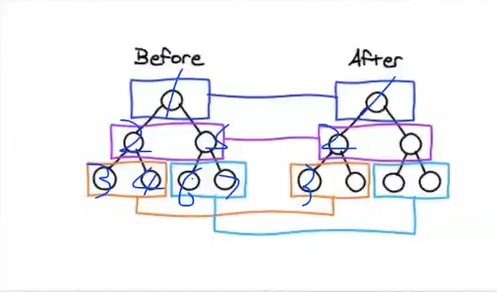

#### computed和watch的区别

> computed是计算属性，当计算属性所依赖的属性 发生变化是，会重新进行计算，计算完成后进行缓存，如果没有改变，再次加载时调用的是缓存中的值；watch是监听数据，没有缓存，再次加载页面后会重新调用函数

**计算属性：**

- 支持缓存，只有依赖数据发生改变，才会重新进行计算
- 不支持异步，当computed内有异步操作时无效，无法监听数据的变化
- 计算属性可以一次性观察多个数据，只要其中一个数据发生改变时，就会重新计算
- 计算属性初始化页面的时候会先执行一遍


**侦听属性：**

- 不支持缓存，数据变，直接会触发相应的操作
- 支持异步
- 监听的函数接受两个参数，第一个参数时最新的值，第二个参数是输入之前的值
- 监听数据必须是data中声明过或者父组件传递过来的props中的数据，当数据变化时，触发其他操作，函数有两个参数：
- 侦听属性函数写法在刚初始化页面的时候不会执行，对象写法添加immediate:true属性时才会初始化页面的时候执行

```javascript
watch:{
    firstName:{
        handler(newName,oldName){
			this.fullName = newName + '' + this.lastName;
        }
        // 代表在wacth里声明了firstName这个方法之后立即执行handler方法
        immediate:true
    }
}
```


deep: deep的意思就是深入观察，监听器会一层层的往下遍历，给obj的所有属性都加上这个监听器，但是这样性能开销就会非常大了，任何修改obj里面任何一个属性都会触发这个监听器里的 handler

```javascript
watch: {
  obj: {
    handler(newName, oldName) {
      console.log('obj.a changed');
    },
    immediate: true,
    deep: true
  }
}
```


优化：我们可以使用字符串的形式监听

```javascript
watch: {
  'obj.a': {
    handler(newName, oldName) {
      console.log('obj.a changed');
    },
    immediate: true,
    // deep: true
  }
}

```

这样Vue.js才会一层一层解析下去，直到遇到属性a，然后才给a设置监听函数。


#### $nextTick

> nectTick可以在回调中获取更新后的DOM

vue实现响应式并不是数据发生变化后dom立即变化，而是按照一定的策略来进行dom更新。

数据更改后，页面并不会立刻重新渲染，页面的渲染操作是异步（微任务中）执行的，这样做的目的是防止因为如果在同步任务阶段渲染，同步任务多次更改变量的话，会导致页面多次重新渲染。而异步是等待同步任务的最终结果再判断数据是否更改再决定是否重新渲染

> nextTick 是在下次 DOM 更新循环结束之后执行延迟回调，在修改数据之后使用nextTick，则可以在回调中获取更新后的 DOM


#### v-model语法糖 


#### VirtualDOM(vue)

> 虚拟DOM就是一个普通的javaScript对象，用来描述真实的DOM，我们创建一个真实的DOM开销很高，因为一个真实DOM的成员非常多，而创建一个虚拟DOM的开销比真实DOM的开销小很多

创建一个虚拟Virtual DOM示例

```javascript
{
    $el:"div",
    data:{},
    children:undefined,
    text:'Hello World',
    elm:undefined,
    key:undefined
}
```


##### 为什么使用Virtual DOM

- 手动操作DOM比较麻烦，还有考虑浏览器的兼容性问题，虽然有jQuery等库简化DOM操作，但是随着项目的复杂，DOM操作复杂提升
- 为了简化DOM的操作，于是出现了各种MVVM框架，MVVM框架解决了视图和状态的同步问题（数据发生变化，自动更新视图，反之如此）
- 为了简化视图的操作，我们可以使用模板引擎，但是模板引擎没有解决跟踪状态变化的问题（数据发生变化后，无法获取上一次的状态，只好把界面上的元素删除再新建），于是Virtual DOM出现了
- Vitrual DOM的好处是当状态改变时不需要立即更新DOM，只需要创建一个虚拟树来描述DOM，Virtual DOM内部再用diff算法高效的更新DOM


##### VirTual DOM的作用

- 虚拟DOM可以维护程序的状态，跟踪上一次的状态 
- 通过比较前后两次状态的差异更新真实DOM


##### Snabbdom

> 注重简单性，模块化，强大特性和性能的虚拟DOM库
>
> https://github.com/coconilu/Blog/issues/152

**init( [ ] )**

`init`接收一个模块列表，并返回一个使用指定模块集的`patch`函数。

```javascript
var patch = snabbdom.init([
    require(snabbdom/modules/class).default,
    require(snabbdom/modules/style).default,
])

```


**patch(oldVnode，newVnode)**

`init`返回的`patch`函数有两个参数。第一个是表示当前视图的DOM元素或vnode。第二个是表示更新后的新视图的vnode。

如果传递带有父节点的DOM元素，`newVnode`将被转换为DOM节点，传递的元素将被创建的DOM节点替换。如果传递旧的vnode, Snabbdom将有效地修改它以匹配新vnode中的描述。

传递的任何旧vnode都必须是上一个`patch`调用的结果vnode。这是必要的，因为Snabbdom将信息存储在vnode中。这使得实现更简单、更高性能的体系结构成为可能。这也避免了创建新的旧vnode树。

```javascript
patch(oldVnode, newVnode);
```

**h(sel，data，children，text，elm，key)**

`h`函数接收一个字符串形式的标签/选择器、一个可选的数据对象、一个可选的字符串或数组作为子代。

children与text互斥

```javascript
var h = require('snabbdom/h').default;
var vnode = h('div#wrapper',{style:{color:'#000'}},[
    h('h1','Headline'),
    h('p', 'A paragrah')
])
```

额外

**ToVnode()**

将DOM节点转换为虚拟节点。特别适合修补已存在的服务器端生成内容。

```javascript
patch(toVNode(document.querySelector('.container')), newVNode)
```


**钩子**

要使用钩子，将它们作为对象传递给数据对象参数的`hook`字段。

```javascript
h('div.row', {
  key: movie.rank,
  hook: {
    insert: (vnode) => { movie.elmHeight = vnode.elm.offsetHeight; }
  }
});
```


**模块列表：**

- style

函数重载：

- 就是同名函数，通过参数的个数不同来区分。也可以通过参数的类型不同来区分
- javaScript中没有重载的概念
- TypeScript中有重载，不过重载的实现还是通过代码调整参数

例如：

```javascript
function add(a,b){
    console.log(a+b)
}
//正常在js中，后面声明的同名函数会覆盖前面的
function add(a,b,c){
    console.log(a+b+c)
}

add(1,2)
add(1,2,3)
```


##### Snabbdom源码解析

**如何学习源码**

- 先宏观了解
  - 使用h()函数创建JavaScript对象（Vnode）描述真实DOM
  - init()设置模块，创建patch()
  - patch()比较两个新旧Vnode
  - 把变化的内容更新到真实DOM中
- 带着目标看源码
- 看源码的过程要不求甚解
- 调试
- 参考资料

##### **snabbdom的核心**

snabbdom的核心仅提供最基本的功能，只导出了三个函数init()、h()、thunk()

- init()是一个高阶函数，返回patch(),patch函数的作用是比对两者虚拟dom之间的差异

- h()：接受一或两个参数，返回虚拟节点VNode，这个函数我们使用 Vue的时候见过

  - 一个参数：
  - 两个参数：第一个参数表示**标签[选择器]**，第二个参数如果是字符串，表示标签内容

  ```javascript
  new Vue({
      router,
      store,
      render:h=>h(APP)
  })
  ```

- thunk()是一种优化策略，可以在处理不可变数据时使用

注意：导入时候不能使用 inport snabbdom from 'snabbdom'

> 原因是node_modules/src/snabbdom.ts末尾导出使用的语法是export导出API，没有使用export default默认导出

###### 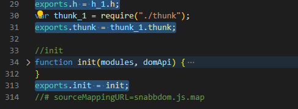

Snabbdom的核心并不能处理元素的属性/样式/事件等，如果需要处理的话，可以使用模块

**常用模块**

- attribute
  - 设置DOM元素的属性，使用setAttribute()
  - 处理布尔类型的属性
- props
  - 和attribute模块相似，设置DOM元素的属性element[attr] = value
  - 不处理布尔类型的值
- class
  - 切换类样式
  - 注意：给元素设置类样式是通过sel选择器
- dataset
  - 设置data-*的自定义属性

- eventlisteners
  - 注册和移除事件
- style
  - 设置行内样式，支持动画
  - delayed/remove/destroy


**模块的使用**

1. 导入模块
2. 注册模块
3. 使用h()函数的第二个参数传入模块需要的数据（对象）

```javascript
import {h,init} from 'snabbdom'

//1. 导入模块
import style from 'snabbdom/modules/style',
import eventlisteners from 'snabbdom/modules/eventlisteners',   

//2.在init中注册模块
//init()的参数是一个数组，可以传入模块，处理属性/样式/事件等
//patch函数的作用是比对两者虚拟dom之间的差异
let patch = init([
    style,
    eventlisteners
])

//3. 使用h()函数的第二个参数传入模板需要的数据 （对象）
let vnode = h('div',{
    style:{
        backgroundColor:'red'
    },
    on:{
        click:eventHandler
    }
},[
    h('h1','hello snabbdom'),
    h('p','hello p')
])

function eventHandler(){
    console.log('被点击了')
}

let app = document.querySelector('#app');	//获取到占位元素

patch(app,vnode) //通过patch去比对两个VNode，  去更新真实DOM,然后返回一个VNode
```

**虚拟dom是如何变成真实DOM的**

- patch(oldVnode，newVnode)
- 打补丁，把新节点中变化的内容渲染到真实DOM，最后返回新节点作为下一次处理的旧节点
- 对比新旧VNode是否相同节点(节点的key和sel相同)
- 如果不是相同节点，删除之前的内容，重新渲染
- 如果是相同节点，再判断新的VNode是否有text，如果有并且和oldVnode的text不同，直接更新文本内容
- 如果新的VNode有children，判断子节点是否变化，判断子节点的过程使用的就是diff算法
- diff过程只进行同级别的比较

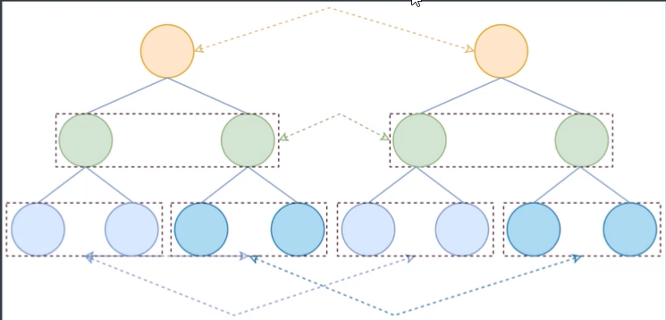


#### key的作用

参考链接： https://github.com/Advanced-Frontend/Daily-Interview-Question/issues/1 

>  key是给每一个vnode的唯一id,可以`依靠key`,更`准确`, 更`快`的拿到oldVnode中对应的vnode节点。


### Vue-router

Vue Router 是 [Vue.js](https://links.jianshu.com/go?to=http%3A%2F%2Fcn.vuejs.org%2F) 官方的路由管理器。它和 Vue.js 的核心深度集成，让构建单页面应用变得易如反掌。

####  active-class 是哪个组件的属性？

active-class是router-link终端属性，用来做选中样式的切换，当router-link标签被点击时将会应用这个样式

#### vue-router有哪几种钩子

- 全局

  - beforeEach
  - beforeResolve
  - afterEach

- 路由

  - beforeEnter

- 组件

  - beforeRouteEnter
  - beforeRouteUpdate
  - beforeRouteLeave

  需要注意是：

  > beforeRouteEnter 不能获取组件实例 this，因为当守卫执行前，组件实例被没有被创建出来，剩下两个钩子则可以正常获取组件实例 this

  但是并不意味着在 beforeRouteEnter 中无法访问组件实例，我们可以通过给 next 传入一个回调来访问组件实例。在导航被确认是，会执行这个回调，这时就可以访问组件实例了，如：

  ```javascript
  beforeRouteEnter(to, from, next) {
      next (vm => {
          // 这里通过 vm 来访问组件实例解决了没有 this 的问题
      })
  }12345
  ```

  > 注意，仅仅是 beforRouteEnter 支持给 next 传递回调，其他两个并不支持。因为归根结底，支持回调是为了解决 this 问题，而其他两个钩子的 this 可以正确访问到组件实例，所有没有必要使用回调

#### 完整的导航解析流程

1. 导航被触发。
2. 在失活的组件里调用离开守卫。
3. 调用全局的 `beforeEach` 守卫。
4. 在重用的组件里调用 `beforeRouteUpdate` 守卫 (2.2+)。
5. 在路由配置里调用 `beforeEnter`。
6. 解析异步路由组件。
7. 在被激活的组件里调用 `beforeRouteEnter`。
8. 调用全局的 `beforeResolve` 守卫 (2.5+)。
9. 导航被确认。
10. 调用全局的 `afterEach` 钩子。
11. 触发 DOM 更新。
12. 用创建好的实例调用 `beforeRouteEnter` 守卫中传给 `next` 的回调函数。

#### 如何定义动态路由

动态路由的创建，主要是使用path属性定义路由路径过程中，使用动态路径参数，以冒号开头，如下：

```javascript
{
  path: '/details/:id'
  name: 'Details'
  components: Details
}
```

访问details目录下的所有文件，如果details/a，details/b等，都会映射到Details组件上

当匹配到/details下的路由时，参数值会被设置到this.$route.params下，所以通过这个属性可以获取动态参数

```javascript
console.log(this.$route.params.id)//比如访问details/a，此时的id就是a
```

初始化页面会加载哪几种导航钩子


#### 如何定义嵌套路由

在 VueRouter 的参数中使用 children 配置


#### \$route和\$router的区别

- router为VueRouter的实例，是一个**全局的路由对象**，包含了路由跳转的方法，钩子函数等
- route是**路由信息对象**||跳转的路由对象，每一个路由都会有一个route对象，是一个局部对象，该对象包含path，params，hash，query，fullpath，matched，name，等路由信息参数

比如

```javascript
router.push('/home');//表示在全局的实例对象router中，去进入home这个路由（route）
```

#### vue-router传参

- params
  - 只能使用name，不能使用path
  - 参数不会显示在路径上，浏览器强制刷新参数会被清空

```javascript
this.$router.push({
    name:Home,	//要去的路由
    params:{	//给该路由携带的参数
        number:1,
        code:'999'
    }
})
//接收参数
const p = this.$route.params
```

- query
  - 参数会显示在路径上，但刷新不会被清空
  - name可以使用path路径

```javascript
this.$router.push({
    name:Home,	//要去的路由
    query:{		//给路由携带的参数
        number:1,
        code:'999'
    }
})
//接收参数
const p = this.$route.query
```

#### vue-router的两种模式

https://www.cnblogs.com/tugenhua0707/p/10859214.html

- hash
  
  - 原理是onhashchange事件，可以在window对象监听这个事件
  
    ```javascript
    window.onhashchange = function(event){
        console.log(event.oldURL,event.newURL);
        let hash = location.hash.slice(1)
    }
    ```
  
  - 特点：
  
    hash 模式下，仅 hash 符号之前的内容会被包含在请求中，如 http://www.abc.com，因此对于后端来说，即使没有做到对路由的全覆盖，也不会返回 404 错误。


- history
  - 利用了HTML5 Interface中新增的pushStatue()和replaceState（）方法
  - 需要后台配置支持，如果刷新时，服务器没有对应响应的资源，会刷404


#### 路由懒加载(动态加载路由)

- 所谓路由懒加载，简单来说就是按需加载，即在需要的时间再进行加载，路由懒加载的好处是能够提高首屏加载速度，解决白屏问题

- 使用

  常用的路由懒加载方式有两种：一种是使用异步组件，一种是使用ES6中的iimport导入

```javascript
const router = new VueRouter({
    routes:[
        {
            path:'/home',
            name:'Home',
            conponent:()= import('../view/home')
        }
    ]
})
```

##### 为什么需要懒加载

- 像vue这种单页面应用，如果没有应用懒加载，运用webpack打包后的文件将会异常的大，造成进入首页时，需要加载的内容过多，时间过长，会出啊先长时间的白屏，即使做了loading也是不利于用户体验，而运用懒加载则可以将页面进行划分，需要的时候加载页面，可以有效的分担首页所承担的加载压力，减少首页加载用时
- 简单的说就是：进入首页不用一次加载过多资源造成用时过长！！！


### Vuex

#### vuex有几种属性

有五种，分别是state、getter、mutation、action、module

#### vuex的特性是什么

- vuex就是一个仓库，仓库里放了很多对象，其中state就是数据源存放地，对应于一般vue对象里面的data
- state里面存放的数据是响应式的、vue组件从store读取数据，若是store中的数据发送改变，依赖者个数据的组件也会发生更新
- 它通过mapState把全局的state和getter映射到当前组件的computed计算属性


#### vuex的getter特性是什么

- getter可以对state进行计算操作，就是store的计算属性
- 虽然在组件内也可以做计算属性，但是getters可以在多个组件之间复用
- 如果一个状态只在一个组件内使用，是可以不用getters

#### vuex的mutation特性是什么

- 负责去更改state中的数据，只能执行同步操作

- action类似mutation，不同在于，action提交的是mutation，而不是直接变更状态
- action可以包含任意异步操作


#### vue中ajax请求代码应该写在组件的methods中还是vuex的action中

如果请求来的数据不慎 要被其他组件公用，仅仅在请求的组件内使用，就不需要放入vuex的state里

如果被其他地方复用，请将请求放入action中，方便复用，并包装成promise返回


#### 不用 vuex 会带来什么问题

- 可维护性会下降，你要修改数据，你得维护 3 个地方
- 可读性下降，因为一个组件里的数据，你根本就看不出来是从哪里来的
- 增加耦合，大量的上传派发，会让耦合性大大的增加，本来 Vue 用 Component 就是为了减少耦合，现在这么用，和组件化的初衷相背


### 六、React

#### React是什么?

> React 是一个声明式，高效且灵活的用于构建用户界面的 JavaScript 库。使用 React 可以将一些简短、独立的代码片段组合成复杂的 UI 界面，这些代码片段被称作“组件”。 


#### 一些细节问题

- JSX语法就是javaScript与xml语法的结合，需要注意的是： 因为 JSX 语法上更接近 JavaScript 而不是 HTML，所以 React DOM 使用 `camelCase`（小驼峰命名）来定义属性的名称，而不使用 HTML 属性名称的命名约定。 Babel 会把 JSX 转译成一个名为 `React.createElement()` 函数调用。

  ```javascript
  const element = (
    <h1 className="greeting">
      Hello, world!
    </h1>
  );
  //等价于
  //React.createElement(元素，属性，innerHtml)
  const element = React.createElement('h1',{className: 'greeting'},'Hello, world!');
  ```
  
  
  
- React是单向数据流：子组件只能读取父组件暴露的属性名，而不能反向修改父组件的属性值，否则会造成逻辑紊乱，代码逻辑关系错乱。可以看作数据是由父级向子级向下流动的

- 组件：组件就是可复用的UI代码片端，必须用**大写字母开头** ，React 会将以小写字母开头的组件视为原生 DOM 标签。 

- 渲染逻辑：

  ```javascript
  function Welcome(props) {
    return <h1>Hello, {props.name}</h1>;
  }
  
  const element = <Welcome name="Sara" />;
  ReactDOM.render(
    element,
    document.getElementById('root')
  );
  ```

  1. 首先调用`ReactDOM.render( )`函数，并将`<welcome name='Sara' />`作为组件传入
  2. React调用`welcome`组件，并将`{name:'Sara'}`作为Props传入
  3. `welcome`组件将`<h1>Hello Sara</h1>元素作为返回值。`
  4. ReactDOM将DOM高效得更新为 `<h1>Hello Sara</h1>`

- 数据的更新方法：(React的diff算法是只更新变化的部分)

  - 第一种：不断调用ReactDOM.render( )函数来修改我们想要重新渲染的元素。

- React.createElement(元素，属性，innerHTML)用于创建虚拟节点

- props是只读性、state可以动态修改（setState = {xxx}）

- 类（class）中的render函数会在组件更新时自动调用，在初始化的时候应该也会调用一次

- 事件处理：

  - React 事件的命名采用小驼峰式（camelCase），而不是纯小写。

  - 使用 JSX 语法时你需要传入一个函数作为事件处理函数，而不是一个字符串。

    ```javascript
    //HTML
    <button onclick="activateLasers()">
      Activate Lasers
    </button>
    //React
    <button onClick={activateLasers}>
      Activate Lasers
    </button>
    ```


  - `preventDefault`  ( )阻止事件的默认行为

    ```javascript
    function ActionLink() {
      function handleClick(e) {
        e.preventDefault();//e 是一个合成事件。
        console.log('The link was clicked.');
      }
    
      return (
        <a href="#" onClick={handleClick}>
          Click me
        </a>
      );
    }
    ```

- ReactDom.render( ): ReactDom.render和类的render（）和React.CreateElement()方法执行结果是等价的,执行的结果得到的并不是真正的DOM节点，结果仅仅是轻量级的Javascript对象，我们称之为Virtual DOM（虚拟节点）

#### React安装

1、npm install create-react-app

2、create-react-app  项目名


#### 组件间传值

##### 父向子组件传值:

>  在 React 应用中，数据通过 props 的传递，从父组件流向子组件。子组件用this.props.属性名接收

##### 子向父组件传值

> 调用父组件的方法可以去改变父组件的状态


#### 生命周期函数

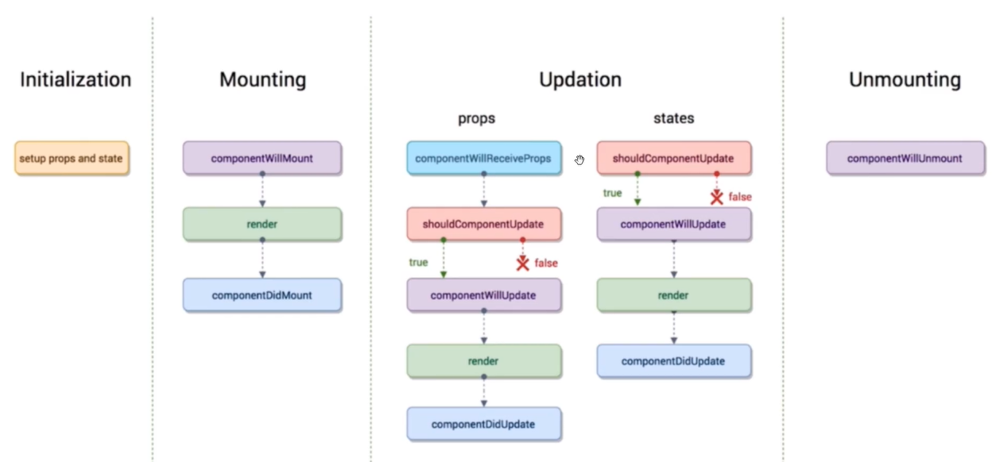

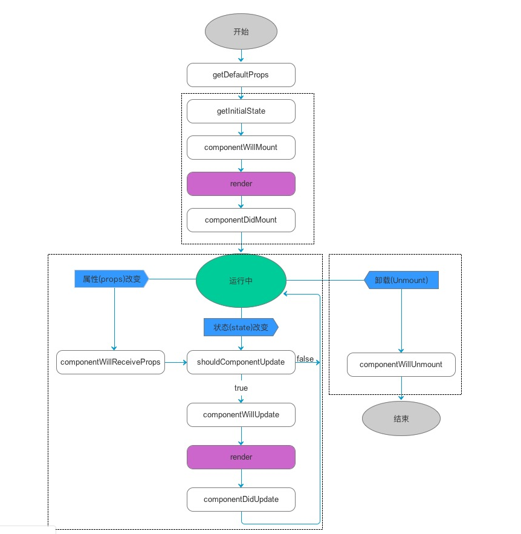

##### 一、初始化阶段

##### 二、挂载阶段

`getDefaultProps`: 获取实例的默认属性

`getinnitialState`: 获取每个实例的初始化状态

`componentWillMount`:组件即将被挂载，渲染到页面上的时刻执行

`render`:组件在这里生成虚拟的DOM节点，只在页面state或props发生变化时执行。 

`ComponentDidMount`: 组件挂载完成时被执行。 

##### 二、更新阶段

`componentWillReceiveProps`: 组件将要接收到属性（props）的时候调用（注意：组件首次渲染时不会执行该函数，可以理解为首次渲染时值肯定没有发生改变，值发生改变是在更新阶段了，而首次渲染在挂载阶段）

`shouldComponentUpdate(nextProps,nextState)`: 组件接受到新属性或新状态的时候执行，该函数必须接收一个boolean类型的返回值（如果返回false,每次接收数据后不更新，阻止render调用，后面的函数就不会继续执行了）

`componentWillUpdate`: 组件即将更新（不能修改属性和状态）

`render`:组件重新渲染

`componentDidUpdate`:组件已经更新

##### 三、销毁阶段

`componentWillUnmount`:组件即将销毁


#### Redux

> Redux是目前React生态中，最好的数据层框架

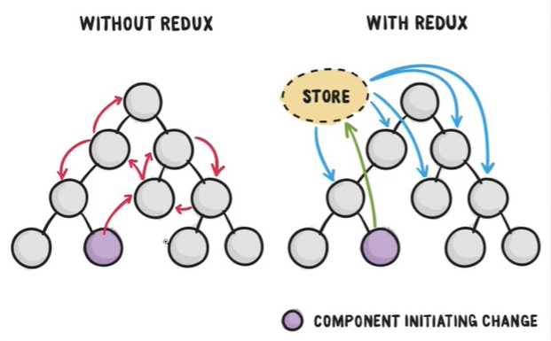

Redux的工作流程

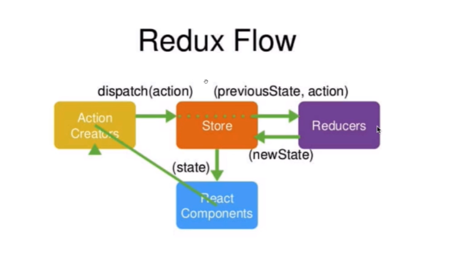

#### Vitual Dom(虚拟DOM)

>  虚拟dom就是用js对象去模拟dom，通过算法对比去更新部分dom，节省性能。 


#### React diff 算法

>  React diff 能够帮助我们计算出 Virtual DOM 中真正变化的部分，并只针对该部分进行实际 DOM 操作，而非重新渲染整个页面，从而保证了每次操作更新后页面的高效渲染，因此 Virtual DOM 与 diff 是保证 React 性能口碑的幕后推手。 

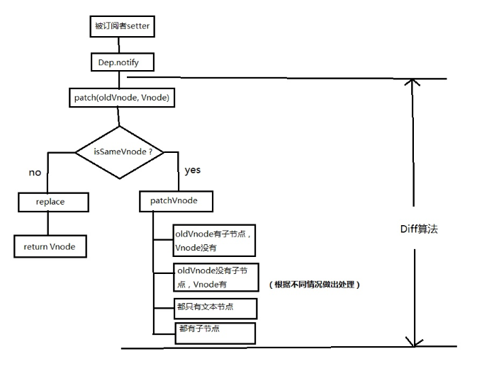

#### VUE与React的对比

1.  vue与react虚拟dom的区别 ？

   >  virtual DOM不一样,vue会跟踪每一个组件的依赖关系, 不需要重新渲染整个组件树.
   > 而对于React而言,每当应用的状态被改变时,**全部组件都会重新渲染**,所以react中会需要shouldComponentUpdate这个生命周期函数方法来进行控制。 

2. 


### 七、webpack

##### webpack的作用及核心配置

> webpack配置中需要理解几个核心的概念`Entry` 、`Output`、`Loaders` 、`Plugins`、 `Chunk`

**Entry**：指定webpack开始构建的入口模块，从该模块开始构建并计算出直接或间接依赖的模块或者库
**Output**：告诉webpack如何命名输出的文件以及输出的目录
**Loaders**：由于webpack只能处理javascript，所以我们需要对一些非js文件处理成webpack能够处理的模块，比如sass文件
**Plugins**：`Loaders`将各类型的文件处理成webpack能够处理的模块，`plugins`有着很强的能力。插件的范围包括，从打包优化和压缩，一直到重新定义环境中的变量。但也是最复杂的一个。比如对js文件进行压缩优化的`UglifyJsPlugin`插件
**Chunk**：coding split的产物，我们可以对一些代码打包成一个单独的chunk，比如某些公共模块，去重，更好的利用缓存。或者按需加载某些功能模块，优化加载时间。在webpack3及以前我们都利用`CommonsChunkPlugin`将一些公共代码分割成一个chunk，实现单独加载。在webpack4 中`CommonsChunkPlugin`被废弃，使用`SplitChunksPlugin`

### 八、npm

#### 安装命令

1、npm install xxx

 安装项目到项目目录下，不会将模块依赖写入`devDependencies`或`dependencies`。 

2、npm install -g xxx  

 `-g`的意思是将模块安装到全局，具体安装到磁盘哪个位置，要看 `npm cinfig prefix`的位置 

3、npm install -save xxx  

 `-save`的意思是将模块安装到项目目录下，并在`package`文件的`dependencies`节点写入依赖。 

4、npm install -save-dev (D) 

 `-save-dev`的意思是将模块安装到项目目录下，并在`package`文件的`devDependencies`节点写入依赖。 

