# 微信小程序

> 微信小程序，简称CX，是一种不需要下载安装即可使用的应用，它实现了应用“触手可及”的梦想，用户扫一扫或者搜一下即可打开应用，也体现了“用完即走”的理念，用户不用关心是否安装太多应用的问题。
>
> 2017年1月9号微信小程序正式上线
>
> 2017年3月7号微信小程序开发个人开发者申请


##  1. 起步

小程序帐号注册：https://mp.weixin.qq.com/wxopen/waregister?action=step1&token=&lang=zh_CN

小程序开发文档：https://developers.weixin.qq.com/miniprogram/dev/framework/


### 帐号申请


账户申请注册完成后，回到https://mp.weixin.qq.com/页面进行登录，登录后点击**设置**

--> **基本设置**，注册第一个小程序，注册完毕后，返回基本设置，往下拉，找到个人的APPID保存起来。


至此，注册结束。


### 个人信息

用户：aa1237841@163.com

密码：Aa18727654

APPID： wxb37a1eea4ca0584e


### 开发准备

#### 开发工具安装

> https://developers.weixin.qq.com/miniprogram/dev/devtools/download.html


#### 开发工具功能简介

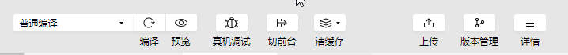

- 编译：已有代码做保存，更新

- 预览：系统生成二维码，用手机微信扫码后可以在移动端看见

- 真机调试：同样生成二维码，在手机端可以查看运行，同时在PC端有调试结果

- 切后台：

- 清缓存：清除各种在运行期间所留下的缓存文件

- 版本管理：借助git，完成对当前微信小程序版本的控制，可以做任何版本控制。

  如推送，抓取等，同时也可以建立分支和合并分支

- 社区：互联网跳转连接，跳转到微信小程序论坛

- 测试号：互联网跳转链接，跳转微信开发文档-测试号申请页面

- 上传（APPID才有）：提供上传代码至微信开发平台

  

#### 小程序demo

> 链接：https://github.com/wechat-miniprogram/miniprogram-demo


### 配置小程序

#### app.json

`app.json`是当前小程序的全局配置，包括了小程序的所有页面路径、页面表现、网络超时事件，底部tab等

优先级：单页面配置 > 全局配置

```javascript
{
  //页面路径
  "pages":[//所有的页面都需要在这里报备，有点类似router,不过报备的是文件夹
    "pages/index/index", //第一个路径为起始路径，也叫首页路径
    "pages/logs/logs"
  ],
      
  //页面表现
  "window":{
    "backgroundTextStyle":"dark", //下拉的loading点的变化(由亮变暗)         
    "navigationBarBackgroundColor": "#000",//导航栏背景
    "navigationBarTitleText": "绍模微信", //导航标题
    "navigationBarTextStyle":"#fff",     //导航标题颜色
    "enablePullDownRefresh": true		//是否运行下拉刷新
    "backgroundColor": "#ddd"   		//下拉的背景色
    
  },
  "style": "v2",
   //是否允许该程序被微信索引，具体索引规则在sitmap.json文件中
  "sitemapLocation": "sitemap.json",
      
  //底部tab,最多5个
  "tabBar": {		
    "selectedColor": "#000000",//菜单栏文字颜色
    "borderStyle": "black", //菜单栏顶部border
    "list": [
      {
          "pagePath": "pagePath",	//点击Icon跳转路径
          "text": "首页",			   //菜单栏标题
          "iconPath": "iconPath",	//icon图片路径
          "selectedIconPath": "selectedIconPath" //活跃的icon图片路径
      }，
      {
          "pagePath": "pages/logs/logs",
          "text": "服务",
          "iconPath": "iconPath",
          "selectedIconPath": "selectedIconPath"
      }
    ]
  }
}

```

1. `pages`字段 —— 用于描述当前小程序所有页面路径，这是为了让微信客户端知道当前你的小程序页面定义在哪个目录。

2. `window`字段 —— 定义小程序所有页面的顶部背景颜色，文字颜色定义等。

3. `tabBar`：定义底部tab,最多5个


#### project.config.json

开发者工具的一些个性化配置，例如界面颜色、编译配置等等。


#### sitemap配置【全局】

> 小程序根目录下的 `sitemap.json` 文件用于配置小程序及其页面是否允许被微信索引，文件内容为一个 JSON 对象，如果没有 `sitemap.json` ，则默认为所有页面都允许被索引；
>
> sitemap完整配置：
>
> https://developers.weixin.qq.com/miniprogram/dev/reference/configuration/sitemap.html


**配置项**：

| 属性  | 类型     | 必填 | 描述         |
| ----- | -------- | ---- | ------------ |
| rules | Object[] | 是   | 索引规则列表 |

**rules**

| 属性     | 类型     | 必填 | 默认值      | 取值                       | 取值说明                                                     |
| :------- | :------- | :--- | :---------- | :------------------------- | :----------------------------------------------------------- |
| action   | string   | 否   | "allow"     | "allow"、"disallow"        | 命中该规则的页面是否能被索引                                 |
| page     | string   | 是   |             | "*"、页面的路径            | `*` 表示所有页面，不能作为通配符使用                         |
| params   | string[] | 否   | []          |                            | 当 page 字段指定的页面在被本规则匹配时可能使用的页面参数名称的列表（不含参数值） |
| matching | string   | 否   | "inclusive" | 参考 **matching 取值说明** | 当 page 字段指定的页面在被本规则匹配时，此参数说明 params 匹配方式 |
| priority | Number   | 否   |             |                            | 优先级，值越大则规则越早被匹配，否则默认从上到下匹配         |

**matching取值说明【参数匹配规则】**

| 值        | 说明                                                         |
| --------- | ------------------------------------------------------------ |
| exact     | 当小程序页面的参数列表**等于** params 时，规则命中【全等则等】 |
| inclusive | 当小程序页面的参数列表**包含** params 时，规则命中【请求的参数 > = params】 |
| exclusive | 当小程序页面的参数列表于params交集为空时，规则命中           |
| partial   | 当小程序页面的参数列表于params交集不为空是，规则命中         |


例一：

```json
{
  "rules":[{
    "action": "allow",
    "page": "path/to/page",
    "params": ["a", "b"],
    "matching": "exact"
  }, {
    "action": "disallow",
    "page": "path/to/page"
  }]
}

```

上面matching：exact表示匹配的规则为请求携带的参数必须与params中的参数完全一致，该请求才能够被微信索引

- `path/to/page?a=1&b=2` => 优先索引
- `path/to/page` => 不被索引
- `path/to/page?a=1` => 不被索引
- `path/to/page?a=1&b=2&c=3` => 不被索引
- 其他页面都会被索引


例二：

```json
{
  "rules":[{
    "action": "allow",
    "page": "path/to/page",
    "params": ["a", "b"],
    "matching": "inclusive"
  }, {
    "action": "disallow",
    "page": "path/to/page"
  }]
}

```

上面matching：inclusive表示匹配的规则为请求携带的参数必须**大于或等于**params中的参数，该请求才能够被微信索引

- `path/to/page?a=1&b=2` => 优先索引
- `path/to/page?a=1&b=2&c=3` => 优先索引
- `path/to/page` => 不被索引
- `path/to/page?a=1` => 不被索引
- 其他页面都会被索引


例三：

```json
"matching": "exclusive"
```

上面matching：inclusive表示匹配的规则为请求携带的参数必须是**不存在**于params中的参数，该请求才能够被微信索引

- `path/to/page` => 优先索引
- `path/to/page?c=3` => 优先索引
- `path/to/page?a=1` => 不被索引
- `path/to/page?a=1&b=2` => 不被索引
- 其他页面都会被索引


```json
"matching": "partial"
```

上面matching：partial表示匹配的规则为请求携带的参数只要存在params中，该请求就够被微信索引

- `path/to/page?a=1` => 优先索引
- `path/to/page?a=1&b=2` => 优先索引
- `path/to/page` => 不被索引
- `path/to/page?c=3` => 不被索引
- 其他页面都会被索引


注：没有 sitemap.json 则默认所有页面都能被索引""

注：`{"action": "allow", "page": "\*"}` 是优先级最低的**默认规则**，未显式指明 "disallow" 的都默认被索引


### 页面结构

#### WXML

WXML和HTML非常相似，也由标签、属性等等构成，区别是小程序的标签更类似一个组件

1. 标签名字有点不一样

2. 多了一些wx:if这个的属性以及 {{ }} 这样的表达式

   在网页的一般开发流程中，我们通常会通过`JS`操作`DOM`(对应HTML的描述产生的树)，以引起界面的一些变化响应用户的行为。例如，用户点击某个按钮的时候，`JS` 会记录一些状态到 `JS` 变量里边，同时通过 `DOM` API 操控 `DOM` 的属性或者行为，进而引起界面一些变化。当项目越来越大的时候，你的代码会充斥着非常多的界面交互逻辑和程序的各种状态变量，显然这不是一个很好的开发模式，因此就有了 MVVM 的开发模式（例如 React, Vue），提倡把渲染和逻辑分离。简单来说就是不要再让 `JS` 直接操控 `DOM`，`JS` 只需要管理状态即可，然后再通过一种模板语法来描述状态和界面结构的关系即可。


#### WXSS

`WXSS` 具有 `CSS` 大部分的特性，小程序在 `WXSS` 也做了一些扩充和修改。

1. 新增了尺寸单位。在写 `CSS` 样式时，开发者需要考虑到手机设备的屏幕会有不同的宽度和设备像素比，采用一些技巧来换算一些像素单位。`WXSS` 在底层支持新的尺寸单位 `rpx` ，开发者可以免去换算的烦恼，只要交给小程序底层来换算即可，由于换算采用的浮点数运算，所以运算结果会和预期结果有一点点偏差。
2. 提供了全局的样式和局部样式。和前边 `app.json`, `page.json` 的概念相同，你可以写一个 `app.wxss` 作为全局样式，会作用于当前小程序的所有页面，局部页面样式 `page.wxss` 仅对当前页面生效。
3. 此外 `WXSS` 仅支持部分 `CSS` 选择器

##### rpx

> 微信的rpx类似px，rpx是一个动态的，相对的单位。在不同屏幕尺寸下与px的比值不是固定的，类似wh单位
>
> 一般在iphone6下，1px = 2rpx，转换规则应该是设备的DPR比

**rpx + flex布局**

> 这两种结合我感觉能制作出适应各种屏幕的布局


#### JS

一个服务仅仅只有界面展示是不够的，还需要和用户做交互：响应用户的点击、获取用户的位置等等。在小程序里边，我们就通过编写 `JS` 脚本文件来处理用户的操作。


编码要求：

- 不能直接使用HTML文件
- 可以全部使用CSS文件
- JS脚本没有window对象


## 2. 微信基础开发知识点

### 生命周期

> 页面加载时，`data` 将会以`JSON`字符串的形式由逻辑层(JS)传至渲染层(WXML)

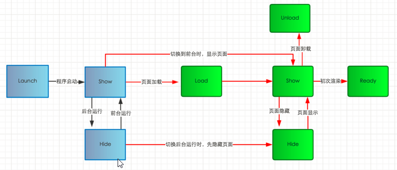

#### 应用生命周期

> https://developers.weixin.qq.com/miniprogram/dev/reference/api/App.html
>
> App() 必须在 `app.js` 中调用，必须调用且只能调用一次。不然会出现无法预期的后果。
>
> 后台： 点击左上角关闭小程序，或者按了设备 Home 键离开微信，并没有直接销毁，而是进入后台
> 前台：再次进入微信或再次打开小程序，相当于从后台进入前台。

1. onLaunch：初始化小程序时触发，全局只触发一次
2.  onShow：  小程序初始化完成或用户从后台切换到前台时触发
3. onHide:       用户从前台切换到后台隐藏时触发
4. onError:      小程序发送脚本错误，或者api调用失败时触发，并带上错误参数

```js
//app.js
App({ 
  onLaunch: function () {   // 监听小程序初始化完成时触发，全局只触发一次。
    console.log("app onLaunch")
  },  
  onShow(){                  // 监听小程序显示时触发，可多次触发。
    console.log('app onShow')
  },
  onHide(){                  // 监听小程序隐藏时触发，可多次触发。
    console.log('app onHide')
  },
  onError(){                 // 错误监听函数，可多次触发。
    console.log('app onError')
  },
  globalData: {
    userInfo: null
  }
})
```

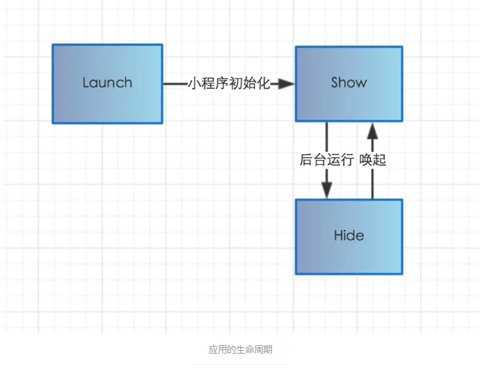

#### 页面生命周期

> https://developers.weixin.qq.com/miniprogram/dev/reference/api/Page.html

1. onLoad：首次进入页面加载时触发，可以在onLoad的参数中获取打开当前页面路径中的参数
2. onShow：   加载完成后，后台切到前台或者重新进入页面时触发
3. onReady：  页面首次渲染完成时触发
4. onHide：     从前台切到后台或进入其他页面时触发
5. onUnload：当使用重定向方法wx.redirectTo(OBJECT)或**关闭当前页返回上一页**wx.navigateBack()，触发onUnload

```js
page({
  /**
   * 生命周期函数--监听页面加载
   */
  onLoad: function (options) {
    console.log('我是页面级onLoad')
  },

  /**
   * 生命周期函数--监听页面初次渲染完成
   */
  onReady: function () {
    console.log('我是页面级onReady')
  },

  /**
   * 生命周期函数--监听页面显示
   */
  onShow: function () {
    console.log(this)
    console.log(this.data.img1)
    console.log('我是页面级show')
  },

  /**
   * 生命周期函数--监听页面隐藏
   */
  onHide: function () {
    console.log('我是页面级onHide')
  },

  /**
   * 生命周期函数--监听页面卸载
   */
  onUnload: function () {
    console.log('我是页面级onUnLoad')
  },
})
```

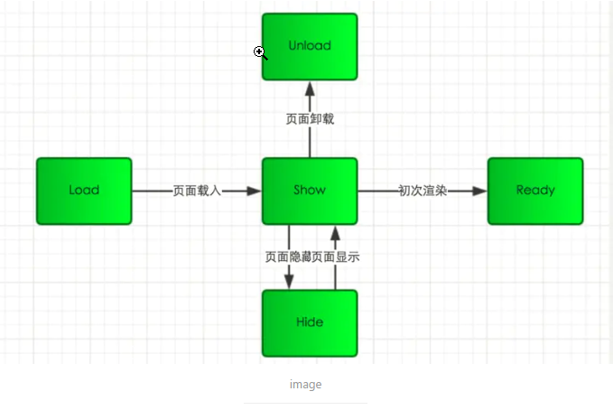


#### 两者触发顺序

>  通过console.log验证它们的触发顺序


**1-首次进入小程序**

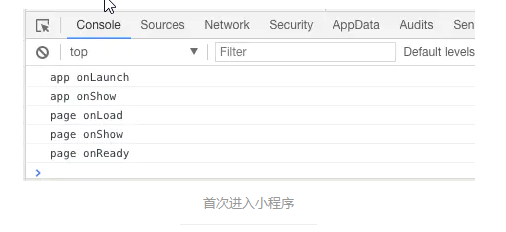

从图中可以看出，首次进入小程序会先触发应用生命周期中onLaunch方法和onShow方法，其次触发页面生命周期中onLoad、onShow和onReady方法。


**2-前台切换到后台**

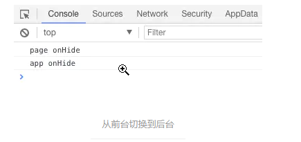

前台切换到后台时，先触发页面生命周期中onHide方法，再触发应用生命周期的onHide方法。


**3-后台切换到前台**

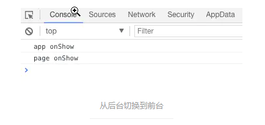

后台切换到前台时，先触发应用生命周期中onShow方法，再触发页面生命周期的onShow方法。


**4- wx.navigateTo跳转状态下，页面A和页面B的生命周期逻辑**

1、进入B页面：B执行onLoad()-->onShow()-->onReady()；

2、A页面navigateTo B页面：A执行onHide()，B执行onLoad()-->onShow()-->onReady()；

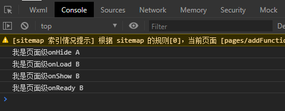

3、B页面返回A页面：B执行onUnload()，A执行onShow()；

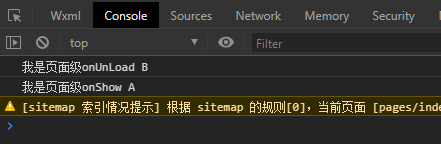

4、退出A页面：A执行onUnload()。


### 运行机制

胶囊

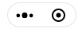


**前台/后台状态**

小程序启动后，界面被展示给用户，此时小程序进入**前台**状态

当用户点击胶囊按钮关闭小程序或安home键离开微信，此时小程序还未完全终止运行，而是进入了**后台**状态

当用户在一段时间内再次进入微信或再次打开小程序，小程序又会从后台进入**前台**


**销毁时机**

通常，只有当小程序进入后台一段时间，或者系统资源占用过高，才会被销毁，具体而言包括以下几种情形：

- 当小程序进入后台，小程序会在后台维持一小段的运行状态，如果这段时间内都未进入前台的话，小程序就会被销毁。
- 当小程序占用系统资源过高的话，就可能被系统销毁或被微信客户端主动回收。可用wx.onMemoryWarning监听内存告警事件


**小程序启动**

小程序启动分为两种情况：冷启动和热启动

- 冷启动（重新加载）：如果用户首次打开小程序，或者因维持后台状态时间到达而被销毁后再打开，此时小程序就是冷启动

- 热启动（千钧一发）：在小程序在后台维持运行还未被销毁的那一小段内再次进入前台，此时小程序就是热启动


**启动场景分类**

用户打开小程序时，场景可分为以下A、B两类

**A：**保留上次的浏览状态，A类一般有以下场景

| 场景值ID | 说明                                                         |
| :------- | :----------------------------------------------------------- |
| 1001     | 发现栏小程序主入口，「最近使用」列表（基础库2.2.4版本起包含「我的小程序」列表） |
| 1003     | 星标小程序列表                                               |
| 1023     | 系统桌面小图标打开小程序                                     |
| 1038     | 从其他小程序返回小程序                                       |
| 1056     | 聊天顶部音乐播放器右上角菜单，打开小程序                     |
| 1080     | 客服会话菜单小程序入口，打开小程序                           |
| 1083     | 公众号会话菜单小程序入口 ，打开小程序（只有腾讯客服小程序有） |
| 1089     | 聊天主界面下拉，打开小程序/微信聊天主界面下拉，「最近使用」栏（基础库2.2.4版本起包含「我的小程序」栏） |
| 1090     | 长按小程序右上角菜单，打开小程序                             |
| 1103     | 发现-小程序主入口我的小程序，打开小程序                      |
| 1104     | 聊天主界面下拉，从我的小程序，打开小程序                     |
| 1113     | 安卓手机负一屏，打开小程序                                   |
| 1114     | 安卓手机侧边栏，打开小程序                                   |
| 1117     | 后台运行小程序的管理页中，打开小程序                         |

- 若进入的场景中带有path，则每次打开小程序都进入对应的path页面

- 若进入的场景不带path

  - 若小程序是热启动，则保留原来状态
  - 若小程序是冷启动，则遵循下一节的重启策略，可能是首页或上次退出的页面

  

**B：**relaunch到指定页或首页，B场景为除了A场景以外

- 若进入的场景中带有path，则每次点击时都进入对应的path页面
- 若进入的场景中不带path，则每次进入都打开首页


### 运行环境

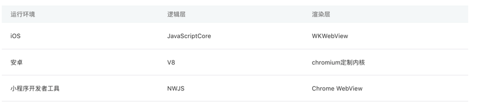

### 基础组件

#### icon图标组件

> 图标。组件属性的长度单位默认为px，[2.4.0](https://developers.weixin.qq.com/miniprogram/dev/framework/compatibility.html)起支持传入单位(rpx/px)。

| 属性  | 类型          | 默认值 | 必填 | 说明                                                         | 最低版本                                                     |
| :---- | :------------ | :----- | :--- | :----------------------------------------------------------- | :----------------------------------------------------------- |
| type  | string        |        | 是   | icon的类型，有效值：success, success_no_circle, info, warn, waiting, cancel, download, search, clear | [1.0.0](https://developers.weixin.qq.com/miniprogram/dev/framework/compatibility.html) |
| size  | number/string | 23     | 否   | icon的大小                                                   | [1.0.0](https://developers.weixin.qq.com/miniprogram/dev/framework/compatibility.html) |
| color | string        |        | 否   | icon的颜色，同css的color                                     | [1.0.0](https://developers.weixin.qq.com/miniprogram/dev/framework/compatibility.html) |

```html
<view>
  <icon type="success" size="80px"></icon>
  <icon type="success_no_circle" size="80px"></icon>
  <icon type="warn" size="80px"></icon>
  <icon type="info" size="80px"></icon>
  <icon type="waiting" size="80px" color="orange"></icon>
  <icon type="cancel" size="80px" ></icon>
  <icon type="search" size="80px" ></icon>
  <icon type="clear" size="80px" ></icon>
  <icon type="download" size="80px" color="#00f"></icon>
</view>
```

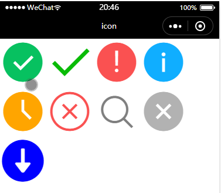

#### text

> font+span的结合体，行内元素
>
> text组件内只支持text嵌套。

| 属性       | 类型    | 默认值 | 必填 | 说明         | 最低版本                                                     |
| :--------- | :------ | :----- | :--- | :----------- | :----------------------------------------------------------- |
| selectable | boolean | false  | 否   | 文本是否可选 | [1.1.0](https://developers.weixin.qq.com/miniprogram/dev/framework/compatibility.html) |
| space      | string  |        | 否   | 显示连续空格 | [1.4.0](https://developers.weixin.qq.com/miniprogram/dev/framework/compatibility.html) |
| decode     | boolean | false  | 否   | 是否解码     | [1.4.0](https://developers.weixin.qq.com/miniprogram/dev/framework/compatibility.html) |

```html
  <!-- text -->
  <text>this is my first app</text>
  <text space="ensp">this is my two app</text>
  <text space="emsp">this is my three app</text>
  <text space="nbsp">this is my four app</text>
```

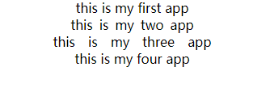


#### button

> 参考：https://developers.weixin.qq.com/miniprogram/dev/component/button.html

bindtap：单击事件

bindinput：输入框输入时触发事件


#### input

> 参考：https://developers.weixin.qq.com/miniprogram/dev/component/input.html
>
> input组件跟原生类差不多，但多了一些微信独特的属性


#### swiper

> 滑块视图容器，其中只可放置swiper-item组件，否则会导致未定义的行为 
>
> 在微信中，icon一般存在本地，图片一般是获取在线地址

常用属性和事件：

| 属性                   | 类型    | 默认值            | 必填 | 说明                                                         | 最低版本                                                     |
| :--------------------- | :------ | :---------------- | :--- | :----------------------------------------------------------- | :----------------------------------------------------------- |
| autoplay               | boolean | false             | 否   | 是否自动轮播                                                 | [1.0.0](https://developers.weixin.qq.com/miniprogram/dev/framework/compatibility.html) |
| interval               | number  | 5000              | 否   | 自动切换时间间隔                                             | [1.0.0](https://developers.weixin.qq.com/miniprogram/dev/framework/compatibility.html) |
| duration               | number  | 500               | 否   | 滑动动画时长                                                 | [1.0.0](https://developers.weixin.qq.com/miniprogram/dev/framework/compatibility.html) |
| indicator-dots         | boolean | false             | 否   | 是否显示小圆点                                               | [1.0.0](https://developers.weixin.qq.com/miniprogram/dev/framework/compatibility.html) |
| indicator-color        | color   | rgba(0, 0, 0, .3) | 否   | 小圆点颜色                                                   | [1.1.0](https://developers.weixin.qq.com/miniprogram/dev/framework/compatibility.html) |
| indicator-active-color | color   | #000000           | 否   | 当前选中的小圆点颜色                                         | [1.1.0](https://developers.weixin.qq.com/miniprogram/dev/framework/compatibility.html) |
| current                | number  | 0                 | 否   | 当前所在滑块的 index，可做默认图片显示                       | [1.0.0](https://developers.weixin.qq.com/miniprogram/dev/framework/compatibility.html) |
| circular               | boolean | false             | 否   | 是否采用无缝轮播                                             | [1.0.0](https://developers.weixin.qq.com/miniprogram/dev/framework/compatibility.html) |
| vertical               | boolean | false             | 否   | 滑动方向是否为纵向，必须给予height才能使用                   | [1.0.0](https://developers.weixin.qq.com/miniprogram/dev/framework/compatibility.html) |
| easing-function        | string  | "default"         | 否   | 指定 swiper 切换缓动动画类型                                 | [2.6.5](https://developers.weixin.qq.com/miniprogram/dev/framework/compatibility.html) |
| bindchange             | 事件    |                   | 否   | current 改变时会触发 change 事件，event.detail = {current, source} | [1.0.0](https://developers.weixin.qq.com/miniprogram/dev/framework/compatibility.html |
| bindanimationfinish    | 事件    |                   | 否   | 动画结束时会触animationfinish 事件，event.detail 同上        | [1.9.0](https://developers.weixin.qq.com/miniprogram/dev/framework/compatibility.html) |

**easing-function 的合法值**

| 值             | 说明         | 最低版本 |
| :------------- | :----------- | :------- |
| default        | 默认缓动函数 |          |
| linear         | 线性动画     |          |
| easeInCubic    | 缓入动画     |          |
| easeOutCubic   | 缓出动画     |          |
| easeInOutCubic | 缓入缓出动画 |          |

```html
<view>
	<swiper autoplay interval="3000" duration="300" circular style="height=100rpx" bindchange="change" bindanimationfinish="finish" >
		<swiper-item>
			<image src="https://timgsa.baidu.com/timg?image&quality=80&size=b9999_10000&sec=1595571756004&di=db5e10a48f737b677792d7e431f73202&imgtype=0&src=http%3A%2F%2Fcdn.duitang.com%2Fuploads%2Fitem%2F201408%2F14%2F20140814124008_3F25L.jpeg"></image>
		</swiper-item>
		<swiper-item>
			<image src="https://ss1.bdstatic.com/70cFuXSh_Q1YnxGkpoWK1HF6hhy/it/u=1727875035,1058014352&fm=26&gp=0.jpg"></image>
		</swiper-item>
		<swiper-item>
			<image src="https://ss2.bdstatic.com/70cFvnSh_Q1YnxGkpoWK1HF6hhy/it/u=352108518,153028892&fm=26&gp=0.jpg"></image>

		</swiper-item>
	</swiper>
</view>
```

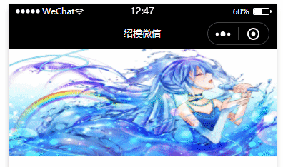


#### scroll-view

> 可滚动视图区域。使用竖向滚动时，需要给[scroll-view](https://developers.weixin.qq.com/miniprogram/dev/component/scroll-view.html)一个固定高度，通过 WXSS 设置 height。组件属性的长度单位默认为px，[2.4.0](https://developers.weixin.qq.com/miniprogram/dev/framework/compatibility.html)起支持传入单位(rpx/px)。

```html
<view>
	<scroll-view class="background-scroll" scroll-x >
		<view class="nav">
			<navigator>国际新闻</navigator>
			<navigator>国内新闻</navigator>
			<navigator>社会新闻</navigator>
			<navigator>娱乐新闻</navigator>
			<navigator>热点头疼</navigator>
			<navigator>科技栏目</navigator>
		</view>
	</scroll-view>
</view>
<style>
/* scroll-view */
.background-scroll{
  background-color: honeydew;
}
.nav{
  display: flex;
}
.nav navigator{
  height: 40rpx;
  white-space: nowrap;	//需配合这个属性让文字超过宽度不换行
  margin: 0 10px;

}
</style>
```

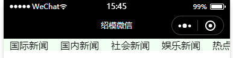


### WXML语法

> WXML（WeiXin Markup Language）是框架设计的一套标签语言，结合[基础组件](https://developers.weixin.qq.com/miniprogram/dev/component/index.html)、[事件系统](https://developers.weixin.qq.com/miniprogram/dev/framework/view/wxml/event.html)，可以构建出页面的结构。

#### 数据绑定

> 在之前的浏览器中，我们是通过浏览器提供的DOM模型结构进行数据绑定，而在小程序中并没有DOM模型结构和BOM模型结构，因此，小程序是通过WXML数据绑定的。
>
> 就是运用JS的data对象完成的WXML数据的动态显示，也就是说，WXML 中的动态数据均来自对应 Page 的 data。而数据在页面的显示则用 **插值表达式{{js表达式}}**
>
> 

##### 绑定分类

- 基础绑定

  ```
  //WXML
  <view> {{ message }} </view>
  
  //js
  Page({
    data: {
      message: 'Hello MINA!'
    }
  })
  ```

- 组件绑定

  ```
  //WXML
  <view id="item-{{id}}"> </view>
  
  //js
  Page({
    data: {
      id: 0
    }
  })
  ```


#### 列表渲染

列表渲染语法：`wx:for=“{{数组|对象}}”`

当前元素：默认变量名是`item`，  可以通过`wx:for-item = "xxx"`来更改变量名

当前下标：默认变量名是`index`，可以通过`wx:for-index = "xxx"`来更改变量名

```html
<view wx:for="{{array}}" wx:for-index="idx" wx:for-item="itemName">
  {{idx}}: {{itemName.message}}
</view>
```


tip: \<block>标签渲染是不会带上本身的标签，而用\<view>标签渲染时会带上本身的标签，


#### 条件渲染

条件渲染语法：`wx:if=“{{JS表达式}}”`

​						   `wx:elif=“{{JS表达式}}”`

​					  	 `wx:else=“{{JS表达式}}”`


##### `wx:if` vs `hidden`

因为 `wx:if` 之中的模板也可能包含数据绑定，所以当 `wx:if` 的条件值切换时，框架有一个局部渲染的过程，因为它会确保条件块在切换时销毁或重新渲染。

同时 `wx:if` 也是**惰性的**，如果在初始渲染条件为 `false`，框架什么也不做，在条件第一次变成真的时候才开始局部渲染。

相比之下，`hidden` 就简单的多，组件始终会被渲染，只是简单的控制显示与隐藏。

一般来说，`wx:if` 有更高的切换消耗而 `hidden` 有更高的初始渲染消耗。因此，如果需要频繁切换的情景下，用 `hidden` 更好，如果在运行时条件不大可能改变则 `wx:if` 较好。


#### 模板

> WXML提供模板（template），可以在模板中定义代码片段，然后在不同的地方调用。
>
> 这跟Vue的组件类似


**定义模版：**

>  在\<template>标签中，使用name属性，作为模板的名字

```html
//定义模板
<template name="msgItem">
	<view>
    	<text> {{index}}: {{msg}} </text>
   	 	<text> Time: {{time}} </text>
    </view>
</template>
```


**使用模板**

>  在\<template>标签中，使用is属性，声明需要使用的模板，然后将模板所需要的 data 传入

```html
//使用模板
<template is="msgItem" data="{{...item}}"/>

<script>
    Page({
        data: {
            item: {
                index: 0,
                msg: 'this is a template',
                time: '2016-09-15'
            }
        }
    })
</script>
```

模板拥有自己的作用域，只能使用 data 传入的数据以及模板定义文件中定义的 `<wxs />` 模块。


#### 引用

> WXML 提供两种文件引用方式`import`和`include`。

##### import导入并使用

```html
<import src="item.wxml"/>	//导入
<template is="item" data="{{text: 'HSM'}}"		//使用
```

**import 的作用域**

import 有作用域的概念，即只会导入(import)目标文件中定义的 template，而不会 import 在目标文件导入(import)的 template。

**如：C import B，B import A，在C中可以使用B定义的`template`，在B中可以使用A定义的`template`，但是C不能使用A定义的`template`**。


##### include

> `include` 可以将目标文件**除了** `<template/>` `<wxs/>` 外的整个代码引入，相当于是拷贝到 `include` 位置，如：
>
> 在include中书写样式时，推荐内联样式，或者写在引入的文件的wxss中或全局里面
>
> include，也有继承性，不能包含include中的template元素

```html
<!-- index.wxml -->
<include src="header.wxml"/>
<view> body </view>
<include src="footer.wxml"/>
```

```html
<!-- header.wxml -->
<view> header </view>
```

```html
<!-- footer.wxml -->
<view> footer </view>
```


### WXS语法

> https://developers.weixin.qq.com/miniprogram/dev/reference/wxs/01wxs-module.html
>
> WXS（WeiXin Script）是小程序的一套脚本语言， 与 JavaScript 是不同的语言，有自己的语法，并不和 JavaScript 一致。

#### 模块

> 每一个 `.wxs` 文件和 `<wxs>` 标签都是一个单独的模块。每个模块都有自己独立的作用域。

- **\<WXS/>标签**

  | 属性名 | 类型   |      | 说明                                                         |
  | :----- | :----- | :--- | :----------------------------------------------------------- |
  | module | String |      | 当前 `<wxs>` 标签的模块名。必填字段。                        |
  | src    | String |      | 引用 .wxs 文件的相对路径。仅当本标签为**单闭合标签**或**标签的内容为空**时有效。 |

  **module 属性**

  module 属性是当前 `<wxs>` 标签的模块名。在单个 wxml 文件内，建议其值唯一。有重复模块名则按照先后顺序覆盖（后者覆盖前者）。不同文件之间的 wxs 模块名不会相互覆盖。

- **.WXS文件**

  - （导出）module.exports

  - （引入）require

    - 只能引用 `.wxs` 文件模块，且必须使用相对路径。

    - `wxs` 模块均为单例，`wxs` 模块在第一次被引用时，会自动初始化为单例对象。多个页面，多个地方，多次引用，使用的都是同一个 `wxs` 模块对象。

    - 如果一个 `wxs` 模块在定义之后，一直没有被引用，则该模块不会被解析与运行。


#### 数据类型

WXS 语言目前共有以下几种数据类型：

- `number` ： 数值
- `string` ：字符串
- `boolean`：布尔值
- `object`：对象
- `function`：函数
- `array` : 数组
- `date`：日期
- `regexp`：正则

**WXS中没有instanceof ，可以用constructor来判断引用类型**


#### 基础类库

- console
- Math
- JSON
  - `stringify(object)`: 将 `object` 对象转换为 `JSON` 字符串，并返回该字符串。
  - `parse(string)`: 将 `JSON` 字符串转化成对象，并返回该对象。
- Number
- Date
- Global


#### WXS与JS的区别

- wxs 不依赖于运行时的基础库版本，可以在所有版本的小程序中运行。
- wxs 与 javascript 是不同的语言，有自己的语法，并不和 javascript 一致。
- wxs 的运行环境和其他 javascript 代码是隔离的，wxs 中不能调用其他 javascript 文件中定义的函数，也不能调用小程序提供的API。
- wxs 函数不能作为组件的事件回调。
- 由于运行环境的差异，在 iOS 设备上小程序内的 wxs 会比 javascript 代码快 2 ~ 20 倍。在 android 设备上二者运行效率无差异


### 事件调用

> 微信小程序事件是视图层（WXML）到逻辑层（JS）的通讯方式
>
> 事件是用户与微信小程序的交互的通讯接口
>
> 在JS中就有事件操作的概念，微信小程序的更加简便
>
> 事件对象可以携带额外信息，如 id, dataset, touches。

#### 事件使用方式

以"bind+事件类型"或“catch+事件类型” 作为用户的事件监听器，连接事件源和事件处理程序

**事件冒泡阶段：**

bind表示默认的冒泡事件，点击事件源，会向上冒泡

catch表示阻止默认的事件冒泡，点击事件源，事件不会向上冒泡

mut-bind:表示互斥事件绑定，会向上冒泡直到遇到同类mut-bind后停止，不影响 `bind`和 `catch` 的绑定效果。【2.8.2版本】

**事件捕获阶段【1.5.0】:**

如果需要在捕获阶段监听事件，可以采用`capture-bind`  或`capture-catch`关键字。

capture-bind：事件捕获阶段监听事件

capture-catch：中断事件捕获，也间接取消了事件冒泡


#### 事件对象(event)

```javascript
{
    "type":'tap'	//事件触发类型
    "timeStamp":""	//事件生成时的时间戳
    "target":{		//触发事件的组件的一些属性值集合	
        "id":""	//事件源组件的ID
        "dataset"：{}//存放自定义属性的集合
    }		
    "currentTarget":{//当前组件的一些属性值集合
        "id":""		//当前组件ID
        "dataset"：{}
    }
    "details":""	 
    "touches":[]	//当前停留在屏幕上的触摸点
    "changedTouches":""
}
```

**dataset**

由`-`组成的连字符，会被转换成驼峰写法

- `data-element-type` ，最终会呈现为 `elementType` ；

大写字符会被转换成小写字符

- `data-elementType` ，最终会呈现为 `elementtype` 。


**mark**【2.7.1】

类似dataset，但会合并冒泡事件路径上所有的mark属性，并返回给事件回调函数。（即使事件不是冒泡事件，也会 `mark` 。），而 `dataset` 仅包含一个节点的 `data-` 属性值。

```html
<view mark:myMark="last" bindtap="bindViewTap">
  <button mark:anotherMark="leaf" bindtap="bindButtonTap">按钮</button>
</view>
```

在上述 WXML 中，如果按钮被点击，将触发 `bindViewTap` 和 `bindButtonTap` 两个事件，事件携带的 `event.mark` 将包含 `myMark` 和 `anotherMark` 两项。

```js
Page({
  bindViewTap: function(e) {
    e.mark.myMark === "last" // true
    e.mark.anotherMark === "leaf" // true
  }
})
```


**target**和**currtentTarget**

target是事件源，也就是一开始被点击的对象，点击了哪个就是哪个，是固定的

currentTarget是目前触发到了的对象，不是固定的，会跟随冒泡或捕获而改变


#### 事件类型

| 类型               | 触发条件                                                     | 最低版本                                                     |
| :----------------- | :----------------------------------------------------------- | :----------------------------------------------------------- |
| touchstart         | 手指触摸动作开始                                             |                                                              |
| touchmove          | 手指触摸后移动                                               |                                                              |
| touchcancel        | 手指触摸动作被打断，如来电提醒，弹窗                         |                                                              |
| touchend           | 手指触摸动作结束                                             |                                                              |
| tap                | 手指触摸后马上离开                                           |                                                              |
| longpress          | 手指触摸后，超过350ms再离开，如果指定了事件回调函数并触发了这个事件，tap事件将不被触发 | [1.5.0](https://developers.weixin.qq.com/miniprogram/dev/framework/compatibility.html) |
| longtap            | 手指触摸后，超过350ms再离开（推荐使用longpress事件代替）     |                                                              |
| transitionend      | 会在 WXSS transition 或 wx.createAnimation 动画结束后触发    |                                                              |
| animationstart     | 会在一个 WXSS animation 动画开始时触发                       |                                                              |
| animationiteration | 会在一个 WXSS animation 一次迭代结束时触发                   |                                                              |
| animationend       | 会在一个 WXSS animation 动画完成时触发                       |                                                              |
| touchforcechange   | 在支持 3D Touch 的 iPhone 设备，重按时会触发                 | [1.9.90](https://developers.weixin.qq.com/miniprogram/dev/framework/compatibility.html) |


运算符的操作

- 微信小程序基础框架
- 微信小程序组件
- 微信小程序API接口的调用
- 微信小程序服务器数据调用
- 综合案例讲解


