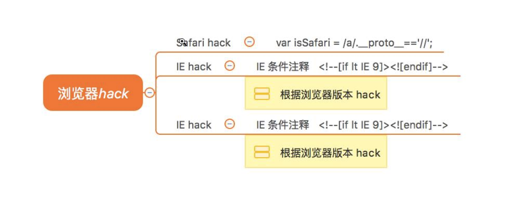

# 浏览器兼容性问题

前言：

在各大浏览器厂商的发展过程中，他们其实对web的标准都有不同的实现，因为实现的标准的不同，所以会有兼容性的产生,早期IE是在浏览器的世界中，占据主导地位。所以它自身实现了很多不同于标准浏览器的东西，有css的，也有js的。

从IE8开始，IE浏览器渐渐遵循标准，到IE9后由于大家都一致认为标准很重要，可以说在兼容性上比较好了，但是在中国来说，由于xp的占有率问题，还是有很多xp系统ie7、8浏览器。

## 处理兼容性的思路

首先以最大程度完善设计稿为基础，再考虑兼容性，不能盲目为了兼容问题而弃用方便简洁的新方法（如 HTML5、CSS3）；当然也不能用过新的技术方法使得兼容性过于低、实用性差。

**渐进增强**

针对低版本浏览器进行构建页面，保证最基本的功能，然后再针对高级浏览器进行效果、交互等改进和追加功能达到更好的用户体验。

**优雅降级**

一开始就构建完整的功能，然后再针对低版本浏览器进行兼容。


**区别**

- 优雅降级是从复杂的现状开始，并试图减少用户体验的供给；而渐进增强则是从一个非常基础的，能够起作用的版本开始，并不断扩充，以适应未来环境的需要。
- 降级（功能衰减）意味着往回看，而渐进增强则意味着朝前看，同时保证其根基处于安全地带。


## 样式兼容性（CSS）


### 1. reset

重置类样式表


### 2. 厂商前缀

厂商前缀是由于不同厂商对标准的实现先后顺序不同


### 3. 条件注释

条件注释是HTML源码中被IE有条件注释的语句，条件注释可被用来向不同版本的IE提供及隐藏代码


```html
<!--[if IE 6]>
<p>You are using Internet Explorer 6.</p>
<![endif]-->


<!--[if !IE]><!-->
<script>alert(1);</script>
<!--<![endif]-->


<!--[if IE 8]>
<link href="ie8only.css" rel="stylesheet">
<![endif]-->

```

❗️使用了条件注释的页面在 Windows Internet Explorer 9 中可正常工作，但在 Internet Explorer 10 中无法正常工作， IE10 不再支持条件注释。


### 4. css hack

根据不同的浏览器（主要针对IE）,设置不同的样式和 元素，主要是利用到了浏览器对不认识属性的掠过而不报错特点。

```html
<style>
.box {
  color: red;
  _color: blue; /* IE6 下它生效 */
  *color: pink; /* IE67 下它生效 */
  color: yellow\9; /* IE/Edge 6-8 下它生效 */
}
</style>


<!–-[if IE 7]>
<link rel="stylesheet" href="ie7.css" type="text/css" />
<![endif]–->

```


## 交互兼容性（JS）


### 封装兼容性事件处理方法

```javascript
function addEvent(ele,type,handle){
    if (ele.addEventListener) {
        ele.addEventListener(type,handle,false)
    }else if(ele.attachEvent){
        ele.attachEvent('on'+type,function(){
            handle.call(ele)
        })
    }else{
        ele['on'+type] = handle;
    }
}
```


### 封装阻止事件冒泡函数

```javascript
function cancelBubble(event){
    if(event.stopPropagation){
        event.stopPropagation()
    }else{
        event.cancelBubble = true;
    }
}
```


### 封装阻止默认事件的函数

```javascript
function cancelHandler(event){
    if(event.preventDefault){
       event.preventDefault();
    }else{
        event.returnValue = false;
    }
    //return false封装不进去，因为对于函数来说这是结束函数返回false
}
```


### 浏览器hack




参考文章：https://juejin.im/post/6844903493161975822#comment