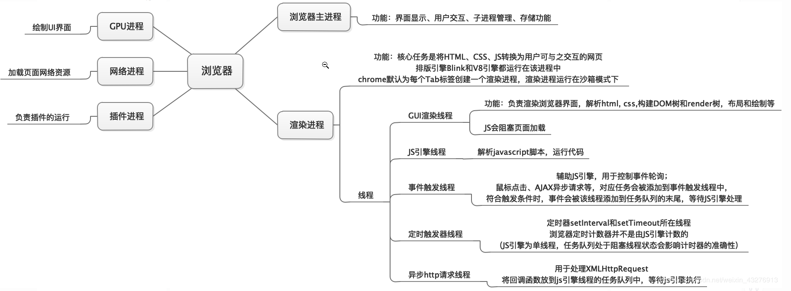

# 浏览器工作原理

## 宏观视角下的浏览器

### 01、仅仅打开了一个页面，为什么会有4个进程

> 
>
> 07年以前的浏览器都是单进程，现在的浏览器是多进程，

关于渲染进程：

- 根域名相同的情况下，新开的窗口只会共用同一个渲染进程。
- 根域名不同的情况下，每新开一个窗口就会创建一个新的渲染进程，
- iframe也相当于一个窗口，也会创建新的渲染进程，如果iframe的根域名相同，就会共用一个渲染进程