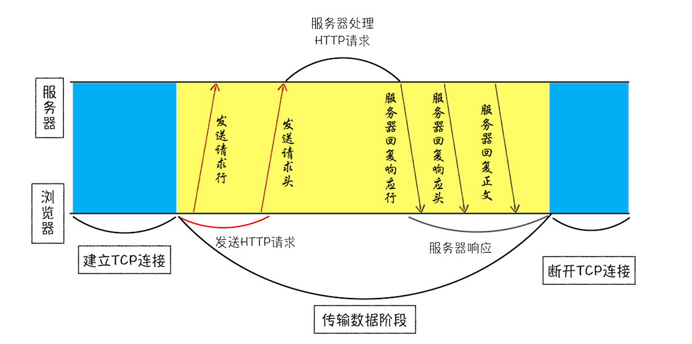
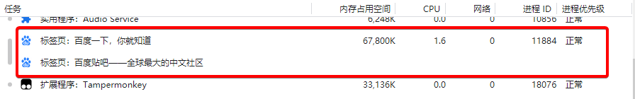
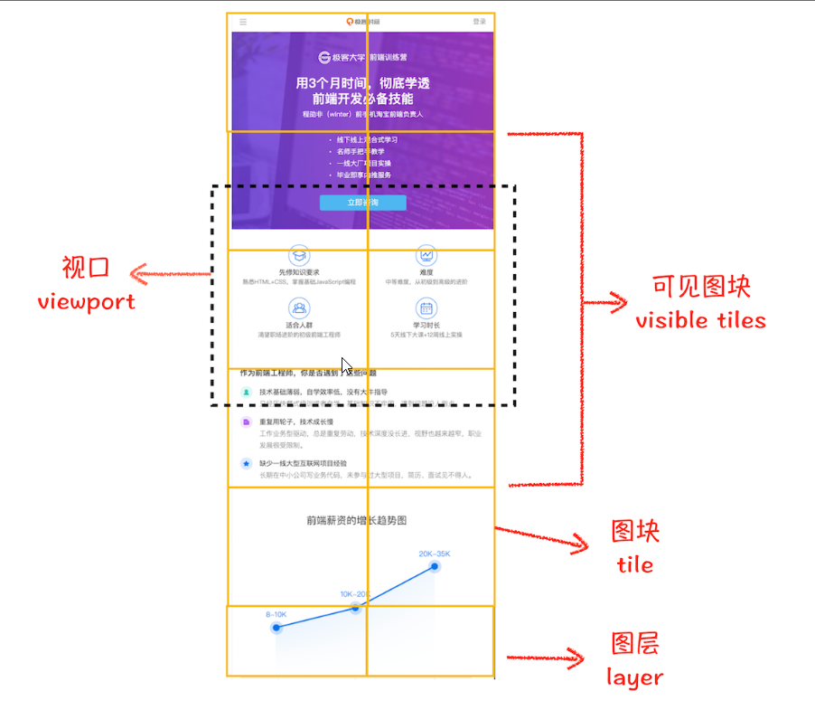

# 浏览器工作原理（chrome）

## 宏观视角下的浏览器

### 1. 浏览器的架构演进

浏览器的架构经历了早期的**单进程浏览器**（2007） -->  **多进程浏览器**（现在）  -->  **面向服务的架构**SOA（未来）。这里我们暂不讨论未来的SOA架构，仅分析单进程到多进程浏览器的演进历史。


在分析单进程与多进程之前，我们需要先知道线程与进程。

#### 进程和线程

在讨论单进程与多进程之前，我们需要一些前置知识，什么是并行处理。


**并行处理**

计算机中的并行处理就是同一时刻处理多个任务，比如我们要计算下面这三个表达式的值，并显示出结果。

```javascript
A = 1+2
B = 20/5
C = 7*8
```

在编写代码的时候，我们可以把这个过程拆分为4个任务：

任务 1：计算 A=1+2；

任务 2：计算 B=20/5；

任务 3：计算 C=7*8；

任务 4：显示最后计算的结果。

正常情况下程序可以使用**单线程**来处理，也就是分四步按照顺序分别执行这四个任务。

如果采用**多线程（3）**，会怎么样呢？我们只需分“两步走”：第一步，使用三个线程同时执行前三个任务；第二步，再执行第四个显示任务。

通过对比分析，你会发现用单线程执行需要四步，而使用多线程只需要两步。因此，**使用并行处理能大大提升性能。**


从图中可以看到，**线程是依附于进程的，而进程中使用多线程并行处理能提升运算效率。**

总结来说，进程和线程之间的关系有以下 4 个特点。

1. **进程中的任意一线程执行出错，都会导致整个进程的崩溃**

2. **线程之间共享进程中的数据**

   

   从上图可以看出，线程 1、线程 2、线程 3 分别把执行的结果写入 A、B、C 中，然后线程 2 继续从 A、B、C 中读取数据，用来显示执行结果。

3. **当一个进程关闭后，操作系统会回收进程所占用的内容。**

   

4. **进程之间的内容相互隔离**

   进程隔离是为保护操作系统中进程互不干扰的技术，每一个进程只能访问自己占有的数据，也就避免出现进程 A 写入数据到进程 B 的情况。正是因为进程之间的数据是严格隔离的，所以一个进程如果崩溃了，或者挂起了，是不会影响到其他进程的。如果进程之间需要进行数据的通信，这时候，就需要使用用于进程间通信（IPC）的机制了。

   

**总结**：

1. 所谓进程就是启动一个程序的时候，操作系统会为该程序创建一块内存，用来存放代码、运行中的数据和一个执行任务的主线程的一个运行环境
2. 线程是由进程创造的，且一个线程，同一时刻只能执行一个任务。
3. 一个进程可以包含多个线程，且线程之间可以共享进程中的数据（进程存在一个数据池）
4. 进程之间不能直接进行数据通信，需要通过进程间通信IPC（InterProcess communication）


#### 单进程浏览器时代

顾名思义，单进程浏览器是指浏览器的所有功能模块都是运行在同一个进程里，这些模块包含了网络、插件、JavaScript 运行环境、渲染引擎和页面等。其实早在 2007 年之前，市面上浏览器都是单进程的。单进程浏览器的架构如下图所示：


如此多的功能模块运行在一个进程里，是导致单进程浏览器**不稳定、不流畅和不安全**的一个主要因素。下面我就来一一分析下出现这些问题的原因。

##### 缺点

**不稳定**

早期浏览器需要借助于插件来实现诸如 Web 视频、Web 游戏等各种强大的功能，比如Flash，但是插件是最容易出问题的模块，并且还运行在浏览器进程之中，所以一个插件的意外崩溃会引起整个浏览器的崩溃。

除了插件之外，渲染引擎模块也是不稳定的，通常一些复杂的 JavaScript 代码就有可能引起渲染引擎模块的崩溃。和插件一样，渲染引擎的崩溃也会导致整个浏览器的崩溃。


**不流畅**

前面说过，一个线程，在同一时刻只能执行一个任务。在上图的页面线程中，页面的渲染模块、JavaScript 执行环境以及插件都是运行在同一个线程中的，这就意味着同一时刻只能有一个模块可以执行。

而如果让一个无限循环的脚本运行在一个单进程的浏览器的页面里。会发生什么？

```javascript
function freeze(){
    while(1){
		console.log('freeze')
    }
}
freeze()
```

因为这个脚本是无限循环的，所以当其执行时，它会独占整个线程，这样导致其他运行在该线程中的其他模块就没有机会被执行。而浏览器中所有的页面都运行在该线程中，所以这些页面都没有机会去执行任务，这样就会导致整个浏览器失去响应，变卡顿。

除了上述**脚本**或者**插件**会让单进程浏览器变卡顿外，**页面的内存泄漏**也是单进程变慢的一个重要原因。通常浏览器的内核都是非常复杂的，运行一个复杂点的页面再关闭页面，会存在内存不能完全回收的情况，这样导致的问题是使用时间越长，内存占用越高，浏览器会变得越慢。


**不安全**

这里依然可以从 插件和页面脚本的两个方面来解释该原因。


插件可以使用C/C++等代码编写，通过插件可以获取到操作系统的任意资源，当你在页面运行一个插件也就意味着这个插件能完全操作你的电脑，如果是个恶意插件，那么它就可以释放病毒，窃取你的帐号密码，引发安全性问题。


至于页面脚本，它可以通过浏览器的漏洞来获取系统权限，这些脚本获取系统权限之后也可以对你电脑做一些恶意的事情，同样也会 引发安全性问题。


#### 多进程浏览器时代

##### 早期多进程架构

你可以先看看下面这张图，这是 2008 年 Chrome 发布时的进程架构。


从图中可以看出，Chrome 的页面是运行在单独的渲染进程中的，同时页面里的插件也是运行在单独的插件进程之中，而进程之间是通过 IPC 机制进行通信（如图中虚线部分）。


**我们先看看如何解决不稳定的问题。**

由于进程是隔离的，所有当一个页面或者插件崩溃，影响到的仅仅是当前的页面进程或者插件进程，并不会影响到浏览器和其他页面 。这就完美解决里页面或插件的崩溃会导致浏览器崩溃，也就是不稳定的原因。


**接下来再来看看不流畅的问题是如何解决的。**

同样，JS代码也是运行在渲染进程中，即便是JS阻塞里显然进程，影响的也只是当前的渲染页面，而不会影响浏览器和其他页面，**因为其他页面的脚本是运行在它们自己的渲染进程中**


**最后我们再来看看上面的两个安全问题是怎么解决的。**

采用多进程架构的额外好处是可以使用安全沙箱，你可以把沙箱看出是操作系统给进程上了一把锁，沙箱里面的程序可以运行，，但是不能在你的硬盘上写入任何数据，也不能再敏感位置读取任何数据。


chrome把**插件进程**和**渲染进程**锁在了沙箱里，这样即使在渲染进程或者插件进程里面执行了恶意程序，恶意程序也无法突破沙箱去获取系统权限。


##### 目前多进程架构


从图中可以看出，最新的chrome浏览器包括：**一个浏览器** 主进程、**一个GPU **进程、**一个网络** 进程

**多个渲染** 进程和**多个插件** 进程


下面我们来逐个分析下这几个进程的功能

**浏览器进程**：主要负责界面显示、用户交互、子进程管理、同时提供存储等功能

**渲染进程**：主要负责将HTML、CSS、JS转换为用户可以与之交互的网页，排版引擎Blink和JS的V8引擎都运行在该进程中，**默认情况下，chrome会为每个页面创建一个渲染进程，处于安全考虑，渲染进程都运行在沙箱模式下**

**GPU进程**：主要负责实现3D CSS效果

**网络进程**：主要负责页面的网络资源加载。

**插件进程**：主要负责插件的运行，因插件易奔溃，所有需要通过插件进程来隔离。


##### 缺点

- **更高的资源占用**：因为每个进程都会包含公共基础结构的副本（如JS运行环境），这就意味着浏览器会消耗更多的内存资源
- **更复杂的体系架构：**浏览器个模块之间耦合性高，扩展性差等问题，会导致现在的架构已经很难适应新的需求。


#### 未来面向服务的架构（SOA）

为了解决这些问题，在 2016 年，Chrome 官方团队使用“面向服务的架构”（Services Oriented Architecture，简称 SOA）的思想设计了新的 Chrome 架构。也就是说 Chrome 整体架构会朝向现代操作系统所采用的“面向服务的架构” 方向发展，原来的各种模块会被重构成独立的服务（Service），每个服务（Service）都可以在独立的进程中运行，访问服务（Service）必须使用定义好的接口，通过 IPC 来通信，从而构建一个更内聚、松耦合、易于维护和扩展的系统，更好实现 Chrome 简单、稳定、高速、安全的目标。


#### 总结

- 最初的浏览器都是单进程的，它们不稳定、不流畅且不安全，之后出现了 Chrome，创造性地引入了多进程架构，并解决了这些遗留问题。但随着Chrome 的架构体系变得愈发复杂，最终 Chrome 团队选择了面向服务架构（SOA）形式。
- 在单进程浏览器中，所有的页面都共享着同一套JavaScript运行环境，同样，对于存储Cookie也都是在一个线程里面操作的。
- 在多进程浏览器中、默认情况下，chrome会为每个页面创建一个渲染进程，但如果该页面是同源的，新页面就会复用父页面的渲染进程。官方把这个默认策略叫process-per-site-instance。
- 早期多进程架构：主进程、渲染进程、插件进程
- 现代多进程架构：主进程、渲染进程、插件进程、GPU进程、网络进程


### 2. 完整的TCP/IP工作流程

​		TCP（Transmission Control Protocol，传输控制协议）是为了在不可靠的互联网络上提供可靠的端到端字节流而专门设计的一个传输协议，用来进行数据传输。

互联网中的数据是通过数据包来传输的。如果发送的数据很大，那么该数据就会被拆分为很多小数据包来传输。比如你现在听的音频数据，是拆分成一个个小的数据包来传输的，并不是一个大的文件一次传输过来的。


​		下面，我将以一个数据包的视角，来分析数据是如何传输的。


#### 1. IP:把数据包送达目的主机

​		数据包要在互联网上进行传输，就是符合网际协议（Internet Protocol，简称IP）标准，互联网上不同的在线设备都有唯一的地址，地址只是一个数字，这和大部分家庭收件地址类似，你只需要知道你要送达的家庭的具体地址，就可以往这个地址发送包裹，这样物理系统就能把物品送到目的地。

**计算机的地址就称为 IP 地址，访问任何网站实际上只是你的计算机向另外一台计算机请求信息。**

​		如果想要把一个数据包从主机A --> 主机B，那么在传输之前，数据包上会被附加上主机B的IP地址，这样在传输过程中才能正确寻址。额外地，数据包上还会附加上主机 A 本身的 IP 地址，有了这些信息主机 B 才可以回复信息给主机 A。这些附加的信息会被装进一个叫 IP 头的数据结构里。IP 头是 IP 数据包开头的信息，包含 IP 版本、源 IP 地址、目标 IP 地址、生存时间等信息。


为了方便理解，我先把网络简单分为三层结构，如下图：


下面我们一起看一下数据包从主机A到主机B的旅程：

1. 上层将数据包交给网络层
2. 网络层再将IP头附加到数据包上，组装成新的IP数据包，并交给底层；
3. 底层通过物理网络将数据包传输给主机B;
4. 数据包被传输到主机B的网络层，在这里主机B拆开数据包的IP头信息，并将拆开来的数据交给上层
5. 最终数据包到达了主机B的上层了。


#### 2. UDP:把数据包送达应用程序

IP是非常底层的协议，只负责把数据包传送到对方电脑，但是对方电脑并不知道吧数据包交给哪个程序，是交给浏览器还是王者荣耀？因此，需要基于IP之上开发能和应用打交道的协议，最常见的是**用户数据包协议**（UDP  User Datagram protocol）


UDP中一个最重要的信息是端口号，端口号其实就是一个数字，每个想访问网络的程序都需要绑定一个端口号，通过端口号UDP就能把指定的数据包发送给指定的程序了，所以，**IP通过IP地址吧数据包发送给指定的电脑，而UDP通过端口号把数据包分发给正确的程序**，和IP头一仰，端口号hi被装进UDP头里面，UDP头再和原始数据包合并成新的UDP数据包。UDP头中除了目的端口，还有源端口号等信息


为了支持 UDP 协议，我把前面的三层结构扩充为四层结构，在网络层和上层之间增加了传输层，如下图所示：


下面我们一起来看下一个数据包从主机A旅行到主机B的路线：

1. 上层将数据包交给传输层
2. 传输层会在数据包前面附加上UDP头，组成新的UDP数据包，再将新的UDP数据包交给网络层 
3. 网络层再将 IP 头附加到数据包上，组成新的 IP 数据包，并交给底层；
4. 数据包被传输到主机 B 的网络层，在这里主机 B 拆开 IP 头信息，并将拆开来的数据部分交给传输层；
5. 在传输层，数据包中的 UDP 头会被拆开，并**根据 UDP 中所提供的端口号，把数据部分交给上层的应用程序；**
6. 最终，含有“极客时间”信息的数据包就旅行到了主机 B 上层应用程序这里。

在使用 UDP 发送数据时，有各种因素会导致数据包出错，虽然 UDP 可以校验数据是否正确，但是对于错误的数据包，UDP 并不提供重发机制，只是丢弃当前的包，而且 UDP 在发送之后也无法知道是否能达到目的地。

虽说 UDP 不能保证数据可靠性，但是传输速度却非常快，所以 UDP 会应用在一些关注速度、但不那么严格要求数据完整性的领域，如在线视频、互动游戏等。


#### 3. TCP:把数据完整地送达应用程序

对于浏览器请求，或者邮件这类要求数据传输可靠性（reliability）的应用，如果使用 UDP 来传输会存在两个问题：

1. 数据包在传输过程中容易丢失；
2. 大文件会被拆分成很多小的数据包来传输，这些小的数据包会经过不同的路由，并在不同的时间到达接收端，而 UDP 协议并不知道如何组装这些数据包，从而把这些数据包还原成完整的文件。

基于这两个问题，我们引入 TCP 了。**TCP（Transmission Control Protocol，传输控制协议）是一种面向连接的、可靠的、基于字节流的传输层通信协议。**相对于 UDP，TCP 有下面两个特点:

1. 对于数据包丢失的情况，TCP 提供重传机制；
2. TCP 引入了数据包排序机制，用来保证把乱序的数据包组合成一个完整的文件。

和 UDP 头一样，TCP 头除了包含了目标端口和本机端口号外，还提供了用于排序的序列号，以便接收端通过序号来重排数据包。

下面看看 TCP 下的单个数据包的传输流程：


通过上图你应该可以了解一个数据包是如何通过 TCP 来传输的。TCP 单个数据包的传输流程和 UDP 流程差不多，不同的地方在于，通过 TCP 头的信息保证了一块大的数据传输的完整性。

下面我们再看下**完整的 TCP 连接过程**，通过这个过程你可以明白 TCP 是如何保证重传机制和数据包的排序功能的。

从下图可以看出，一个完整的 TCP 连接的生命周期包括了“**建立连接**”“**传输数据**”和“**断开连接**”三个阶段。


**首先，建立连接阶段**。这个阶段是通过“三次握手”来建立客户端和服务器之间的连接。TCP 提供面向连接的通信传输。面向连接是指在数据通信开始之前先做好两端之间的准备工作。所谓三次握手，是指在建立一个 TCP 连接时，客户端和服务器总共要发送三个数据包以确认连接的建立。

**其次，传输数据阶段。**在该阶段，接收端需要对每个数据包进行确认操作，也就是接收端在接收到数据包之后，需要发送确认数据包给发送端。所以当发送端发送了一个数据包之后，在规定时间内没有接收到接收端反馈的确认消息，则判断为数据包丢失，并触发发送端的重发机制。同样，一个大的文件在传输过程中会被拆分成很多小的数据包，这些数据包到达接收端后，接收端会按照 TCP 头中的序号为其排序，从而保证组成完整的数据。

**最后，断开连接阶段**。数据传输完毕之后，就要终止连接了，涉及到最后一个阶段“四次挥手”来保证双方都能断开连接。


到这里你应该就明白了，TCP 为了保证数据传输的可靠性，牺牲了数据包的传输速度，因为“三次握手”和“数据包校验机制”等把传输过程中的数据包的数量提高了一倍。


#### 总结

1. 互联网中的数据是通过数据包来传输的，数据包在传输过程中容易丢失或出错。
2. IP 负责把数据包送达目的主机。
3. UDP 负责把数据包送达具体应用。
4. 而 TCP 保证了数据完整地传输，它的连接可分为三个阶段：建立连接、传输数据和断开连接。


### 3. 完整的HTTP请求流程

​		HTTP是一个简单的请求-响应协议，它通常运行在TCP之上，是一种允许**浏览器向服务器获取资源的协议**，是 Web 的基础，通常由浏览器发起请求，用来获取不同类型的文件，例如 HTML 文件、CSS 文件、JavaScript 文件、图片、视频等。此外，HTTP 也是浏览器使用最广的协议

​		在今天这篇文章中，我将通过分析一个 HTTP 请求过程中每一步的状态来带梳理完整的 HTTP 请求过程。

#### 1. 构建请求行

首先，浏览器构建请求行信息（如下所示），构建好后，浏览器准备发起网络请求。

```javascript
请求方法   请求URL  HTTP协议及版本
GET /  index.html   HTTP1.1
```


#### 2. 查找缓存

在真正发起网络请求之前，浏览器会先在浏览器缓存中查询是否有要请求的文件，其中，**浏览器缓存是一种在本地保存的资源副本，以供下次请求时直接使用的技术。**

当浏览器发现请求的资源已经在浏览器缓存中存有副本，它就会拦截请求，返回该资源的副本，并直接结束请求，而不会再去源服务器重新下载，这样做的好处是：

1. 缓解服务器压力，提升性能（获取资源的耗时更短了）
2. 对于网站来说，缓存是实现资源加载的重要组成部分。

当然，如果缓存查找失败，就会进入网络请求过程了。要详细了解缓存，参考xxx


#### 3. DNS解析IP地址

不过，先不急，在了解网络请求之前，我们需要先看看HTTP和TCP的关系。因为浏览器使用HTTP协议作为应用层协议，用来**封装请求的文本信息**，并使用TCP/IP作传输层协议将它发到网络上，所以在HTTP工作开始之前，浏览器需要通过TCP与服务器建立连接。也就是说**HTTP的内容是通过TCP的传输数据阶段来实现的**，你可以结合下图更好地理解这两种的关系。

那接下来可以思考这么”一连串”问题：

1. HTTP网络请求的第一步是做什么呢？结合上图看，是和服务器建立TCP连接
2. 那建立连接的信息都有了吗？在上一篇xxx文章中，我们讲到建立TCP连接的第一步就是需要准备IP和端口号。
3. 那怎么获取IP和端口号呢？这得看看我们现在有什么，我们有一个目标URL地址，那是否可以利用URL地址来获取IP和端口号信息呢？

在上一篇xxx文章中，我们介绍过数据包都是通过 IP 地址传输给接收方的。由于 IP 地址是数字标识，比如百度网站的 IP 是 39.106.233.176, 难以记忆，但使用百度的域名（baidu.com）就好记多了，所以基于这个需求又出现了一个服务，负责把域名和 IP 地址做一一映射关系。这套域名映射为 IP 的系统就叫做“**域名系统**”，**简称 DNS（Domain Name System）**。

所以，这样一路推导下来，你会发现在第一步浏览器会请求 DNS 返回域名对应的 IP。当然浏览器还提供了 DNS 数据缓存服务，如果某个域名已经解析过了，那么浏览器会缓存解析的结果，以供下次查询时直接使用，这样也会减少一次网络请求。

拿到 IP 之后，接下来就需要获取端口号了。通常情况下，如果 URL 没有特别指明端口号，那么 HTTP 协议默认是 80 端口。

#### 4. 等待TCP队列

现在已经把端口和 IP 地址都准备好了，那么下一步是不是可以建立 TCP 连接了呢？


答案依然是“不行”，chrome有个机制，同一个域名 同时最多只能建立6个TCP连接，如果在同一域名下同时有10个请求发生，那么4个请求会进入排列等待状态，直至进行中的请求完成。


当然，如果请求的数量少于6，会直接进入下一步，建立TCP连接。


#### 5. 建立TCP连接

排队等待结束之后，终于可以快乐地和服务器握手了，在 HTTP 工作开始之前，浏览器通过 TCP的三次握手与服务器建立连接。


#### 6. 发送HTTP请求

一旦建立了TCP连接，浏览器就可以呃服务器进行通信了，而HTTP中的数据正是这个通信过程中传输的。


首先浏览器会向服务器发送请求行，它包括了请求方法、请求URL、和HTTP协议版本。

发送**请求行**，就是告诉服务器需要什么资源，最常见的请求方法是**GET**，比如，直接在浏览器地址栏中输入百度的域名（baidu.com）,这就告诉服务器要GET它的首页资源。

另外一个常见的请求方法是**POST**，它用于发送一些数据给服务器，比如登录一个网站，就需要通过POST方式吧用户的信息发送给服务器的数据库保存起来，这里浏览器准备的数据是通过**请求体**来发送。

在浏览器发送请求命令之后，还要以**请求头**形式发送其他一些信息，把浏览器的一些基础信息告诉服务器，比如浏览器所使用的操作系统，浏览器内核，以及当前请求的域名信息，浏览器端的Cookie信息等等。

#### 服务器处理HTTP请求流程

历经千辛万苦，HTTP的请求信息终于被送达了服务器，接下来，服务器会根据浏览器的请求信息来准备相应的内容。


#### 7. 返回响应


一旦服务器处理结束，便可以返回数据给浏览器了。


首先服务器会返回**响应行**，包括协议版本和状态码

随后，服务器也会随同响应向浏览器发送**响应头**。响应头包含了服务器自身的一些信息，比如服务器生成返回数据的时间、返回的数据类型（JSON、HTML、流媒体等类型），以及服务器要在客户端保存的 Cookie 等信息。

发送完响应头后，服务器就可以继续发送 **响应体**的数据，通常，响应体就包含了HTML的实际内容。


以上这些就是服务响应浏览器的具体过程

#### 8. 断开连接

通常情况下，一旦服务向客户端返回了请求数据，它就要关闭TCP连接，不够浏览器或服务器在其头信息中加入了：

```text
Connection:keep-alive
```

那么 TCP 连接在发送后将仍然保持打开状态，这样浏览器就可以继续通过同一个 TCP 连接发送请求。**保持 TCP 连接可以省去下次请求时需要建立连接的时间，提升资源加载速度。**比如，一个 Web 页面中内嵌的图片就都来自同一个 Web 站点，如果初始化了一个持久连接，你就可以复用该连接，以请求其他资源，而不需要重新再建立新的 TCP 连接。


#### 9. 重定向

到这里似乎请求流程快结束了，不过还有一种情况你需要了解下，比如当你在浏览器中打开 baidu.com 后，你会发现最终打开的页面地址是 https://www.baidu.com这两个 URL 之所以不一样，是因为涉及到了一个重定向操作。


从图中你可以看到，响应行返回的状态码是 301，状态 301 就是告诉浏览器，我需要重定向到另外一个网址，而需要重定向的网址正是包含在响应头的 Location 字段中，接下来，浏览器获取 Location 字段中的地址，并使用该地址重新导航，这就是一个完整重定向的执行流程。这也就解释了为什么输入的是 baidu.com，最终打开的却是 https://www.baidu.com 了。

至此，整个HTTP请求流程已经结束。

#### 流程总结


### 4. 完整的导航流程

上一篇文章中，我梳理了完整的HTTP请求流程，在这一篇文章中，我将结合浏览器进程进一步总结下“从输入URL到页面展示完整的流程“。


从图中可以看出，**整个过程需要各个进程之间的配合**，整个过程可以大致描述如下：

1. 首先，浏览器进程接收到用户输入的URL请求，浏览器进程便将该URL转发给网络进程。
2. 然后，在网络进程中发起真正的URL请求。
3. 接着，网络进程接受到了服务器返回的响应头数据，开始解析响应头数据，并将响应体数据转发给浏览器进程。
4. 浏览器进程接收到网络进程的响应头数据后，发送**提交导航（commitNavifation）**消息到渲染进程。
5. 渲染进程收到**提交导航**的消息后，便开始和网络进程建立数据管道，开始接收HTML数据
6. 最后渲染进程会向浏览器进程提交**确认提交**，这是告诉浏览器进程：“已经准备好接收和解析页面数据了”
7. 浏览器进程接收到渲染进程**提交文档**的消息之后，便开始移除之前旧的文档，然后更新浏览器进程中的页面状态

这其中，**用户发出URL请求到页面开始解析的这个过程，就叫做导航**

下面，我们来详细分析这些阶段。


#### 1. 用户输入

当用户在地址栏输入一个查询关键字时，地址栏会判断输入的关键字时**搜索内容**，还是**请求的URL**

1. 如果是搜索内容，地址栏会使用浏览器默认的搜索引擎，来合成新的带有关键字的URL
2. 如果判断输入内容符合URL规则，比如输入的是baidu.com，那么地址栏会根据规则，把这段内容加上协议，合成完整的URL，如https://www.baidu.com

当用户输入关键字并点击回车之后，这意味着当前页面即将要被替换成新的页面，不过在这个流程继续之前，浏览器还给了当前页面一次执行beforeUnload事件的机会，beforeUnload事件允许页面在退出之前执行一个数据清理操作，还可以询问用户是否要离开当前页面，比如当前页面可能存在未提交完成的表单等情况，因此用户可以通过beforeUnload事件来取消导航，让浏览器不再执行任何后续工作。


当前页面没有监听beforeUnload事件或者同意了几下后续流程，那么浏览器便进入下图的状态


从图中可以看出，当浏览器刚开始加载一个地址之后，标签页上的图标便进入了记载状态。当此时图中显示的页面依然是之前打开的页面内容，并没有立即替换成github的页面，因为需要等待**渲染进程提交文档**阶段，页面内容才会被替换


#### 2. URL请求过程

接下来，便今日了页面请求资源过程。这是，浏览器进程会通过进程间通信（IPC）把URL请求发送至网络进程，网络进程接收到URL请求后，会在这里发起真正的URL请求流程。具体过程如下：

	1. 首先，网络进程会查找本地缓存是否缓存了该资源，如果有缓存资源，那么直接返回给浏览器进程；如果在缓存中没有查找到资源，那么直接进入网络请求流程，请求的第一步是要进行DNS解析，以获取域名的服务器IP地址，如果请求协议是HTTPS，那么还需要建立TLS连接。
 	2. 接下来就是利用IP地址与服务器建立TCP连接，连接建立之后，浏览器会构建请求行、请求头等信息，并把和该域相关的Cookie等数据附加到请求头中，然后向服务器发送该请求信息。
 	3. 服务器接收到请求信息后，会根据请求信息生成响应数据（包括响应行，响应头和响应体等信息），并发给网络进程，等网络进程接收了响应行和响应头之后，就开始解析响应头的内容了，（为了方便讲述，下面我将服务器返回的响应头和响应行统称为响应头。）

##### 1. 重定向

在接收到服务器返回的响应头后，网络进程开始解析响应头，如果发现返回的状态码是301或302，说明服务需要浏览器重定向到其他URL。这是网络进程会从响应头的Location字段里面读取重定向的地址，然后再发起新的HTTP或者HTTPS请求，一切又从头开始了


从图中可以看出，服务器会通过重定向的方式把所有的HTTP请求转换成HTTPS请求，也就是说你使用HTTP向服务器发送请求时，服务器会返回一个包含有302或者302状态码响应头，并把响应头的Location字段中填上HTTPS的地址，这就是告诉了浏览器要重新导航到新的地址上。

网络进程重新请求了该地址之后，服务器返回的信息如下


从图中可以看出，服务器返回的响应头的状态码是 200，这是告诉浏览器一切正常，可以继续往下处理该请求了。


##### 2. 响应数据类型处理

在处理了重定向问题之后，我们继续导航流程的分析，URL请求的数据类型，有时候是一个下载类型，有时候就正常的HTML页面，那么浏览器是如何区分他们的呢？

答案是Content-Type。**Content-type是HTTP头中一个非常重要的字段，它告诉浏览器服务器返回的响应体数据是什么类型**，然后浏览器会根据Content-type的值来决定如何显示响应体的内容。

这里我们以请求一个**页面**为例，返回的信息如下图：


从图中可以看到，响应头中的 Content-type 字段的值是 text/html，这就是告诉浏览器，服务器返回的数据是 HTML 格式。

然后我们再以请求一个安装包为例，返回的信息如下：


从返回的响应头信息来看，其 Content-Type 的值是 application/octet-stream，显示数据是**字节流类型**的，通常情况下，浏览器会按照**下载类型**来处理该请求。

所以，不同 Content-Type 的后续处理流程也截然不同。如果 Content-Type 字段的值被浏览器判断为**下载类型**，**那么该请求会被提交给浏览器的下载管理器，同时该 URL 请求的导航流程就此结束**。但如果是 **HTML**，**那么浏览器则会继续进行导航流程**。由于 Chrome 的页面渲染是运行在渲染进程中的，所以接下来就需要准备渲染进程了。

##### 3. 准备渲染进程

默认情况下，chrome会为每个页面分配一个渲染进程，也就是说，每打开一个新页面就会创建一个新的渲染进程，但是，也有些例外，**如果从一个页面打开了另一个新页面，而新页面和当前页面属于同一站点的话，那么新页面会复用父页面的渲染进程**。官方把这个策略叫做**同一站点策略（process-per-site-instance）**

>同一站点是指**根域名**与**协议**一致的站点，都属于同一站点

比如下面这三个

```text
https://baike.baidu.com
https://www.baidu.com
https://www.baidu.com:8080
```

他们都属于同一站点，因为他们的协议都是HTTPS，而且根域名也都是baidu.com


总结来说，打开一个新页面采用的**渲染进程策略**是：

1. 通常情况下，打开新的页面都会使用单独的渲染进程

2. 如果从A页面打开B页面，且A和B都属于同一站点的话，那么B页面就会复用A页面的渲染进程，如果是其他情况，浏览器进程则会为B创建一个新的渲染进程

   比如从baidu.com中打开tieba.baidu.com，他们 会复用同一个渲染进程

   

   而如果直接输入tieba.baidu.com而不是从baidu.com页面点击进入的话，浏览器会为tieba的百度重新创建一个新的渲染进程

   


渲染进程准备好之后，还不能立即进入文档解析状态，因为此时的文档数据还在网络进程中，并没有提交给渲染进程，所以下一步就进入了提交文档阶段。


##### 4. 提交文档

所谓提交文档，就是指浏览器进程将网络进程接收到的HTML数据提交给渲染进程，具体流程如下：

1. 首先，当浏览器进程接收到网络进程的响应头数据之后，便向渲染进程发起了**提交文档**的消息
2. 渲染进程收到**提交文档**的消息后，会和我聊进程建立传输数据的**管道**。
3. 等文档数据传输完成之后，渲染进程会返回**确定提交**的消息给浏览器进程；
4. 浏览器进程在收到**确认提交**的消息后，会更新浏览器界面状态，包括了安全状态、地址栏的URL、前进后退的历史状态，并更新web 页面。

其中，当浏览器进程确认提交之后，更新内容如下图“


这也就解释了为什么在浏览器的地址栏里面输入了一个地址后，之前的页面没有立马消失，而是要加载一会儿才会更新页面。

到这里，一个完整的导航流程就“走”完了，这之后就要进入渲染阶段了。


##### 5. 渲染阶段

一旦浏览器进程向渲染进程发送**提交文档**消息后，渲染进程便开始页面解析和子资源加载了，一旦页面生成完成，渲染进程会发送一个**确认提交**消息给浏览器进行，浏览器接收到消息后，就会停止标签上的加载动画，并更新web页面。


至此，一个完整的页面就生成了。


#### 总结

1. 服务器可以根据响应头来控制浏览器的行为，如跳转、网络数据类型判断。
2. Chrome 默认采用每个标签对应一个渲染进程，但是如果两个页面属于同一站点，那这两个标签会使用同一个渲染进程。
3. 浏览器的导航过程涵盖了从用户发起请求到提交文档给渲染进程的中间所有阶段。

导航流程很重要，它是网络加载流程和渲染流程之间的一座桥梁，如果你理解了导航流程，那么你就能完整串起来整个页面显示流程，这对于你理解浏览器的工作原理起到了点睛的作用。


### 5. 从输入 URL 到页面展示，这中间发生了什么？

结合**HTTP的请求过程**与**完整的导航流程**这两篇文章，对整个流程，我做出了如下总结

1. 用户输入关键字，浏览器进程根据用户输入信息判断是**搜索内容**还是**请求URL**
   1. 如果是搜索内容，就将搜索内容与搜索引擎合成新的URL
   2. 如果是请求URL，浏览器进程就会根据URL协议，合成合法的URL
2. 浏览器进程会通过进程间通信（IPC）把URL请求发送至网络进程，由网络进程发起真正请求。
3. 网络进程在发起请求之前，首先检查本地是否存在缓存，如果存在，且缓存还未过期，则把该资源返回给浏览器进程。
4. 如果不存在缓存，或缓存已过期，网络进程则向服务器发起网络请求。
   1. 在请求之前，首先对域名进行DNS解析，拿到服务端IP和端口（如果没写端口http默认80，https默认443）
   2. 等待TCP队列（如果建立的TCP连接大于6）
   3. TCP三次握手与服务器建立连接。
      1. 客户端：你能收到我发给你信息(SYN)吗？
      2. 服务端：信息(SYN)我收到了，那你能收到我发送给你的信息(ACK)吗？
      3. 客户端：OK，我也收到了你的信息（ACK）了，我们可以进行通信了
   4. 建立TCP连接后，开始发送HTTP请求：
      1. 首先构建请求行和请求头，然后经传输层加上TCP头组成TCP包（包括源端口号、目的程序端口号和用于校验数据完整性的序号）
      2. 经网络层再加上IP头组成TCP包。最终经物理网络传输到目的服务器。
5. 服务器处理请求
   1. 首先目的服务器网络层接收到数据包、解析出IP头部和数据、将解开数据包上传至传输层、解析出TCP头部和数据，识别端口，将解开的数据包上传至应用层
   2. 历经千辛万苦，**HTTP的请求信息**终于被送达了服务器，接下来，服务器会根据浏览器的请求信息来准备相应的内容（准备响应行，响应头，响应体）。
   3. 一旦服务器处理结束，便可以返回数据给浏览器了。（先返回响应行，再返回响应头，最后返回响应体）。

6. 重定向
   1. 如果服务器返回的状态码是301【永久重定向】或302【临时重定向】，说明服务器需要浏览器进行重定向，那么浏览器就会获取在响应头里的Location字段中的地址，并向该地址重新发送HTTP请求。
   2. 如果服务器返回的状态码是304【请求资源未更新】，说明服务器资源未更新，浏览器在本地缓存中拿数据就可以了，就不返回数据了
   3. 如果服务器返回200，说明数据成功拿到了
7. TCP四次挥手断开连接，但如果浏览器或服务器在其HTTP头部加上`Connection:keep-alive`，则TCP连接则继续保持。
   1. 客户端：我这边没有数据要传了喔
   2. 服务端：好的，我看看我这边还有没有数据要传
   3. 服务端：我这边也没有数据要传了
   4. 客户端：好的，那我断开连接了喔

8. 网络进程将获取到的数据包进行解析，根据响应头中的Content-type来判断响应数据的类型，如果是字节流类型，则将该请求交给下载管理器，该导航流程结束，如果是HTML文件类型，就通知浏览器进程获取到该文档准备渲染。
9. 浏览器进程获取到通知，根据当前页面B是否是从页面A中打开的，并且和A是否是同一个站点（根域名和协议一样就被认为是同一站点），如果满足上述条件，就复用之前网页的渲染进程，否则，则新创建一个单独的渲染进程。
10. 浏览器进程发出**提交文档**的消息给渲染进程，渲染进程收到消息后，会和网络进程建立数据通信**管道**，文档数据传输完成后（数据是边传输边进行渲染），渲染进程就返回**确定提交**的消息给浏览器进程
11. 浏览器收到**确认提交**的消息后，会更新浏览器的页面状态，包括了安全状态，地址栏的URL，前进后退的历史状态，并跟新web页面，此时的web页面是空白页
12. 渲染进程对文档进行页面解析和子资源加载，HTML通过HTML解析器转成DOM Tree(二叉树结构)，CSS按照CSS规则和CSS解析器转换成CSSOM Tree，两个Tree合并形成render Tree（不包含HTML的具体元素和元素要画的具体位置），通过layout计算出每个元素具体的宽、高、颜色、位置、结合起来，开始绘制，最后显示在屏幕中显示出来。


### 6. 渲染进程

渲染进程（Rendering Engine），它是浏览器最核心的部分，不过我们一般习惯称之为**浏览器内核**

渲染进程主要包括的线程：


其中，各个线程主要负责的职责如下：

**1. GUI渲染线程**：负责渲染浏览器界面，解析HTML，CSS，构建DOM树和RenderObject树、布局和绘制等。当界面需要重绘（repaint）或由于某种操作引发回流（reflow）时，该线程就会执行。

**2. JS引擎线程**：该引擎主要负责解析JavaScript脚本并运行相关代码。JS引擎线程在一个Tab页（渲染进程）中无论什么时候都只有一个JS引擎线程在运行JS程序，需要提起的一点是，GUI渲染线程与JS引擎线程是互斥的，同一时刻只能有其中一个线程在运行，这也就是为什么JS操作时间过长，会造成页面渲染不连贯，导致页面阻塞的原因

**3. 事件触发线程**：当事件符合条件被触发时，该线程会把该事件的回调函数放入到事件队列的末尾，等待JS引擎空闲时处理

**4. 定时器触发线程**：我们日常使用的setInterval 和 setTimeout 就在该线程中，原因可能就是：由于JS引擎是单线程的，如果处于阻塞线程状态就会影响记时的准确，所以需要通过单独的线程来记时并触发响应的事件这样子更为合理。开启定时器线程后，定时器线程会在计时完毕后的回调函数添加到事件队列中，等待js引擎空闲后执行。

**5. HTTP异步请求线程**：在 XMLHttpRequest 在连接后是通过浏览器新开一个线程请求，这个线程就是Http请求线程，它 将检测到状态变更时，如果设置有回调函数，异步线程就产生状态变更事件放到 JavaScript 引擎的处理队列中等待处理。


了解了渲染进程的各种线程后，下面我们开始看看这些线程是如何分工合作的把HTML、CSS、JavaScript 数据，最终输出为屏幕上的像素的。


按照渲染的时间顺序，其渲染流水线可分为如下几个子阶段：构建 DOM 树、样式计算、布局阶段、分层、绘制、分块、光栅化和合成。接下来，在介绍每个阶段的过程中，你应该重点关注以下三点内容：

1. 开始每个子阶段都会有其**输入的内容**
2. 如何每个字阶段都会有其**处理过程**
3. 最终每个子阶段会生成**输出内容**

理解了这三部分内容，能让你更加清晰地理解每个子阶段

#### 1.构建DOM树

构建DOM树是因为浏览器无法直接理解和使用HTML，所以需要用**HTML解析器（HTMLParser）**将HTML字节流转换成浏览器能理解的结构——DOM树（DOM树是一种基于深度优先前序遍历的二叉树）。

在开始介绍HTML解析器之前，我们需要了解一个问题，HTML解析器并不是等待整个文档加载完后才开始解析的，而是网络进程加载了多少，HTML解析器边解析多少。

详细的流程是：网络进程接收到响应头后，会根据响应头中的Content-type字段来判断文件的类型，比如Content-type的值是”text/html“，那么浏览器就会判断这时一个HTML文件，然后为该请求选择或创建一个渲染进程，渲染进程准备好后，**网络进程和渲染进程直接会建立一个共享数据的管道**，网络进程接收到数据后就往这个管道里放，而渲染进程则从管道的另外一端不断地读取数据，并同时将读取的数据 "喂"给HTML解析器，由HTML解析器赋值解析为DOM

解答完这个问题之后，接下来我们就可以来详细聊聊 DOM 的具体生成流程了。

前面我们说过代码从网络传输过来是字节流的形式，那么后续字节流是如何转换为 DOM 的呢？你可以参考下图：


##### 阶段一：通过分词器将字节流转换为Token。


由图可以看出，Tag Token 又分 StartTag 和 EndTag，比如\<body>就是 StartTag ，\</body>就是EndTag，分别对于图中的蓝色和红色块，文本 Token 对应的绿色块。

##### 阶段二：将Token转换成DOM节点

如果HTML解析器解析到Token是 startTag ，就会为该Token创建一个DOM节点。

##### 阶段三：将DOM节点添加到DOM树中

HTML解析器在创建完DOM节点后就会立即将该节点加入到DOM树中


**第二个和第三个阶段是同步进行的，需要将 Token 解析为 DOM 节点，并将 DOM 节点添加到 DOM 树中。**


HTML解析器维护了一个Token栈队列，该Token栈主要用来计算节点之间得到父子关系，在第一个阶段中生成的Token会被按顺序压到这个栈中，具体的处理规则如下所示。

- 如果压入栈的是**StartTag Token**，HTML解析器会为该Token创建一个DOM节点，然后将该节点加入到DOM树中，它的父节点就是栈中相邻的那个元素生成的节点
- 如果分词器解析出来是**文本Token**，那么回生成一个文本节点，然后将该节点加入到DOM树中，文本Token是不需要压入栈的，它的父节点就是当前栈顶Token所对应的节点。
- 如果分词器解析出来的是**EndTag Token**，比如是EndTag div ，HTML解析器会查看Token栈顶的元素是否是StarTag div，如果是，就将startTag div从栈顶弹出，表示该元素解析完成

通过分词器产生的新 Token 就这样不停地压栈和出栈，整个解析过程就这样一直持续下去，直到分词器将所有字节流分词完成。

为了更加直观地理解整个过程，下面我们来结合一段HTML代码，来一步步分析DOM树的生成过程。

```html
<html>
<body>
    <div>1</div>
    <div>test</div>
</body>
</html>
```

这段代码以字节流的形式传给了HTML解析器，经过分词器处理，解析出来的第一个Token是StartTag html，解析出来的Token会被压入栈中，并同时创建一个html的DOM节点，将其加入到DOM节点中。

这里需要补充说明下，**HTML解析器开始工作时，会默认创建一个根为document的空DOM结构**，同时会将一个StartTag document的Token压入栈底，然后经过分词器解析出来的第一个StartTage html Token会被压入栈中，并创建一个html的DOM节点，添加到document上，如下图所示：


然后按照同样的流程解析出来 StartTag body 和 StartTag div，其 Token 栈和 DOM 的状态如下图所示


接下来解析出来的是第一个 div 的文本 Token，渲染引擎会为该 Token 创建一个文本节点，并将该 添加到 DOM 中，它的父节点就是当前 Token 栈顶元素对应的节点，如下图所示：


再接下来，分词器解析出来第一个 EndTag div，这时候 HTML 解析器会去判断当前栈顶的元素是否是 StartTag div，如果是则从栈顶弹出 StartTag div，如下图所示：


按照同样的规则，一路解析，最终结果如下图所示：


至此，DOM树构建完毕。

##### 总结：

**输入的内容**：HTML

**处理过程**：HTML解析器将HTML字节流转换为Token，再将Token转换为DOM，挂载到DOM树中

**输出内容**：DOM树


#### 2. 样式计算

样式计算的目的是为了计算出 DOM 节点中每个元素的具体样式，这个阶段大体可分为三步来完成。

##### 1. 构建styleSheets

和 HTML 文件一样，浏览器也是无法直接理解这些纯文本的 CSS 样式，所以**当渲染引擎接收到 CSS 文本时，会执行一个转换操作，将 CSS 文本转换为浏览器可以理解的结构——styleSheets。**

如果你很想了解这个格式化的过程，可以好好去研究下，不同的浏览器可能在CSS格式化过程中会有所不同，在这里就不展开篇幅了。

通过浏览器的控制台`document.styleSheets`可以来查看这个最终结果。**通过JavaScript可以完成查询和修改功能**,**或者说这个阶段为后面的样式操作提供基石。**


从图中可以看出，这个样式表包含了很多种样式。当然样式表的具体结构不是我们今天讨论的重点，你只需要知道渲染引擎会把获取到的 CSS 文本全部转换为 styleSheets 结构中的数据，并且该结构同时具备了查询和修改功能，这会为后面的样式操作提供基础。

##### 2. 样式表标准化

现在我们已经把现有的 CSS 文本转化为浏览器可以理解的结构了，那么接下来就要对其进行属性值的标准化操作。

要理解什么是属性值标准化，你可以看下面这样一段 CSS 文本：

```css
body { font-size: 2em }
p {color:blue;}
span  {display: none}
div {font-weight: bold}
div  p {color:green;}
div {color:red; }
```

可以看到上面的 CSS 文本中有很多属性值，如 2em、blue、bold，这些类型数值不容易被渲染引擎理解，所以需要将所有值转换为渲染引擎容易理解的、标准化的计算值，这个过程就是属性值标准化。

那标准化后的属性值是什么样子的？


从图中可以看到，2em 被解析成了 32px，red 被解析成了 rgb(255,0,0)，bold 被解析成了 700……


##### 3. 计算出 DOM 树中每个节点的具体样式

现在样式的属性已被标准化了，接下来就需要计算 DOM 树中每个节点的样式属性了，如何计算呢？

这就涉及到 CSS 的层叠规则和继承规则了。


**层叠**

**层叠是 CSS 的一个基本特征，它是一个定义了如何合并来自多个源的属性值的算法。它在 CSS 处于核心地位，CSS 的全称“层叠样式表”正是强调了这一点。**


**1. 比较重要性**

重要性从高到底：

1)  开发者样式表中的!important

2）开发者样式表中的普通样式

3）浏览器默认样式表中的样式

**2. 比较特殊性**

总体规则：选择器选中的范围越窄，越特殊

具体规则：通过选择器，计算出一个4位数（xxxx）

1. 千位：如果是内联样式，记做1，否则记0（1000）
2. 百位：等于选择器中所有id选择器的数量（x00）
3. 十位：等于选择器中所有class、属性选择器、伪类选择器(:link)的数量(x0)
4. 个位：等于选择器中所有元素选择器，伪元素（::before）选择器的数量（x）

比较的规则是从千位开始逐位往下比较 

**3. 比较源次性**

代码书写越靠后的胜出


**继承**

首先是 CSS 继承。**CSS 继承就是每个 DOM 节点都包含有父节点的样式。**这么说可能有点抽象，我们可以结合具体例子，看下面这样一张样式表是如何应用到 DOM 节点上的。


从图中可以看出，所有子节点都继承了父节点样式。比如 body 节点的 font-size 属性是 20，那 body 节点下面的所有节点的 font-size 都等于 20。

为了加深你对 CSS 继承的理解，你可以打开 Chrome 的“开发者工具”，选择第一个“element”标签，再选择“style”子标签，你会看到如下界面：


样式计算过程中的第二个规则是样式层叠。

##### 总结：

1. 输入：CSS 文本；
2. 处理：属性值标准化，每个节点具体样式（继承、层叠）；
3. 输出：styleSheets(CSSOM)。


#### 3. 布局阶段

现在，我们有 DOM 树和 DOM 树中元素的样式，但这还不足以显示页面，因为我们还不知道 DOM 元素的几何位置信息。**那么接下来就需要计算出 DOM 树中可见元素的几何位置，我们把这个计算过程叫做布局。**

Chrome 在布局阶段需要完成两个任务：创建布局树和布局计算。

##### 1. 创建布局树

你可能注意到了 DOM 树还含有很多不可见的元素，比如 head 标签，还有使用了 display:none 属性的元素。所以在显示之前，我们还要额外地构建一棵只**包含可见元素布局树。**

我们结合下图来看看布局树的构造过程：


从上图可以看出，DOM树所有不可见的节点都没有包含到布局树中。

为了构建布局树，浏览器大体上完成了下面这些工作：

1. 遍历 DOM 树中的所有可见节点，并把这些节点加到布局树中；
2. 而不可见的节点会被布局树忽略掉，如 head 标签下面的全部内容，再比如 body.p.span 这个元素，因为它的属性包含 dispaly:none，所以这个元素也没有被包进布局树。

##### 2. 布局计算

现在我们有了一棵完整的布局树。接下来就是要计算布局树节点的坐标位置，布局的计算过程非常复杂，张开介绍的话，会显得文章过于臃肿，大多数情况下，我们只需要知道**它所做的工作是什么**，想知道它是如何做的话，可以看看以下两篇文章👇

-  [从Chrome源码看浏览器如何layout布局](https://zhuanlan.zhihu.com/p/25445527?refer=dreawer)
-  [人人FED团队的文章-从Chrome源码看浏览器如何layout布局](https://www.rrfed.com/2017/02/26/chrome-layout/)


##### 总结：

1. DOM & CSSOM 合并成布局树（DOM 树中的可见元素）；
2. 布局计算。


#### 4. 分层

现在我们有了布局树，而且每个元素的具体位置信息都计算出来了，那么接下来是不是就要开始着手绘制页面了？

答案依然是否定的。

因为页面中有很多复杂的效果，如一些复杂的 3D 变换、页面滚动，或者使用 z-indexing 做 z 轴排序等，为了更加方便地实现这些效果，渲染引擎还需要为特定的节点生成专用的图层，并生成一棵对应的图层树（LayerTree）。

**生成图层树**

你最终看到的页面，就是由这些图层一起叠加构成的，它们按照一定的顺序叠加在一起，就形成了最终的页面。

**浏览器的页面实际上被分成了很多图层，这些图层叠加后合成了最终的页面。**

我们来看看图层与布局树之间关系，如下图👇


通常情况下，**并不是布局树的每个节点都包含一个图层，如果一个节点没有对应的层，那么这个节点就从属于父节点的图层。**

那什么情况下，渲染引擎会为特定的节点创建新图层呢？

有两种情况需要分别讨论，一种是**显式合成**，一种是**隐式合成**。

##### 1. 显式合成

一、 拥有**层叠上下文**的节点。

层叠上下文也基本上是有一些特定的CSS属性创建的，一般有以下情况:

1. HTML根元素本身就具有层叠上下文。
2. 普通元素设置**position不为static**并且**设置了z-index属性**，会产生层叠上下文。
3. 元素的 **opacity** 值不是 1
4. 元素的 **transform** 值不是 none
5. 元素的 **filter** 值不是 none
6. 元素的 **isolation** 值是isolate
7. **will-change**指定的属性值为上面任意一个。(will-change的作用后面会详细介绍)


二、需要剪裁（clip）的地方也会被创建为图层。

不过首先你需要了解什么是剪裁，结合下面的 HTML 代码：

```html
<style>
      div {
            width: 200;
            height: 200;
            overflow:auto;
            background: gray;
        } 
</style>
<body>
    <div >
        <p>所以元素有了层叠上下文的属性或者需要被剪裁，那么就会被提升成为单独一层，你可以参看下图：</p>
        <p>从上图我们可以看到，document层上有A和B层，而B层之上又有两个图层。这些图层组织在一起也是一颗树状结构。</p>
        <p>图层树是基于布局树来创建的，为了找出哪些元素需要在哪些层中，渲染引擎会遍历布局树来创建层树（Update LayerTree）。</p> 
    </div>
</body>
```


比如一个标签很小，50*50像素，你在里面放了非常多的文字，那么超出的文字部分就需要被剪裁。当然如果出现了滚动条，那么滚动条也会被单独提升为一个图层，如下图


因此：

**元素有了层叠上下文的属性或者需要被剪裁，满足其中任意一点，就会被提升成为单独一层。**


##### 2. 隐式合成

这是一种什么样的情况呢，通俗意义上来说，就是`z-index`比较低的节点会提升为一个单独的图层，那么`层叠等级比它高`的节点**都会**成为一个独立的图层。

[浏览器渲染流程&Composite（渲染层合并）简单总结](https://segmentfault.com/a/1190000014520786)

**缺点：** 根据上面的文章来说，在一个大型的项目中，一个`z-index`比较低的节点被提升为单独图层后，层叠在它上面的元素统统都会提升为单独的图层，我们知道，上千个图层，会增大内存的压力，有时候会让页面崩溃。这就是`层爆炸`


##### 总结

1. 特定节点生成专用图层，生成一棵图层树（层叠上下文、Clip，类似 PhotoShop 里的图层）；
2. 拥有层叠上下文属性（明确定位属性、透明属性、CSS 滤镜、z-index 等）的元素会创建单独图层；
3. 没有图层的 DOM 节点属于父节点图层；
4. 需要剪裁的地方也会创建图层。


#### 5. 图层绘制

图层绘制在完成图层树的构建之后，渲染引擎会对图层树中的每个图层进行绘制，那么接下来我们看看渲染引擎是怎么实现图层绘制的？试想一下，如果给你一张纸，让你先把纸的背景涂成蓝色，然后在中间位置画一个红色的圆，最后再在圆上画个绿色三角形。你会怎么操作呢？

通常，你会把你的绘制操作分解为三步：

1. 绘制蓝色背景；
2. 在中间绘制一个红色的圆；
3. 再在圆上绘制绿色三角形。

渲染引擎实现图层的绘制与之类似，会把一个图层的绘制拆分成很多小的绘制指令，然后再把这些指令按照顺序组成一个待绘制列表，如下图所示：


从图中可以看出，绘制列表中的指令其实非常简单，就是让其执行一个简单的绘制操作，比如绘制粉色矩形或者黑色的线等。而绘制一个元素通常需要好几条绘制指令，因为每个元素的背景、前景、边框都需要单独的指令去绘制。所以在图层绘制阶段，输出的内容就是这些待绘制列表。

你也可以打开“开发者工具”的“Layers”标签，选择“document”层，来实际体验下绘制列表，如下图所示：


在该图中，区域 1 就是 document 的绘制列表，拖动区域 2 中的进度条可以重现列表的绘制过程。


##### 总结：

1. 输入：图层树；
2. 渲染引擎对图层树中每个图层进行绘制；
3. 拆分成绘制指令，生成绘制列表，提交到合成线程；
4. 输出：绘制列表。


#### 6. 分块

绘制列表只是用来记录**绘制顺序**和**绘制指令**的列表，而实际上绘制操作是由渲染引擎中的合成线程来完成的。你可以结合下图来看下渲染主线程和合成线程之间的关系：


如上图所示，当**图层的绘制列表**准备好之后，主线程会把该绘制列表提交（commit）给合成线程，那么接下来合成线程是怎么工作的呢？

在有些情况下，有的图层可以很长，比如有的页面你使用滚动条要滚动好久才能滚动到底部，但是通过视口，用户只能看到页面的很小一部分，所以在这种情况下，要绘制出所有图层内容的话，就会产生太大的开销，而且也没有必要。

基于这个原因，**合成线程会将图层划分为图块（tile）**，这些图块的大小通常是 256x256 或者 512x512，如下图所示：



##### 总结：

1. 合成线程会将较大、较长的图层（一屏显示不完，大部分不在视口内）划分为图块（tile, 256*256, 512*512）。


#### 7. 光栅化（栅格化）

然后**合成线程会按照视口附近的图块来优先生成位图，实际生成位图的操作是由栅格化来执行的。所谓栅格化，是指将图块转换为位图。**而图块是栅格化执行的最小单位。渲染进程维护了一个栅格化的线程池，所有的图块栅格化都是在线程池内执行的，运行方式如下图所示：


通常，栅格化过程都会使用 GPU 来加速生成，使用 GPU 生成位图的过程叫快速栅格化，或者 GPU 栅格化，生成的位图被保存在 GPU 内存中。

相信你还记得，GPU 操作是运行在 GPU 进程中，如果栅格化操作使用了 GPU，那么最终生成位图的操作是在 GPU 中完成的，这就涉及到了跨进程操作。具体形式你可以参考下图：


从图中可以看出，渲染进程把生成图块的指令发送给 GPU，然后在 GPU 中执行生成图块的位图，并保存在 GPU 的内存中。

##### 总结：

1. 在光栅化线程池中，将视口附近的图块优先生成位图（栅格化执行该操作）；
2. 快速栅格化：GPU 加速，生成位图（GPU 进程）。


#### 8. 合成和显示

一旦所有图块都被光栅化，合成线程就会生成一个绘制图块的命令——“DrawQuad”，然后将该命令提交给浏览器进程。

浏览器进程里面有一个叫 viz 的组件，用来接收合成线程发过来的 DrawQuad 命令，然后根据 DrawQuad 命令，将其页面内容绘制到内存中，也就是生成了页面，然后把这部分内存发送给显卡,那你肯定对显卡的原理很好奇。最后再将内存显示在屏幕上。

看了某博主对显示器显示图像的原理解释:

> 无论是 PC 显示器还是手机屏幕，都有一个固定的刷新频率，一般是 60 HZ，即 60 帧，也就是一秒更新 60 张图片，一张图片停留的时间约为 16.7 ms。而每次更新的图片都来自显卡的**前缓冲区**。而显卡接收到浏览器进程传来的页面后，会合成相应的图像，并将图像保存到**后缓冲区**，然后系统自动将`前缓冲区`和`后缓冲区`对换位置，如此循环更新。

这个时候，心中就有点概念了，比如某个动画大量占用内存时，浏览器生成图像的时候会变慢，图像传送给显卡就会不及时，而显示器还是以不变的频率刷新，因此会出现卡顿，也就是明显的掉帧现象。

到这里，经过这一系列的阶段，编写好的 HTML、CSS、JavaScript 等文件，经过浏览器就会显示出漂亮的页面了。

##### 总结：

1. 合成线程发送绘制图块命令——DrawQuad，提交给浏览器进程；
2. 浏览器进程的 viz 组件，根据DrawQuad命令，绘制页面在屏幕上。


**渲染流水线大总结**

好了，我们现在已经分析完了整个渲染流程，从 HTML 到 DOM、样式计算、布局、图层、绘制、分块、光栅化、合成和显示。下面我用一张图来总结下这整个渲染流程：


#### 渲染流程总结

1. 渲染进程将HTML内容转换为能够读懂的**DOM树**结构
2. 渲染进程将CSS样式转换为浏览器可以理解的**styleSheets**，计算出DOM节点的样式。
3. 创建**布局树**，并计算元素的位置信息
4. 对布局树进行分层，并生成**分层树**
5. 为每个图层生成**绘制列表**，并将其提交到合成线程
6. 合成线程将图层分成**图块**，并在光栅格化线程池中将图块转换成位图（放大会模糊）
7. 合成线程发送绘制图块命令**DrawQuad**给浏览器进程
8. 浏览器进程根据DrawQuad消息**生成页面**，并显示到显示器上。


#### 相关概念

有了上面介绍渲染流水线的基础，我们再来看看三个和渲染流水线相关的概念——“重排”、“重绘”和“合成”。理解了这三个概念对于后续 Web 的性能优化会有很大帮助。

##### 1. 重排

也叫回流，条件就是:**对 DOM 结构的修改引发 DOM 几何尺寸变化的时候**,会发生`回流`过程。

具体一点，有以下的操作会触发回流:

1. 一个 DOM 元素的几何属性变化，常见的几何属性有`width`、`height`、`padding`、`margin`、`left`、`top`、`border` 等等, 这个很好理解。

2. 使 DOM 节点发生`增减`或者`移动`。

3. 读写 `offset`族、`scroll`族和`client`族属性的时候，浏览器为了获取这些值，需要进行回流操作。

4. 调用 `window.getComputedStyle` 方法。

一些常用且会导致回流的属性和方法：

- `clientWidth`、`clientHeight`、`clientTop`、`clientLeft`
- `offsetWidth`、`offsetHeight`、`offsetTop`、`offsetLeft`
- `scrollWidth`、`scrollHeight`、`scrollTop`、`scrollLeft`
- `scrollIntoView()`、`scrollIntoViewIfNeeded()`
- `getComputedStyle()`
- `getBoundingClientRect()`
- `scrollTo()`

依照上面的渲染流水线，触发回流的时候，如果 DOM 结构发生改变，则重新渲染 DOM 树，然后将后面的流程(包括主线程之外的任务)全部走一遍。

你可先参考下图：


从上图可以看出，如果你通过 JavaScript 或者 CSS 修改元素的几何位置属性，例如改变元素的宽度、高度等，那么浏览器会触发重新布局，解析之后的一系列子阶段，这个过程就叫**重排（回流）**。无疑，**重排（回流）需要更新完整的渲染流水线，所以开销也是最大的。**


##### 2. 重绘

当页面中元素样式的改变并不影响它在文档流中的位置时（例如：`color`、`background-color`、`visibility`等），浏览器会将新样式赋予给元素并重新绘制它，这个过程称为重绘。

根据概念，我们知道由于没有导致 DOM 几何属性的变化，因此元素的位置信息不需要更新，从而省去布局的过程，流程如下：


比如通过 JavaScript 更改某些元素的背景颜色，从图中可以看出，如果修改了元素的背景颜色，那么布局阶段将不会被执行，因为并没有引起几何位置的变换，所以就直接进入了绘制阶段，然后执行之后的一系列子阶段，这个过程就叫**重绘**。相较于重排操作，**重绘省去了布局和分层阶段，所以执行效率会比重排操作要高一些。**


##### 3. 直接合成阶段

还有一种情况：就是**更改了一个既不要布局也不要绘制**的属性，那么渲染引擎会跳过布局和绘制，直接执行后续的**合成**操作，这个过程就叫**合成**。。具体流程参考下图：


举个例子：比如使用CSS的transform来实现动画效果，**避免了回流跟重绘**，直接在非主线程中执行合成动画操作。显然这样子的效率更高，毕竟这个是在非主线程上合成的，没有占用主线程资源，另外也避开了布局和绘制两个子阶段，所以**相对于重绘和重排，合成能大大提升绘制效率。**

利用这一点好处：

-  合成层的位图，会交由 GPU 合成，比 CPU 处理要快
-  当需要 repaint 时，只需要 repaint 本身，不会影响到其他的层
-  对于 transform 和 opacity 效果，不会触发 layout 和 paint

提升合成层的最好方式是使用 CSS 的 will-change 属性

**GPU加速原因**

比如利用 CSS3 的`transform`、`opacity`、`filter`这些属性就可以实现合成的效果，也就是大家常说的**GPU加速**。

-  在合成的情况下，直接跳过布局和绘制流程，进入`非主线程`处理部分，即直接交给`合成线程`处理。
-  充分发挥`GPU`优势，合成线程生成位图的过程中会调用线程池，并在其中使用`GPU`进行加速生成，而GPU 是擅长处理位图数据的。
-  没有占用主线程的资源，即使主线程卡住了，效果依然流畅展示。


#### 实践意义

-  使用`createDocumentFragment`进行批量的 DOM 操作
-  使用 class 操作样式，而不是频繁操作 style
-  对于 resize、scroll 等进行防抖/节流处理。
-  动画使用transform或者opacity实现
-  将元素的will-change 设置为 opacity、transform、top、left、bottom、right 。这样子渲染引擎会为其单独实现一个图层，当这些变换发生时，仅仅只是利用合成线程去处理这些变换，而不牵扯到主线程，大大提高渲染效率。
-  对于不支持will-change 属性的浏览器，使用一个3D transform属性来强制提升为合成 `transform: translateZ(0);`

## JavaScript执行原理回顾

### 1. 执行上下文

　所谓执行上下文，就是`javaScript`执行一段代码时的执行环境，比如调用一个函数，就会进入这个函数的执行上下文，确定该函数在执行期间用到的诸如 this、变量、对象以及函数等

那我们接下来从代码看起

```javascript
showName()
console.log(myname)
var myname = '极客时间'
function showName() {
    console.log('函数showName被执行');
}
```

使用过 JavaScript 的同学应该都知道，JavaScript 是按顺序执行的。若按照这个逻辑来理解的话，那么：

- 当执行到第 1 行的时候，由于函数 `showName` 还没有定义，所以执行应该会报错；
- 同样执行第 2 行的时候，由于变量`myname` 也未定义，所以同样也会报错。

然而执行结果却并非如此，如下图：


第 1 行输出“函数 `showName` 被执行”，第 2 行输出“undefined”，这和前面想象中的顺序执行有点不一样啊！

通过上面的执行结果，你应该已经知道了函数或者变量可以在定义之前使用，那如果使用没有定义的变量或者函数，JavaScript 代码还能继续执行吗？为了验证这点，我们可以删除第 3 行变量 `myname` 的定义，如下所示：

```javascript
showName()
console.log(myname);
function showName(){
    console.log('函数showName被执行');
}
```

然后再执行这段代码时，JavaScript引擎就会报错，结果如下：


从上面两段代码的执行结果来看，我们可以得出如下三个结论。

1. 在执行过程中，若使用了未声明（创建）的变量，那么JavaScript执行会报错。（代码2）
2. 在变量定义之前使用它，不会报错，但是该变量的值会为undefined，而不是定义时的值
3. 在一个函数定义之前使用它，不会出错，且函数能正确执行。

但是对于第二个和第三个结论，就挺让人费解的：

- 变量和函数为什么能在定义之前使用呢？这似乎表明JavaScript代码并不是一行一行执行的
- 同样的方式，为什么函数和变量的处理结果完全不一样呢？比如上面的执行结果，提前使用的 `showName` 函数能打印出来完整结果，但是提前使用的 `myname` 变量值却是 undefined，而不是定义时使用的“HSM”这个值。

#### 1. 变量提升

要解释这两个问题，我们就需要先了解下什么是变量提升。

不过在介绍变量提升之前，我们先通过下面这段代码，来看看什么是 JavaScript 中的`声明`和`赋值`。

```javascript
var myname = "极客时间"
```

这段代码你可以把它看成

```javascript
var myname;	//声明部分
myname = "极客时间"	//赋值部分
```

如下图所示：


上面是**变量**的声明和赋值，那接下来我们再来看看**函数**的声明和赋值，结合下面这段代码

```javascript
function foo(){
	console.log('foo')
}
var bar = function(){
	console.log('bar')
}
```

第一个函数`foo`是一个完整的函数声明，也就是说没有涉及到赋值操作，第二个函数是闲声明变量bar，再把`function(){console.log('bar')}`赋值给bar


好了，理解了声明和赋值操作，那接下来我们就可以聊聊什么是变量提升了。

**所谓变量提升，是指在JavaScript代码执行过程中，JavaScript引擎把变量的声明部分和函数的声明部分提升到代码开头的行为。变量被提升后，会被变量设置默认值，这个默认值就是我们熟悉的undefined**

下面我们来模拟实现：

```javascript
/*1. 变量提升部分*/
//把变量提升到开头yname，同时赋值undefined
var myname = undefined
//把函数showName提升到开头
function showName(){
    console.log('showName函数被调用')
}

/*2. 可执行代码部分*/
showName()
console.log(myname)
//去掉var 声明部分，保留赋值语句
myname = '极客时间'
```

为了模拟变量提升的效果，我们对代码做了以下调整，如下图：


从图中可以看出，对原来的代码主要做了两处调整：

- 第一处是把声明的部分都提升到了代码开头，如变量 `myname` 和函数 `showName`，并给变量设置默认值 undefined；
- 第二处是移除原本声明的变量和函数，如`var myname = '极客时间'`的语句，移除了 var 声明，整个移除 `showName `的函数声明。

通过这两步，就可以实现变量提升的效果。你也可以执行这段模拟变量提升的代码，其输出结果和第一段代码是完全一样的。

通过这段模拟的变量提升代码，我们已经明白了可以在定义之前使用变量或者函数的原因

——函数和变量的声明在执行之前都提升到了代码开头。

#### 2. JS代码的执行流程

从概念的字面意义上来看，”'变量提升'意味着变量和函数的声明会在物理层面移动到代码的最前面，正如我们所模拟的那样，但，这并不准确，实际上**变量和函数声明在代码里的位置是不会改变的，而是在编译阶段被放入JavaScript引擎放入内容中**。对，你没听错，一段 JavaScript 代码在执行之前需要被 JavaScript 引擎编译，编译完成之后，才会进入执行阶段。大致流程你可以参考下图：


##### 1. 编译阶段

那么编译阶段和变量提升存在什么关系呢？为了搞清楚这个问题，我们还是回过头来看上面那段模拟变量提升的代码，为了方便介绍，可以把这段代码分成两部分。

**第一部分：变量提升部分的代码**

```javascript
var myname = undefined
function showName(){
    console.log('函数showName被执行')
}
```

**第二部分：执行部分的代码**

```javascript
showName()
console.log(myname)
myname = '极客时间'
```

下面我们就可以把 JavaScript 的执行流程细化，如下图所示：


从上图可以看出，输入一段代码，经过编译后，会生成两部分内容：**执行上下文（Execution context）**和可执行代码

**执行上下文是JavaScript执行一段代码时的运行环境**，比如调用一个函数，就会进入这个函数的执行上下文，确定该函数在执行期间用到的诸如 this、变量、对象以及函数等。

现在，我们只需知道，在执行上下文中存在一个**变量环境的对象**（variable Environment），该对象中保存了变量提升的内容，比如上面代码中 的变量`myname`和函数`showName`，都保存在该对象中

我们可以简单的把变量环境对象看成如下结构

```javascript
VariableEnvironment:
	myname --> undefined;
	showName --> function:{console.log(myname)}
```


了解完变量环境对象的结构后，接下来，我们再结合下面这段代码来分析下变量环境对象是如何生成的。

```javascript
showName()
console.log(myname)
var myname = '极客时间'
function showName() {
    console.log('函数showName被执行');
}
```

我们可以一行一行来分析上述代码：

1. 第一行和第二行，由于这两行代码不是声明操作，所以JavaScript引擎不会做任何处理
2. 第三行，由于这行是经过Var声明的，因此`javaScript引擎`将在环境对象中创建一个名为`myname`的属性，并使用undefined对其初始化；
3. 第四行，JavaScript引擎发现了一个通过function定义的函数，所以它将函数定义存储到堆（HEAP）中，并在环境对象中创建了一个`showName`的属性，然后将该属性值指向堆中函数的位置。

好了，现在有了执行上下文和可执行代码了，那么接下来就到了执行阶段了。

##### 2. 执行阶段

```javascript
showName()
console.log(myname)
myname = '极客时间'
```

JavaScript 引擎开始执行“可执行代码”，按照顺序一行一行地执行。下面我们就来一行一行分析下这个执行过程：

- 当执行到`showName`函数时，JavaScript引擎便开始在变量环境对象中查找该函数，由于变量环境对象中存在该函数的引用，所以JavaScript引擎便开始执行该函数，并输出“函数showName被执行”的结果。
- 接下来打印`myname`信息，JavaScript 引擎继续在变量环境对象中查找该对象，由于变量环境存在`myname`变量，并且其值为 undefined，所以这时候就输出 undefined。

- 接下来执行第 3 行，把“极客时间”赋给 `myname` 变量，赋值后变量环境中的 `myname` 属性值改变为“极客时间”，变量环境如下所示：

```javascript
VariableEnvironment:
     myname -> "极客时间", 
     showName ->function : {console.log(myname)
```

#### 代码出现相同的变量或函数怎么办？

由于JavaScript不支持函数重载，同名函数书写顺序靠后的在编译阶段会覆盖掉之前的变量或函数。

综上所述：**一段代码如果定义了两个相同名字的函数，那么最终生效的是最后一个函数**

#### 总结

- JavaScript代码执行过程中，需要先做**变量提升**，而之所以需要实现变量提升，是因为JavaScript代码在执行之前需要先**编译**。（为什么需要先编译，因为这是JS的执行机制）
- 在**编译阶段**，变量和函数会被存放到**变量环境对象**中，变量的默认值会被设置为undefined，在代码执行阶段，JavaScript引擎会从变量环境中查找自定义的变量和函数。
- 如果在编译阶段，存在两个相同的函数，那么最终存放在变量环境中的是最后定义的那个，因为JavaScript不支持函数重载，后定义的会覆盖前定义的。

### 2. 调用栈（执行栈）

在上篇文章中，我们讲到了，当一段代码被执行时，JavaScript 引擎先会对其进行编译，并创建执行上下文。但是并没有明确说明到底什么样的代码才算符合规范。

那么接下来我们就来明确下，哪些情况下代码才算是“一段”代码，才会在执行之前就进行编译并创建执行上下文。一般说来，有这么三种情况：

1. 当JavaScript执行全局代码的时候，会编译全局代码并创建**全局执行上下文**，而且在整个页面的生存周期内，全局执行上下文只有一份。
2. 当调用一个函数的时候，函数体内的代码会被编译，并创建**函数执行上下文**，一般情况下，函数执行结束之后，创建的函数执行上下文会被销毁。
3. 当使用eval函数的时候，eval的代码也会被编译，并创建**eval执行上下文**。

好了，又进一步理解了执行上下文，那本节我们就在这基础之上继续深入，一起聊聊**调用栈**。

比如你在写 JavaScript 代码的时候，有时候可能会遇到栈溢出的错误，如下图所示：


那为什么会出现这种错误呢？这就涉及到了**调用栈**的内容，你应该知道JavaScript中有很多函数，经常会出现在一个函数中调用另外一个函数的情况，**调用栈就是用来管理函数调用关系的一种数据结构**，因此要讲清楚调用栈，你还要先弄明白**函数调用**和**栈结构**

#### 函数调用

函数调用的定义非常简单，就是调用一个函数。比如下面这段代码

```javascript
var a = 2
function add(){
var b = 10
return  a+b
}
add()
```

这段代码很简单，先是创建了一个 add 函数，接着在代码的最下面又调用了该函数。

那么下面我们就利用这段简单的代码来解释下函数调用的过程。

在执行到**调用函数add()**之前，JavaScript引擎会为上面这段代码创建全局执行上下文，包含了声明的函数和变量，参考图如下。


从图中可以看出，代码中全局变量和函数都保存在全局执行上下文的变量对象中。

执行上下文准备好之后，便开始执行全局代码，当执行到add()函数调用这儿时，javaScript判断这是一个函数调用，那么将执行以下操作：

- 首先，从全局执行上下文中，取出add函数代码
- 其次，对add函数的这段代码进行编译，并创建该**函数的执行上下文**和**可执行代码**
- 最后，执行代码，输出结果


就这样，当执行到add函数的时候，我们就有了两个执行上下文了——全局执行上下文和add函数的执行上下文。

也就是说在执行JavaScript时，可能会存在多个执行上下文，那么JavaScript引擎时如何管理这些上下文的呢？

答案是**通过一种叫栈的数据结构来管理的**。

#### 栈

所谓栈，就是一种后进先出的结构，就像一个死胡同，先进入的肯定是被后进的堵在最里面的，而最后进的转身就出去了，因为栈是一种**后进先出的结构**


#### JavaScript调用栈

JavaScript引擎正是利用栈的这种结构来管理执行上下文的，在执行上下文创建好后，JavaScript引擎就会将执行上下文压入栈中，通常这种用来管理执行上下文的栈称为执行上下文栈，又称执行栈，调用栈。

便于能更好地理解调用栈，下面我们再来看段稍微复杂点的示例代码：

```javascript
var a = 2;
function add(a,b){
	return a+b
}
function addAll(a,b){
	var d = 10;
    result = add(a+b);
    return a + result + d
}
addAll(3,6)
```

在上面这段代码中，你可以看到他是在`addAll`函数中调用了`add`函数，那在整个代码的执行过程中，调用栈是怎么变化的呢

**第一步，创建全局执行上下文，并将其压入栈底**。如下图所示


从图中可以看出，变量a，函数add和 addAll 都保存到了全局上下文的变量环境对象中。

全局执行上下文压入调用栈后，JavaScript引擎便开始执行全局代码了，首先会执行a=2的赋值操作，执行该语句会将全局上下文变量环境中a的值设置为2，设置后的全局上下文的状态如下图所示。


### 3. let ,  const   以及TDZ

在JS执行原理的第一篇中，我们已经了解到了**JS存在变量提升这种特性，从而导致了很多与直觉不符的代码，这也是JavaScript的一个重要设计缺陷。**

虽然在ES2015中已经通过引入块级作用域并配合let，const关键字来避开了这种设计缺陷，但是由于JavaScript需要保持向下兼容，所以变量提升在相当长的一段时间内还会继续存在。关**键是这两套机制还是同时运行在一套”系统“中。**

这一节我们将探讨**如何通过块级作用域并配合let和const关键字来修复变量提升问题。**

首先我们需要了解一点，变量的生成分为三个阶段。

- **创建**：比如创建了一个变量a，此时还未初始化，变量不能被访问，打印该变量会报错Cannot access 'a' before initialization（初始化前不能访问a）
- **初始化**：给a赋初始值undefiend，此时初始化完成，变量可以被访问（a = undefined）
- **赋值**：给a赋我们给他的值，比如a = 10;就是把10赋值给a；

#### 1. 作用域

为什么只有JavaScript存在变量提升的特性，而其他语言似乎都没有这个特性呢？要搞明白这个问题，我们就得先从作用域是说起。

**作用域就是指在程序中定义变量的区域，该位置决定了变量的生命周期。通俗的理解，作用域就是变量与函数的可访问范围，即作用域控制着变量和函数的可见性和生命周期**

目前ES的作用域有三种：

**全局作用域**：该区域内定义的变量/函数在代码中的任何位置都能访问到，生命周期伴随者页面的生命周期。

**函数作用域**：该区域内定义的变量/函数只能在函数内部被访问，函数执行结束后，函数内定义的变量会被销毁。

**块级作用域（ES2015）**：块级作用域就是使用一堆大括号包裹的一段代码，比如函数，判断语句，循环语句，甚至单独的一个{ }都可以被看做一个块级作用域。需要注意的是，块级作用域需配合let或const才生效。

```javascript
if(){if块}
while(1){while块}
function foo(){函数块}
for(){for循环块}
{单独一个块}
```

简单来讲，如果一种语言支持块级作用域，那么其代码块内部定义的变量在代码块外部是访问不到的，并且等该代码块中的代码执行完成之后，代码块中定义的变量会被销毁。

#### 2. 变量提升所带来的问题

由于变量提升作用，使用 JavaScript 来编写和其他语言相同逻辑的代码，都有可能会导致不一样的执行结果。出现这种情况主要有以下两种原因。

##### 1. 变量易被覆盖

比如下面这段代码

```javascript
var myname = '极客时间';
function showName(){
    console.log(myname);
    if(0){var myname = "极客邦"} 	//不管这句话执不执行，编译阶段都会被提升上去。
    console.log(myname);
}
showName();
```

执行上面这段代码，打印出来的都是 undefined。

分析如下


showName 函数的执行上下文创建后，JavaScript 引擎便开始执行 showName 函数内部的代码了。首先执行的是：

```javascript
console.log(myname);
```

执行这段代码需要使用变量 myname，结合上面的调用栈状态图,首先从当前的执行上下文中查找变量，由于变量提升，当前的执行上下文中就包含了变量 myname，而值是 undefined，所以获取到的 myname 的值就是 undefined。

#####2. 变量未被销毁

```javascript
function foo(){
    for(var i = 0; i < 7; i++){}
   	console.log(i)
}
foo();
```

如果你使用 C 语言或者其他的大部分语言实现类似代码，在 for 循环结束之后，i 就已经被销毁了，但是在 JavaScript 代码中，i 的值并未被销毁，所以最后打印出来的是 7。

原因在于在编译阶段，i 就已经被提升了，每次循环都只是给 i 赋值而已，所以当for循环结束之后，变量 i 并没有被销毁。

#### 3. ES2015是如何解决变量提升带来的缺陷

为了解决这些问题，ES6 引入了 **let** 和 **const** 关键字，从而使 JavaScript 也能像其他语言一样拥有了块级作用域。

接下来，我们将通过实际的例子来分析下，ES2015是如何通过块级作用域解决上面的问题的。

**未使用块级作用域**

```javascript
function varTese(){
    var x = 1;
    if(true){
        var x = 2;
        console.log(x)//2
    }
    console.log(x);//2
}
```

由于 var 的作用范围是整个函数，所以在编译阶段，会生成如下的执行上下文：


从执行上下文的变量环境中可以看出，最终只生成了一个变量 x，函数体内所有对 x 的赋值操作都会直接改变变量环境中的 x 值。


**使用块级作用域后**

这个改造过程其实很简单，只需要把 var 关键字替换为 let 关键字，改造后的代码如下：

```javascript
function letTest() {
  let x = 1;
  if (true) {
    let x = 2;  // 不同的变量
    console.log(x);  // 2
  }
  console.log(x);  // 1
}
```

执行这段代码，其输出结果和我们预期一致，这是因为let关键字支持块级作用域。

**所以在编译阶段，JavaScript引擎并不会把if块中通过let声明的变量放到词法环境中**,这也就意味着在 if 块通过 let 声明的关键字，并不会提升到全函数可见。仅在函数执行阶段，执行到该代码块时，该块级作用域才会被push进词法作用域顶部，在块级作用域内代码被执行完后，被pop推出，同时内部声明的变量也被销毁。

#### 4. JavaScript时如何支持块级作用域的

我们知道，ES 可以通过使用 let 或者 const 关键字来实现块级作用域，不过你是否有过这样的疑问：“在同一段代码中，ES6 是如何做到既要支持变量提升的特性，又要支持块级作用域的呢？”

我们先来看这段代码。

```javascript
function foo(){
    var a = 1
    let b = 2
    {
      let b = 3
      var c = 4
      let d = 5
      console.log(a)
      console.log(b)
    }
    console.log(b) 
    console.log(c)
    console.log(d)
}   
foo()
```

**第一步：编译并执行上下文，如下图**


通过上图，我们可以得出以下结论：

- 函数内部通过var声明的变量，在编译阶段全部存放到变量环境中。
- 函数内部通过let声明的变量，在编译阶段会放到词法环境中(Lexical Enviroment)
- **函数的块级作用域内部通过let声明的变量，在编译阶段并不会放入词法环境中。**

**第二步：执行代码**

当函数执行到函数内部的块级作用域（代码块）时，此时函数的执行上下文如下


从图中可以看出，

##### 词法环境结构

从上图中可以看出，词法环境是一个小型的栈结构，栈底是函数最外层的变量，（也就是编译阶段存在函数最外层用let声明的变量）。在编译阶段被放入了词法环境栈的最底部。当代码执行进入一个块级作用域内部后，就会把该作用域块内部的变量压到栈顶，在该作用域块执行完成之后，该作用域的信息就会从栈顶弹出。这就是词法环境的结构

##### 变量查找过程

当执行到作用域块中的console.log(a)这行代码时，就需要在词法环境和变量环境中查找变量 a 的值了。

具体查找方式是：沿着词法环境的栈顶向下查询，如果在词法环境中的某个块中查找到了，就直接返回给 JavaScript 引擎，如果没有查找到，那么继续在变量环境中查找。


当作用域块执行结束之后，其内部定义的变量就会从词法环境的栈顶弹出，最终执行上下文如下图所示：


### TDZ（暂时性死区）

所谓暂时性死区，就是在变量的创建阶段和未初始化的这段时间内对变量进行操作，就会造成暂时性死区

例如下面这段代码：

```javascript
let myname= '极客时间'
{
  console.log(myname) 
  let myname= '极客邦'
}
```


总结：

1. 无论是var，函数，还是let，const都存在变量提升，只不过提升的程度不同，变量仅在初始化之后能被访问到。
   - let和const的创建被提升，初始化和赋值不会被提升。
   - var的创建和初始化被提升，赋值不会被提升。
   - function的创建、初始化和赋值均会被提升。

2. 
3. 在变量初始化之前使用变量，就会形成一个暂时性死区。