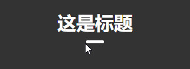
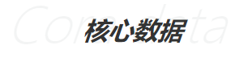
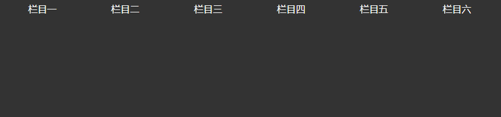
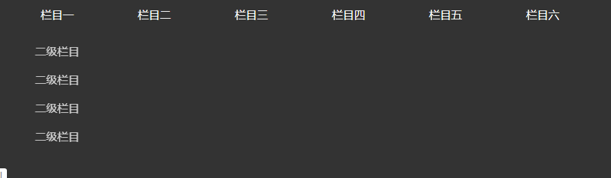
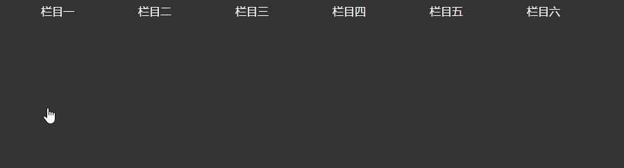
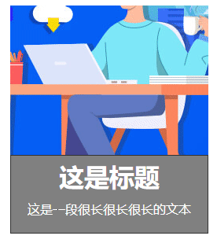

# 通用原生UI组件

## 纯CSS

### 1. 图片遮罩层

#### 基本功能

```html
<style>
    /* 图片遮罩层 */
    .layer{position: relative; width: 270px; color: #fff;}
    .layer >.img{background-repeat: no-repeat; background-size: 100% 100%;}
    .layer > .mask{position: absolute; left: 0px; top: 0px; right: 0px; bottom: 0px; margin: auto; background-color: rgba(0, 0, 0, 0.7);}
</style>   
<!-- 图片遮罩层 -->
<div class="layer">
    
    <div class="mask">这里为遮罩层内容</div>
</div>
```


#### 可选颜色扩展

```css
/* 遮罩层颜色扩展 */
/* 透明色 */
.layer > .mask.white{background-color: rgba(255, 255, 255, 0.7); color: #333;}
/* 青绿色 */
.layer > .mask.lightgreen{background-color: rgba(64, 196, 128, 0.7);}
/* 天蓝色 */
.layer > .mask.skyblue{background-color: rgba(35, 139, 199, 0.7);}
```


### 2. 带下划线标题

#### 基本功能

```html
<style>
    .title{display: inline-block; text-align: center; margin: 80px 0px 40px;}
    .title > h1{margin-bottom: 10px;}
    .title > .line{width: 30px; height: 5px; background-color: #000; margin: 0 auto; transition: width linear 0.2s;  border-radius: 10px;}
    .title:hover >.line{width: 100%;}
</style>
<!-- 带下划线标题 -->
<div class="title ">
    <h1>这是标题</h1>
    <div class="line "></div>
</div>
```



#### 可选颜色样式扩展

```css
/* 颜色扩展 */
/* 白色 */
.title.white{color: #fff;}
.title.white .line{background: #fff;}
.line.white{background: #fff;}
/* 青绿色 */
.title.hightgreen{color: #40C480;}
.title.hightgreen .line{background: #40C480;}
.line.hightgreen{background: #40C480;}

/* 天蓝 */
.title.skyblue{color: #264788;}
.title.skyblue .line{background: #40C480;}
.line.skyblue{background: #264788;}
```

### 3. 带文字背景标题

#### 基础功能

```html
<style>
    .title{ display: inline-block; text-align: center;font-style: italic; font-weight: 300; }
    .title h3{position: absolute; top: 5%; left: 35%; font-size: 28px; color: #333;}
    .title .bg-text{position: relative;font-size: 55px;font-weight: 300;color: rgba(28, 31, 37, 0.05);line-height: 99px; text-align: center;}
</style>
<div class="title">    
    <div class="bg-text">Cora data<h3>核心数据</h3></div>
</div>
```



#### 可选颜色样式扩展

```css
//白色
.title.white .bg-text h3{color: #fff;}
.title.white .bg-text{color: rgba(255, 255, 255, 0.05);}
```


### 4. 菜单栏

#### 基本功能

```html
<style>
    /* 公共样式 */
    a{color: #fff; text-decoration: none;}
    /* 菜单栏 */
    #nav{list-style: none; height: 40px;}
    #nav > li {float: left; text-align: center;}
    #nav > li a{display: inline-block; width: 100px;  padding: 10px 20px;}
    #nav > li > ul{transition: all linear 0.3s; list-style: none; opacity: 0;}
    #nav > li:hover #nav2{opacity: 1;}
</style>
<ul id="nav">
    <li>
        <a href="">栏目一</a>
        <ul id="nav2">
            <li><a href="">二级栏目</a></li>
            <li><a href="">二级栏目</a></li>
            <li><a href="">二级栏目</a></li>
            <li><a href="">二级栏目</a></li>
        </ul>
    </li>
    <li>
        <a href="">栏目二</a>
    </li>
    <li><a href="">栏目三</a></li>
    <li><a href="">栏目四</a></li>
    <li><a href="">栏目五</a></li>
    <li><a href="">栏目六</a></li>
</ul>
```



#### 可选动画扩展

向上渐入动画

```css
/* 公共样式 */
a{color: #fff; text-decoration: none;}
/* 菜单栏 */
#nav{list-style: none; height: 40px;}
#nav > li {position: relative; float: left; text-align: center;}
#nav > li a{display: inline-block; width: 100px;  padding: 10px 20px;}
#nav > li > ul{position: absolute; top: 100px;left: 0px; transition: all linear 0.3s; list-style: none; opacity: 0;}
#nav > li:hover #nav2{top:40px; opacity: 1;}
```



这动画还存在问题，待解决


每个li延迟旋转 

```css
/* 可选过渡样式 */
/* 每个样式延迟旋转 */
#nav > li > ul li{transition: all linear 1s; transform: rotateY(-130deg);}
#nav > li > ul li:nth-of-type(2){transition: all linear 1s 0.2s; transform: rotateY(-130deg);}
#nav > li > ul li:nth-of-type(3){transition: all linear 1s 0.4s; transform: rotateY(-130deg);}
#nav > li > ul li:nth-of-type(4){transition: all linear 1s 0.6s; transform: rotateY(-130deg);}
#nav > li:hover #nav2 li {transform: rotateY(0deg);}
```



#### 力拓菜单栏

```html
<style>
    /* 公共样式 */
    * {margin: 0px;padding: 0px;text-align: center;}
    a{color: #333; text-decoration: none;}
    /* 菜单栏 */
    #nav{display: inline-block; list-style: none; height: 80px;line-height: 80px; box-sizing: border-box;}
    #nav > li {position: relative; float: left; text-align: center; box-sizing: border-box; padding: 0px 20px;}
    #nav > li > a{display: inline-block; box-sizing: border-box; border-top: 2px solid transparent;}
    #nav > li > ul{position: absolute; left: 31px; top: 70px; display: inline-block; transition: all linear 0.3s; list-style: none; 
        line-height: 40px; border: 1px solid #0000; display: none;}
    #nav > li > ul >li { min-width: 110px; text-align: left; border-bottom: 1px solid #999; box-sizing: border-box;margin: 0 3px;}
    #nav > li:hover .nav2{display: block; border: 1px solid #333;}
    #nav > li:hover >a{border-top: 2px solid #cb3939;}
    #nav > li>ul>li:hover{background: cadetblue;}
</style>
<ul id="nav">
    <li>
        <a href="">首页</a>
        <ul class="nav2">
            <li><a href="">二级栏目</a></li>
            <li><a href="">二级栏目</a></li>
            <li><a href="">二级栏目</a></li>
            <li><a href="">二级栏目</a></li>
            <li><a href="">二级栏目</a></li>
            <li><a href="">二级栏目</a></li>
        </ul>
    </li>
    <li>
        <a href="">产品和方案</a>
        <ul class="nav2">
            <li><a href="">二级栏目</a></li>
        </ul>
    </li>
    <li><a href="">平台</a>
        <ul class="nav2">
            <li><a href="">二级栏目</a></li>
        </ul></li>
    <li><a href="">营销</a>
        <ul class="nav2">
            <li><a href="">二级栏目</a></li>
        </ul></li>
    <li><a href="">渠道合作</a>
        <ul class="nav2">
            <li><a href="">二级栏目</a></li>
        </ul></li>
    <li><a href="">资讯</a>
        <ul class="nav2">
            <li><a href="">二级栏目</a></li>
        </ul></li>
    <li><a href="">关于我们</a>
        <ul class="nav2">
            <li><a href="">二级栏目</a></li>
        </ul></li>
</ul>
```


### 5. 动态搜索栏

#### 基础功能

```html
<style>
    .search-box{position: relative; text-align: right; margin-right: 30px; width: 300px;}
    .search-box input{position: relative; z-index: 5; display: inline-block; width: 50px; height: 25px; transition: all .5s; opacity: 0; border-radius: 30px; outline: none; border: none; 
        padding: 0px 25px 0px 10px; box-sizing: border-box;}
    .search-box .search-icon{position: absolute; top: 5px; right: 10px; background: url("./images/search.png") no-repeat center center; width: 14px; height: 14px;}
    .search-box input:hover {cursor: pointer;}
    .search-box input:focus {width: 150px; opacity: 1;cursor: text; border: 1px solid #333;}
    .search-box input:focus ~ .search-icon {z-index: 6;}
    .search-box input::placeholder{color: #999;} 
</style>
<div class="search-box">
    <input type="text" placeholder="输入搜索内容">
    <div class="search-icon"></div>
</div>
```


#### 快速了解

这个动画主要用到了三个比较重要的属性，text-align，width，::focus

text-align设置到父元素中，用来设置子元素的动画移动方向，center表示width宽度由两边扩展，两边收缩，left表示width向右伸展，向左收缩，right表示width向左边扩展，向右收缩

width必须要给父级设置width，否则只会向右伸展

::focus伪类用来操作input的伸缩，初次点击搜索icon，此时点击的是input，因为input此时设置了opacity所以不可见，但z-index又高于icon，再次点击icon时，此时点击的是搜索icon，因为提高了icon的z-index，点击非input元素会导致input失去焦点，所以input又会缩回来。其实点击非input区域都会导致input失去焦点而收缩

#### 可选功能扩展

```css
/* 右伸展，左收缩 */
.search-box.alignL{text-align: left; margin-left: 161px;}
.search-box.alignL > input{ right: 0px; top: 0px; padding: 0px 10px 0px 30px;}
.search-box.alignL > .search-icon{left: 10px;}

/* 左右伸展收缩 */
.search-box.alignC{ text-align: center;}
.search-box.alignC > input{  margin-left: 80px;}
.search-box.alignC > input:focus ~ .search-icon {right: -80px;}
```

### 6. 盒子列表

#### 基础功能

```html
<style>
    .list{ list-style: none; width: 1200px; margin: 0 auto; overflow: hidden;}
    .list > li{float: left; }
    .list > li:nth-of-type(4n) > .graphic-box{ margin-right: 0px;}
</style>
<ul class="list clearFix">
    <li></li>
    <li></li>
    <li></li>
    <li></li>
</ul>
```


### 7. 图文盒子

#### 基础功能

```html
<style>
    .graphic-box{display: inline-block; margin: 0px 40px 30px 0px; }
    .graphic-img{width: 300px; height: 190px;}
    .graphic-img.pic1{background: url("images/pic1.png")no-repeat center center; }
    .graphic-info{height: 100px; background-color: gray; text-align: center; border: 1px solid #333; box-sizing: border-box; padding: 5px; color: #fff;}
    .graphic-info > h1{margin-bottom: 10px;}
    .graphic-info > p{}
</style> 
<div class="graphic-box">
     <div class="graphic-img pic1"></div>
     <div class="graphic-info">
         <h1>这是标题</h1>
         <p>这是一段很长很长很长的文本</p>
     </div>
</div>
```


#### 可选功能扩展

**1. 图片带遮罩层图文盒**

```html
<style>
    .graphic-box{display: inline-block; margin: 0px 40px 30px 0px; }
    .graphic-img{width: 270px; height: 190px;}
    .graphic-img.pic1{background: url("images/pic1.png")no-repeat center center; }
    .graphic-info{height: 100px; background-color: gray; text-align: center; border: 1px solid #333; box-sizing: border-box; padding: 5px; color: #fff;}
    .graphic-info > h1{margin-bottom: 10px;}
    .graphic-info > p{}
    .layer{position: relative;color: #fff;}
    .layer > .img{background-repeat: no-repeat; background-size: 100% 100%;}
    .layer > .layer-mask{position: absolute; left: 0px; top: 0px; right: 0px; bottom: 0px; margin: auto; background-color: rgba(0, 0, 0, 0.7); opacity: 0; transition: all linear .3s;}
    .layer > .layer-mask:hover{opacity: 1;}
</style>
<div class="graphic-box">
    <div class="layer">
        <div class="graphic-img pic1"></div>
        <div class="layer-mask">这里为遮罩层内容</div>
    </div>
    <div class="graphic-info">
        <h1>这是标题</h1>
        <p>这是一段很长很长很长的文本</p>
    </div>
</div>
```




## CSS + JS

### 1.tab 选项卡

#### 基础功能


### 2. 轮播图

#### 基础功能

```html
<style>
    *{margin: 0px;padding: 0px;}
    .carousel{height: 500px;overflow: hidden;}
    .carousel-wrapper{position: relative; display: inline-block; top: 0px; left: 0px; animation: all linear .2s;}
    .carousel-slide{position: relative;}
    .banner-content{ position: absolute;  left: 0px; top: 0px; color: #fff;}
</style>        
<div class="carousel" id="swiper1">
    <div class="carousel-wrapper">
        <div class="carousel-slide">
            
            <div class="banner-content">
                <h3>这是第一张</h3>
            </div>
        </div>
        <div class="carousel-slide">
            <div class="banner-content">
                <h3>这是第二张</h3>
            </div></div>
        <div class="carousel-slide">
            <div class="banner-content">
                <h3>这是第三张</h3>
            </div>
        </div>
    </div>
</div>
 <script src="js/jquery-1.7.2.min.js"></script>
<script>
    function Carousel(selector, options) {
        this.selector = $(selector).get(0);
        this.carW = $(this.selector).width() || $(window).width();
        this.carH = $(this.selector).height() || $(window).height();
        this.realLen = $('.carousel-slide').length;
        this.format()
        this.toMove(2000)
        return this
    }
    Carousel.prototype.format = function () {
        this.wrapper = $(this.selector).find('.carousel-wrapper');
        //首先克隆出第一张图片
        $('.carousel-slide').eq(0).clone().appendTo(this.wrapper)
        this.slide = $(this.selector).find('.carousel-slide');

        //计算wrapper容器的宽度 (slide个数乘以carousel宽度)
        this.wrapper.css({ width: this.carW * this.slide.length });
        console.log(this.slide)
        this.slide.css({ width: this.carW, display: 'inline-block', float: 'left' })
        this.slide.find('img').css({ backgroundSize: '100% 100%', width: this.carW, height: this.carH })
    }
    Carousel.prototype.toMove = function (duration) {
        this.curIdx = 1;
        var timer = null
        var self  = this;
        timer = setInterval(function() {
            self.wrapper.animate({ left: -(self.curIdx * self.carW) + 'px' }, 600, 'linear', function(){
                console.log(self.curIdx, self.slide.length, self)
                if (self.curIdx == self.slide.length) {
                    console.log('到最后了');
                    self.curIdx = 1;
                    self.wrapper.css('left', 0)

                }
            })
            self.curIdx += 1;
        }, duration)
    }

    let swiper = new Carousel('#swiper1', {
    });
    console.log(swiper)
</script>
```


### 3. 分页

#### 基础功能